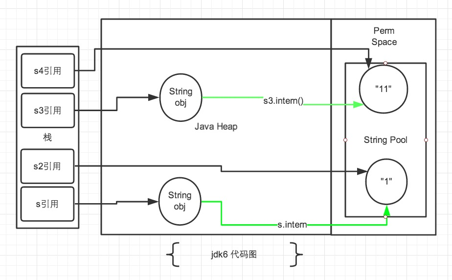
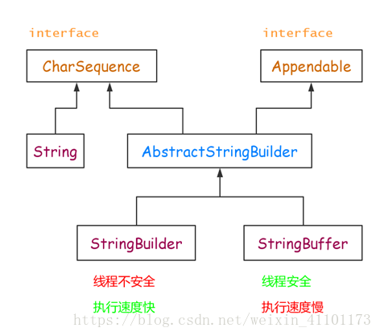
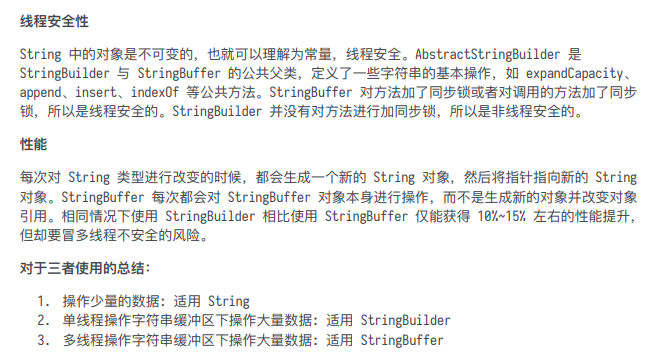

## 1. String常用方法


> - [String常用方法](https://wiki.lifeisgg.online/archives/Java-方法汇总/#toc_28)


## 2. 两种方式创建的底层原理和字符串常量

- 第一种是通过**“字面量”**赋值

  ```java
  String str="hello"
  ```

- 第二种是通过**new关键字创建新对象**，在内存中用构造器创建新对象形式

  ```java
  String str=new String("hello")
  ```

  


### 2.1 案例一：通过字面量来创建String

```java
String s1 = "abc";
String s2 = "abc";
System.out.println(s1 == s2); // True
System.out.println(s1.equals(s2)); // True
```


采用字面值的方式创建一个字符串时，JVM首先会去字符串池中查找是否存在"abc"这个对象，此时有两种情况

- 如果不存在，则在字符串常量池中创建"abc"这个对象，然后将池中"abc"这个对象的引用地址返回给"abc"对象的引用s1，这样s1会指向字符串常量池中"abc"这个字符串对象；
- 如果存在，则不创建任何对象，直接将池中"abc"这个对象的地址返回，赋给引用s2。因为s1、s2都是指向同一个字符串池中的"abc"对象，所以结果为true。


当相同的字符串被创建多次，内存中只保存一份字符串常量值，这就是字符串的"驻留"


### 2.2 案例二：通过new对象形式

```java
String s3 = new String("xyz");
String s4 = new String("xyz");
System.out.println(s3 == s4); // False
System.out.println(s3.equals(s4)); // True
```

采用new关键字新建一个字符串对象时，JVM首先在字符串池中查找有没有"xyz"这个字符串对象，

- 如果有：则不在池中再去创建"xyz"这个对象了，直接在堆中创建一个"xyz"字符串对象，然后将堆中的这个"xyz"对象的地址返回赋给引用s3，这样，s3就指向了堆中创建的这个"xyz"字符串对象；
- 如果没有：则首先在字符串池中创建一个"xyz"字符串对象，然后再在堆中创建一个"xyz"字符串对象，然后将堆中这个"xyz"字符串对象的地址返回赋给s3引用，这样，s3指向了堆中创建的这个"xyz"字符串对象。s4则指向了堆中创建的另一个"xyz"字符串对象。s3 、s4是两个指向不同对象的引用，结果当然是false。


### 2.3 案例三：创建了多少对象

```java
 String s = new String(“xyz”);
```

产生几个对象？一个或两个，如果常量池中原来没有 ”xyz”, 就是两个。

- 常量池中没有 `”xyz”`：就先去字符串常量池创建，然后再去堆中创建实例，所以会创建两个对象
- 常量池中有 `”xyz”`：就直接去堆中创建实例，所以会创建一个对象


## 3. intern的实现原理（JDK1.8）

参考

> - https://tech.meituan.com/2014/03/06/in-depth-understanding-string-intern.html


```java
public native String intern();
```


### 3.1 JDK6的intern()




### 3.2 JDK7的intern()


这个方法是一个 `native` 的方法，但注释写的非常明了。当调用 intern方法时：

- 如果字符串常量池已经包含一个等于此String对象的字符串（值比较用equals(oject)方法确定），则返回池中的字符串对象的地址。
- 如果不包含，将此String对象添加到字符串常量池中为新的String对象，并返回字符串常量池中此新的String对象的引用


JDK 1.7后，intern方法还是会先去查询常量池中是否有已经存在，如果存在，则返回常量池中的引用，这一点与之前没有区别，区别在于，**如果在常量池找不到对应的字符串，则不会再将字符串拷贝到常量池，而只是在常量池中生成一个对原字符串的引用简单的说，就是往常量池放的东西变了：原来在常量池中找不到时，复制一个副本放到常量池，1.7后则是将在堆上的地址引用复制到常量池。**


### 3.3 举例

```java
String str2 = new String("str") + new String("01");//创建了"str"和"01"常量，但是没有创建"str01"常量
str2.intern();
String str1 = "str01";
System.out.println(str2==str1);//true
```

> 1. 第一行：字符串常量池中生成"str"和"01"，在堆中创建两个String对象，相加后返回在堆为"str01"的新的String对象的引用，**此时常量池没有"str01"对象，只有"str"和"01"**
> 2. 第二行：调用intern()后，由于字符串常量池中不存在"str01"，所以复制str2地址引用到字符串常量池(1.7后的改动)
> 3. 第三行：由于字符串常量池中已存在"str01"，所以str1指向已存在的，即st2所指向的对象
> 4. 第四行：两个指向同一个对象所以结果为true


```java
String str2 = new String("str")+new String("01");
String str1 = "str01";
str2.intern();
System.out.println(str2==str1);//false
```

> 1. 第一行：字符串常量池中生成"str"和"01"，在堆中创建两个String对象，相加后返回值为"str01"的新的String对象
> 2. 第二行：由于字符串常量池不存在"str01"，所以此时在字符串常量池中创建新的对象
> 3. 第三行：由于已经存在"str01"，所以不会把str2地址引用到字符串常量池，而是返回已经存在的"str01"对象的地址
> 4. 第四行：由于str1指向字符串常量池对象，str2指向堆中的对象，所以返回false


## 4. 字符串相加原理

参考

> - https://blog.csdn.net/u010775025/article/details/86507090


### 4.1 三种情况


- 两个或者两个以上的字符串常量相加，在预编译的时候“+”会被优化，相当于把字符串常量自动合成一个字符串常量
- 字符串对象的+操作其本质是new了StringBuilder对象进行append操作，拼接后调用toString()返回String对象
- `final`修饰的String在相加的时候等同于`字符串常量`直接相加，在编译后会直接替换成对应的值

```java
String s1 = "Programming";
String s2 = new String("Programming");
String s3 = "Program";
String s4 = "ming";
String s5 = "Program" + "ming";
String s6 = s3 + s4;
String s7 = s3 + "ming";
System.out.println(s1 == s2);
System.out.println(s1 == s5);
System.out.println(s1 == s6);
System.out.println(s1 == s7);
```


- **常量相加：**全都是常量相加时，会在字符串常量池创建新对象，不会在堆中创建新的对象

  

  第20~22行，我们通过对比知道，String s5 = "Program" + "ming";在被编译器优化成了String s5 = "Programming"; 

  也可以得出字符串常量相加，不会用到`StringBuilder`对象，有一点要注意的是：字符串常量和字符串是不同的概念，字符串常量储存于方法区，而字符串储存于堆(heap)。

  

- 包含String对象的相加：操作其本质是new了StringBuilder对象进行append操作，拼接后调用toString()返回新的String对象

  

  > 1. 第24行：使用new 了 StringBuider对象
  > 2. 第25行：进行StringBuider对象初始化
  > 3. 第26行：使用append() 方法拼接s3的内容
  > 4. 第27行：再使用append() 方法拼接s4的内容
  > 5. 第28行：最后调用toString() 返回String对象


### 4.2 特殊情况

```java
String s2 = new StringBuilder("ja").append("va").toString();
System.out.println(s2.intern() == s2);//false
```

常理认为，在执行`s2.intern()`时，由于字符串常量池中不存在，所以会复制引用s2到字符串常量池中去，最后对比指向同一个对象地址为`true`，但事实上`"java"`这个字符串在执行此语句之前，字符串常量池中已经存在此字符串


## 5. StringBuffer 和 StringBuilder


> String StringBuffer 和 StringBuilder 的区别是什么? String 为什么是不可变的?


### 5.1 Java String 类：String字符串常量

需要注意的是，String的值是不可变的，这就导致每次对String的操作都会生成**新的String对象**，这样不仅效率低下，而且大量浪费有限的内存空间。我们来看一下这张对String操作时内存变化的图：


我们可以看到，初始String值为“hello”，然后在这个字符串后面加上新的字符串“world”，这个过程是需要重新在栈堆内存中开辟内存空间的，最终得到了“hello world”字符串也相应的需要开辟内存空间，**这样短短的两个字符串，却需要开辟三次内存空间**，不得不说这是对内存空间的**极大浪费**。为了应对经常性的字符串相关的操作，就需要使用Java提供的其他两个操作字符串的类——StringBuffer类和StringBuild类来对此种变化字符串进行处理。


### 5.2 StringBuffer 和 StringBuilder 类——StringBuffer、StringBuilder字符串变量


当对字符串进行修改的时候，需要使用 **StringBuffer(线程安全)** 和 **StringBuilder(线程不安全)** 类。

和 String 类不同的是，StringBuffer 和 StringBuilder 类的对象能够被多次的修改，并且不产生新的未使用对象。

StringBuilder 类在 Java 5 中被提出，它和 StringBuffer 之间的最大不同在于 **StringBuilder 的方法不是线程安全的（不能同步访问）**。

由于 StringBuilder 相较于 StringBuffer 有速度优势，所以多数情况下建议使用 StringBuilder 类。然而在应用程序要求线程安全的情况下，则必须使用 StringBuffer 类。




### 5.3 区别

- **String：**不可变字符串；
- **StringBuffer：**可变字符串、效率低、线程安全；
- **StringBuilder：**可变字符序列、效率高、线程不安全；

初始化上的区别，String可以空赋值，后者不行，报错




