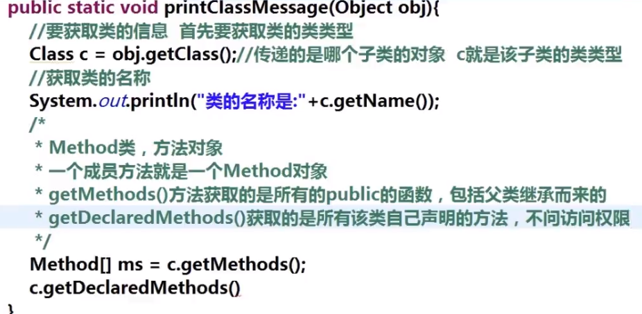

## 参考

> - https://blog.csdn.net/huangliniqng/article/details/88554510
> - https://www.jianshu.com/p/9be58ee20dee


## 注解

所有的注解类型都继承自这个普通的接口（Annotation）

这句话有点抽象，但却说出了注解的本质。我们看一个 JDK 内置注解的定义：

```java
@Target(ElementType.METHOD)
@Retention(RetentionPolicy.SOURCE)
public @interface Override {

}
```

这是注解 @Override 的定义，其实它本质上就是：

```java
public interface Override extends Annotation{
    
}
```


### 内置注解

- @Override - 检查该方法是否是重写方法。如果发现其父类，或者是引用的接口中并没有该方法时，会报编译错误。
- @Deprecated - 标记过时方法。如果使用该方法，会报编译警告。
- @SuppressWarnings - 指示编译器去忽略注解中声明的警告。


### 元注解

定义在注解上的注解

- @Retention：注解的生命周期
- @Documented：注解是否应当被包含在 JavaDoc 文档中
- @Target：注解的作用目标范围，例如方法，类
- @Inherited：是否允许子类继承该注解


@Target

- ElementType.TYPE：允许被修饰的注解作用在类、接口和枚举上
- ElementType.FIELD：允许作用在属性字段上
- ElementType.METHOD：允许作用在方法上
- ElementType.PARAMETER：允许作用在方法参数上
- ElementType.CONSTRUCTOR：允许作用在构造器上
- ElementType.LOCAL_VARIABLE：允许作用在本地局部变量上
- ElementType.ANNOTATION_TYPE：允许作用在注解上
- ElementType.PACKAGE：允许作用在包上

```java
public enum ElementType {
    /** Class, interface (including annotation type), or enum declaration */
    TYPE,

    /** Field declaration (includes enum constants) */
    FIELD,

    /** Method declaration */
    METHOD,

    /** Formal parameter declaration */
    PARAMETER,

    /** Constructor declaration */
    CONSTRUCTOR,

    /** Local variable declaration */
    LOCAL_VARIABLE,

    /** Annotation type declaration */
    ANNOTATION_TYPE,

    /** Package declaration */
    PACKAGE,

    /**
     * Type parameter declaration
     *
     * @since 1.8
     */
    TYPE_PARAMETER,

    /**
     * Use of a type
     *
     * @since 1.8
     */
    TYPE_USE
}
```


@Retention

RUNTIME>CLASS>SOURCE

- SOURCE：注解将被编译器丢弃（该类型的注解信息只会保留在源码里，源码经过编译后，注解信息会被丢弃，不会保留在编译好的class文件里）
- CLASS：注解在class文件中可用，但会被VM丢弃（该类型的注解信息会保留在源码里和class文件里，在执行的时候，不会加载到虚拟机中），请注意，当注解未定义Retention值时，默认值是CLASS，如Java内置注解，@Override、@Deprecated、@SuppressWarnning等
- RUNTIME：注解信息将在运行期(JVM)也保留，因此可以通过反射机制读取注解的信息（源码、class文件和执行的时候都有注解的信息），如SpringMvc中的@Controller、@Autowired、@RequestMapping等。
  


### 自定义注解

使用@interface，在定义注解时，不能继承其他的注解或接口。

```java
@Retention(RetentionPolicy.RUNTIME)
@Target({ElementType.METHOD, ElementType.TYPE})
@Documented
@Inherited
public @interface MyAnnotation {

}
```


- 方法就是声明配置参数，方法名就是参数名称
- 方法返回值为参数类型，只能是基本类型以及String，enum，Class，数组
- 只有一个方法时指定为value在使用注解时可以省略名称


## 反射

JAVA反射机制是在运行状态中

> - 对于任意一个类，都能够知道这个类的所有属性和方法；
> - 对于任意一个对象，都能够调用它的任意方法和属性；

这种动态获取信息以及动态调用对象方法的功能称为java语言的反射机制。


### 优缺点

- 优点：实现动态创建对象和编译
- 缺点：对性能有影响。使用反射基本上是一种解释操作,我们可以告诉JM,我们希望做什么并且它满足我们的要求。这类操作总是慢于直接执行相同的操作


### 用途

参考

> - [https://www.jianshu.com/p/3fd80b251399](https://www.jianshu.com/p/3fd80b251399)


在日常的第三方应用开发过程中，经常会遇到某个类的某个成员变量、方法或是属性是私有的或是只对系统应用开放，这时候就可以利用Java的反射机制通过反射来获取所需的私有成员或是方法。当然，也不是所有的都适合反射，之前就遇到一个案例，通过反射得到的结果与预期不符。阅读源码发现，经过层层调用后在最终返回结果的地方对应用的权限进行了校验，对于没有权限的应用返回值是没有意义的缺省值，否则返回实际值起到保护用户的隐私目的。


### 常用方法


通过setAccessible方法解除限制为public

### 反射机制的相关类


类名 用途   Class类 代表类的实体，在运行的Java应用程序中表示类和接口  Field类 代表类的成员变量（成员变量也称为类的属性）  Method类 代表类的方法  Constructor类 代表类的构造方法


| **类名**      | **用途**                                         |
| ------------- | ------------------------------------------------ |
| Class类       | 代表类的实体，在运行的Java应用程序中表示类和接口 |
| Field类       | 代表类的成员变量（成员变量也称为类的属性）       |
| Method类      | 代表类的方法                                     |
| Constructor类 | 代表类的构造方法                                 |


### 常见类型的类举例

```java
@Test
public void allClassTest(){

    List<Class> classList = Lists.newArrayList();
    classList.add(Object.class);//类
    classList.add(Comparable.class);//接口
    classList.add(String[].class);//数组
    classList.add(int[].class);//不同类型数组
    classList.add(int[][].class);//不同维度数组
    classList.add(Override.class);//注解
    classList.add(ElementType.class);//枚举
    classList.add(Integer.class);//包装类型
    classList.add(void.class);//void
    classList.add( Class.class);//Class
    classList.forEach(System.out::println);
    //class java.lang.Object
    //interface java.lang.Comparable
    //class [Ljava.lang.String;
    //class [I
    //class [[I
    //interface java.lang.Override
    //class java.lang.annotation.ElementType
    //class java.lang.Integer
    //void
    //class java.lang.Class
}
```


### Class类

Class代表类的实体，在运行的Java应用程序中表示类和接口。在这个类中提供了很多有用的方法，这里对他们简单的分类介绍。


#### 获取方式

```java
@Test
public void reflectTest() throws ClassNotFoundException {
    ReflectTest reflectTest = new ReflectTest();
    //三种获取Class,获取的都是单例的class对象
    Class clz_1 = ReflectTest.class;
    Class clz_2 = reflectTest.getClass();
    Class clz_3 = Class.forName("annotationAndReflect.ReflectTest");

}
```


#### 类相关的方法

| 方法                       | 用途                                                   |
| -------------------------- | ------------------------------------------------------ |
| asSubclass(Class\<U\> clazz) | 把传递的类的对象转换成代表其子类的对象                 |
| Cast                       | 把对象转换成代表类或是接口的对象                       |
| getClassLoader()           | 获得类的加载器                                         |
| getClasses()               | 返回一个数组，数组中包含该类中所有公共类和接口类的对象 |
| getDeclaredClasses()       | 返回一个数组，数组中包含该类中所有类和接口类的对象     |
| forName(String className)  | 根据类名返回类的对象                                   |
| getName()                  | 获得类的完整路径名字                                   |
| newInstance()              | 创建类的实例                                           |
| getPackage()               | 获得类的包                                             |
| getSimpleName()            | 获得类的名字                                           |
| getSuperclass()            | 获得当前类继承的父类的名字                             |
| getInterfaces()            | 获得当前类实现的类或是接口                             |


#### 类中构造器相关的方法


| 方法                                               | 用途                                   |
| -------------------------------------------------- | -------------------------------------- |
| getConstructor(Class...<?> parameterTypes)         | 获得该类中与参数类型匹配的公有构造方法 |
| getConstructors()                                  | 获得该类的所有公有构造方法             |
| getDeclaredConstructor(Class...<?> parameterTypes) | 获得该类中与参数类型匹配的构造方法     |
| getDeclaredConstructors()                          | 获得该类所有构造方法                   |


#### 类中方法相关的方法


| 方法                                                       | 用途                   |
| ---------------------------------------------------------- | ---------------------- |
| getMethod(String name, Class...<?> parameterTypes)         | 获得该类某个公有的方法 |
| getMethods()                                               | 获得该类所有公有的方法 |
| getDeclaredMethod(String name, Class...<?> parameterTypes) | 获得该类某个方法       |
| getDeclaredMethods()                                       | 获得该类所有方法       |


#### 类中判断类型


| 方法                                                         | 用途                             |
| ------------------------------------------------------------ | -------------------------------- |
| isAnnotation()                                               | 如果是注解类型则返回true         |
| isAnnotationPresent(Class<? extends Annotation> annotationClass) | 如果是指定类型注解类型则返回true |
| isAnonymousClass()                                           | 如果是匿名类则返回true           |
| isArray()                                                    | 如果是一个数组类则返回true       |
| isEnum()                                                     | 如果是枚举类则返回true           |
| isInstance(Object obj)                                       | 如果obj是该类的实例则返回true    |
| isInterface()                                                | 如果是接口类则返回true           |
| isLocalClass()                                               | 如果是局部类则返回true           |
| isMemberClass()                                              | 如果是内部类则返回true           |


### Field类


[Field](https://developer.android.google.cn/reference/java/lang/reflect/Field)代表类的成员变量（成员变量也称为类的属性）。

| 方法                          | 用途                    |
| ----------------------------- | ----------------------- |
| equals(Object obj)            | 属性与obj相等则返回true |
| get(Object obj)               | 获得obj中对应的属性值   |
| set(Object obj, Object value) | 设置obj中对应属性值     |


### Method类


[Method](https://developer.android.google.cn/reference/java/lang/reflect/Method)代表类的方法。

| 方法                               | 用途                                     |
| ---------------------------------- | ---------------------------------------- |
| invoke(Object obj, Object... args) | 传递object对象及参数调用该对象对应的方法 |





### Constructor类


[Constructor](https://developer.android.google.cn/reference/java/lang/reflect/Constructor)代表类的构造方法。

| 方法                            | 用途                       |
| ------------------------------- | -------------------------- |
| newInstance(Object... initargs) | 根据传递的参数创建类的对象 |


## 反射操作泛型

参数或返回类型包含泛型

```java
public class ReflectEntity {
    public void generics(Map<String, String> map, List<String> list) {
        System.out.println("泛型方法");
    }

    public Map<String, String> generics() {
        System.out.println("泛型方法2");
        return new HashMap<>();
    }
}
```

操作泛型

```java
//泛型方法获取
@Test
public void genericsTest() throws NoSuchMethodException {
    Class<?> clz = ReflectEntity.class;
    Method method = clz.getDeclaredMethod("generics", Map.class, List.class);
    Type[] genericParameterTypes = method.getGenericParameterTypes();
    Arrays.stream(genericParameterTypes).forEach(item -> {
        System.out.println(item);
        //如果是一个参数化类型
        if (item instanceof ParameterizedType) {
            //获得真实类型
            Type[] actualTypeArguments = ((ParameterizedType) item).getActualTypeArguments();
            Arrays.stream(actualTypeArguments).forEach(System.out::println);
        }
    });

    method = clz.getDeclaredMethod("generics");
    Type genericReturnType = method.getGenericReturnType();
    System.out.println(genericReturnType);
    if (genericReturnType instanceof ParameterizedType) {
        //获得真实类型
        Type[] actualTypeArguments = ((ParameterizedType) genericReturnType).getActualTypeArguments();
        Arrays.stream(actualTypeArguments).forEach(System.out::println);
    }

}
```


## 反射获取注解类型

```java
//反射操作注解
@Test
public void annotationTest() throws NoSuchFieldException {
    Class clz = Student.class;
    //获取类上注解的标记的value值
    Annotation[] declaredAnnotations = clz.getDeclaredAnnotations();
    Table table = (Table) clz.getAnnotation(Table.class);
    System.out.println(table.value());

    //获取字段上的
    Field id = clz.getDeclaredField("id");
    TableField annotation = (TableField) id.getAnnotation(TableField.class);
    System.out.println(annotation);
}
```

