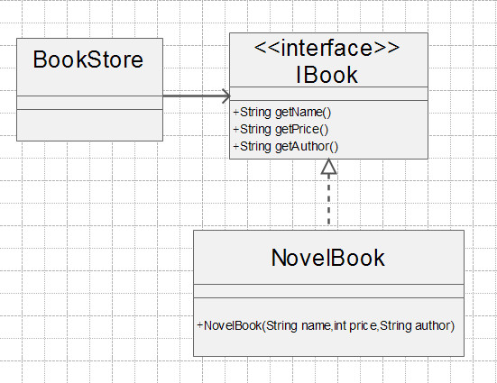

## 参考


::: tip 参考

- https://www.runoob.com/design-pattern/design-pattern-intro.html
- http://c.biancheng.net/view/1317.html
- [设计模式之禅](TheZen0fDesignPattern_2.pdf)
- [六大设计原则](https://so.csdn.net/so/search/blog?q=%E5%85%AD%E5%A4%A7%E8%AE%BE%E8%AE%A1%E5%8E%9F%E5%88%99&t=blog&p=1&s=0&tm=0&lv=-1&ft=0&l=&u=hfreeman2008)
- [尚硅谷](https://www.bilibili.com/video/BV1G4411c7N4)

:::


## 总览


::: info 七大原则

- 单一职责原则
- 接口隔离原则
- 依赖倒置原则
- 里氏替换原则
- 开闭原则
- 迪米特法则
- 合成复用原则

:::


## 1. 单一职责原则(Single Responsibility Principle,SPR)

::: tip 参考

[六大设计原则之单一职责原则](https://blog.csdn.net/hfreeman2008/article/details/52234287?ops_request_misc=%25257B%252522request%25255Fid%252522%25253A%252522160862280716780257419145%252522%25252C%252522scm%252522%25253A%25252220140713.130102334.pc%25255Fblog.%252522%25257D&request_id=160862280716780257419145&biz_id=0&utm_medium=distribute.pc_search_result.none-task-blog-2~blog~first_rank_v2~rank_v29-6-52234287.pc_v2_rank_blog_default&utm_term=%E5%85%AD%E5%A4%A7%E8%AE%BE%E8%AE%A1%E5%8E%9F%E5%88%99)

:::


## 1. 开闭原则(Open Closed Principle,OCP)


::: tip 参考

- http://c.biancheng.net/view/1322.html
- [六大设计原则之开闭原则](https://blog.csdn.net/hfreeman2008/article/details/52344022?ops_request_misc=%25257B%252522request%25255Fid%252522%25253A%252522160853876616780261982313%252522%25252C%252522scm%252522%25253A%25252220140713.130102334.pc%25255Fblog.%252522%25257D&request_id=160853876616780261982313&biz_id=0&utm_medium=distribute.pc_search_result.none-task-blog-2~blog~first_rank_v2~rank_v29-4-52344022.pc_v2_rank_blog_default&utm_term=%E5%85%AD%E5%A4%A7%E8%AE%BE%E8%AE%A1%E5%8E%9F%E5%88%99)

:::


### 1.1 介绍

`开闭原则（Open Closed Principle，OCP）`由勃兰特·梅耶（Bertrand Meyer）提出，他在 1988 年的著作《面向对象软件构造》（Object Oriented Software Construction）中提出：

::: info 定义

Software entities should be open for extension，but closed for modification。

(一个软件实体如类，模块和函数应该对扩展开放，对修改关闭)

:::


开闭原则明确的告诉我们：软件实现应该对扩展开放，对修改关闭，其含义是说一个软件实体应该通过扩展来实现变化，而不是通过修改已有的代码来实现变化的。那什么是软件实体呢？这里的软件实体包括以下几个部分：


::: info 软件实体

1. 项目中划分出的模块
2. 类与接口
3. 方法

:::


开闭原则的含义是

::: tip 开闭原则的含义

当应用的需求改变时，在不修改软件实体的源代码或者二进制代码的前提下，可以扩展模块的功能，使其满足新的需求。一个软件产品只要在生命周期内，都会发生变化，即然变化是一个事实，我们就应该在设计时尽量适应这些变化，以提高项目的稳定性和灵活性，真正实现“拥抱变化”。开闭原则告诉我们应尽量通过扩展软件实体的行为来实现变化，而不是通过修改现有代码来完成变化，它是为软件实体的未来事件而制定的对现行开发设计进行约束的一个原则。

:::


### 1.2 作用

开闭原则是面向对象程序设计的终极目标，它使软件实体拥有一定的适应性和灵活性的同时具备稳定性和延续性。具体来说，其作用如下。

::: info 作用

1. **对软件测试的影响**：

   软件遵守开闭原则的话，软件测试时`只需要对扩展的代码进行测试`就可以了，因为原有的测试代码仍然能够正常运行。

2. **可以提高代码的可复用性**：

   粒度越小，被复用的可能性就越大；在面向对象的程序设计中，根据原子和抽象编程可以提高代码的可复用性。

3. **可以提高软件的可维护性**：

   遵守开闭原则的软件，其稳定性高和延续性强，从而易于扩展和维护。

:::


### 1.3 示例

以书店销售书籍为例，其类图如下：





书籍接口

```java
public interface IBook{
  public String getName();
  public String getPrice();
  public String getAuthor();
}
```

小说类书籍：

```java
public class NovelBook implements IBook{
   private String name;
   private int price;
   private String author;

   public NovelBook(String name,int price,String author){
     this.name = name;
     this.price = price;
     this.author = author;
   }

   public String getAutor(){
     return this.author;
   }

   public String getName(){
     return this.name;
   }  

   public int getPrice(){
     return this.price;
   } 
}
```


Client类：

```java
public class Client{
   public static void main(Strings[] args){
     IBook novel = new NovelBook("笑傲江湖",100,"金庸");
     System.out.println("书籍名字："+novel.getName()+"书籍作者："+novel.getAuthor()+"书籍价格："+novel.getPrice());
   }

}
```

项目投产生，书籍正常销售，但是我们经常因为各种原因，要打折来销售书籍，这是一个变化，我们要如何应对这样一个需求变化呢？

我们有下面三种方法可以解决此问题：

::: info 解决方案

- **修改接口**
  在IBook接口中，增加一个方法getOffPrice(),专门用于进行打折处理，所有的实现类实现此方法。但是这样的一个修改方式，实现类NovelBook要修改，同时IBook接口应该是稳定且可靠，不应该经常发生改变，否则接口作为契约的作用就失去了。因此，此方案否定。
- **修改实现类**
  修改NovelBook类的方法，直接在getPrice()方法中实现打折处理。此方法是有问题的，例如我们如果getPrice()方法中只需要读取书籍的打折前的价格呢？这不是有问题吗？当然我们也可以再增加getOffPrice()方法，这也是可以实现其需求，但是这就有二个读取价格的方法，因此，该方案也不是一个最优方案。
- **通过扩展实现变化**
  我们可以增加一个子类OffNovelBook,覆写getPrice方法。此方法修改少，对现有的代码没有影响，风险少，是个好办法。

:::


打折类：

```java
public class OffNovelBook extends NovelBook{

   public OffNovelBook(String name,int price,String author){
      super(name,price,author);
   }

   //覆写价格方法，当价格大于40，就打8析，其他价格就打9析
   public int getPrice(){
     if(this.price > 40){
        return this.price * 0.8;
     }else{
        return this.price * 0.9;
     }     
   } 
}
```


### 1.4 实现方法

第一：**抽象约束**
抽象是对一组事物的通用描述，没有具体的实现，也就表示它可以有非常多的可能性，可以跟随需求的变化而变化。因此，通过接口或抽象类可以约束一组可能变化的行为，并且能够实现对扩展开放，其包含三层含义：

- 通过接口或抽象类约束扩散，对扩展进行边界限定，不允许出现在接口或抽象类中不存在的public方法。
- 参数类型，引用对象尽量使用接口或抽象类，而不是实现类，这主要是实现里氏替换原则的一个要求
- 抽象层尽量保持稳定，一旦确定就不要修改


第二：**元数据(metadata)控件模块行为**
编程是一个很苦很累的活，那怎么才能减轻压力呢？答案是尽量使用元数据来控制程序的行为，减少重复开发。什么是元数据？用来描述环境和数据的数据，通俗的说就是配置参数，参数可以从文件中获得，也可以从数据库中获得。


第三：**制定项目章程**
在一个团队中，建立项目章程是非常重要的，因为章程是所有人员都必须遵守的约定，对项目来说，约定优于配置。这比通过接口或抽象类进行约束效率更高，而扩展性一点也没有减少。


第四：**封装变化**
对变化封装包含两层含义：
(1)将相同的变化封装到一个接口或抽象类中
(2)将不同的变化封装到不同的接口或抽象类中，不应该有两个不同的变化出现在同一个接口或抽象类中。
封装变化，也就是受保护的变化，找出预计有变化或不稳定的点，我们为这些变化点创建稳定的接口。


## 2 依赖倒置原则(Dependency Inversion Principle,DIP)

::: tip 参考

[六大设计原则之依赖倒置原则](https://blog.csdn.net/hfreeman2008/article/details/52289571?ops_request_misc=%25257B%252522request%25255Fid%252522%25253A%252522160853876616780261982313%252522%25252C%252522scm%252522%25253A%25252220140713.130102334.pc%25255Fblog.%252522%25257D&request_id=160853876616780261982313&biz_id=0&utm_medium=distribute.pc_search_result.none-task-blog-2~blog~first_rank_v2~rank_v29-2-52289571.pc_v2_rank_blog_default&utm_term=%E5%85%AD%E5%A4%A7%E8%AE%BE%E8%AE%A1%E5%8E%9F%E5%88%99)

:::


### 2.1 介绍

依赖倒置原则(Dependence Inversion Principle ,DIP)定义如下：

::: info 定义

**High level modules should not depend upon low level modules,Both should depend upon abstractions.Abstractions should not depend upon details.Details should depend upon abstracts.**

:::


翻译过来为：

::: info 

- 高层模块不应该依赖低层模块，两者都应该依赖抽象
- 抽象不应该依赖细节
- 细节应该依赖抽象

:::


**也可以说高层模块，低层模块，细节都应该依赖抽象**


::: info

- 每一个逻辑的实现都是由颗粒原子逻辑组成的，颗粒原子逻辑就是低层模块，而颗粒原子逻辑组成的模块就是高层模块。
- 在java语言中，抽象就是接口或抽象类，两都都是不能直接被实例化的
- 细节就是实现类，实现接口或继承抽象类而产生的类就是细节，两者都可以直接被实例化。

:::


### 倒置

倒置最终指的是，如果我开奶茶店需要各种各样的奶茶，此时奶茶店作为高层逻辑依赖于底层逻辑各种各样的奶茶，而按照依赖倒置原则，将奶茶抽象分类为水果茶，奶茶的时候，这些奶茶就反过来依赖于这些抽象种类，也符合了都依赖于抽象这一原则，而此时奶茶店只需要关注奶茶种类的抽象接口。


### 三种写法

- 通过构造器
- 通过setter
- 通过接口注入(实现一个方法用接口作为参数接收)


### 2.2 最佳实践

依赖倒置原则的本质就是通过抽象（接口或抽象类）使各个类或模块的实现彼此独立， 不互相影响，实现模块间的松耦合，我们怎么在项目中使用这个规则呢？只要遵循以下的几 个规则就可以：


- 每个类尽量都有接口或抽象类，或者抽象类和接口两者都具备：这是依赖倒置的基本要求，接口和抽象类都是属于抽象的，有了抽象才可能依赖倒置。
- 变量的表面类型尽量是接口或者是抽象类
- 任何类都不应该从具体类派生
- 尽量不要覆写基类的方法
- 结合里氏替换原则使用


更加精简的定义就是“面向接口编程”—OOD(Object-Oriented Design，面向对象设计)的精髓之一。


### 2.2 好处

采用依赖倒置原则可以减少类间的耦合性，提高系统的稳定，降低并行开发引起的风险，提高代码的可读性和可维护性。


## 3. 迪米特原则(Law of Demeter,LoD)

::: tip 参考

[六大设计原则之迪米特原则](https://blog.csdn.net/hfreeman2008/article/details/52335601?ops_request_misc=%25257B%252522request%25255Fid%252522%25253A%252522160862280716780257419145%252522%25252C%252522scm%252522%25253A%25252220140713.130102334.pc%25255Fblog.%252522%25257D&request_id=160862280716780257419145&biz_id=0&utm_medium=distribute.pc_search_result.none-task-blog-2~blog~first_rank_v2~rank_v29-3-52335601.pc_v2_rank_blog_default&utm_term=%E5%85%AD%E5%A4%A7%E8%AE%BE%E8%AE%A1%E5%8E%9F%E5%88%99)

:::


### 3.1 介绍

迪米特原则(Law of Demeter,LoD)，也叫最少知识原则(Low knowledge Principle,LKP):

**一个对象应该对其他对象有最少的了解。**

通俗的讲：一个类对自己需要耦合或调用的类知道的最少，你(被耦合或调用的类)的内部是如何复杂和我没有关系，我就知道你提供的public方法，我只调用这些方法，其它的我不关心。

一个类公开的public属性或方法越多，修改时涉及的面也就越大，变更引起的风险扩散 也就越大。因此，为了保持朋友类间的距离，在设计时需要反复衡量：是否还可以再减少 public方法和属性，是否可以修改为private、package-private（包类型，在类、方法、变量前 不加访问权限，则默认为包类型）、protected等访问权限，是否可以加上final关键字等。 注意 迪米特法则要求类“羞涩”一点，尽量不要对外公布太多的public方法和非静态的 public变量，尽量内敛，多使用private、package-private、protected等访问权限。


迪米特法则的核心观念就是类间解耦，弱耦合，只有弱耦合了以后，类的复用率才可以 提高。其要求的结果就是产生了大量的中转或跳转类，导致系统的复杂性提高，同时也为维 护带来了难度。读者在采用迪米特法则时需要反复权衡，既做到让结构清晰，又做到高内聚 低耦合。


## 4. 里氏替换原则(Liskov Substitution Principle,LSP)

::: tip 参考

[六大设计原则之里氏替换原则](https://blog.csdn.net/hfreeman2008/article/details/52344343?ops_request_misc=%25257B%252522request%25255Fid%252522%25253A%252522160862280716780257419145%252522%25252C%252522scm%252522%25253A%25252220140713.130102334.pc%25255Fblog.%252522%25257D&request_id=160862280716780257419145&biz_id=0&utm_medium=distribute.pc_search_result.none-task-blog-2~blog~first_rank_v2~rank_v29-1-52344343.pc_v2_rank_blog_default&utm_term=%E5%85%AD%E5%A4%A7%E8%AE%BE%E8%AE%A1%E5%8E%9F%E5%88%99)

:::


### 定义

所有引用基类的地方必须能透明地使用其子类的对象。


通俗点讲，只要父类能出现的地方子类就可以出现，而且 替换为子类也不会产生任何错误或异常，使用者可能根本就不需要知道是父类还是子类。但 是，反过来就不行了，有子类出现的地方，父类未必就能适应。即向上转型和向下转型。


## 6. 接口隔离原则

::: tip 参考

[六大设计原则之接口隔离原则](https://blog.csdn.net/hfreeman2008/article/details/52304172?ops_request_misc=%25257B%252522request%25255Fid%252522%25253A%252522160862280716780257419145%252522%25252C%252522scm%252522%25253A%25252220140713.130102334.pc%25255Fblog.%252522%25257D&request_id=160862280716780257419145&biz_id=0&utm_medium=distribute.pc_search_result.none-task-blog-2~blog~first_rank_v2~rank_v29-5-52304172.pc_v2_rank_blog_default&utm_term=%E5%85%AD%E5%A4%A7%E8%AE%BE%E8%AE%A1%E5%8E%9F%E5%88%99)

:::


### 定义

- 客户端不应该依赖它不需要的接口。
- 类间的依赖关系应该建立在最小的接口上。


我们可以把这两个定义概括为一句话：建立单一接口，不要建立臃肿庞大的接口。再通 俗一点讲：接口尽量细化，同时接口中的方法尽量少。看到这里大家有可能要疑惑了，这与 单一职责原则不是相同的吗？错，接口隔离原则与单一职责的审视角度是不相同的，单一职 责要求的是类和接口职责单一，注重的是职责，这是业务逻辑上的划分，而接口隔离原则要 求接口的方法尽量少。例如一个接口的职责可能包含10个方法，这10个方法都放在一个接口 中，并且提供给多个模块访问，各个模块按照规定的权限来访问，在系统外通过文档约 束“不使用的方法不要访问”，按照单一职责原则是允许的，按照接口隔离原则是不允许的， 因为它要求“尽量使用多个专门的接口”。专门的接口指什么？就是指提供给每个模块的都应 该是单一接口，提供给几个模块就应该有几个接口，而不是建立一个庞大的臃肿的接口，容 纳所有的客户端访问。