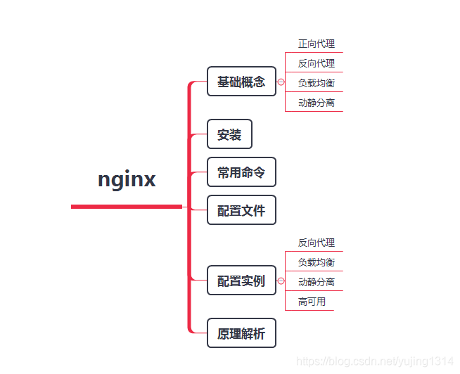

## 参考

::: tip 参考

- [W3CSCHOOL-Nginx使用手册](https://www.w3cschool.cn/nginxsysc/)
- [Nginx学习笔记 基于docker](https://blog.csdn.net/m0_49558851/article/details/107786372)
- [当初我要是这么学习Nginx就好了！多图详解](https://www.jianshu.com/p/e90050dc89b6)
- [搞懂Nginx一篇文章就够了](https://blog.csdn.net/yujing1314/article/details/107000737)
- [Nginx 配置详解](https://www.runoob.com/w3cnote/nginx-setup-intro.html)
- [nginx中文手册](https://www.nginx.cn/nginx-how-to)

:::


## 介绍

Nginx (engine x) 是一个高性能的 `Web 服务器`和`反向代理服务器`，也是一个 IMAP/POP3/SMTP 服务器：

Nginx是一款轻量级的高性能web服务器，同时也是一款非常优秀的负载均衡器和反向代理服务器。由于支持强大的正则匹配规则、动静分离、URLrewrite功能及安装配置简单且对网络稳定性依赖非常小等优点，所以常用来做为七层负载均衡使用。在硬件不差的情况下，通常可以稳定支持几万的并发连接，在硬件性能足够好，且对系统内核参数及Nginx配置进行优化甚至可以达到10万以上的并发。





## 特点


::: info 特点

- **反向代理，负载均衡器**
- **高可靠性、单 Master 多 Worker 模式**
- **高可扩展性、高度模块化**
- **非阻塞**
- **事件驱动**
- **低内存消耗**
- **热部署**

:::


## 应用场景


::: info 应用场景

- **静态文件服务器**
- **反向代理，负载均衡**
- **安全防御**
- **智能路由（企业级灰度测试、地图 POI 一键切流）**
- **灰度发布**
- **静态化**
- **消息推送**
- **图片实时压缩**
- **防盗链**

:::


## 安装（Docker安装）

::: tip 参考

[Docker 安装 Nginx](https://www.runoob.com/docker/docker-install-nginx.html)

:::


### 第一种：直接docker安装


#### 拉取镜像

::: tip

- https://hub.docker.com/_/nginx?tab=tags

:::

```bash
docker pull nginx:latest
```


#### 启动容器

```java
docker run --name nginx -p 80:80 -d nginx
```


#### 修改配置文件

配置文件存放路径：`/etc/nginx/nginx.conf`

修改后重启容器即可


### 第二种：使用docker-compose


在`/usr/local/docker/nginx/`配置好`docker-compose.yml`，并将`/etc/nginx/conf.d`下的配置文件映射

```yml
version: '3.1'
services:
  nginx:
    restart: always
    image: nginx
    container_name: nginx
    ports:
      - 80:80
    volumes:
      - /usr/local/docker/nginx/conf.d/:/etc/nginx/conf.d
```


下载`docker-compose`

```bash
sudo curl -L https://github.com/docker/compose/releases/download/1.16.1/docker-compose-`uname -s`-`uname -m` -o /usr/local/bin/docker-compose
#或
sudo curl -L https://get.daocloud.io/docker/compose/releases/download/1.25.1/docker-compose-`uname -s`-`uname -m` -o /usr/local/bin/docker-compose
```


添加可执行权限

```bash
sudo chmod +x /usr/local/bin/docker-compose
```


在`/usr/local/docker/nginx/conf.d/`下创建`default.conf`并配置

```bash
server {
    listen       80;
    listen  [::]:80;
    server_name  localhost;

    location / {
        root   /usr/share/nginx/html;
        index  index.html index.htm;
    }
    error_page   500 502 503 504  /50x.html;
    location = /50x.html {
        root   /usr/share/nginx/html;
    }
}
```


运行`docker-compose.yml`

```bash
docker-compose up -d
```


## Nginx配置文件


::: tip 参考

- [nginx基本配置与参数说明](https://www.nginx.cn/76.html)
- https://www.cnblogs.com/panchanggui/p/12067953.html

:::


| 文件块   | 作用                                                         |
| -------- | ------------------------------------------------------------ |
| 全局块   | 配置影响nginx全局的指令。一般有运行nginx服务器的用户组，nginx进程pid存放路径，日志存放路径，配置文件引入，允许生成`worker process`数等。 |
| events   | 配置影响nginx`服务器或与用户的网络连接`。`每个进程的最大连接数`，`选取哪种事件驱动模型处理连接请求`，`是否允许同时接受多个网路连接`，`开启多个网络连接序列化`等 |
| http     | 可以嵌套多个server，配置代理，缓存，日志定义等绝大多数功能和第三方模块的配置。如文件引入，mime-type定义，日志自定义，是否使用sendfile传输文件，连接超时时间，单连接请求数等。 |
| server   | 配置`虚拟主机的相关参数`，一个http中可以有多个server。       |
| location | 配置`请求的路由`，以及`各种页面的处理情况`。                 |


### 全局块

> 配置影响nginx全局的指令

::: info 配置项

- 错误日志的存放路径
- Nginx进程PID存放路径
- 配置运行Nginx服务器用户（组）
- 允许生成`worker process`数
- 配置文件的引入

:::

```bash
# 以下统称为全局块
# error_log代表Nginx错误日志存放的位置
# pid是Nginx运行的一个标识

user  nginx;
worker_processes  1;
error_log  /var/log/nginx/error.log warn;
pid        /var/run/nginx.pid;
```


### events块

> 该部分配置主要影响Nginx服务器与用户的网络连接

::: info 配置项

- 每个进程的最大连接数
- 选取哪种事件驱动模型处理连接请求
- 是否允许同时接受多个网路连接
- 开启多个`网络连接序列化`

:::


```bash
# events块
# worker_connections的数值越大，Nginx的并发能力就越强
events {
    worker_connections  1024;
}
```


### http块

> 可以嵌套多个server，配置代理，缓存，日志定义等绝大多数功能和第三方模块的配置

::: info 配置项

- 定义MIMI-Type
- 自定义服务日志
- 允许sendfile方式传输文件
- 连接超时时间
- 单连接请求数上限

:::


```bash
# http块
# include代表引入一个外部文件
# include       /etc/nginx/mime.types;	mime.types中存放着大量媒体类型
#include /etc/nginx/conf.d/*.conf;	引入了conf.d下以.conf为结尾的配置文件

http {
    include       /etc/nginx/mime.types;
    default_type  application/octet-stream;

    log_format  main  '$remote_addr - $remote_user [$time_local] "$request" '
                      '$status $body_bytes_sent "$http_referer" '
                      '"$http_user_agent" "$http_x_forwarded_for"';

    access_log  /var/log/nginx/access.log  main;

    sendfile        on;
    #tcp_nopush     on;

    keepalive_timeout  65;

    #gzip  on;

    include /etc/nginx/conf.d/*.conf;
}
```


### server块

> 配置`虚拟主机的相关参数`

::: info 配置项

- 配置网络监听
- 基于名称的虚拟主机配置
- 基于IP的虚拟主机配置

:::


### location块

> 配置`请求的路由`，以及`各种页面的处理情况`。

::: info 配置项

- 请求根目录配置
- 更改location的URI
- 网站默认首页配置

:::


### nginx.conf


**`nginx.conf`默认配置示例**

::: demo nginx.conf默认配置示例

```bash
# 以下统称为全局块

#定义Nginx运行的用户和用户组
user  nginx;

#nginx进程数，建议设置为等于CPU总核心数。
worker_processes  1;

#全局错误日志定义类型，[ debug | info | notice | warn | error | crit ]
error_log  /var/log/nginx/error.log warn;

#进程pid文件
pid        /var/run/nginx.pid;


# events块
# worker_connections的数值越大，Nginx的并发能力就越强

events {
    worker_connections  1024;
}


# http块
# include代表引入一个外部文件
# include       /etc/nginx/mime.types;	mime.types中存放着大量媒体类型
# include /etc/nginx/conf.d/*.conf;	引入了conf.d下以.conf为结尾的配置文件

http {
    include       /etc/nginx/mime.types;
    default_type  application/octet-stream;

    log_format  main  '$remote_addr - $remote_user [$time_local] "$request" '
                      '$status $body_bytes_sent "$http_referer" '
                      '"$http_user_agent" "$http_x_forwarded_for"';

    access_log  /var/log/nginx/access.log  main;

    sendfile        on;
    #tcp_nopush     on;

    keepalive_timeout  65;

    #gzip  on;

    #include /etc/nginx/conf.d/*.conf;
    # server块
		# listen代表Nginx监听的端口号
		# server_name代表Nginx接受请求的IP
	server {
    	listen       80;
    	listen  [::]:80;
    	server_name  localhost;

    	#charset koi8-r;
    	#access_log  /var/log/nginx/host.access.log  main;


    	#location块
    	# root:将接受到的请求根据/usr/share/nginx/html去查找静态资源
    	# index:默认去上述的路径中找到index.html或index.htm
    	location / {
        	root   /usr/share/nginx/html;
        	index  index.html index.htm;
    	}

    	#error_page  404              /404.html;

    	# redirect server error pages to the static page /50x.html
    	#
    	error_page   500 502 503 504  /50x.html;
    	location = /50x.html {
        	root   /usr/share/nginx/html;
    	}
		}
}
```

:::


**`nginx.conf`详细配置示例**


::: demo nginx.conf详细配置示例


```bash
######Nginx配置文件nginx.conf中文详解#####
 
#定义Nginx运行的用户和用户组
user www www;
 
#nginx进程数，建议设置为等于CPU总核心数。
worker_processes 8;
  
#全局错误日志定义类型，[ debug | info | notice | warn | error | crit ]
error_log /usr/local/nginx/logs/error.log info;
 
#进程pid文件
pid /usr/local/nginx/logs/nginx.pid;
 
#指定进程可以打开的最大描述符：数目
#工作模式与连接数上限
#这个指令是指当一个nginx进程打开的最多文件描述符数目，理论值应该是最多打开文件数（ulimit -n）与nginx进程数相除，但是nginx分配请求并不是那么均匀，所以最好与ulimit -n 的值保持一致。
#现在在linux 2.6内核下开启文件打开数为65535，worker_rlimit_nofile就相应应该填写65535。
#这是因为nginx调度时分配请求到进程并不是那么的均衡，所以假如填写10240，总并发量达到3-4万时就有进程可能超过10240了，这时会返回502错误。
worker_rlimit_nofile 65535;
 
events
{
    #参考事件模型，use [ kqueue | rtsig | epoll | /dev/poll | select | poll ]; epoll模型
    #是Linux 2.6以上版本内核中的高性能网络I/O模型，linux建议epoll，如果跑在FreeBSD上面，就用kqueue模型。
    #补充说明：
    #与apache相类，nginx针对不同的操作系统，有不同的事件模型
    #A）标准事件模型
    #Select、poll属于标准事件模型，如果当前系统不存在更有效的方法，nginx会选择select或poll
    #B）高效事件模型
    #Kqueue：使用于FreeBSD 4.1+, OpenBSD 2.9+, NetBSD 2.0 和 MacOS X.使用双处理器的MacOS X系统使用kqueue可能会造成内核崩溃。
    #Epoll：使用于Linux内核2.6版本及以后的系统。
    #/dev/poll：使用于Solaris 7 11/99+，HP/UX 11.22+ (eventport)，IRIX 6.5.15+ 和 Tru64 UNIX 5.1A+。
    #Eventport：使用于Solaris 10。 为了防止出现内核崩溃的问题， 有必要安装安全补丁。
    use epoll;
 
    #单个进程最大连接数（最大连接数=连接数*进程数）
    #根据硬件调整，和前面工作进程配合起来用，尽量大，但是别把cpu跑到100%就行。每个进程允许的最多连接数，理论上每台nginx服务器的最大连接数为。
    worker_connections 65535;
 
    #keepalive超时时间。
    keepalive_timeout 60;
 
    #客户端请求头部的缓冲区大小。这个可以根据你的系统分页大小来设置，一般一个请求头的大小不会超过1k，不过由于一般系统分页都要大于1k，所以这里设置为分页大小。
    #分页大小可以用命令getconf PAGESIZE 取得。
    #[root@web001 ~]# getconf PAGESIZE
    #4096
    #但也有client_header_buffer_size超过4k的情况，但是client_header_buffer_size该值必须设置为“系统分页大小”的整倍数。
    client_header_buffer_size 4k;
 
    #这个将为打开文件指定缓存，默认是没有启用的，max指定缓存数量，建议和打开文件数一致，inactive是指经过多长时间文件没被请求后删除缓存。
    open_file_cache max=65535 inactive=60s;
 
    #这个是指多长时间检查一次缓存的有效信息。
    #语法:open_file_cache_valid time 默认值:open_file_cache_valid 60 使用字段:http, server, location 这个指令指定了何时需要检查open_file_cache中缓存项目的有效信息.
    open_file_cache_valid 80s;
 
    #open_file_cache指令中的inactive参数时间内文件的最少使用次数，如果超过这个数字，文件描述符一直是在缓存中打开的，如上例，如果有一个文件在inactive时间内一次没被使用，它将被移除。
    #语法:open_file_cache_min_uses number 默认值:open_file_cache_min_uses 1 使用字段:http, server, location  这个指令指定了在open_file_cache指令无效的参数中一定的时间范围内可以使用的最小文件数,如果使用更大的值,文件描述符在cache中总是打开状态.
    open_file_cache_min_uses 1;
     
    #语法:open_file_cache_errors on | off 默认值:open_file_cache_errors off 使用字段:http, server, location 这个指令指定是否在搜索一个文件是记录cache错误.
    open_file_cache_errors on;
}
  
  
  
#设定http服务器，利用它的反向代理功能提供负载均衡支持
http
{
    #文件扩展名与文件类型映射表
    include /etc/nginx/mime.types;
 
    #默认文件类型
    default_type application/octet-stream;
 
    #默认编码
    #charset utf-8;
 
    #服务器名字的hash表大小
    #保存服务器名字的hash表是由指令server_names_hash_max_size 和server_names_hash_bucket_size所控制的。参数hash bucket size总是等于hash表的大小，并且是一路处理器缓存大小的倍数。在减少了在内存中的存取次数后，使在处理器中加速查找hash表键值成为可能。如果hash bucket size等于一路处理器缓存的大小，那么在查找键的时候，最坏的情况下在内存中查找的次数为2。第一次是确定存储单元的地址，第二次是在存储单元中查找键 值。因此，如果Nginx给出需要增大hash max size 或 hash bucket size的提示，那么首要的是增大前一个参数的大小.
    server_names_hash_bucket_size 128;
 
    #客户端请求头部的缓冲区大小。这个可以根据你的系统分页大小来设置，一般一个请求的头部大小不会超过1k，不过由于一般系统分页都要大于1k，所以这里设置为分页大小。分页大小可以用命令getconf PAGESIZE取得。
    client_header_buffer_size 32k;
 
    #客户请求头缓冲大小。nginx默认会用client_header_buffer_size这个buffer来读取header值，如果header过大，它会使用large_client_header_buffers来读取。
    large_client_header_buffers 4 64k;
 
    #设定通过nginx上传文件的大小
    client_max_body_size 8m;
 
    #开启高效文件传输模式，sendfile指令指定nginx是否调用sendfile函数来输出文件，对于普通应用设为 on，如果用来进行下载等应用磁盘IO重负载应用，可设置为off，以平衡磁盘与网络I/O处理速度，降低系统的负载。注意：如果图片显示不正常把这个改成off。
    #sendfile指令指定 nginx 是否调用sendfile 函数（zero copy 方式）来输出文件，对于普通应用，必须设为on。如果用来进行下载等应用磁盘IO重负载应用，可设置为off，以平衡磁盘与网络IO处理速度，降低系统uptime。
    sendfile on;
 
    #开启目录列表访问，合适下载服务器，默认关闭。
    autoindex on;
 
    #此选项允许或禁止使用socke的TCP_CORK的选项，此选项仅在使用sendfile的时候使用
    tcp_nopush on;
      
    tcp_nodelay on;
 
    #长连接超时时间，单位是秒
    keepalive_timeout 120;
 
    #FastCGI相关参数是为了改善网站的性能：减少资源占用，提高访问速度。下面参数看字面意思都能理解。
    fastcgi_connect_timeout 300;
    fastcgi_send_timeout 300;
    fastcgi_read_timeout 300;
    fastcgi_buffer_size 64k;
    fastcgi_buffers 4 64k;
    fastcgi_busy_buffers_size 128k;
    fastcgi_temp_file_write_size 128k;
 
    #gzip模块设置
    gzip on; #开启gzip压缩输出
    gzip_min_length 1k;    #最小压缩文件大小
    gzip_buffers 4 16k;    #压缩缓冲区
    gzip_http_version 1.0;    #压缩版本（默认1.1，前端如果是squid2.5请使用1.0）
    gzip_comp_level 2;    #压缩等级
    gzip_types text/plain application/x-javascript text/css application/xml;    #压缩类型，默认就已经包含textml，所以下面就不用再写了，写上去也不会有问题，但是会有一个warn。
    gzip_vary on;
 
    #开启限制IP连接数的时候需要使用
    #limit_zone crawler $binary_remote_addr 10m;
 
 
 
    #负载均衡配置
    upstream piao.jd.com {
      
        #upstream的负载均衡，weight是权重，可以根据机器配置定义权重。weigth参数表示权值，权值越高被分配到的几率越大。
        server 192.168.80.121:80 weight=3;
        server 192.168.80.122:80 weight=2;
        server 192.168.80.123:80 weight=3;
 
        #nginx的upstream目前支持4种方式的分配
        #1、轮询（默认）
        #每个请求按时间顺序逐一分配到不同的后端服务器，如果后端服务器down掉，能自动剔除。
        #2、weight
        #指定轮询几率，weight和访问比率成正比，用于后端服务器性能不均的情况。
        #例如：
        #upstream bakend {
        #    server 192.168.0.14 weight=10;
        #    server 192.168.0.15 weight=10;
        #}
        #2、ip_hash
        #每个请求按访问ip的hash结果分配，这样每个访客固定访问一个后端服务器，可以解决session的问题。
        #例如：
        #upstream bakend {
        #    ip_hash;
        #    server 192.168.0.14:88;
        #    server 192.168.0.15:80;
        #}
        #3、fair（第三方）
        #按后端服务器的响应时间来分配请求，响应时间短的优先分配。
        #upstream backend {
        #    server server1;
        #    server server2;
        #    fair;
        #}
        #4、url_hash（第三方）
        #按访问url的hash结果来分配请求，使每个url定向到同一个后端服务器，后端服务器为缓存时比较有效。
        #例：在upstream中加入hash语句，server语句中不能写入weight等其他的参数，hash_method是使用的hash算法
        #upstream backend {
        #    server squid1:3128;
        #    server squid2:3128;
        #    hash $request_uri;
        #    hash_method crc32;
        #}
 
        #tips:
        #upstream bakend{#定义负载均衡设备的Ip及设备状态}{
        #    ip_hash;
        #    server 127.0.0.1:9090 down;
        #    server 127.0.0.1:8080 weight=2;
        #    server 127.0.0.1:6060;
        #    server 127.0.0.1:7070 backup;
        #}
        #在需要使用负载均衡的server中增加 proxy_pass http://bakend/;
 
        #每个设备的状态设置为:
        #1.down表示单前的server暂时不参与负载
        #2.weight为weight越大，负载的权重就越大。
        #3.max_fails：允许请求失败的次数默认为1.当超过最大次数时，返回proxy_next_upstream模块定义的错误
        #4.fail_timeout:max_fails次失败后，暂停的时间。
        #5.backup： 其它所有的非backup机器down或者忙的时候，请求backup机器。所以这台机器压力会最轻。
 
        #nginx支持同时设置多组的负载均衡，用来给不用的server来使用。
        #client_body_in_file_only设置为On 可以讲client post过来的数据记录到文件中用来做debug
        #client_body_temp_path设置记录文件的目录 可以设置最多3层目录
        #location对URL进行匹配.可以进行重定向或者进行新的代理 负载均衡
    }
```

:::


### default.conf

------

是`nginx.conf`中通过`include`引入的配置

```bash
include /etc/nginx/conf.d/*.conf
```

默认在`/etc/nginx/conf.d/`中


`default.conf`默认配置示例

::: demo default.conf默认配置示例

```bash
# server块
# listen代表Nginx监听的端口号
# server_name代表Nginx接受请求的IP
server {
    listen       80;
    listen  [::]:80;
    server_name  localhost;

    #charset koi8-r;
    #access_log  /var/log/nginx/host.access.log  main;


    #location块
    # root:将接受到的请求根据/usr/share/nginx/html去查找静态资源
    # index:默认去上述的路径中找到index.html或index.htm
    location / {
        root   /usr/share/nginx/html;
        index  index.html index.htm;
    }

    #error_page  404              /404.html;

    # redirect server error pages to the static page /50x.html
    #
    error_page   500 502 503 504  /50x.html;
    location = /50x.html {
        root   /usr/share/nginx/html;
    }

    # proxy the PHP scripts to Apache listening on 127.0.0.1:80
    #
    #location ~ \.php$ {
    #    proxy_pass   http://127.0.0.1;
    #}

    # pass the PHP scripts to FastCGI server listening on 127.0.0.1:9000
    #
    #location ~ \.php$ {
    #    root           html;
    #    fastcgi_pass   127.0.0.1:9000;
    #    fastcgi_index  index.php;
    #    fastcgi_param  SCRIPT_FILENAME  /scripts$fastcgi_script_name;
    #    include        fastcgi_params;
    #}

    # deny access to .htaccess files, if Apache's document root
    # concurs with nginx's one
    #
    #location ~ /\.ht {
    #    deny  all;
    #}
}

```

:::


**`default.conf`详细配置示例**

::: demo default.conf详细配置示例

```bash
    server
    {
        #监听端口
        listen 80;
 
        #域名可以有多个，用空格隔开
        server_name www.jd.com jd.com;
        index index.html index.htm index.php;
        root /data/www/jd;
 
        #对******进行负载均衡
        location ~ .*.(php|php5)?$
        {
            fastcgi_pass 127.0.0.1:9000;
            fastcgi_index index.php;
            include fastcgi.conf;
        }
          
        #图片缓存时间设置
        location ~ .*.(gif|jpg|jpeg|png|bmp|swf)$
        {
            expires 10d;
        }
          
        #JS和CSS缓存时间设置
        location ~ .*.(js|css)?$
        {
            expires 1h;
        }
          
        #日志格式设定
        #$remote_addr与$http_x_forwarded_for用以记录客户端的ip地址；
        #$remote_user：用来记录客户端用户名称；
        #$time_local： 用来记录访问时间与时区；
        #$request： 用来记录请求的url与http协议；
        #$status： 用来记录请求状态；成功是200，
        #$body_bytes_sent ：记录发送给客户端文件主体内容大小；
        #$http_referer：用来记录从那个页面链接访问过来的；
        #$http_user_agent：记录客户浏览器的相关信息；
        #通常web服务器放在反向代理的后面，这样就不能获取到客户的IP地址了，通过$remote_add拿到的IP地址是反向代理服务器的iP地址。反向代理服务器在转发请求的http头信息中，可以增加x_forwarded_for信息，用以记录原有客户端的IP地址和原来客户端的请求的服务器地址。
        log_format access '$remote_addr - $remote_user [$time_local] "$request" '
        '$status $body_bytes_sent "$http_referer" '
        '"$http_user_agent" $http_x_forwarded_for';
          
        #定义本虚拟主机的访问日志
        access_log  /usr/local/nginx/logs/host.access.log  main;
        access_log  /usr/local/nginx/logs/host.access.404.log  log404;
          
        #对 "/" 启用反向代理
        location / {
            proxy_pass http://127.0.0.1:88;
            proxy_redirect off;
            proxy_set_header X-Real-IP $remote_addr;
              
            #后端的Web服务器可以通过X-Forwarded-For获取用户真实IP
            proxy_set_header X-Forwarded-For $proxy_add_x_forwarded_for;
              
            #以下是一些反向代理的配置，可选。
            proxy_set_header Host $host;
 
            #允许客户端请求的最大单文件字节数
            client_max_body_size 10m;
 
            #缓冲区代理缓冲用户端请求的最大字节数，
            #如果把它设置为比较大的数值，例如256k，那么，无论使用firefox还是IE浏览器，来提交任意小于256k的图片，都很正常。如果注释该指令，使用默认的client_body_buffer_size设置，也就是操作系统页面大小的两倍，8k或者16k，问题就出现了。
            #无论使用firefox4.0还是IE8.0，提交一个比较大，200k左右的图片，都返回500 Internal Server Error错误
            client_body_buffer_size 128k;
 
            #表示使nginx阻止HTTP应答代码为400或者更高的应答。
            proxy_intercept_errors on;
 
            #后端服务器连接的超时时间_发起握手等候响应超时时间
            #nginx跟后端服务器连接超时时间(代理连接超时)
            proxy_connect_timeout 90;
 
            #后端服务器数据回传时间(代理发送超时)
            #后端服务器数据回传时间_就是在规定时间之内后端服务器必须传完所有的数据
            proxy_send_timeout 90;
 
            #连接成功后，后端服务器响应时间(代理接收超时)
            #连接成功后_等候后端服务器响应时间_其实已经进入后端的排队之中等候处理（也可以说是后端服务器处理请求的时间）
            proxy_read_timeout 90;
 
            #设置代理服务器（nginx）保存用户头信息的缓冲区大小
            #设置从被代理服务器读取的第一部分应答的缓冲区大小，通常情况下这部分应答中包含一个小的应答头，默认情况下这个值的大小为指令proxy_buffers中指定的一个缓冲区的大小，不过可以将其设置为更小
            proxy_buffer_size 4k;
 
            #proxy_buffers缓冲区，网页平均在32k以下的设置
            #设置用于读取应答（来自被代理服务器）的缓冲区数目和大小，默认情况也为分页大小，根据操作系统的不同可能是4k或者8k
            proxy_buffers 4 32k;
 
            #高负荷下缓冲大小（proxy_buffers*2）
            proxy_busy_buffers_size 64k;
 
            #设置在写入proxy_temp_path时数据的大小，预防一个工作进程在传递文件时阻塞太长
            #设定缓存文件夹大小，大于这个值，将从upstream服务器传
            proxy_temp_file_write_size 64k;
        }
          
          
        #设定查看Nginx状态的地址
        location /NginxStatus {
            stub_status on;
            access_log on;
            auth_basic "NginxStatus";
            auth_basic_user_file confpasswd;
            #htpasswd文件的内容可以用apache提供的htpasswd工具来产生。
        }
          
        #本地动静分离反向代理配置
        #所有jsp的页面均交由tomcat或resin处理
        location ~ .(jsp|jspx|do)?$ {
            proxy_set_header Host $host;
            proxy_set_header X-Real-IP $remote_addr;
            proxy_set_header X-Forwarded-For $proxy_add_x_forwarded_for;
            proxy_pass http://127.0.0.1:8080;
        }
          
        #所有静态文件由nginx直接读取不经过tomcat或resin
        location ~ .*.(htm|html|gif|jpg|jpeg|png|bmp|swf|ioc|rar|zip|txt|flv|mid|doc|ppt|
        pdf|xls|mp3|wma)$
        {
            expires 15d;
        }
          
        location ~ .*.(js|css)?$
        {
            expires 1h;
        }
    }
}
```

:::


## Nginx集群

单点故障，避免nginx的宕机，导致整个程序的崩溃


准备

::: info 准备

- 准备多台Nginx
- 准备`keepalived`，监听nginx的健康情况
- 准备`haproxy`，提供一个虚拟的路径，统一的去接收用户的请求

:::


## Grafana+Prometheus监控(docker)

::: tip 参考

- https://www.cnblogs.com/xiao987334176/p/12870942.html

:::