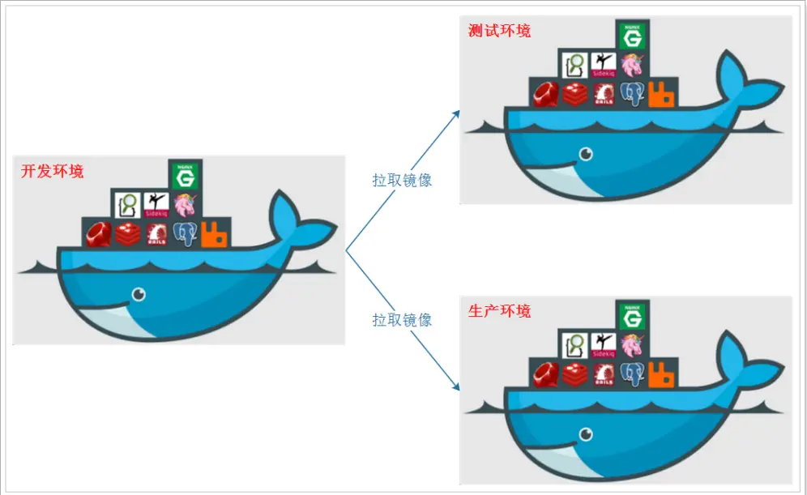
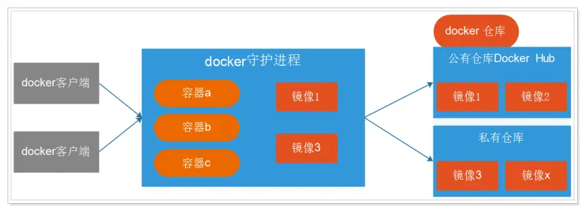
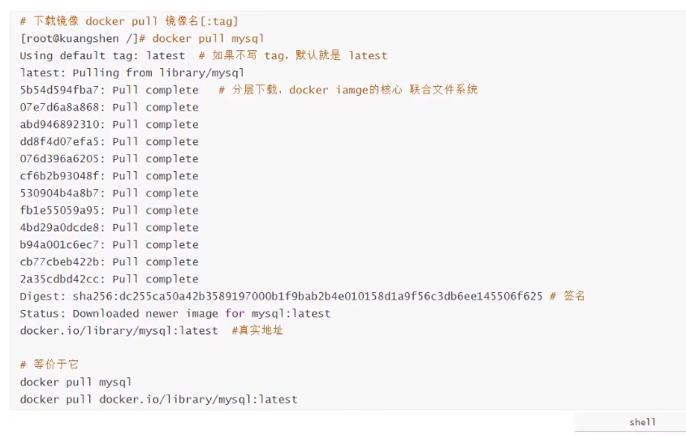

## 参考

参考

::: tip 参考

- [阮一峰Docker 入门教程](http://www.ruanyifeng.com/blog/2018/02/docker-tutorial.html)
- https://www.bilibili.com/read/cv6041687/

:::


官方

::: tip 官方

- [官方文档](https://docs.docker.com/)
- [仓库地址](https://hub.docker.com/)

:::


## 介绍

Docker 是一个开源的应用容器引擎，基于 Go 语言开发。Docker 可以让开发者打包他们的应用以及依赖包到一个轻 量级、可移植的容器中，然后发布到任何流行的 Linux 机器上，也可以实现虚拟化。容器是完全使用沙箱机制，相互 之间不会有任何接口（类似 iPhone 的 app）,更重要的是容器性能开销极低。

**Docker 属于 Linux 容器的一种封装，提供简单易用的容器使用接口。**它是目前最流行的 Linux 容器解决方案。

Docker 将应用程序与该程序的依赖，打包在一个文件里面。运行这个文件，就会生成一个虚拟容器。程序在这个虚拟容器里运行，就好像在真实的物理机上运行一样。有了 Docker，就不用担心环境问题。

总体来说，Docker 的接口相当简单，用户可以方便地创建和使用容器，把自己的应用放入容器。容器还可以进行版本管理、复制、分享、修改，就像管理普通的代码一样。


### 用途

Docker 的主要用途，目前有三大类。

::: info 用途

- **提供一次性的环境**。比如，本地测试他人的软件、持续集成的时候提供单元测试和构建的环境。
- **提供弹性的云服务**。因为 Docker 容器可以随开随关，很适合动态扩容和缩容。
- **组建微服务架构**。通过多个容器，一台机器可以跑多个服务，因此在本机就可以模拟出微服务架构。
- Web 应用的自动化打包和发布
- 自动化测试和持续集成、发布
- 在服务型环境中部署和调整数据库或其他的后台应用

:::


使用Docker可以实现开发人员的开发环境、测试人员的测试环境、运维人员的生产环境的一致性。





### 组成




### 底层原理


## 安装

::: tip 参考

- [CentOS Docker 安装](https://www.runoob.com/docker/centos-docker-install.html)
- [Install Docker Engine on CentOS](https://docs.docker.com/engine/install/centos/)
- [视频狂神说](https://www.bilibili.com/video/BV1og4y1q7M4?p=6)

:::


## 常用命令

参考

::: tip 参考

- https://www.bilibili.com/read/cv6041687/
- https://www.cnblogs.com/duanxz/p/7905233.html
- https://jishuin.proginn.com/p/763bfbd2a0a8

:::


### 镜像(images)


**查看镜像**

```bash
#查看所有本地主机上的镜像
docker images

#帮助
[root@VM-151-171-centos ~]# docker images --help

Usage:  docker images [OPTIONS] [REPOSITORY[:TAG]]

List images

Options:
  -a, --all             Show all images (default hides intermediate images)
      --digests         Show digests
  -f, --filter filter   Filter output based on conditions provided
      --format string   Pretty-print images using a Go template
      --no-trunc        Don't truncate output
  -q, --quiet           Only show numeric IDs
```


**搜索镜像**

```bash
#搜索mysql镜像
docker search mysql

[root@VM-151-171-centos ~]# docker search --help

Usage:  docker search [OPTIONS] TERM

Search the Docker Hub for images

Options:
  -f, --filter filter   Filter output based on conditions provided
      --format string   Pretty-print search using a Go template
      --limit int       Max number of search results (default 25)
      --no-trunc        Don't truncate output


#搜索stars大于3000的镜像
[root@VM-151-171-centos ~]# docker search mysql --filter=STARS=3000
NAME                DESCRIPTION                                     STARS               OFFICIAL            AUTOMATED
mysql               MySQL is a widely used, open-source relation…   10444               [OK]                
mariadb             MariaDB is a community-developed fork of MyS…   3880                [OK] 
```


**下载镜像**




可以看到部分文件已经存在，无需重复下载


**删除镜像**

```shell
#删除镜像，参数可以使镜像名也可以是镜像id
[root@VM-151-171-centos ~]# docker rmi --help

Usage:  docker rmi [OPTIONS] IMAGE [IMAGE...]

Remove one or more images

Options:
  -f, --force      Force removal of the image
      --no-prune   Do not delete untagged parents


#删除多个镜像
docker rmi -f [] []

#删除全部镜像
docker rmi -f $(docker images -aq)
```


### 容器(container)

参考参考:[https://www.bilibili.com/read/cv6041687/](https://www.bilibili.com/read/cv6041687/)


::: warning 注意

start是启动已创建好的，run是运行一个全新的容器

:::


## 日志 | 元数据 | 目录挂载 | 文件传输 


### 日志

```shell
[root@VM-151-171-centos ~]# docker logs --help

Usage:  docker logs [OPTIONS] CONTAINER

Fetch the logs of a container

Options:
      --details        Show extra details provided to logs
  -f, --follow         Follow log output
      --since string   Show logs since timestamp (e.g. 2013-01-02T13:23:37) or relative (e.g. 42m for 42 minutes)
      --tail string    Number of lines to show from the end of the logs (default "all")
  -t, --timestamps     Show timestamps
      --until string   Show logs before a timestamp (e.g. 2013-01-02T13:23:37) or relative (e.g. 42m for 42 minutes)
```


### 元数据

```shell
#查看关于容器的所有信息
docker inspect [容器id/名]
```


### 目录挂载

可以在创建容器的时候，将宿主机的目录与容器内的目录进行映射，这样我们就可以通过修改宿主机某个目录的文件从而去影响容器，也就意味着挂载的目录`互相同步`。 

创建容器时添加`-v`参数，后边为`宿主机目录:容器目录`，例如： docker run -di -v /usr/local/test:/usr/local/test -- name=mycentos3 centos:7

创建linux宿主机器要挂载的目录

```shell
mkdir /usr/local/test
```


创建并启动容器mycentos3,并挂载linux中的/usr/local/test目录到容器的/usr/local/test；也就是在

linux中的/usr/local/test中操作相当于对容器相应目录操作

```shell
docker run -di -v /usr/local/test:/usr/local/test --name=mycentos3 centos:7
```


在linux下创建文件

```shell
touch /usr/local/test/def.txt
```


进入容器

```shell
docker exec -it mycentos3 /bin/bash 
```


在容器中查看目录中是否有对应文件def.txt

```shell
ll /usr/local/test 
```


### 文件传输

拷贝宿主机文件到容器

```shell
#将主机文件拷贝到容器中
docker cp [主机文件] [容器]:[容器路径]
```


拷贝容器中的文件到宿主机

```shell
#将主机文件拷贝到容器中
docker cp [容器]:[容器文件] [主机路径]
```


## dockerfile


## docker-compose

