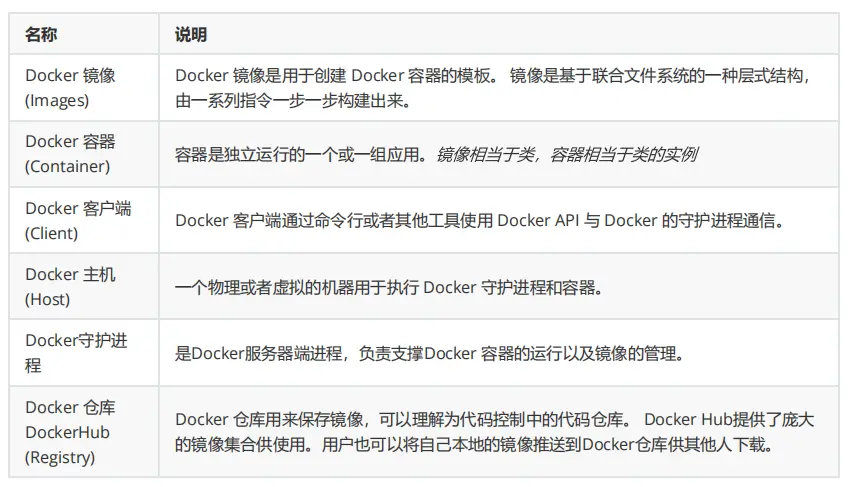
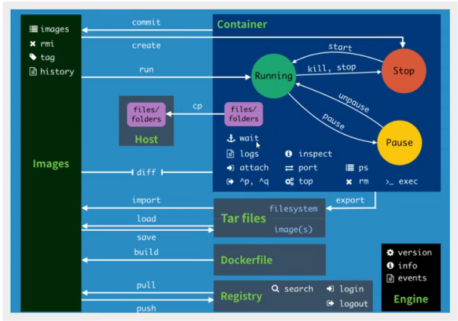
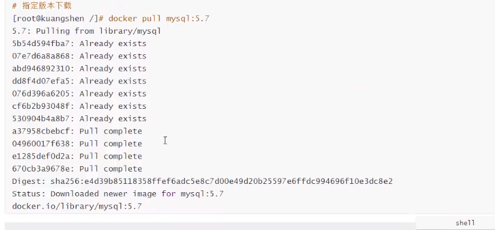
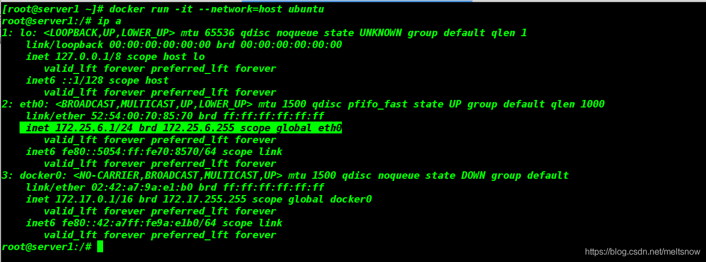

## 参考

参考

::: tip 参考

- [阮一峰Docker 入门教程](http://www.ruanyifeng.com/blog/2018/02/docker-tutorial.html)
- https://www.bilibili.com/read/cv6041687/
- [菜鸟教程 | Docker 教程](https://www.runoob.com/docker/docker-tutorial.html)

:::


官方

::: tip 官方

- [官方文档](https://docs.docker.com/)
- [仓库地址](https://hub.docker.com/)

:::


## 介绍

Docker 是一个开源的应用容器引擎，基于 Go 语言开发。Docker 可以让开发者打包他们的应用以及依赖包到一个轻 量级、可移植的容器中，然后发布到任何流行的 Linux 机器上，也可以实现虚拟化。容器是完全使用沙箱机制，相互 之间不会有任何接口（类似 iPhone 的 app）,更重要的是容器性能开销极低。

**Docker 属于 Linux 容器的一种封装，提供简单易用的容器使用接口。**它是目前最流行的 Linux 容器解决方案。

Docker 将应用程序与该程序的依赖，打包在一个文件里面。运行这个文件，就会生成一个虚拟容器。程序在这个虚拟容器里运行，就好像在真实的物理机上运行一样。有了 Docker，就不用担心环境问题。

总体来说，Docker 的接口相当简单，用户可以方便地创建和使用容器，把自己的应用放入容器。容器还可以进行版本管理、复制、分享、修改，就像管理普通的代码一样。


### 用途

Docker 的主要用途，目前有三大类。

::: info 用途

- **提供一次性的环境**。比如，本地测试他人的软件、持续集成的时候提供单元测试和构建的环境。
- **提供弹性的云服务**。因为 Docker 容器可以随开随关，很适合动态扩容和缩容。
- **组建微服务架构**。通过多个容器，一台机器可以跑多个服务，因此在本机就可以模拟出微服务架构。
- Web 应用的自动化打包和发布
- 自动化测试和持续集成、发布
- 在服务型环境中部署和调整数据库或其他的后台应用

:::


使用Docker可以实现开发人员的开发环境、测试人员的测试环境、运维人员的生产环境的一致性。


### 组成





### 底层原理


## 安装

::: tip 参考

- [CentOS Docker 安装](https://www.runoob.com/docker/centos-docker-install.html)
- [Install Docker Engine on CentOS](https://docs.docker.com/engine/install/centos/)
- [视频狂神说](https://www.bilibili.com/video/BV1og4y1q7M4?p=6)

:::


### docker可视化界面

::: tip 参考

- https://www.cnblogs.com/frankdeng/p/9686735.html

:::


## docker镜像容器原理

::: tip 参考

- http://dockone.io/article/783
- https://zhuanlan.zhihu.com/p/93085215
- https://blog.51cto.com/liuleis/2070461

:::


## 常用命令

参考

::: tip 参考

- [Docker官网文档](https://docs.docker.com/engine/reference/run/)
- http://dockone.io/article/783
- https://www.bilibili.com/read/cv6041687/
- https://www.cnblogs.com/duanxz/p/7905233.html
- https://jishuin.proginn.com/p/763bfbd2a0a8

:::





### 镜像(images)


**查看镜像**

```bash
#查看所有本地主机上的镜像
docker images

#帮助
[root@VM-151-171-centos ~]# docker images --help

Usage:  docker images [OPTIONS] [REPOSITORY[:TAG]]

List images

Options:
  -a, --all             Show all images (default hides intermediate images)
      --digests         Show digests
  -f, --filter filter   Filter output based on conditions provided
      --format string   Pretty-print images using a Go template
      --no-trunc        Don't truncate output
  -q, --quiet           Only show numeric IDs
```


**搜索镜像**

```bash
#搜索mysql镜像
docker search mysql

[root@VM-151-171-centos ~]# docker search --help

Usage:  docker search [OPTIONS] TERM

Search the Docker Hub for images

Options:
  -f, --filter filter   Filter output based on conditions provided
      --format string   Pretty-print search using a Go template
      --limit int       Max number of search results (default 25)
      --no-trunc        Don't truncate output


#搜索stars大于3000的镜像
[root@VM-151-171-centos ~]# docker search mysql --filter=STARS=3000
NAME                DESCRIPTION                                     STARS               OFFICIAL            AUTOMATED
mysql               MySQL is a widely used, open-source relation…   10444               [OK]                
mariadb             MariaDB is a community-developed fork of MyS…   3880                [OK] 
```


**下载镜像**




可以看到部分文件已经存在，无需重复下载


**删除镜像**

```shell
#删除镜像，参数可以使镜像名也可以是镜像id
[root@VM-151-171-centos ~]# docker rmi --help

Usage:  docker rmi [OPTIONS] IMAGE [IMAGE...]

Remove one or more images

Options:
  -f, --force      Force removal of the image
      --no-prune   Do not delete untagged parents


#删除多个镜像
docker rmi -f [] []

#删除全部镜像
docker rmi -f $(docker images -aq)
```


### 容器(container)

参考参考:[https://www.bilibili.com/read/cv6041687/](https://www.bilibili.com/read/cv6041687/)


::: warning 注意

- start是启动已创建好的，run是运行一个全新的容器
- `run`的时候`--rm`代表用完容器自动删除容器
- `run`的时候`-P`大写的P是随机端口

:::


### 其他

```shell
#查看各个容器状态（CPU等）
docker stats
#查看指定容器
docker stats [容器]
```


```shell
#7.在使⽤ -d 参数时，容器启动后会进⼊后台。此时想要进⼊容器，可以通过以下指令进⼊
docker attach 容器名称/id #不推荐使⽤，因为退出时会导致容器的停⽌
docker exec -it 容器名称/id /bin/bash #在进⼊容器后可使⽤linux命令，退出使⽤exit

#8.导出
docker export 容器名称/id > 名称.tar

#9.导⼊，可以使⽤ docker import 从容器快照⽂件中再导⼊为镜像，以下实例将快照⽂件指定
路径的tar 导⼊到镜像 test/test:v1:
cat tar路径 | docker import - test/test:v1
#也可以通过指定 URL 或者某个⽬录来导⼊
docker import http://example.com/exampleimage.tgz example/imagerepo

#10.删除容器
docker rm -f 容器名称/id

#11.启动&停止docker
service docker start#启动docker
service docker stop#停止docker
service docker restart#重启docker

#12.开机自启动docker
systemctl enable docker
```


## 日志 | 元数据 | 文件传输 


### 日志

```shell
[root@VM-151-171-centos ~]# docker logs --help

Usage:  docker logs [OPTIONS] CONTAINER

Fetch the logs of a container

Options:
      --details        Show extra details provided to logs
  -f, --follow         Follow log output
      --since string   Show logs since timestamp (e.g. 2013-01-02T13:23:37) or relative (e.g. 42m for 42 minutes)
      --tail string    Number of lines to show from the end of the logs (default "all")
  -t, --timestamps     Show timestamps
      --until string   Show logs before a timestamp (e.g. 2013-01-02T13:23:37) or relative (e.g. 42m for 42 minutes)
```


### 元数据

```shell
#查看关于容器的所有信息
docker inspect [容器id/名]
```


### 文件传输

拷贝宿主机文件到容器

```shell
#将主机文件拷贝到容器中
docker cp [主机文件] [容器]:[容器路径]
```


拷贝容器中的文件到宿主机

```shell
#将主机文件拷贝到容器中
docker cp [容器]:[容器文件] [主机路径]
```


## 容器数据卷/目录挂载

::: tip 参考

- https://www.cnblogs.com/ruanraun/p/dockervolumes.html
- https://www.cnblogs.com/ivictor/p/4834864.html
- https://www.cnblogs.com/loveyous/p/11372034.html

:::


在容器中管理数据主要有两种方式：

- 数据卷(Volumes)
- 挂载主机目录(Bind mounts)


::: warning

Docker中提供了两种挂载方式，`-v`和`-mount`

Docker新用户应该选择 --mount参数

经验丰富的Docker使用者对-v或者--volume已经很熟悉了，但是推荐使用-mount参数。

:::


### 目录挂载

持久化容器里面的数据到本地，通过`目录挂载`的方式

可以在创建容器的时候，将宿主机的目录与容器内的目录进行映射，这样我们就可以通过修改宿主机某个目录的文件从而去影响容器，也就意味着挂载的目录`互相同步`。 

创建容器时添加`-v`参数，后边为`宿主机目录:容器目录`，例如： docker run -di -v /usr/local/test:/usr/local/test -- name=mycentos3 centos:7

创建linux宿主机器要挂载的目录

```shell
mkdir /usr/local/test
```


创建并启动容器mycentos3,并挂载linux中的/usr/local/test目录到容器的/usr/local/test；也就是在

linux中的/usr/local/test中操作相当于对容器相应目录操作

```shell
docker run -di -v /usr/local/test:/usr/local/test --name=mycentos3 centos:7
```


在linux下创建文件

```shell
touch /usr/local/test/def.txt
```


进入容器

```shell
docker exec -it mycentos3 /bin/bash 
```


在容器中查看目录中是否有对应文件def.txt

```shell
ll /usr/local/test 
```


然后查看容器元数据中的挂载目录信息

```json
"Mounts": [
  {
    "Type": "bind",
    "Source": "/usr/local/docker/nginx/html",
    "Destination": "/data/html",
    "Mode": "rw",
    "RW": true,
    "Propagation": "rprivate"
  },
  {
    "Type": "bind",
    "Source": "/usr/local/docker/nginx/img",
    "Destination": "/data/img",
    "Mode": "rw",
    "RW": true,
    "Propagation": "rprivate"
  },
  {
    "Type": "bind",
    "Source": "/usr/local/docker/nginx/conf.d",
    "Destination": "/etc/nginx/conf.d",
    "Mode": "rw",
    "RW": true,
    "Propagation": "rprivate"
  }
],

```


### 具名和匿名挂载

```shell
# 如何确实是具名/匿名挂载，还是指定路径挂载
#匿名挂载
-v 容器内路径

#具名挂载
-v 卷名:容器内路径

#指定路径挂载
-v /宿主机路径:容器内路径
```


### 容器挂载目录权限

在`容器内路径`后加`:ro`为可读，加`:rw`为可读可写

::: info

- **ro**:宿主机只能读取容器的数据卷内容不能修改
- **rw**:默认，即可读可写

:::


### 数据卷容器共享

如我我们经常需要多个容器之间进行数据共享我们需要用到命令`--volumes-from`


具体示例

1. 我们从仓库拉一个centos的容器镜像

```bash
Copy$ docker pull centos
```

2）然后运行这个镜像并创建一个数据卷挂载到/mydata

```bash
$ docker run -it -v /mydata --name mycentos centos
```

2. 再运行两个容器，在这两个容器中使用--volumes-from来挂载mycentos容器中的数据卷.

```bash
$ docker run -it --volumes-from mycentos --name soncentos1 centos

$ docker run -it --volumes-from mycentos --name soncentos2 centos
```

此时，容器soncentos1和soncentos2都挂载同一个数据卷到相的/mydata目录。三个容器任何一方在该目录下的写入数据，其他容器都可以看到。


::: warning 注意

可以多次使用`--volumes-**from**`参数来从多个容器挂载多个数据卷。还可以从其他已经挂载了容器卷的容器来挂载数据卷。 使用--volumes-**from**参数所挂载数据卷的容器自身并不需要保持在运行状态。 

如果删除了挂载的容器（包括dbdata、db1和db2），数据卷并不会被自动删除。如果要删除一个数据卷，必须在删除最后一个还挂载着它 的容器时显式使用docker rm -v命令来指定同时删除关联的容器。

:::


## 制作镜像


### 使用commit命令

```shell
# 提交某个容器为镜像
docker commit [容器]

[root@izuf6f489inattnq5zpfcxz ~]# docker commit --help

Usage:  docker commit [OPTIONS] CONTAINER [REPOSITORY[:TAG]]

Create a new image from a container's changes

Options:
  -a, --author string    Author (e.g., "John Hannibal Smith <hannibal@a-team.com>")
  -c, --change list      Apply Dockerfile instruction to the created image
  -m, --message string   Commit message
  -p, --pause            Pause container during commit (default true)

```


## Dockerfile-制作镜像

::: tips 参考

- [Dockerfile reference](https://docs.docker.com/engine/reference/builder/#dockerfile-examples)
- [菜鸟教程 | Dockerfile](https://www.runoob.com/docker/docker-dockerfile.html)

:::


### 命令


`CMD`&`ENTRYPOINT`的区别

::: warning CMD&ENTRYPOINT的区别

- CMD：指定这个容器启动的时候要运行的命令，只有最后一个会生效，可被替代
- ENTRYPOINT：指定这个容器启动的时候要运行的命令，可以追加命令

:::


举例通过构建两个不同的dockerfile

`dockerfile-cmd`

```shell
# 构建镜像为centos-cmd
FROM centos
CMD ["ls", "-a"]
```

`dockerfile-entrypoint`

```shell
# 构建镜像为centos-entrypoint
FROM centos
ENTRYPOINT ["ls", "-a"]
```


构建镜像再运行

`centos-cmd`

```shell

[root@izuf6f489inattnq5zpfcxz ~]# docker run centos-cmd
.
..
.dockerenv
bin
dev
etc
home
lib
lib64
lost+found
media
mnt
opt
proc
root
run
sbin
srv
sys
tmp
usr
var
[root@izuf6f489inattnq5zpfcxz ~]#

```


`centos-entrypoint`

```shell
[root@izuf6f489inattnq5zpfcxz ~]# docker run centos-entrypoint
.
..
.dockerenv
bin
dev
etc
home
lib
lib64
lost+found
media
mnt
opt
proc
root
run
sbin
srv
sys
tmp
usr
var
[root@izuf6f489inattnq5zpfcxz ~]#
```


此时我们在`run`时追加命令，由于`cmd`是替换所以会报错，而`entrypoint`则不会

`centos-cmd`

```shell
[root@izuf6f489inattnq5zpfcxz ~]# docker run centos-cmd -l
docker: Error response from daemon: OCI runtime create failed: container_linux.go:349: starting container process caused "exec: \"-l\": executable file not found in $PATH": unknown.
[root@izuf6f489inattnq5zpfcxz ~]#
```


`centos-entrypoint`

```shell

[root@izuf6f489inattnq5zpfcxz ~]# docker run centos-entrypoint -l
total 56
drwxr-xr-x   1 root root 4096 Feb  8 16:19 .
drwxr-xr-x   1 root root 4096 Feb  8 16:19 ..
-rwxr-xr-x   1 root root    0 Feb  8 16:19 .dockerenv
lrwxrwxrwx   1 root root    7 Nov  3 15:22 bin -> usr/bin
drwxr-xr-x   5 root root  340 Feb  8 16:19 dev
drwxr-xr-x   1 root root 4096 Feb  8 16:19 etc
drwxr-xr-x   2 root root 4096 Nov  3 15:22 home
lrwxrwxrwx   1 root root    7 Nov  3 15:22 lib -> usr/lib
lrwxrwxrwx   1 root root    9 Nov  3 15:22 lib64 -> usr/lib64
drwx------   2 root root 4096 Dec  4 17:37 lost+found
drwxr-xr-x   2 root root 4096 Nov  3 15:22 media
drwxr-xr-x   2 root root 4096 Nov  3 15:22 mnt
drwxr-xr-x   2 root root 4096 Nov  3 15:22 opt
dr-xr-xr-x 151 root root    0 Feb  8 16:19 proc
dr-xr-x---   2 root root 4096 Dec  4 17:37 root
drwxr-xr-x  11 root root 4096 Dec  4 17:37 run
lrwxrwxrwx   1 root root    8 Nov  3 15:22 sbin -> usr/sbin
drwxr-xr-x   2 root root 4096 Nov  3 15:22 srv
dr-xr-xr-x  13 root root    0 Feb  8 16:19 sys
drwxrwxrwt   7 root root 4096 Dec  4 17:37 tmp
drwxr-xr-x  12 root root 4096 Dec  4 17:37 usr
drwxr-xr-x  20 root root 4096 Dec  4 17:37 var
[root@izuf6f489inattnq5zpfcxz ~]#

```

可以看到此时`-l`命令被追加到`ls -a`中，最后执行了`ls -a -l`


其他

::: info

- 每个保留关键字都是大写字母
- 执行顺序从上到下
- #表示注释
- 每一个指令都会创建提交一个`新的镜像层`，并提交

:::


### 示例：创建自己的centos镜像


编写`dockerfile`文件

```shell
FROM centos
MAINTAINER Chen Long

ENV MYPATH /usr/local
WORKDIR $MYPATH

RUN yum -y install vim
RUN yum -y install tree
RUN yum -y install net-tools

EXPOSE 80

CMD echo $MYPATH
CMD echo "---END---"
CMD /bin/bash
```


执行build命令

``` .shell
docker build -f [dockerfile文件] -t [镜像名] .
```


构建完毕

```shell
Successfully built 0532ada899d9
Successfully tagged mycentos:1.0.0
```


查看镜像

```shell
[root@izuf6f489inattnq5zpfcxz mydockerfile]# docker images
REPOSITORY            TAG                 IMAGE ID            CREATED             SIZE
mycentos              1.0.0               0532ada899d9        3 minutes ago       314MB
```


查看镜像构建历史

```shell
docker history [镜像]
```


重命名镜像/打标签

```shell
docker tag [镜像]
```


## docker-compose


## docker网络


::: tips 参考

- https://blog.csdn.net/meltsnow/article/details/94490994
- https://blog.51cto.com/ganbing/2087598
- [Docker四种网络模式](https://www.jianshu.com/p/22a7032bb7bd)

:::


### 定义

安装Docker时，它会自动创建三个网络:

- bridge（创建容器默认连接到此网络）
- none 
- host


| 网络模式   | 简介                                                         |
| ---------- | ------------------------------------------------------------ |
| Host       | 容器将不会虚拟出自己的网卡，配置自己的IP等，而是使用宿主机的IP和端口。 |
| Bridge     | 此模式会为每一个容器分配、设置IP等，并将容器连接到一个docker0虚拟网桥，通过docker0网桥以及Iptables nat表配置与宿主机通信。 |
| None       | 该模式关闭了容器的网络功能。                                 |
| Container  | 创建的容器不会创建自己的网卡，配置自己的IP，而是和一个指定的容器共享IP、端口范围。 |
| 自定义网络 | 略                                                           |


使用`docker network ls`查看

```shell
[root@izuf6f489inattnq5zpfcxz ~]# docker network ls
NETWORK ID          NAME                DRIVER              SCOPE
cdd42cba5f27        bridge              bridge              local
83b40108e61e        host                host                local
9b24385c4387        nginx_default       bridge              local
a801bf66725a        none                null                local
```

> nginx为自己安装的


**Docker内置这三个网络，运行容器时，你可以使用该–network标志来指定容器应连接到哪些网络。**

**该bridge网络代表docker0所有Docker安装中存在的网络。除非你使用该docker run --network=选项指定，否则Docker守护程序默认将容器连接到此网络。**

```shell {10-13}
[root@izuf6f489inattnq5zpfcxz ~]# ip a
1: lo: <LOOPBACK,UP,LOWER_UP> mtu 65536 qdisc noqueue state UNKNOWN qlen 1
    link/loopback 00:00:00:00:00:00 brd 00:00:00:00:00:00
    inet 127.0.0.1/8 scope host lo
       valid_lft forever preferred_lft forever
2: eth0: <BROADCAST,MULTICAST,UP,LOWER_UP> mtu 1500 qdisc pfifo_fast state UP qlen 1000
    link/ether 00:16:3e:10:a3:c3 brd ff:ff:ff:ff:ff:ff
    inet 172.17.3.46/18 brd 172.17.63.255 scope global eth0
       valid_lft forever preferred_lft forever
3: docker0: <BROADCAST,MULTICAST,UP,LOWER_UP> mtu 1500 qdisc noqueue state UP
    link/ether 02:42:22:ac:5e:95 brd ff:ff:ff:ff:ff:ff
    inet 172.18.0.1/16 brd 172.18.255.255 scope global docker0
       valid_lft forever preferred_lft forever
4: br-9b24385c4387: <BROADCAST,MULTICAST,UP,LOWER_UP> mtu 1500 qdisc noqueue state UP
    link/ether 02:42:ba:48:bd:cc brd ff:ff:ff:ff:ff:ff
    inet 172.23.0.1/16 brd 172.23.255.255 scope global br-9b24385c4387
       valid_lft forever preferred_lft forever
6: veth76d3b86@if5: <BROADCAST,MULTICAST,UP,LOWER_UP> mtu 1500 qdisc noqueue master br-9b24385c4387 state UP
    link/ether 76:09:c0:f5:c0:de brd ff:ff:ff:ff:ff:ff link-netnsid 0
10: veth4a169f6@if9: <BROADCAST,MULTICAST,UP,LOWER_UP> mtu 1500 qdisc noqueue master docker0 state UP
    link/ether 56:2a:84:6f:4a:03 brd ff:ff:ff:ff:ff:ff link-netnsid 2
12: veth46c9f96@if11: <BROADCAST,MULTICAST,UP,LOWER_UP> mtu 1500 qdisc noqueue master docker0 state UP
    link/ether 0e:7e:8a:1d:d4:c7 brd ff:ff:ff:ff:ff:ff link-netnsid 3
14: veth6a04666@if13: <BROADCAST,MULTICAST,UP,LOWER_UP> mtu 1500 qdisc noqueue master docker0 state UP
    link/ether 72:6a:3a:3c:17:83 brd ff:ff:ff:ff:ff:ff link-netnsid 4
16: vethb692a64@if15: <BROADCAST,MULTICAST,UP,LOWER_UP> mtu 1500 qdisc noqueue master docker0 state UP
    link/ether 6e:82:0e:c2:09:fd brd ff:ff:ff:ff:ff:ff link-netnsid 5
18: veth976aa59@if17: <BROADCAST,MULTICAST,UP,LOWER_UP> mtu 1500 qdisc noqueue master docker0 state UP
    link/ether 82:61:29:70:0b:11 brd ff:ff:ff:ff:ff:ff link-netnsid 6
22: vethdc31829@if21: <BROADCAST,MULTICAST,UP,LOWER_UP> mtu 1500 qdisc noqueue master docker0 state UP
    link/ether 72:5a:78:af:70:c8 brd ff:ff:ff:ff:ff:ff link-netnsid 1
```


**我们在使用docker run创建Docker容器时，可以用 --net 选项指定容器的网络模式，Docker可以有以下4种网络模式：**

::: info 四种网络模式

- **host**：使用 --net=host 指定。
- **none**：使用 --net=none 指定。
- **bridge**：使用 --net=bridge 指定，默认设置。
- **container**：使用 --net=container:NAME_or_ID 指定。

:::


### Host

相当于Vmware中的`桥接模式`，与宿主机在同一个网络中，但没有独立IP地址。

众所周知，Docker使用了Linux的`Namespaces`技术来进行资源隔离，如`PID Namespace`隔离进程，`Mount Namespace`隔离文件系统，`Network Namespace`隔离网络等。

一个Network Namespace提供了一份独立的网络环境，包括网卡、路由、Iptable规则等都与其他的Network Namespace隔离。一个Docker容器一般会分配一个独立的Network Namespace。但如果启动容器的时候使用host模式，那么这个容器将不会获得一个独立的Network Namespace，而是和宿主机共用一个Network Namespace。容器将不会虚拟出自己的网卡，配置自己的IP等，而是使用宿主机的IP和端口。


**例如，我们在172.25.6.1/24的机器上用host模式启动一个ubuntu容器**

```shell
[root@server1 ~]# docker run -it --network=host ubuntu
```


可以看到，容器的网络使用的时宿主机的网络，但是，容器的其他方面，如`文件系统`、`进程列表`等还是和宿主机隔离的。




### Container

在理解了host模式后，这个模式也就好理解了。这个模式指定新创建的容器和已经存在的一个容器共享一个`Network Namespace`，而不是和宿主机共享。新创建的容器不会创建自己的网卡，配置自己的IP，而是和一个指定的容器共享IP、端口范围等。同样，两个容器除了网络方面，其他的如文件系统、进程列表等还是隔离的。两个容器的进程可以通过lo网卡设备通信。


### None

该模式将容器放置在它自己的网络栈中，但是并不进行任何配置。实际上，该模式关闭了容器的网络功能，在以下两种情况下是有用的：容器并不需要网络（例如只需要写磁盘卷的批处理任务）。


::: info overlay

**在docker1.7代码进行了重构，单独把网络部分独立出来编写，所以在docker1.8新加入的一个overlay网络模式。Docker对于网络访问的控制也是在逐渐完善的。**

:::


### Bridge(默认)

相当于Vmware中的`Nat模式`，容器使用独立`network Namespace`，并连接到`docker0`虚拟网卡（默认模式）。通过`docker0网桥`以及`Iptables nat表`配置与宿主机通信；

bridge模式是`Docker默认的网络设置`，此模式会为每一个容器分配`Network Namespace`、设置IP等，并将一个主机上的Docker容器连接到一个虚拟网桥上。下面着重介绍一下此模式。


当Docker server启动时，会在主机上创建一个名为`docker0的虚拟网桥`，此主机上启动的Docker容器会连接到这个虚拟网桥上。虚拟网桥的工作方式和物理交换机类似，这样主机上的所有容器就通过交换机连在了一个二层网络中。

接下来就要为容器分配IP了，Docker会从RFC1918所定义的私有IP网段中，选择一个`和宿主机不同的IP地址和子网`分配给`docker0`，连接到docker0的容器就从这个子网中选择`一个未占用的IP`使用。如一般Docker会使用172.17.0.0/16这个网段，并将172.17.0.1/16分配给docker0网桥（在主机上使用ifconfig命令是可以看到docker0的，可以认为它是网桥的管理接口，在宿主机上作为一块虚拟网卡使用）。单机环境下的网络拓扑如下，主机地址为10.10.0.186/24。


#### 流程

Docker完成以上网络配置的过程大致是这样的：


1. 在主机上创建一对虚拟网卡`veth pair`设备。veth设备总是`成对出现`的，它们组成了一个数据的通道，数据从一个设备进入，就会从另一个设备出来。因此，veth设备常用来连接两个网络设备。

   

2. Docker将veth pair设备的一端放在新创建的容器中，并命名为`eth0`。另一端放在主机中，以veth65f9这样类似的名字命名，并将这个网络设备加入到docker0网桥中，可以通过brctl show命令查看。

   ```shell
   brctl show
   bridge name     bridge id               STP enabled     interfaces
   docker0         8000.02425f21c208       no
   ```
   
   


3. 从`docker0子网`中分配一个IP给容器使用，并设置`docker0的IP地址`为容器的`默认网关`。

   运行容器：

   ```shell
   docker run --name=nginx_bridge --net=bridge -p 80:80 -d nginx        
   9582dbec7981085ab1f159edcc4bf35e2ee8d5a03984d214bce32a30eab4921a
   ```

   


#### 容器的通信

在bridge模式下，连在同一网桥上的容器可以相互通信（若出于安全考虑，也可以禁止它们之间通信，方法是在`DOCKER_OPTS`变量中设置`–icc=false`，这样只有使用–link才能使两个容器通信）。

Docker可以开启容器间通信（意味着默认配置–icc=true），也就是说，宿主机上的所有容器可以不受任何限制地相互通信，这可能导致拒绝服务攻击。进一步地，Docker可以通过–ip_forward和–iptables两个选项控制容器间、容器和外部世界的通信。

容器也可以与外部通信，我们看一下主机上的`Iptable`规则，可以看到这么一条

```shell
-A POSTROUTING -s 172.17.0.0/16 ! -o docker0 -j MASQUERADE
```


这条规则会将源地址为172.17.0.0/16的包（也就是从Docker容器产生的包），并且不是从docker0网卡发出的，进行源地址转换，转换成主机网卡的地址。这么说可能不太好理解，举一个例子说明一下。假设主机有一块网卡为eth0，IP地址为10.10.101.105/24，网关为10.10.101.254。从主机上一个IP为172.17.0.1/16的容器中ping百度（180.76.3.151）。IP包首先从容器发往自己的默认网关docker0，包到达docker0后，也就到达了主机上。然后会查询主机的路由表，发现包应该从主机的eth0发往主机的网关10.10.105.254/24。接着包会转发给eth0，并从eth0发出去（主机的ip_forward转发应该已经打开）。这时候，上面的Iptable规则就会起作用，对包做SNAT转换，将源地址换为eth0的地址。这样，在外界看来，这个包就是从10.10.101.105上发出来的，Docker容器对外是不可见的。

那么，外面的机器是如何访问Docker容器的服务呢？我们首先用下面命令创建一个含有web应用的容器，将容器的80端口映射到主机的80端口。

```shell
docker run --name=nginx_bridge --net=bridge -p 80:80 -d nginx
```

**此条规则就是对主机eth0收到的目的端口为80的tcp流量进行DNAT转换，将流量发往172.17.0.2:80，也就是我们上面创建的Docker容器。所以，外界只需访问10.10.101.105:80就可以访问到容器中的服务。**

**除此之外，我们还可以自定义Docker使用的IP地址、DNS等信息，甚至使用自己定义的网桥，但是其工作方式还是一样的。**


### 自定义网络

**建议使用自定义的网桥来控制哪些容器可以相互通信，还可以自动DNS解析容器名称到IP地址。Docker提供了创建这些网络的默认网络驱动程序，你可以创建一个新的Bridge网络，Overlay或Macvlan网络。你还可以创建一个网络插件或远程网络进行完整的自定义和控制。**

**你可以根据需要创建任意数量的网络，并且可以在任何给定时间将容器连接到这些网络中的零个或多个网络。此外，您可以连接并断开网络中的运行容器，而无需重新启动容器。当容器连接到多个网络时，其外部连接通过第一个非内部网络以词法顺序提供。**

**接下来介绍Docker的内置网络驱动程序。**