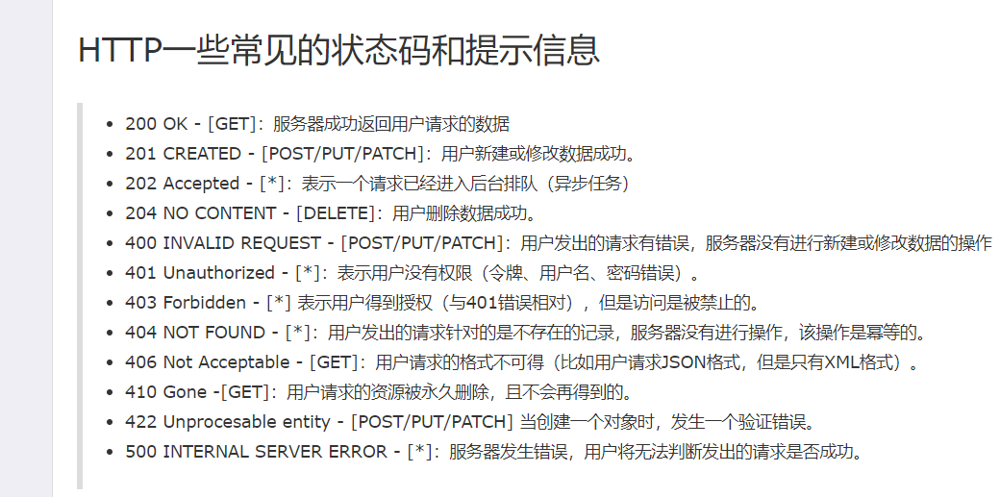

## OSI与TCP/IP各层的结构与功能,都有哪些协议?

## Http | Https

参考

> - https://blog.csdn.net/qq_38289815/article/details/80969419

### Http

​		超文本传输协议，是一个基于请求与响应，无状态的，应用层的协议，常基于TCP/IP协议传输数据，互联网上应用最为广泛的一种网络协议,所有的WWW文件都必须遵守这个标准。设计HTTP的初衷是为了提供一种发布和接收HTML页面的方法。

**原理/过程**

- 客户端的浏览器首先要通过网络与服务器建立连接，该连接是通过 TCP 来完成的，一般 TCP 连接的端口号是80。 建立连接后，客户机发送一个请求给服务器，请求方式的格式为：统一资源标识符（URL）、协议版本号，后边是 MIME 信息包括请求修饰符、客户机信息和许可内容。
- 服务器接到请求后，给予相应的响应信息，其格式为一个状态行，包括信息的协议版本号、一个成功或错误的代码，后边是 MIME 信息包括服务器信息、实体信息和可能的内容。

**特点**

- http协议支持客户端/服务端模式，也是一种请求/响应模式的协议。
- 简单快速：客户向服务器请求服务时，只需传送请求方法和路径。请求方法常用的有GET、HEAD、POST。
- 灵活：HTTP允许传输任意类型的数据对象。传输的类型由Content-Type加以标记。
- 无连接：限制每次连接只处理一个请求。服务器处理完请求，并收到客户的应答后，即断开连接，但是却不利于客户端与服务器保持会话连接，为了弥补这种不足，产生了两项记录http状态的技术，一个叫做Cookie,一个叫做Session。
- 无状态：无状态是指协议对于事务处理没有记忆，后续处理需要前面的信息，则必须重传。

### HTTP1 | HTTP2 | HTTP3

::: tip 参考

- [一文读懂 HTTP1/HTTP2/HTTP/3](https://zhuanlan.zhihu.com/p/102561034)
- https://blog.csdn.net/weixin_41205419/article/details/105510318
- [一文读懂 HTTP/2 特性](https://zhuanlan.zhihu.com/p/26559480)

:::

### Https

​		《图解HTTP》这本书中曾提过HTTPS是身披SSL外壳的HTTP。HTTPS是一种通过计算机网络进行安全通信的传输协议，经由HTTP进行通信，利用SSL/TLS建立全信道，加密数据包。HTTPS使用的主要目的是提供对网站服务器的身份认证，同时保护交换数据的隐私与完整性。基于HTTP协议，通过SSL或TLS提供加密处理数据、验证对方身份以及数据完整性保护

**原理/过程**

- 首先服务端给客户端传输证书,这个证书就是公钥,只是包含了很多的信息,比如说证书的办法机构,证书的过期时间
- 客户端进行证书的解析,比如说验证办法机构,过期时间,如果发现没有任何问题,就生成一个随机值(私钥),然后用证书对这个私钥进行加密,并发送给服务端
- 服务端使用私钥将这个信息进行解密,得到客户端的私钥,然后客户端和服务端就可以通过这个私钥进行通信了
- 服务端将消息进行对称加密(简单来说就是讲消息和私钥进行混合,除非知道私钥否则服务进行解密),私钥正好只有客户端和服务端知道,所以信息就比较安全了
- 服务端将进行对称加密后的消息进行传送
- 客户端使用私钥进行信息的解密

**特点**

- **数据保密性：**保证数据内容在传输的过程中不会被第三方查看。就像快递员传递包裹一样，都进行了封装，别人无法获知里面装了什么 。
- **数据完整性：**及时发现被第三方篡改的传输内容。就像快递员虽然不知道包裹里装了什么东西，但他有可能中途掉包，数据完整性就是指如果被掉包，我们能轻松发现并拒收 。
- **身份校验安全性：**保证数据到达用户期望的目的地。就像我们邮寄包裹时，虽然是一个封装好的未掉包的包裹，但必须确定这个包裹不会送错地方，通过身份校验来确保送对了地方 。

**缺点**

- HTTPS 协议握手阶段比较费时，会使页面的加载时间延长近。
- HTTPS 连接缓存不如 HTTP 高效，会增加数据开销，甚至已有的安全措施也会因此而受到影响。
- HTTPS 协议的安全是有范围的，在黑客攻击、拒绝服务攻击和服务器劫持等方面几乎起不到什么作用。
- SSL 证书通常需要绑定 IP，不能在同一 IP 上绑定多个域名，IPv4 资源不可能支撑这个消耗。
- 成本增加。部署 HTTPS 后，因为 HTTPS 协议的工作要增加额外的计算资源消耗，例如 SSL 协议加密算法和 SSL 交互次数将占用一定的计算资源和服务器成本。
- HTTPS 协议的加密范围也比较有限。最关键的，SSL 证书的信用链体系并不安全，特别是在某些国家可以控制 CA 根证书的情况下，中间人攻击一样可行。

### Http | Https的不同

Http协议运行在TCP之上，明文传输，客户端与服务器端都无法验证对方的身份；Https是身披SSL(Secure Socket Layer)外壳的Http，运行于SSL上，SSL运行于TCP之上，是添加了加密和认证机制的HTTP。HTTP 的连接很简单，是无状态的。HTTPS 协议是由 SSL+HTTP 协议构建的可进行加密传输、身份认证的网络协议，比 HTTP 协议安全。(无状态的意思是其数据包的发送、传输和接收都是相互独立的。无连接的意思是指通信双方都不长久的维持对方的任何信息。)

- 端口不同：Http与Http使用不同的连接方式，用的端口也不一样，前者是80，后者是443；
- 资源消耗：和HTTP通信相比，Https通信会由于加减密处理消耗更多的CPU和内存资源；
- 开销：Https通信需要证书，而证书一般需要向认证机构购买；

## TCP

### TCP/IP网络模型

​		计算机与网络设备要相互通信，双方就必须基于相同的方法。比如，如何探测到通信目标、由哪一边先发起通信、使用哪种语言进行通信、怎样结束通信等规则都需要事先确定。不同的硬件、操作系统之间的通信，所有的这一切都需要一种规则。而我们就把这种规则称为**协议（protocol）**。

**TCP/IP** 是互联网相关的各类协议族的总称，比如：**TCP，UDP，IP，FTP，HTTP，ICMP，SMTP** 等都属于 TCP/IP 族内的协议。

**TCP/IP**模型是互联网的基础，它是一系列网络协议的总称。这些协议可以划分为四层，分别为**链路层、网络层、传输层和应用层**。

- **链路层：**负责封装和解封装IP报文，发送和接受ARP/RARP报文等。
- **网络层：**负责路由以及把分组报文发送给目标网络或主机。
- **传输层：**负责对报文进行分组和重组，并以TCP或UDP协议格式封装报文。
- **应用层：**负责向用户提供应用程序，比如HTTP、FTP、Telnet、DNS、SMTP等。

### TCP连接：三次握手

参考

> - https://blog.csdn.net/qq_38950316/article/details/81087809
> - https://mp.weixin.qq.com/s/u56NcMs68sgi6uDpzJ61yw

#### 字段说明

| 字段 | 含义                                                         |
| :--- | :----------------------------------------------------------- |
| URG  | 紧急指针是否有效。为1，表示某一位需要被优先处理              |
| ACK  | 确认号是否有效，一般置为1。                                  |
| PSH  | 提示接收端应用程序立即从TCP缓冲区把数据读走。                |
| RST  | 对方要求重新建立连接，复位。                                 |
| SYN  | 同步序列编号（Synchronize Sequence Numbers）。请求建立连接，并在其序列号的字段进行序列号的初始值设定。建立连接，设置为1 |
| FIN  | 希望断开连接。                                               |

三次握⼿的⽬的是建⽴可靠的通信信道，说到通讯，简单来说就是数据的发送与接收，⽽三次握⼿最主 要的⽬的就是双⽅确认⾃⼰与对⽅的发送与接收是正常的。发送SYN用来请求连接，发送ACK表示发过来的SYN已接收，从发送SYN端到发送ACK端这边的通信正常

- **第一次握手：SYN-SENT**

  客户端向服务端发送连接请求报文段和`SYN=1`请求标志。该报文段中包含自身的数据通讯初始序号`seq=x`。请求发送后，客户端便进入 `SYN-SENT` 状态。

- **第二次握手：SYN-RECEIVED**

  服务端收到连接请求报文段后，如果同意连接，则会发送一个应答，该应答中也会包含自身的数据通讯初始序号，**服务器发送请求标志SYN=1，发送确认标志ACK=1，即SYN+ACK包，然后发送自己的序号seq=y，发送客户端的确认序号ack=x+1**，发送完成后便进入 `SYN-RECEIVED` 状态。

- **第三次握手：ESTABLISHED**

  当客户端收到连接同意的应答后，还要向服务端发送一个确认报文，**客户端发送ACK确认号，发送自己的序号seq=x+1，发送对方的确认号ack=y+1**。客户端发完这个报文段后便进入 ESTABLISHED 状态，服务端收到这个应答后也进入 ESTABLISHED 状态，此时连接建立成功。

#### 为什么要传回 SYN

接收端传回发送端所发送的 SYN 是为了告诉发送端，我接收到的信息确实就是你所发送的信号了。

> SYN 是 TCP/IP 建⽴连接时使⽤的握⼿信号。在客户机和服务器之间建⽴正常的 TCP ⽹络连接时， 客户机⾸先发出⼀个 SYN 消息，服务器使⽤ **SYN-ACK** 应答表示接收到了这个消息，最后客户机再 以 **ACK(Acknowledgement**[汉译：确认字符 ,在数据通信传输中，接收站发给发送站的⼀种传输控制 字符。它表示确认发来的数据已经接受⽆误。 ]）消息响应。这样在客户机和服务器之间才能建⽴ 起可靠的TCP连接，数据才可以在客户机和服务器之间传递。

#### 传了 SYN,为啥还要传 ACK

双⽅通信⽆误必须是两者互相发送信息都⽆误。传了 SYN，证明发送⽅到接收⽅的通道没有问题，但是 接收⽅到发送⽅的通道还需要 ACK 信号来进⾏验证。

### TCP断开：四次挥手

- 第一次挥手：客户端发出释放FIN=1，自己序列号seq=u，进入`FIN-WAIT-1`状态
- 第二次挥手：服务器收到客户端的后，发出ACK=1确认标志和客户端的确认号ack=u+1，自己的序列号seq=v，进入CLOSE-WAIT状态
- 第三次挥手：客户端收到服务器确认结果后，进入FIN-WAIT-2状态。此时服务器发送释放FIN=1信号，确认标志ACK=1，确认序号ack=u+1，自己序号seq=w，服务器进入LAST-ACK（最后确认态）
- 第四次挥手：客户端收到回复后，发送确认ACK=1，ack=w+1，自己的seq=u+1，客户端进入TIME-WAIT（时间等待）。客户端经过2个最长报文段寿命后，客户端CLOSE；服务器收到确认后，立刻进入CLOSE状态。

#### 为什么 TCP 建立连接需要三次握手，而不是两次？

- 为了实现可靠数据传输， TCP 协议的通信双方， 都必须维护一个序列号， 以标识发送出去的数据包中， 哪些是已经被对方收到的。 三次握手的过程即是通信双方相互告知序列号起始值， 并确认对方已经收到了序列号起始值的必经步骤
- 如果只是两次握手， 至多只有连接发起方的起始序列号能被确认， 另一方选择的序列号则得不到确认

#### 为什么连接的时候是三次握手，关闭的时候却是四次握手？

因为当Server端收到Client端的SYN连接请求报文后，可以直接发送SYN+ACK报文。其中ACK报文是用来应答的，SYN报文是用来同步的。但是关闭连接时，当Server端收到FIN报文时，很可能并不会立即关闭SOCKET，所以只能先回复一个ACK报文，告诉Client端，"你发的FIN报文我收到了"。只有等到我Server端所有的报文都发送完了，我才能发送FIN报文，因此不能一起发送。故需要四步握手。

#### 为什么TIME_WAIT状态需要经过2MSL(最大报文段生存时间)才能返回到CLOSE状态？

虽然按道理，四个报文都发送完毕，我们可以直接进入CLOSE状态了，但是我们必须假象网络是不可靠的，有可以最后一个ACK丢失。所以TIME_WAIT状态就是用来重发可能丢失的ACK报文。在Client发送出最后的ACK回复，但该ACK可能丢失。Server如果没有收到ACK，将不断重复发送FIN片段。所以Client不能立即关闭，它必须确认Server接收到了该ACK。Client会在发送出ACK之后进入到TIME_WAIT状态。Client会设置一个计时器，等待2MSL的时间。如果在该时间内再次收到FIN，那么Client会重发ACK并再次等待2MSL。所谓的2MSL是两倍的MSL(Maximum Segment Lifetime)。MSL指一个片段在网络中最大的存活时间，2MSL就是一个发送和一个回复所需的最大时间。如果直到2MSL，Client都没有再次收到FIN，那么Client推断ACK已经被成功接收，则结束TCP连接。

#### 如果已经建立了连接，但是客户端突然出现故障了怎么办？

TCP还设有一个保活计时器，显然，客户端如果出现故障，服务器不能一直等下去，白白浪费资源。服务器每收到一次客户端的请求后都会重新复位这个计时器，时间通常是设置为2小时，若两小时还没有收到客户端的任何数据，服务器就会发送一个探测报文段，以后每隔75秒钟发送一次。若一连发送10个探测报文仍然没反应，服务器就认为客户端出了故障，接着就关闭连接。

#### TCP协议如何保证可靠传输

::: tip 参考

- https://juejin.cn/post/6916073832335802382
- https://zhuanlan.zhihu.com/p/112317245

:::

- 1）校验和 Checksum（稍作了解即可）
- 2）序列号和确认应答机制（重要）
- 3）重传机制（重要）
- 4）流量控制（滑动窗口协议）（非常重要）
- 5）拥塞控制（重要）

- 超时重传：当TCP发出一个段后，它启动一个定时器，等待目的端确认收到这个报文段。如果不能及时收到一个确认，将重发这个报文段。
- TCP给发送的每一个包进行编号，接收方对数据包进行排序，把有序数据传送给应用层。
- 校验和：TCP将保持它首部和数据的检验和。这是一个端到端的检验和，目的是检测数据在传输过程中的任何变化。如果收到段的检验和有差错，TCP将丢弃这个报文段和不确认收到此报文段。
- TCP的接收端会丢弃重复的数据。
- 流量控制：TCP连接的每一方都有固定大小的缓冲空间，TCP的接收端只允许发送端发送接收端缓冲区能接纳的我数据。当接收方来不及处理发送方的数据，能提示发送方降低发送的速率，防止包丢失。TCP使用的流量控制协议是可变大小的滑动窗口协议。
- 拥塞控制：当网络拥塞时，减少数据的发送。

#### TCP滑动窗口和流量控制

参考

> - https://blog.csdn.net/qq_37653144/article/details/82765098

TCP 利⽤滑动窗⼝实现流量控制。流量控制是为了控制发送⽅发送速率，保证接收⽅来得及接收。 接收方发送的确认报⽂中的窗⼝字段可以⽤来控制发送⽅窗⼝⼤⼩，从⽽影响发送⽅的发送速率。将窗⼝ 字段设置为 0，则发送⽅不能发送数据。

#### TCP拥塞控制

在某段时间，若对⽹络中某⼀资源的需求超过了该资源所能提供的可⽤部分，⽹络的性能就要变坏。这 种情况就叫拥塞。拥塞控制就是为了防⽌过多的数据注⼊到⽹络中，这样就可以使⽹络中的路由器或链 路不致过载。

拥塞控制所要做的都有⼀个前提，就是⽹络能够承受现有的⽹络负荷。拥塞控制是⼀个全 局性的过程，涉及到所有的主机，所有的路由器，以及与降低⽹络传输性能有关的所有因素。相反，流 量控制往往是点对点通信量的控制，是个端到端的问题。流量控制所要做到的就是抑制发送端发送数据 的速率，以便使接收端来得及接收。 

为了进⾏拥塞控制，TCP 发送⽅要维持⼀个 拥塞窗⼝(cwnd) 的状态变量。拥塞控制窗⼝的⼤⼩取决于 ⽹络的拥塞程度，并且动态变化。发送⽅让⾃⼰的发送窗⼝取为拥塞窗⼝和接收⽅的接受窗⼝中᫾⼩的 ⼀个。 

TCP的拥塞控制采⽤了四种算法，即 慢开始 、 拥塞避免 、快重传 和 快恢复。在⽹络层也可以使路 由器采⽤适当的分组丢弃策略（如主动队列管理 AQM），以减少⽹络拥塞的发⽣。 

> - 慢开始： 慢开始算法的思路是当主机开始发送数据时，如果⽴即把⼤量数据字节注⼊到⽹络， 那么可能会引起⽹络阻塞，因为现在还不知道⽹络的符合情况。经验表明，᫾好的⽅法是先探测 ⼀下，即由⼩到⼤逐渐增⼤发送窗⼝，也就是由⼩到⼤逐渐增⼤拥塞窗⼝数值。cwnd初始值为 1，每经过⼀个传播轮次，cwnd加倍。 
> - 拥塞避免： 拥塞避免算法的思路是让拥塞窗⼝cwnd缓慢增⼤，即每经过⼀个往返时间RTT就把发 送放的cwnd加1. 
> - 快重传与快恢复： 在 TCP/IP 中，快速重传和恢复（fast retransmit and recovery，FRR）是 ⼀种拥塞控制算法，它能快速恢复丢失的数据包。没有 FRR，如果数据包丢失了，TCP 将会使⽤ 定时器来要求传输暂停。在暂停的这段时间内，没有新的或复制的数据包被发送。有了 FRR，如 果接收机接收到⼀个不按顺序的数据段，它会⽴即给发送机发送⼀个重复确认。如果发送机接收 到三个重复确认，它会假定确认件指出的数据段丢失了，并⽴即重传这些丢失的数据段。有了 FRR，就不会因为重传时要求的暂停被耽误。 　当有单独的数据包丢失时，快速重传和恢复 （FRR）能最有效地⼯作。当有多个数据信息包在某⼀段很短的时间内丢失时，它则不能很有效 地⼯作。

## UDP

​		UDP协议全称是**用户数据报协议**，在网络中它与TCP协议一样用于处理数据包，是一种无连接的协议。**在OSI模型中，在第四层——传输层，处于IP协议的上一层**。**UDP有不提供数据包分组、组装和不能对数据包进行排序的缺点**，也就是说，当报文发送之后，是无法得知其是否安全完整到达的。

### 特点

1. **面向无连接**

首先 UDP 是不需要和 TCP一样在发送数据前进行三次握手建立连接的，想发数据就可以开始发送了。并且也只是数据报文的搬运工，不会对数据报文进行任何拆分和拼接操作。

具体来说就是：

- 在发送端，应用层将数据传递给传输层的 UDP 协议，UDP 只会给数据增加一个 UDP 头标识下是 UDP 协议，然后就传递给网络层了
- 在接收端，网络层将数据传递给传输层，UDP 只去除 IP 报文头就传递给应用层，不会任何拼接操作

2. **有单播，多播，广播的功能**

UDP 不止支持一对一的传输方式，同样支持一对多，多对多，多对一的方式，也就是说 UDP 提供了单播，多播，广播的功能。

3. **UDP是面向报文的**

发送方的UDP对应用程序交下来的报文，在添加首部后就向下交付IP层。UDP对应用层交下来的报文，既不合并，也不拆分，而是保留这些报文的边界。因此，应用程序必须选择合适大小的报文

4. **不可靠性**

首先不可靠性体现在无连接上，通信都不需要建立连接，想发就发，这样的情况肯定不可靠。

并且收到什么数据就传递什么数据，并且也不会备份数据，发送数据也不会关心对方是否已经正确接收到数据了。

再者网络环境时好时坏，但是 UDP 因为没有拥塞控制，一直会以恒定的速度发送数据。即使网络条件不好，也不会对发送速率进行调整。这样实现的弊端就是在网络条件不好的情况下可能会导致丢包，但是优点也很明显，在某些实时性要求高的场景（比如电话会议）就需要使用 UDP 而不是 TCP。

5. **头部开销小，传输数据报文时是很高效的。**

## TCP | UDP 区别

|              |                    UDP                     |                  TCP                   |
| :----------: | :----------------------------------------: | :------------------------------------: |
|   是否连接   |                   无连接                   |                面向连接                |
|   是否可靠   |    不可靠传输，不使用流量控制和拥塞控制    |    可靠传输，使用流量控制和拥塞控制    |
| 连接对象个数 | 支持一对一，一对多，多对一和多对多交互通信 |            只能是一对一通信            |
|   传输方式   |                  面向报文                  |               面向字节流               |
|   首部开销   |            首部开销小，仅8字节             |       首部最小20字节，最大60字节       |
|   适用场景   | 适用于实时应用（IP电话、视频会议、直播等） | 适用于要求可靠传输的应用，例如文件传输 |

- TCP向上层提供面向连接的可靠服务 ，UDP向上层提供无连接不可靠服务。
- 虽然 UDP 并没有 TCP 传输来的准确，但是也能在很多实时性要求高的地方有所作为
- 对数据准确性要求高，速度可以相对较慢的，可以选用TCP

## SSL握手协议

参考

> - http://www.ruanyifeng.com/blog/2014/09/illustration-ssl.html
> - https://www.cnblogs.com/sunfb/p/3443221.html

SSL的握手过程严格说是SSL协议的子协议，RFC5246(SSL V1.2）分为三个子协议，握手协议，记录协议（加密传输数据）和告警协议（用于告警和关闭连接）。握手过程实际就是握手协议的内容。

1. 客户端与服务器需要就一组用于保护数据的算法达成一致；
2. 它们需要确立一组由那些算法所使用的加密密钥；
3. 握手还可以选择对客户端进行认证。

### 1. Client Hello

客户端发起会话，里面有以下两个信息最为重要

1. 客户端随机数，用于生成主密钥；
2. 客户端支持的密码套件列表，具体不展开，提供很多内容，关键看服务器端选哪个组合。

### 2. Server Hello

服务端产生第一次应答，里面同样有两个信息很重要

1. 服务端随机数，用于生成主密钥；
2. 确定密码套件（下图红框所示），这里就看出服务器将使用DH算法作为密钥交换算法，这在握手过程中会和RSA有所区别，注意这不是加密算法，AES_128_GCM才是，不在本文讨论范围内。

### 3. Certificate

服务端向客户端发送自己的证书，当前显示这是一个自签的证书（keytool工具生成）证书更多的是验证身份，其中包含了公钥，可用于RSA密钥交换算法的加密。

## 浏览器输入URL到展示到浏览器页面渲染过程

参考

> - https://blog.csdn.net/weixin_30693683/article/details/100092946
> - https://segmentfault.com/a/1190000006879700

## Socket

### 使用的函数

参考

> - https://blog.csdn.net/wy1550365215/article/details/76376875

## 常见的HTTP状态码以及其代表的含义

参考

> - https://www.cnblogs.com/wpf1913/articles/http-state.html

### 成功2××：成功处理了请求的状态码。

200            服务器已成功处理了请求并提供了请求的网页。
204            服务器成功处理了请求，但没有返回任何内容。    

​            

### 重定向3××：每次请求中使用重定向不要超过 5 次。

301            请求的网页已永久移动到新位置。当URLs发生变化时，使用301代码。搜索引擎索引中保存新的URL。
302            请求的网页临时移动到新位置。搜索引擎索引中保存原来的URL。
304            如果网页自请求者上次请求后没有更新，则用304代码告诉搜索引擎机器人，可节省带宽和开销。

### 客户端错误4××：表示请求可能出错，妨碍了服务器的处理。

400             服务器不理解请求的语法。
403             服务器拒绝请求。
404             服务器找不到请求的网页。服务器上不存在的网页经常会返回此代码。
410             请求的资源永久删除后，服务器返回此响应。该代码与 404（未找到）代码相似，但在资源以前存在而现在不存在的情况下，有时用来替代404 代码。如果资源已永久删除，应当使用 301 指定资源的新位置。

### 服务器错误5××：表示服务器在处理请求时发生内部错误。这些错误可能是服务器本身的错误，而不是请求出错。

500              服务器遇到错误，无法完成请求。
503              服务器目前无法使用（由于超载或停机维护）。通常，这只是暂时状态。

