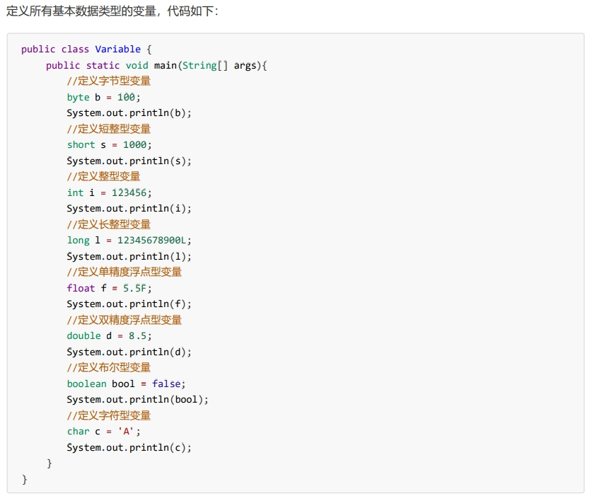

# 参考

> - [JavaSchool](http://www.51gjie.com/)

# 1 数据类型

Java的数据类型分为两大类： 

- **基本数据类型**：包括 整数 、 浮点数 、 字符 、 布尔 。 

- **引用数据类型**：包括 类 、 数组 、 接口 。

  

## 1.1 整型

整型用于表示没有小数部分的数值， 它允许是负数。Java 提供了 4 种整型，具体内容如下

### 注意

int类型声明为L时会报错，需要向下转型。long类型声明时可以加或不加`L或l`

## 1.2 浮点类型

浮点类型用于表示有小数部分的数值。在 Java 中有两种浮点类型

​		double 表示这种类型的数值精度是 float 类型的两倍（有人称之为双精度数值)。**绝大部分应用程序都采用 double 类型**。在很多情况下，**float 类型的精度很难满足需求**。实际上，只有很少的情况适合使用 float 类型，例如，需要单精度数据的库， 或者需要存储大量数据。 float 类型的数值有一个后缀 F 或 f (例如，3.14F。) 没有后缀 F 的浮点数值（如 3.14 ) 默 认为 double 类型。当然，也可以在浮点数值后面添加后缀 D 或 d (例如，3.14D) 。

### 注意

声明`float`时必须要加`F或f`，但是如果是整数则不用

`double`类型可加可不加D或d，因为声明为小数时，小数默认是double类型

## 1.3 char类型

​		char 类型原本用于表示单个字符。不过，现在情况已经有所变化。 如今，有些 Unicode 字符可以用一个 chai•值描述，另外一些 Unicode 字符则需要两个 char 值。有关的详细信息请 阅读下一节。 char 类型的字面量值要用单引号括起来。例如：W 是编码值为 65 所对应的字符常量。 它与 "A" 不同，"A" 是包含一个字符 A 的字符串, char 类型的值可以表示为十六进制值，其 范围从 \u0000 到 \Uffff。例如：W2122 表示注册符号 ( ), \u03C0 表示希腊字母 it。 除了转义序列 \u 之外， 还有一些用于表示特殊字符的转义序列， 请参看表 3-3。所有这 些转义序列都可以出现在加引号的字符字面量或字符串中。例如，’ \02丨22' 或 "1 110\11”。转 义序列 \u还可以出现在加引号的字符常量或字符串之外（而其他所有转义序列不可以）。例 如： public static void main(String\u005B\ u00SD args) 就完全符合语法规则， \u005B 和 \u005D 是 [ 和 ] 的编码

## 1.4 boolean类型

boolean (布尔）类型有两个值：false 和 true, 用来判定逻辑条件 整型值和布尔值之间 不能进行相互转换。

