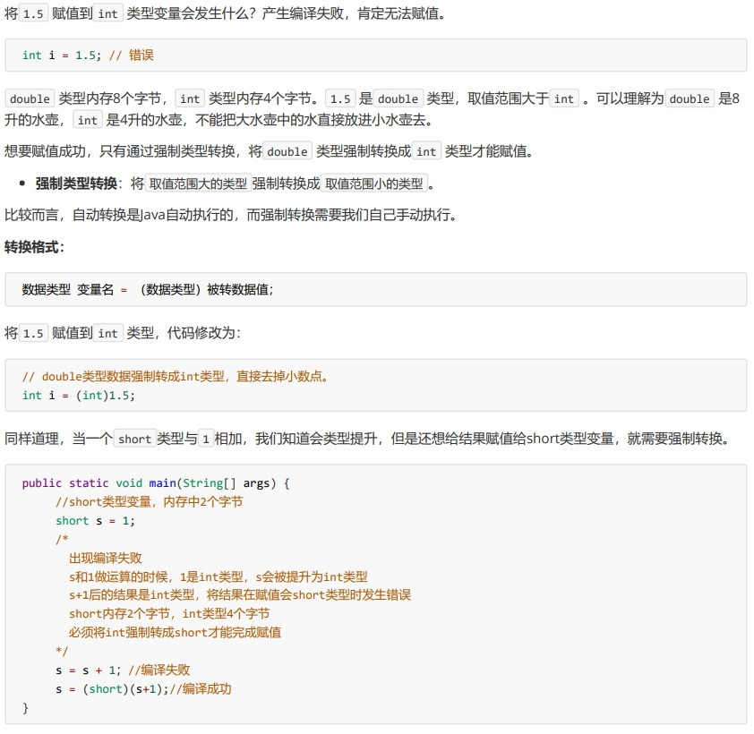
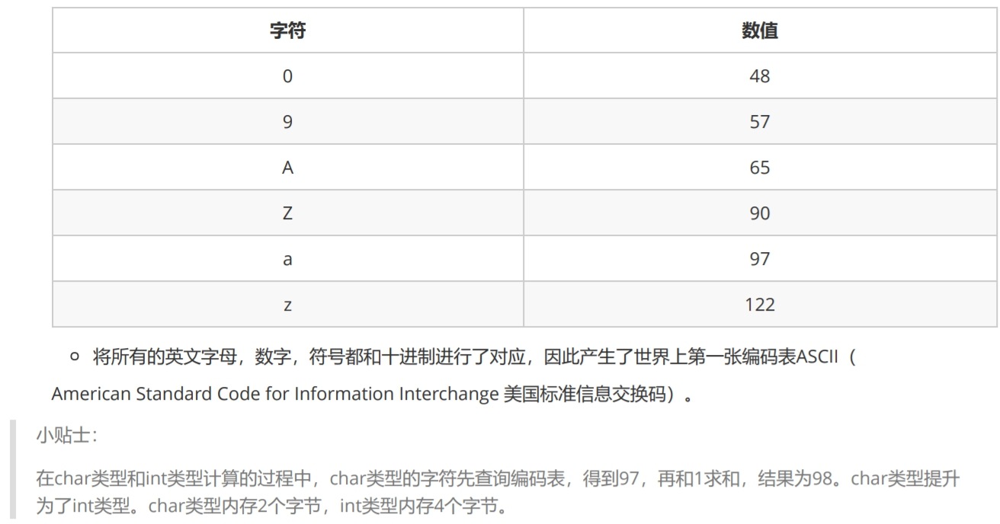
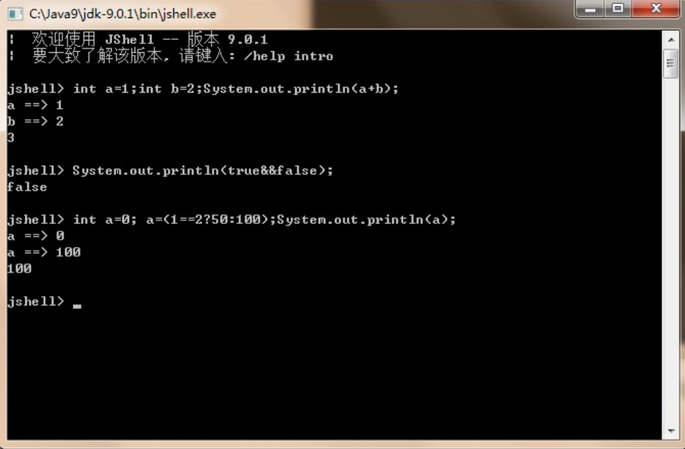
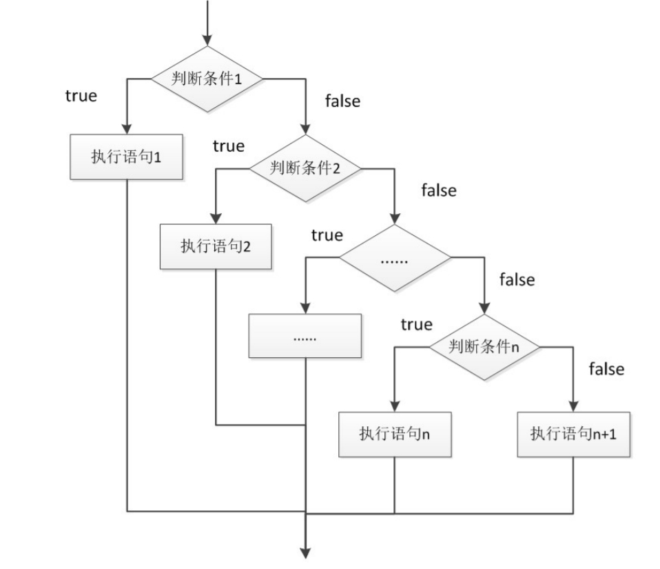

## 参考

> - [JavaSchool](http://www.51gjie.com/)


## 1 数据类型

Java的数据类型分为两大类： 

- **基本数据类型**：包括 整数 、 浮点数 、 字符 、 布尔 。 

- **引用数据类型**：包括 类 、 数组 、 接口 。

  


### 1.1 整型

整型用于表示没有小数部分的数值， 它允许是负数。Java 提供了 4 种整型，具体内容如下


#### 注意

int类型声明为L时会报错，需要向下转型。long类型声明时可以加或不加`L或l`

```java
int a = 10L;//报错
int b = (int)10L;//正确
long c = 10L;//正确
long d = 10;//正确,相当于向上转型
```


### 1.2 浮点类型

浮点类型用于表示有小数部分的数值。在 Java 中有两种浮点类型


​		double 表示这种类型的数值精度是 float 类型的两倍（有人称之为双精度数值)。**绝大部分应用程序都采用 double 类型**。在很多情况下，**float 类型的精度很难满足需求**。实际上，只有很少的情况适合使用 float 类型，例如，需要单精度数据的库， 或者需要存储大量数据。 float 类型的数值有一个后缀 F 或 f (例如，3.14F。) 没有后缀 F 的浮点数值（如 3.14 ) 默 认为 double 类型。当然，也可以在浮点数值后面添加后缀 D 或 d (例如，3.14D) 。


#### 注意

声明`float`时必须要加`F或f`，但是如果是整数则不用

```java
float a = 10;//正确
float b = 10.5F;//正确
float c = 10.5;//报错
```

`double`类型可加可不加D或d，因为声明为小数时，小数默认是double类型

```java
double a = 10;//正确
double b = 10.5;//正确
double c = 10.5D;//正确,D可加可不加
```


### 1.3 char类型

​		char 类型原本用于表示单个字符。不过，现在情况已经有所变化。 如今，有些 Unicode 字符可以用一个 chai•值描述，另外一些 Unicode 字符则需要两个 char 值。有关的详细信息请 阅读下一节。 char 类型的字面量值要用单引号括起来。例如：W 是编码值为 65 所对应的字符常量。 它与 "A" 不同，"A" 是包含一个字符 A 的字符串, char 类型的值可以表示为十六进制值，其 范围从 \u0000 到 \Uffff。例如：W2122 表示注册符号 ( ), \u03C0 表示希腊字母 it。 除了转义序列 \u 之外， 还有一些用于表示特殊字符的转义序列， 请参看表 3-3。所有这 些转义序列都可以出现在加引号的字符字面量或字符串中。例如，’ \02丨22' 或 "1 110\11”。转 义序列 \u还可以出现在加引号的字符常量或字符串之外（而其他所有转义序列不可以）。例 如： public static void main(String\u005B\ u00SD args) 就完全符合语法规则， \u005B 和 \u005D 是 [ 和 ] 的编码


### 1.4 boolean类型

boolean (布尔）类型有两个值：false 和 true, 用来判定逻辑条件 整型值和布尔值之间 不能进行相互转换。


## 2 运算符


### 2.1 算术运算符


Java中，整数使用以上运算符，无论怎么计算，也不会得到小数。


++ 运算，变量自己增长1。反之， -- 运算，变量自己减少1，用法与 ++ 一致。 

- 独立运算： 

  - 变量在独立运算时， 前++ 和 后++ 没有区别 。 
  - 变量 前++ ：例如 ++i 。 
  - 变量 后++ ：例如 i++ 。

- 混合运算： 

  - 和其他变量放在一起， 前++ 和 后++ 就产生了不同。 

    

  - 变量 前++ ：变量a自己加1，将加1后的结果赋值给b，也就是说a先计算。a和b的结果都是2。

    


在 Java 中，使用算术运算符 + 、-、 * 、/ 表示加、减、 乘、除运算。 **当参与 / 运算的两个 操作数都是整数时， 表示整数除法；否则， 表示浮点除法**。 整数的求余操作（有时称为取模) 用 ％ 表示。例如，15/2 等于 ，7 15%2 等于 1 , 15.0/2 等于 7.50 需要注意， 整数被 0 除将会产生一个异常， 而浮点数被 0 除将会得到无穷大或 NaN 结果。


### 2.2 赋值运算符


### 2.3 比较运算符


#### instanceof：比较一个对象是否为一个类的实例/或某个接口的实现类

参考

> - https://www.cnblogs.com/ysocean/p/8486500.html


基础用法

```java
boolean result = obj instanceof Class
```

其中 `obj` 为一个对象，`Class` 表示一个类或者一个接口，当 `obj` 为 `Class` 的对象，或者是其直接或间接子类，或者是其接口的实现类，结果result 都返回 true，否则返回false。


原理：

> **编译器会检查 `obj` 是否能转换成右边的`class`类型，如果不能转换则直接报错，如果不能确定类型，则通过编译，具体看运行时定。**


##### 其他情况

- obj 必须为引用类型，不能是基本类型

  ```java
  int i = 0;
  System.out.println(i instanceof Integer);//编译不通过
  System.out.println(i instanceof Object);//编译不通过
  ```

  

- obj 为 null

  ```java
  System.out.println(null instanceof Object);//false
  ```

  

- obj 为 class 接口的实现类

  ```java
  
  ```

  

- 我们可以用 `instanceof` 运算符判断 某个对象是否是 `List` 接口的实现类，如果是返回 true，否则返回 false

  ```java
  ArrayList arrayList = new ArrayList();
  System.out.println(arrayList instanceof List);//true
  
  List list = new ArrayList();
  System.out.println(list instanceof ArrayList);//true
  ```

  

- obj 为 class 类的直接或间接子类

  ```java
  public class Person {
   
  }
  
  public class Man extends Person{
       
  }
  
  Person p1 = new Person();
  Person p2 = new Man();
  Man m1 = new Man();
  System.out.println(p1 instanceof Man);//false
  System.out.println(p2 instanceof Man);//true
  System.out.println(m1 instanceof Man);//true
  ```


##### 原理

参考

> - https://docs.oracle.com/javase/specs/jls/se8/html/jls-15.html#jls-15.20.2


伪代码描述

```java
boolean result;
if (obj == null) {
  result = false;
} else {
  try {
      T temp = (T) obj; // checkcast
      result = true;
  } catch (ClassCastException e) {
      result = false;
  }
}
```

所以

```java
Person p1 = new Person();
 
System.out.println(p1 instanceof String);//编译报错
System.out.println(p1 instanceof List);//false
System.out.println(p1 instanceof List<?>);//false
System.out.println(p1 instanceof List<Person>);//编译报错
```

也就是说有表达式 obj instanceof T，instanceof 运算符的 obj 操作数的类型必须是引用类型或空类型; 否则，会发生编译时错误。 

　　如果 obj 强制转换为 T 时发生编译错误，则关系表达式的 instanceof 同样会产生编译时错误。 在这种情况下，表达式实例的结果永远为false。

　　在运行时，如果 T 的值不为null，并且 obj 可以转换为 T 而不引发ClassCastException，则instanceof运算符的结果为true。 否则结果是错误的

　　简单来说就是：**如果 obj 不为 null 并且 (T) obj 不抛 ClassCastException 异常则该表达式值为 true ，否则值为 false 。**


总结

> - https://docs.oracle.com/javase/specs/jvms/se8/html/jvms-6.html#jvms-6.5.instanceof


### 2.4 逻辑运算符


### 2.5 三元运算符

**三元运算符格式：**

```
数据类型 变量名 = 布尔类型表达式？结果1：结果2
```


**三元运算符计算方式：**

- 布尔类型表达式结果是true，三元运算符整体结果为结果1，赋值给变量。
- 布尔类型表达式结果是false，三元运算符整体结果为结果2，赋值给变量。


### 2.6 位运算符


- &：按位与。当两位同时为1时才返回1。
- |：按位或。只要有一位为1即可返回1。
- ~：按位非。单目运算符，将操作数的每个位（包括符号位）全部取反。
- ^：按位异或。当两位相同时返回0，不同时返回1。
- <<：左移运算符。
- \>>：右移运算符。
- \>>>：无符号右移运算符。


|          符号          |                                                    |
| :--------------------: | -------------------------------------------------- |
|       &：按位与        | 当两位同时为1时才返回1，否则返回0                  |
|       \|：按位或       | 只要有一位为1即可返回1                             |
|       ~：按位非        | 单目运算符，将操作数的每个位（包括符号位）全部取反 |
|      ^：按位异或       | 当两位相同时返回0，不同时返回1                     |
|     <<：左移运算符     | 左移运算符                                         |
|    \>>：右移运算符     | 右移运算符，例如 \>> 2则代表除于2                  |
| \>>>：无符号右移运算符 | 无符号右移运算符                                   |


### 2.7 数学函数与常量Math

在 Math类中，包含了各种各样的数学函数。在编写不同类别的程序时，可能需要的函数也不同。


```java
/**
         *Math.sqrt()//计算平方根
         *Math.cbrt()//计算立方根
         *Math.pow(a, b)//计算a的b次方
         *Math.max( , );//计算最大值
         *Math.min( , );//计算最小值
         */
 
        System.out.println(Math.sqrt(16));   //4.0
        System.out.println(Math.cbrt(8));    //2.0
        System.out.println(Math.pow(3,2));     //9.0
        System.out.println(Math.max(2.3,4.5));//4.5
        System.out.println(Math.min(2.3,4.5));//2.3
 
        /**
         * abs求绝对值
         */
        System.out.println(Math.abs(-10.4));    //10.4
        System.out.println(Math.abs(10.1));     //10.1
 
        /**
         * ceil天花板的意思，就是返回大的值
         */
        System.out.println(Math.ceil(-10.1));   //-10.0
        System.out.println(Math.ceil(10.7));    //11.0
        System.out.println(Math.ceil(-0.7));    //-0.0
        System.out.println(Math.ceil(0.0));     //0.0
        System.out.println(Math.ceil(-0.0));    //-0.0
        System.out.println(Math.ceil(-1.7));    //-1.0
 
        /**
         * floor地板的意思，就是返回小的值
         */
        System.out.println(Math.floor(-10.1));  //-11.0
        System.out.println(Math.floor(10.7));   //10.0
        System.out.println(Math.floor(-0.7));   //-1.0
        System.out.println(Math.floor(0.0));    //0.0
        System.out.println(Math.floor(-0.0));   //-0.0
 
        /**
         * random 取得一个大于或者等于0.0小于不等于1.0的随机数
         */
        System.out.println(Math.random());  //小于1大于0的double类型的数
        System.out.println(Math.random()*2);//大于0小于1的double类型的数
        System.out.println(Math.random()*2+1);//大于1小于2的double类型的数
 
        /**
         * rint 四舍五入，返回double值
         * 注意.5的时候会取偶数    异常的尴尬=。=
         */
        System.out.println(Math.rint(10.1));    //10.0
        System.out.println(Math.rint(10.7));    //11.0
        System.out.println(Math.rint(11.5));    //12.0
        System.out.println(Math.rint(10.5));    //10.0
        System.out.println(Math.rint(10.51));   //11.0
        System.out.println(Math.rint(-10.5));   //-10.0
        System.out.println(Math.rint(-11.5));   //-12.0
        System.out.println(Math.rint(-10.51));  //-11.0
        System.out.println(Math.rint(-10.6));   //-11.0
        System.out.println(Math.rint(-10.2));   //-10.0
 
        /**
         * round 四舍五入，float时返回int值，double时返回long值
         */
        System.out.println(Math.round(10.1));   //10
        System.out.println(Math.round(10.7));   //11
        System.out.println(Math.round(10.5));   //11
        System.out.println(Math.round(10.51));  //11
        System.out.println(Math.round(-10.5));  //-10
        System.out.println(Math.round(-10.51)); //-11
        System.out.println(Math.round(-10.6));  //-11
        System.out.println(Math.round(-10.2));  //-10
```


## 3 数据类型转换

Java程序中要求参与的计算的数据，必须要保证数据类型的一致性，如果数据类型不一致将发生类型的转换。

- 自动（隐式）类型转换：从小类型到大类型，不需要强制转换符
- 强制类型转换：从大类型到小类型，需要强制转换符实现强制转换，强制转换符：（需要转换成的类型）变量


### 3.1 自动（隐式）转换

**从小类型到大类型，不需要强制转换符**


**转换原理图解**

​	byte 类型内存占有1个字节，在和 int 类型运算时会提升为 int 类型 ，自动补充3个字节，因此计算后的结果还是 int 类 型。


**转换规则**

​		范围小的类型向范围大的类型提升， byte、short、char 运算时直接提升为 int 。


### 3.2 强制（显示）转换




**转换原理图解**


**强烈注意**


**关于+=运算**

```java
public static void main(String[] args){
	short s = 1;
	s+=1;
	System.out.println(s);
}

```

分析： **s += 1** 逻辑上看作是 **s = s + 1** 计算结果被提升为int类型，再向short类型赋值时发生错误，因为不能将取值范围大的类型赋值到取值范围小的类型。但是， **s=s+1进行两次运算 ， += 是一个运算符，只运算一次，并带有强制转换的特点**， 也就是说 **s += 1 就是 s = (short)(s + 1)** ，因此程序没有问题编译通过，运行结果是2.


#### 关于常量变量的计算


```java
public classMain {
     public static void main(String[] args) {
     byte a =4;
     byte b =6;
     byte c = a + b;
	}
}

```


- **为什么byte a = 4；就不会报错？**

  > 因为byte是一个字节，八个二进制位，此时其范围为-128 ~ +127，所以4在其范围内，所以可以被赋值。一旦这个数值超过了127，那么编译就会报错了。

- **为什么byte c = a + b;就报错呢？**

  > 这是java的机制导致的，java在对byte这种类型进行“运算”时，会将其转换为int类型，两个int类型相加，赋值给byte类型肯定会报错的。

- **为什么byte = 3 + 4；又不会报错呢？**

  > 跟**byte a = 4**一样，3+4是常量的计算，会优先执行，执行结果再赋值给byte，此时判断数值是否满足该类型范围，满足就直接赋值了。


总结

> - **两个变量相加，先对类型进行提升，然后运算，再将运算结果赋值。**b1和b2是两个变量，变量存储的值是变化的，在编译的时候无法判断里面具体的值，相加有可能会超出byte的取值范围。
> - **两个常量相加，先计算常量数值，然后判断是否满足类型范围，再赋值**。Java编译器有常量优化机制，在编译的时候就将常量的运算值计算出来了，而且常量运算的结果值在小数据类型的取值范围内，所以通过，如果不在小数据类型的取值范围内，编译就无法通过。
>


### 3.3 ASCII编码表

```java
public static void main(String[] args) {
	//字符类型变量
	char c = 'a';
	int i = 1;
	//字符类型和int类型计算
	System.out.println(c+i);//输出结果是98
}
```




## 4 方法


### JShell工具

​		什么时候会用到 JShell 工具呢，当我们编写的代码非常少的时候，而又不愿意编写类，main方法，也不愿意去编译和运 行，这个时候可以使用JShell工具。 启动JShell工具，在DOS命令行直接输入JShell命令。

接下来可以编写Java代码，无需写类和方法，直接写方法中的代码即可，同时无需编译和运行，直接回车即可




## 5 流程控制语句


### 5.1 判断语句




### 5.2 循环语句


#### 5.2.1 for循环

```java
for(初始化表达式①; 布尔表达式②; 步进表达式④){
	循环体③
}
```

**执行流程**

执行顺序①②③④>②③④>②③④…②不满足为止。

> - ①负责完成循环变量初始化 
> - ②负责判断是否满足循环条件，不满足则跳出循环
> - ③具体执行的语句 
> - ④循环后，循环条件所涉及变量的变化情况
>


#### 5.2.2 while循环

```java
初始化表达式①
while(布尔表达式②){
循环体③
步进表达式④
}
```


执行流程 执行顺序：①②③④>②③④>②③④…②不满足为止。 

> - ①负责完成循环变量初始化。 
> - ②负责判断是否满足循环条件，不满足则跳出循环。
> - ③具体执行的语句。 
> - ④循环后，循环变量的变化情况。


#### 5.2.3 其它循环

```java
for(Object x : ArrayList){
	循环体
}
```


### 5.3 选择语句


#### switch语句

```java
switch(表达式) {
case 常量值1:
语句体1;
break;
case 常量值2:
语句体2;
break;
...
default:
语句体n+1;
break;
}

```


执行流程 

> 1. 首先计算出表达式的值 
> 2. 其次，和case依次比较，一旦有对应的值，就会执行相应的语句，在执行的过程中，遇到break就会结 束。 
> 3. 最后，如果所有的case都和表达式的值不匹配，就会执行default语句体部分，然后程序结束掉。


在switch语句中，如果case的后面不写break，将出现`穿透`现象，也就是不会在判断下一个case的值，直接向后运 行，直到遇到break，或者整体switch结束。

```java
public static void main(String[] args) {
int i = 5;
switch (i){
case 0:
System.out.println("执行case0");
break;
case 5:
System.out.println("执行case5");
case 10:
System.out.println("执行case10");
default:
System.out.println("执行default");
}
}

```


上述程序中，执行case5后，由于没有break语句，程序会一直向后走，不会在判断case，也不会理会break，直接 运行完整体switch。


### 5.4 跳出语句


#### break：终止switch或者循环

- 在选择结构switch语句中 
- 在循环语句中 
- 离开使用场景的存在是没有意义的


#### continue：结束本次循环，继续下一次的循环

