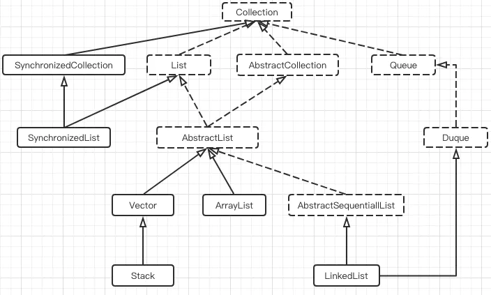
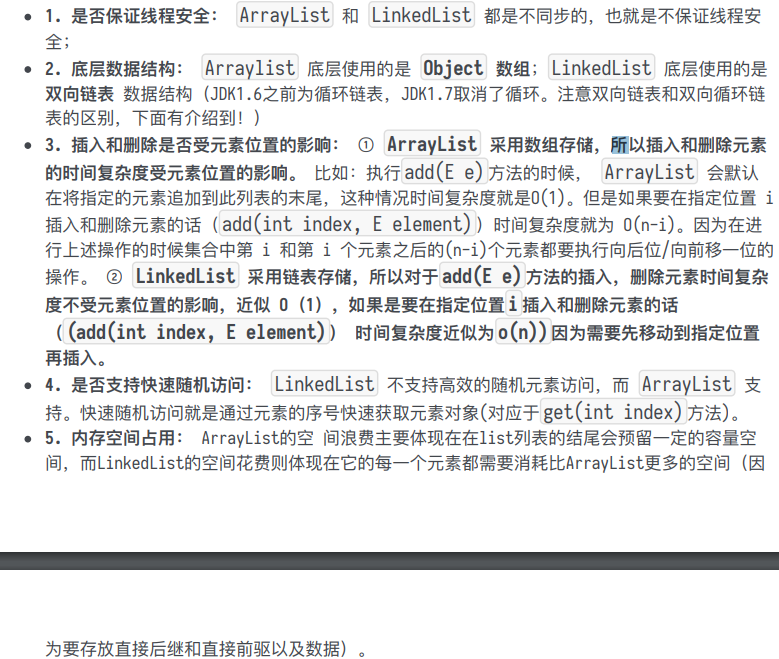
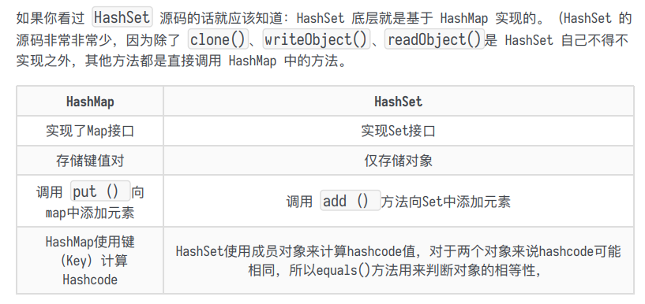
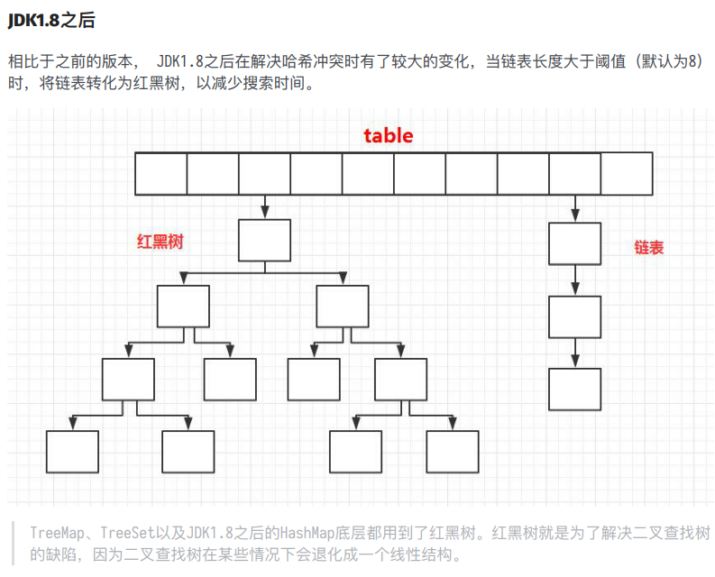
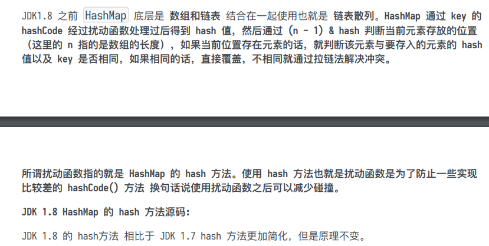
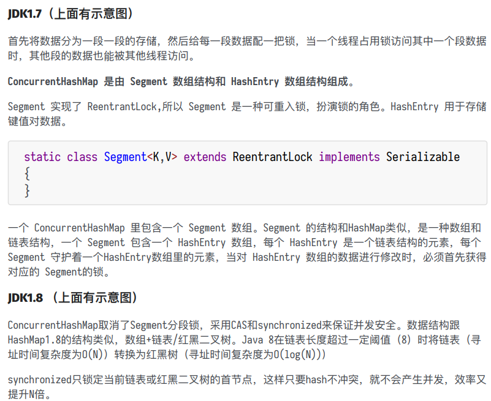

## 容器总览

注

> - 虚线空心三角：继承，例如`AbstractList`继承`List`
> - 实线空心三角：实现，例如`ArrayList`实现`AbstractList`


> - 小虚线：接口
> - 长虚线：抽象类
> - 实现：实现类





### 常用集合方法

参考

> https://wiki.lifeisgg.online/archives/Java%E6%96%B9%E6%B3%95%E6%B1%87%E6%80%BB


## 1. List | ArrayList

参考

> ArrayList方法原理：https://www.cnblogs.com/lierabbit/p/8383683.html


### 构造方法

- 无参构造方法
- 有参构造方法
- 指定集合

```java
public ArrayList()//无参构造方法
public ArrayList(int initialCapacity)；//有参构造方法
public ArrayList(Collection<? extends E> c)//指定集合
  
/**
* 默认初始容量大小为10
*/
private static final int DEFAULT_CAPACITY = 10;
    
/**默认空数组*/
private static final Object[] DEFAULTCAPACITY_EMPTY_ELEMENTDATA = {};
```


**无参构造方法**

**以无参数构造方法创建 ArrayList 时，实际上初始化赋值的是一个空数组。当真正对数组进行添加元素操作时，才真正分配容量。即向数组中添加第一个元素时，数组容量扩为10。**

```java
/**
     * Shared empty array instance used for default sized empty instances. We
     * distinguish this from EMPTY_ELEMENTDATA to know how much to inflate when
     * first element is added.
     */
    private static final Object[] DEFAULTCAPACITY_EMPTY_ELEMENTDATA = {};
    /**
     * Constructs an empty list with an initial capacity of ten.
     */
    public ArrayList() {
        this.elementData = DEFAULTCAPACITY_EMPTY_ELEMENTDATA;
    }
```


**有参指定大小构造方法**

- 当指定的初始容量大于0，初始化指定大小的数组
- 当指定的初始容量等于0，初始化空数组
- 当指定的初始容量小于0，抛出IllegalArgumentException异常

```java
/**
     * Shared empty array instance used for empty instances.
     */
    private static final Object[] EMPTY_ELEMENTDATA = {};
    /**
     * Constructs an empty list with the specified initial capacity.
     *
     * @param  initialCapacity  the initial capacity of the list
     * @throws IllegalArgumentException if the specified initial capacity
     *         is negative
     */


    public ArrayList(int initialCapacity) {
        if (initialCapacity > 0) {
            this.elementData = new Object[initialCapacity];
        } else if (initialCapacity == 0) {
            this.elementData = EMPTY_ELEMENTDATA;
        } else {
            throw new IllegalArgumentException("Illegal Capacity: "+
                                               initialCapacity);
        }
    }
```


**指定集合**

当指定集合不为空即长度不为0，则复制该集合，否则初始化一个空数组

```java
/**
     * Constructs a list containing the elements of the specified
     * collection, in the order they are returned by the collection's
     * iterator.
     *
     * @param c the collection whose elements are to be placed into this list
     * @throws NullPointerException if the specified collection is null
     */
    public ArrayList(Collection<? extends E> c) {
        elementData = c.toArray();
        if ((size = elementData.length) != 0) {
            // c.toArray might (incorrectly) not return Object[] (see 6260652)
            if (elementData.getClass() != Object[].class)
                elementData = Arrays.copyOf(elementData, size, Object[].class);
        } else {
            // replace with empty array.
            this.elementData = EMPTY_ELEMENTDATA;
        }
    }
```


### E get(int index) ：获取index位置的元素

首先判断index是否越界，这里并没有判断是否小于0，因为下标小于0时数组会抛出异常。越界则抛出IndexOutOfBoundsException异常，反之返回数组对应index位置的元素

```java
// Positional Access Operations
    // 返回index下标的元素且强制转化为E（List<E>中的E）类型
    @SuppressWarnings("unchecked")
    E elementData(int index) {
        return (E) elementData[index];
    }

    /**
     * Returns the element at the specified position in this list.
     *
     * @param  index index of the element to return
     * @return the element at the specified position in this list
     * @throws IndexOutOfBoundsException {@inheritDoc}
     */
    public E get(int index) {
        // 检查index是否越界
        rangeCheck(index);
        // 返回index下标的元素
        return elementData(index);
    }

    /**
     * Checks if the given index is in range.  If not, throws an appropriate
     * runtime exception.  This method does *not* check if the index is
     * negative: It is always used immediately prior to an array access,
     * which throws an ArrayIndexOutOfBoundsException if index is negative.
     */
    private void rangeCheck(int index) {
        // 检查index是否大于等于size（数组的元素数量），因为数组下标从0开始计算，所以也不能等于元素数量
        // 这里没有检查index < 0的情况，因为index < 0时数组会自动抛出异常，所以并未检查index<0的情况
        if (index >= size)
            throw new IndexOutOfBoundsException(outOfBoundsMsg(index));
    }

    /**
     * Constructs an IndexOutOfBoundsException detail message.
     * Of the many possible refactorings of the error handling code,
     * this "outlining" performs best with both server and client VMs.
     */
    private String outOfBoundsMsg(int index) {
        return "Index: "+index+", Size: "+size;
    }
```


### E set(int index, E element)  ：设置（覆盖）index位置的元素

和get一样先判断index（下标）是否越界，不越界则先获取原来index位置上的元素，接着设置（覆盖）index位置上的元素，然后返回原来的元素，反之抛出IndexOutOfBoundsException异常

```java
/**
     * Replaces the element at the specified position in this list with
     * the specified element.
     *
     * @param index index of the element to replace
     * @param element element to be stored at the specified position
     * @return the element previously at the specified position
     * @throws IndexOutOfBoundsException {@inheritDoc}
     */
    public E set(int index, E element) {
        rangeCheck(index);

        E oldValue = elementData(index);
        elementData[index] = element;
        return oldValue;
    }
```


### boolean add(E e)  ：添加一个元素到列表尾/扩容机制

**参考**

> - https://www.cnblogs.com/dengrongzhang/p/9371551.html
> - https://blog.csdn.net/zymx14/article/details/78324464
> - https://github.com/Snailclimb/JavaGuide/blob/master/docs/java/collection/ArrayList-Grow.md


添加一个元素到列表尾，当列表容量不足时自动扩容（通常是扩容至原来的1.5倍），添加成功返回true 。如果是新创建的对象且调用的无参构造方法，初始化时是将空数组`DEFAULTCAPACITY_EMPTY_ELEMENTDATA`赋给elementData，在第一次调用add方法时才会扩容，一般是默认值`DEFAULT_CAPACITY = 10`


#### 流程


- 第一步：调用`ensureCapacityInternal(size + 1)`方法
- 第二步：调用 `calculateCapacity(elementData, minCapacity)` 方法计算返回需要扩容的最小值
- 第三步：调用`ensureExplicitCapacity()`方法判断扩容的最小值是否大于数组的长度，此时`minCapacity`为调用`calculateCapacity`传过来的最后计算得出的最小容量。大于则继续调用**grow(minCapacity)**方法，否则直接 `elementData[size++] = e`;
- 第四步：调用`grow()`方法进行扩容。先`newCapacity = oldCapacity + (oldCapacity >> 1)`;计算扩容`1.5倍`后再与`minCapacity`对比，如果还是比`minCapacity`小就直接`newCapacity = minCapacity`; 之后再将`newCapacity`与`MAX_ARRAY_SIZE`对比，如果比`MAX_ARRAY_SIZE`大那就调用`hugeCapacity(minCapacity)`;重新计算大小，最后`elementData = Arrays.copyOf(elementData, newCapacity)`;完成扩容，最后再将加的对象赋值给`elementData[size] , size++`


#### 第一步：调用`ensureCapacityInternal(size + 1)`方法

`minCapacity = size + 1`即为所需最小容量，调用此方法时会先调用`calculateCapacity(elementData, minCapacity)`去计算所需最小容量，之后作为参数去调用`ensureExplicitCapacity`去与当前elementdata数组的长度`elementdata.length`比较看是否需要调用`grow()`去扩容。

```java
/**
     * Appends the specified element to the end of this list.
     *
     * @param e element to be appended to this list
     * @return <tt>true</tt> (as specified by {@link Collection#add})
     */
    public boolean add(E e) {
        // 检查当前容量是否还可以容纳一个元素，不够则扩容
        ensureCapacityInternal(size + 1);  // Increments modCount!!
        // 添加到数组末尾
        // 这个语句可以分解为
        // elementData[size] = e;
        // size += 1;
        elementData[size++] = e;
        return true;
    }

		private void ensureCapacityInternal(int minCapacity) {
        ensureExplicitCapacity(calculateCapacity(elementData, minCapacity));
    }

```


> **注意** ：JDK11 移除了 `ensureCapacityInternal()` 和 `ensureExplicitCapacity()` 方法


#### 第二步：调用 `calculateCapacity(elementData, minCapacity)` 方法


计算默认容量`DEFAULT_CAPACITY = 10`和当前`minCapacity = size + 1`的最大值。当 要 add 进第1个元素时，minCapacity为1，在Math.max()方法比较后，minCapacity 为10。

```java


    /**
     * Default initial capacity.
     */
    private static final int DEFAULT_CAPACITY = 10;  // 默认容量为10

 // 如果数据等于默认数据，返回默认容量和minCapacity（所需容量最小值）的最大值，反之返回所需容量最小值
    private static int calculateCapacity(Object[] elementData, int minCapacity) {
        if (elementData == DEFAULTCAPACITY_EMPTY_ELEMENTDATA) {
            return Math.max(DEFAULT_CAPACITY, minCapacity);
        }
        return minCapacity;
    }


    /**
     * The maximum size of array to allocate.
     * Some VMs reserve some header words in an array.
     * Attempts to allocate larger arrays may result in
     * OutOfMemoryError: Requested array size exceeds VM limit
     */
   

```


#### 第三步：调用`ensureExplicitCapacity()`方法看是否需要扩容


- 当我们要 add 进第1个元素到 ArrayList 时，`elementData.length` 为0 （因为还是一个空的 list），因为执行了 `ensureCapacityInternal()` 方法 ，所以 minCapacity 此时为10。此时，`minCapacity - elementData.length > 0 `成立，所以会进入 `grow(minCapacity为10)` 方法。
- 当add第2个元素时，`minCapacity` 为2，此时`elementData.length`(容量)在添加第一个元素后扩容成 10 了。此时，`minCapacity - elementData.length > 0 `不成立，所以不会进入 （执行）`grow(minCapacity)` 方法。
- 添加第3、4···到第10个元素时，依然不会执行grow方法，数组容量都为10。直到添加第11个元素，`minCapacity(为11)`比`elementData.length（为10）`要大。进入`grow(minCapacity为11)`方法进行扩容


```java
    private void ensureExplicitCapacity(int minCapacity) {
        modCount++;  // 操作数+1

        // overflow-conscious code
        // 如果所需容量最小值大于实际数组的长度就扩大实际数组容量
        if (minCapacity - elementData.length > 0)
            grow(minCapacity);
    }
```


#### 第四步：调用`grow()`方法进行扩容


- 当add第1个元素时，oldCapacity 为0，经比较后第一个if判断成立，newCapacity = minCapacity(为10)。但是第二个if判断不会成立，即newCapacity 不比 MAX_ARRAY_SIZE大，则不会进入 `hugeCapacity` 方法。数组容量为10，add方法中 return true,size增为1。
- 当add第11个元素进入grow方法时，newCapacity为15，比minCapacity（为11）大，第一个if判断不成立。新容量没有大于数组最大size，不会进入hugeCapacity方法。数组容量扩为15，add方法中return true,size增为11。
- 以此类推······


之所以每次扩容原来的`1.5倍`，是为了不让每次调用`add()`方法都去扩容然后复制数组

```java

    /**
     * Increases the capacity to ensure that it can hold at least the
     * number of elements specified by the minimum capacity argument.
     *
     * @param minCapacity the desired minimum capacity
     */
    private void grow(int minCapacity) {
        // overflow-conscious code
        int oldCapacity = elementData.length;
        // 新的容量为旧的容量的1.5倍
        int newCapacity = oldCapacity + (oldCapacity >> 1);
        // 如果扩充容量后还是不够，则新的容量等于所需容量最小值（一般就是数组实际元素个数）
        if (newCapacity - minCapacity < 0)
            newCapacity = minCapacity;
        // 如果新的容量大于数组最大容量，再调用hugeCapacity计算新的容量
        if (newCapacity - MAX_ARRAY_SIZE > 0)
            newCapacity = hugeCapacity(minCapacity);
        // minCapacity is usually close to size, so this is a win:
        // 复制原来的数据到新的数组，数组容量为新的容量
        elementData = Arrays.copyOf(elementData, newCapacity);
    }

    private static int hugeCapacity(int minCapacity) {
        if (minCapacity < 0) // overflow
            throw new OutOfMemoryError();
        // 大于数组最大容量返回Integer最大值，反之返回数组最大容量
        return (minCapacity > MAX_ARRAY_SIZE) ?
                Integer.MAX_VALUE :
                MAX_ARRAY_SIZE;
    }

 private static final int MAX_ARRAY_SIZE = Integer.MAX_VALUE - 8;  // 数组最大容量为Integer最大值再减8
```


### void add(int index, E element) ：在index处放置元素

将elementData数组从index开始后面的元素往后移一位，接着在index处放置元素

**模拟添加数据(lierabbit)到index=4过程如下：**


- 在此列表中的指定位置插入指定的元素。 
- 先调用 `rangeCheckForAdd` 对index进行界限检查；然后调用 `ensureCapacityInternal` 方法保证`capacity`足够大；
- 再将从index开始之后的所有成员后移一个位置；将element插入index位置；最后size加1。


```java
/**
     * Inserts the specified element at the specified position in this
     * list. Shifts the element currently at that position (if any) and
     * any subsequent elements to the right (adds one to their indices).
     *
     * @param index index at which the specified element is to be inserted
     * @param element element to be inserted
     * @throws IndexOutOfBoundsException {@inheritDoc}
     */
    public void add(int index, E element) {
        // 检查下标是否越界
        rangeCheckForAdd(index);
        // 检查当前容量是否还可以在容纳一个元素，不够则扩容
        ensureCapacityInternal(size + 1);  // Increments modCount!!
        // 将elementData从index开始后面的元素往后移一位
        System.arraycopy(elementData, index, elementData, index + 1,
                size - index);
        elementData[index] = element;
        size++;
    }

    /**
     * A version of rangeCheck used by add and addAll.
     */
    private void rangeCheckForAdd(int index) {
        // 当index等于size时相当于添加元素到列表尾
        if (index > size || index < 0)
            throw new IndexOutOfBoundsException(outOfBoundsMsg(index));
    }
```


### ensureCapacity(int minCapacity)：自主扩增容量

在使用add()方法增加新的元素时，如果要增加的数据量很大，应该使用`ensureCapacity()`方法，该方法的作用是预先设置Arraylist的大小，这样可以大大提高初始化速度。 

```java
/**
    如有必要，增加此 ArrayList 实例的容量，以确保它至少可以容纳由minimum capacity参数指定的元素数。
     *
     * @param   minCapacity   所需的最小容量
     */
    public void ensureCapacity(int minCapacity) {
        int minExpand = (elementData != DEFAULTCAPACITY_EMPTY_ELEMENTDATA)? 0: DEFAULT_CAPACITY;
            // any size if not default element table            
            // larger than default for default empty table. It's already
            // supposed to be at default size.
            
        if (minCapacity > minExpand) {
            ensureExplicitCapacity(minCapacity);
        }
    }
```


最好在 add 大量元素之前用 `ensureCapacity` 方法，以减少增量重新分配的次数。例如：


未提前使用 `ensureCapacity` 前

```java
public class EnsureCapacityTest {
	public static void main(String[] args) {
		ArrayList<Object> list = new ArrayList<Object>();
		final int N = 10000000;
		long startTime = System.currentTimeMillis();
		for (int i = 0; i < N; i++) {
			list.add(i);
		}
		long endTime = System.currentTimeMillis();
		System.out.println("使用ensureCapacity方法前："+(endTime - startTime));

	}
}

```

结果：使用`ensureCapacity`方法前：2158


使用 `ensureCapacity` 后

```java
public class EnsureCapacityTest {
    public static void main(String[] args) {
        ArrayList<Object> list = new ArrayList<Object>();
        final int N = 10000000;
        list = new ArrayList<Object>();
        long startTime1 = System.currentTimeMillis();
        list.ensureCapacity(N);//此处调用后
        for (int i = 0; i < N; i++) {
            list.add(i);
        }
        long endTime1 = System.currentTimeMillis();
        System.out.println("使用ensureCapacity方法后："+(endTime1 - startTime1));
    }
}
```


结果：使用`ensureCapacity`方法后：1773


### 数组复制/扩容的两个方法


#### System.arraycopy(Object src, int srcPos, Object dest, int destPos, int length)

将数组`src`从`srcPos`后的元素复制到目标数组`dest`的`destPos`起点开始，复制`length`个

> - `src` -这是源数组. 
> - `srcPos` -这是源数组中的起始位置。
> - `dest` -这是目标数组。
> - `destPos` -这是目标数据中的起始位置。
> - `length` -- 这是一个要复制的数组元素的数目。


#### Arrays.copyOf()

```java
elementData = Arrays.copyOf(elementData, newCapacity);
```


#### 区别

看两者源代码可以发现 copyOf() 内部实际调用了 `System.arraycopy()` 方法

`arraycopy()` 需要目标数组，将原数组拷贝到你自己定义的数组里或者原数组，而且可以选择拷贝的起点和长度以及放入新数组中的位置 `copyOf()` 是系统自动在内部新建一个数组，并返回该数组。


### boolean addAll(Collection<? extends E> c) : 添加一个集合里的所有元素到列表尾

将要添加的集合变为数组，然后将其复制到elementData数组末尾 

```java
/**
     * Appends all of the elements in the specified collection to the end of
     * this list, in the order that they are returned by the
     * specified collection's Iterator.  The behavior of this operation is
     * undefined if the specified collection is modified while the operation
     * is in progress.  (This implies that the behavior of this call is
     * undefined if the specified collection is this list, and this
     * list is nonempty.)
     *
     * @param c collection containing elements to be added to this list
     * @return <tt>true</tt> if this list changed as a result of the call
     * @throws NullPointerException if the specified collection is null
     */
    public boolean addAll(Collection<? extends E> c) {
        Object[] a = c.toArray();
        int numNew = a.length;
        // 检查当前容量是否还可以在容纳a数组的元素，不够则扩容
        ensureCapacityInternal(size + numNew);  // Increments modCount
        // 将a数组里的元素添加到elementData末尾
        System.arraycopy(a, 0, elementData, size, numNew);
        size += numNew;
        // a数组不为空（长度不为0）时返回true，反之false
        return numNew != 0;
    }
```


### int indexOf(Object o)  ：查找o元素在列表第一次出现的位置

ArrayList中可以存放null元素，indexof是返回elementData数组中值相同的首个元素的下标，indexof中比较方法是equals而equals是比较元素的值，如果使用**null.equals(Object o)**会报错空指针，因此必须对null单独查找。如果未找到该元素则返回-1

```java
/**
     * Returns the index of the first occurrence of the specified element
     * in this list, or -1 if this list does not contain the element.
     * More formally, returns the lowest index <tt>i</tt> such that
     * <tt>(o==null ? get(i)==null : o.equals(get(i)))</tt>,
     * or -1 if there is no such index.
     */
    public int indexOf(Object o) {
        //元素可以为null，如果为null返回null的下标
        if (o == null) {
            for (int i = 0; i < size; i++)
                if (elementData[i]==null)
                    return i;
        } else {
            for (int i = 0; i < size; i++)
                if (o.equals(elementData[i]))
                    return i;
        }
        // 没有找到对应的元素返回-1
        return -1;
    }
```


### E remove(int index)  ：删除index位置上的元素

模拟删除index=4（值为lierabbit）过程如下


```java
/**
     * Removes the element at the specified position in this list.
     * Shifts any subsequent elements to the left (subtracts one from their
     * indices).
     *
     * @param index the index of the element to be removed
     * @return the element that was removed from the list
     * @throws IndexOutOfBoundsException {@inheritDoc}
     */
    public E remove(int index) {
        // 检查下标是否越界
        rangeCheck(index);

        modCount++;  // 操作数+1
        E oldValue = elementData(index);  // 获取index位置上的元素

        int numMoved = size - index - 1;  // 需要往前移动几个位置
        if (numMoved > 0)
            // 从index + 1开始，往后的元素向前移动1个位置
            System.arraycopy(elementData, index+1, elementData, index,
                    numMoved);
        // 将数组末尾元素置空
        elementData[--size] = null; // clear to let GC do its work

        return oldValue;
    }
```


### boolean remove(Object o)  ：删除o元素

通过寻找o元素，可以获得其下标，再根据下标删除o元素

```java
/**
     * Removes the first occurrence of the specified element from this list,
     * if it is present.  If the list does not contain the element, it is
     * unchanged.  More formally, removes the element with the lowest index
     * <tt>i</tt> such that
     * <tt>(o==null ? get(i)==null : o.equals(get(i)))</tt>
     * (if such an element exists).  Returns <tt>true</tt> if this list
     * contained the specified element (or equivalently, if this list
     * changed as a result of the call).
     *
     * @param o element to be removed from this list, if present
     * @return <tt>true</tt> if this list contained the specified element
     */
    public boolean remove(Object o) {
        // 元素可以为null，分开搜索o
        if (o == null) {
            for (int index = 0; index < size; index++)
                if (elementData[index] == null) {
                    fastRemove(index);
                    return true;
                }
        } else {
            for (int index = 0; index < size; index++)
                if (o.equals(elementData[index])) {
                    fastRemove(index);
                    return true;
                }
        }
        // 没有找到返回false
        return false;
    }

    /*
     * Private remove method that skips bounds checking and does not
     * return the value removed.
     */
    // 由于已经找到元素，则元素必定存在，则index必定合理，所以不需要在检查index是否越界
    private void fastRemove(int index) {
        modCount++;
        int numMoved = size - index - 1;
        if (numMoved > 0)
            System.arraycopy(elementData, index+1, elementData, index,
                    numMoved);
        elementData[--size] = null; // clear to let GC do its work
    }
```


### forEach(Consumer<? super E> action) ：遍历列表 

这里可以看到**modCount**的用处，当**modCount**发生改变后，立刻抛出**ConcurrentModificationException**异常。通过之前的分析可以知道当列表内容被修改时**modCount**会增加。也就是说如果在遍历**ArrayList**的过程中有其他线程修改了**ArrayList**，那么将抛出**ConcurrentModificationException**异常

```java

    protected transient int modCount = 0;//操作数

    @Override
    public void forEach(Consumer<? super E> action) {
        // 确保不为空
        Objects.requireNonNull(action);
        final int expectedModCount = modCount;
        @SuppressWarnings("unchecked")
        final E[] elementData = (E[]) this.elementData;
        final int size = this.size;
        for (int i=0; modCount == expectedModCount && i < size; i++) {
            action.accept(elementData[i]);
        }
        if (modCount != expectedModCount) {
            throw new ConcurrentModificationException();
        }
    }


    public static <T> T requireNonNull(T obj) {
        if (obj == null)
            throw new NullPointerException();
        return obj;
    }
```


## 2. List | LinkedList


## 3. List | 区别


### ArrayList与List的区别

参考

> - https://www.cnblogs.com/zcscnn/p/7743507.html


List是一个接口，而ListArray是一个类。ArrayList继承并实现了List。

因此，List接口不能被构造，也就是我们说的不能创建实例对象，但是我们可以像下面那样为List接口创建一个指向自己的对象引用，而ArrayList实现类的实例对象就在这充当了这个指向List接口的对象引用。 


```java
List list = new List();//是错误的用法
List list = new ArrayList();//正确
```


这句创建了一个ArrayList实现类的对象后把它上溯到了List接口。此时它就是一个List对象了，它有些ArrayList类具有的，但是List接口没有的属性和方法，它就不能再用了。 而ArrayList list=newArrayList();

创建一对象则保留了ArrayList的所有属性和方法。 


### Arraylist 与 LinkedList 区别?




### ArrayList 与 Vector 区别呢?为什么要⽤Arraylist取代Vector呢？


## 4. Set | HashSet

**HashSet**实现**Set**接口，由哈希表（实际上是一个**HashMap**实例）支持。它不保证set 的迭代顺序；特别是它不保证该顺序恒久不变。此类允许使用null元素。对于**HashSet**而言，它是基于**HashMap**实现的，HashSet底层使用**HashMap**来保存所有元素，因此**HashSet** 的实现比较简单，相关**HashSet**的操作，基本上都是直接调用底层**HashMap**的相关方法来完成， **HashSet**的源代码如下：


### HashSet与HashMap区别




### 构造器

```java
public class HashSet<E>  
    extends AbstractSet<E>  
    implements Set<E>, Cloneable, java.io.Serializable  
{  
    static final long serialVersionUID = -5024744406713321676L;  
  
    // 底层使用HashMap来保存HashSet中所有元素。  
    private transient HashMap<E,Object> map;  
      
    // 定义一个虚拟的Object对象作为HashMap的value，将此对象定义为static final。  
    private static final Object PRESENT = new Object();  
  
    /** 
     * 默认的无参构造器，构造一个空的HashSet。 
     *  
     * 实际底层会初始化一个空的HashMap，并使用默认初始容量为16和加载因子0.75。 
     */  
    public HashSet() {  
    map = new HashMap<E,Object>();  
    }  
  
    /** 
     * 构造一个包含指定collection中的元素的新set。 
     * 
     * 实际底层使用默认的加载因子0.75和足以包含指定 
     * collection中所有元素的初始容量来创建一个HashMap。 
     * @param c 其中的元素将存放在此set中的collection。 
     */  
    public HashSet(Collection<? extends E> c) {  
    map = new HashMap<E,Object>(Math.max((int) (c.size()/.75f) + 1, 16));  
    addAll(c);  
    }  
  
    /** 
     * 以指定的initialCapacity和loadFactor构造一个空的HashSet。 
     * 
     * 实际底层以相应的参数构造一个空的HashMap。 
     * @param initialCapacity 初始容量。 
     * @param loadFactor 加载因子。 
     */  
    public HashSet(int initialCapacity, float loadFactor) {  
    map = new HashMap<E,Object>(initialCapacity, loadFactor);  
    }  
  
    /** 
     * 以指定的initialCapacity构造一个空的HashSet。 
     * 
     * 实际底层以相应的参数及加载因子loadFactor为0.75构造一个空的HashMap。 
     * @param initialCapacity 初始容量。 
     */  
    public HashSet(int initialCapacity) {  
    map = new HashMap<E,Object>(initialCapacity);  
    }  
  
    /** 
     * 以指定的initialCapacity和loadFactor构造一个新的空链接哈希集合。 
     * 此构造函数为包访问权限，不对外公开，实际只是是对LinkedHashSet的支持。 
     * 
     * 实际底层会以指定的参数构造一个空LinkedHashMap实例来实现。 
     * @param initialCapacity 初始容量。 
     * @param loadFactor 加载因子。 
     * @param dummy 标记。 
     */  
    HashSet(int initialCapacity, float loadFactor, boolean dummy) {  
    map = new LinkedHashMap<E,Object>(initialCapacity, loadFactor);  
    }  
  

  
    /** 
     * 返回此HashSet实例的浅表副本：并没有复制这些元素本身。 
     * 
     * 底层实际调用HashMap的clone()方法，获取HashMap的浅表副本，并设置到HashSet中。 
     */  
    public Object clone() {  
        try {  
            HashSet<E> newSet = (HashSet<E>) super.clone();  
            newSet.map = (HashMap<E, Object>) map.clone();  
            return newSet;  
        } catch (CloneNotSupportedException e) {  
            throw new InternalError();  
        }  
    }  
}  
```


### 调用add方法/如何去重


当你把对象加⼊ HashSet 时，HashSet会先计算对象的 hashcode 值来判断对象加⼊的位置，同时也会 与其他加⼊的对象的hashcode值作⽐᫾，如果没有相符的hashcode，HashSet会假设对象没有重复出 现。但是如果发现有相同hashcode值的对象，这时会调⽤ equals（） ⽅法来检查hashcode相等的对 象是否真的相同。如果两者相同，HashSet就不会让加⼊操作成功。（摘⾃我的Java启蒙书《Head fist java》第⼆版）


- 如果此set中尚未包含指定元素，则添加指定元素。 
- 更确切地讲，如果此 set 没有包含满足(e\==null ? e2\==null : e.equals(e2)) 的元素e2，则向此set 添加指定的元素e。 
- 如果此set已包含该元素，则该调用不更改set并返回false。 
- 底层实际将将该元素作为key放入HashMap。 
- 由于HashMap的put()方法添加key-value对时，当新放入HashMap的Entry中key 与集合中原有Entry的key相同（hashCode()返回值相等，通过equals比较也返回true）。新添加的Entry的value会将覆盖原来Entry的value，但key不会有任何改变， 
- 因此如果向HashSet中添加一个已经存在的元素时，新添加的集合元素将不会被放入HashMap中， 
- 原来的元素也不会有任何改变，这也就满足了Set中元素不重复的特性。 

```java
    /**  
     * @param e 将添加到此set中的元素。 
     * @return 如果此set尚未包含指定元素，则返回true。 
     */  
    public boolean add(E e) {  
    return map.put(e, PRESENT)==null;  
    }  
```


### 调用remove方法

```java
 /** 
     * 如果指定元素存在于此set中，则将其移除。 
     * 更确切地讲，如果此set包含一个满足(o==null ? e==null : o.equals(e))的元素e， 
     * 则将其移除。如果此set已包含该元素，则返回true 
     * （或者：如果此set因调用而发生更改，则返回true）。（一旦调用返回，则此set不再包含该元素）。 
     * 
     * 底层实际调用HashMap的remove方法删除指定Entry。 
     * @param o 如果存在于此set中则需要将其移除的对象。 
     * @return 如果set包含指定元素，则返回true。 
     */  
    public boolean remove(Object o) {  
    return map.remove(o)==PRESENT;
    }  
```


### 调用clear方法

```java
    /** 
     * 从此set中移除所有元素。此调用返回后，该set将为空。 
     * 
     * 底层实际调用HashMap的clear方法清空Entry中所有元素。 
     */  
    public void clear() {  
    map.clear();  
    }  
```


### 迭代器遍历

底层实际调用底层**HashMap**的**keySet**来返回所有的key。

```java
/** 
     * 返回对此set中元素进行迭代的迭代器。返回元素的顺序并不是特定的。 
     *  
     * 底层实际调用底层HashMap的keySet来返回所有的key。 
     * 可见HashSet中的元素，只是存放在了底层HashMap的key上， 
     * value使用一个static final的Object对象标识。 
     * @return 对此set中元素进行迭代的Iterator。 
     */  
    public Iterator<E> iterator() {  
    return map.keySet().iterator();  
    }  
  
```


也可以使用`for(Object obj : set)`的方式进行遍历


### size大小

底层实际调用**HashMap**的**size()**方法返回Entry的数量，就得到该Set中元素的个数

```java
/** 
     * 返回此set中的元素的数量（set的容量）。 
     * 
     * 底层实际调用HashMap的size()方法返回Entry的数量，就得到该Set中元素的个数。 
     * @return 此set中的元素的数量（set的容量）。 
     */  
    public int size() {
    return map.size();  
    }  
```


### 判断空

```java
    /** 
     * 如果此set不包含任何元素，则返回true。 
     * 
     * 底层实际调用HashMap的isEmpty()判断该HashSet是否为空。 
     * @return 如果此set不包含任何元素，则返回true。 
     */  
    public boolean isEmpty() {  
    return map.isEmpty();  
    }  
```


### 判断是否存在某个对象

```java

    /** 
     * 如果此set包含指定元素，则返回true。 
     * 更确切地讲，当且仅当此set包含一个满足(o==null ? e==null : o.equals(e)) 
     * 的e元素时，返回true。 
     * 
     * 底层实际调用HashMap的containsKey判断是否包含指定key。 
     * @param o 在此set中的存在已得到测试的元素。 
     * @return 如果此set包含指定元素，则返回true。 
     */  
    public boolean contains(Object o) {  
    return map.containsKey(o);  
    }  
```


## 5. Map | HashMap


### 参考

> - https://www.cnblogs.com/chentang/p/12670462.html
> - https://www.cnblogs.com/wytiger/p/10731082.html
> - https://www.cnblogs.com/yuanblog/p/4441017.html
> - [最全源码解析](https://blog.csdn.net/v123411739/article/details/78996181?utm_medium=distribute.pc_relevant.none-task-blog-BlogCommendFromMachineLearnPai2-2.channel_param&depth_1-utm_source=distribute.pc_relevant.none-task-blog-BlogCommendFromMachineLearnPai2-2.channel_param)


### 哈希表&哈希冲突

​	在数组中根据下标查找某个元素，一次定位就可以达到，哈希表利用了这种特性，**哈希表的主干就是数组**。比如我们要新增或查找某个元素，我们通过把当前元素的关键字 通过某个函数映射到数组中的某个位置，通过数组下标一次定位就可完成操作。


> **存储位置 = f(关键字)**

其中，这个函数f一般称为**哈希函数**，这个函数的设计好坏会直接影响到哈希表的优劣。举个例子，比如我们要在哈希表中执行插入操作：


查找操作同理，先通过哈希函数计算出实际存储地址，然后从数组中对应地址取出即可。

然而万事无完美，如果两个不同的元素，通过哈希函数得出的实际存储地址相同怎么办？也就是说，当我们对某个元素进行哈希运算，得到一个存储地址，然后要进行插入的时候，发现已经被其他元素占用了，其实这就是所谓的**哈希冲突**，也叫哈希碰撞。前面我们提到过，哈希函数的设计至关重要，好的哈希函数会尽可能地保证 **计算简单**和**散列地址分布均匀,**但是，我们需要清楚的是，数组是一块连续的固定长度的内存空间，再好的哈希函数也不能保证得到的存储地址绝对不发生冲突。那么哈希冲突如何解决呢？

- **链地址法：**将哈希表的每个单元作为链表的头结点，所有哈希地址为 i 的元素构成一个同义词链表。即发生冲突时就把该关键字链在以该单元为头结点的链表的尾部。


### HashMap数据结构

**HashMap**的主干是一个变量名为**table**的**Entry/Node数组**。**Entry/Node**是**HashMap**的基本组成单元，每一个**Entry/Node**包含一个**key-value**键值对。

```java
//HashMap的主干数组，可以看到就是一个Entry数组，初始值为空数组{}，主干数组的长度一定是2的次幂
transient Entry<K,V>[] table = (Entry<K,V>[]) EMPTY_TABLE;

    static class Node<K,V> implements Map.Entry<K,V> {
        final int hash;
        final K key;
        V value;
        Node<K,V> next;

        Node(int hash, K key, V value, Node<K,V> next) {
            this.hash = hash;
            this.key = key;
            this.value = value;
            this.next = next;
        }
```

- **简单来说，HashMap由数组+链表组成的，数组是HashMap的主体，链表则是主要为了解决哈希冲突而存在的。**
- **如果定位到的数组位置不含链表（当前entry的next指向null）：那么对于查找，添加等操作很快，仅需一次寻址即可；**
- **如果定位到的数组包含链表：对于添加操作，其时间复杂度为O(n)，首先遍历链表，存在即覆盖，否则新增；对于查找操作来讲，仍需遍历链表，然后通过key对象的equals方法逐一比对查找。**






### HashMap属性

- **initialCapacity：**初始容量。指的是 HashMap 集合初始化的时候自身的容量。可以在构造方法中指定；如果不指定的话，总容量默认值是 **16** 。需要注意的是初始容量必须是 2 的幂次方。
- **size：**当前 HashMap 中已经存储着的键值对数量，即 HashMap.size()
- **loadFactor：**加载因子。所谓的加载因子就是 HashMap (当前的容量/总容量) 到达一定值的时候，HashMap 会实施扩容。加载因子也可以通过构造方法中指定，默认的值是 0.75 。举个例子，假设有一个 HashMap 的初始容量为 16 ，那么扩容的阀值就是 0.75 * 16 = 12 。也就是说，在你打算存入第 13 个值的时候，HashMap 会先执行扩容。
- **threshold：**扩容阀值。即 扩容阀值 = HashMap 总容量 * 加载因子。当前 HashMap 的容量大于或等于扩容阀值的时候就会去执行扩容。扩容的容量为当前 HashMap 总容量的两倍。比如，当前 HashMap 的总容量为 16 ，那么扩容之后为 32 。
- **table：**1.8之前为Entry 数组，1.8之后为Node数组。我们都知道 HashMap 内部存储 key/value 是通过 Entry/Node 这个介质来实现的。

```java
implements Map<K,V>, Cloneable, Serializable {
    //序列号，序列化的时候使用。
    private static final long serialVersionUID = 362498820763181265L;
    /**默认容量，1向左移位4个，00000001变成00010000，也就是2的4次方为16，使用移位是因为移位是计算机基础运算，效率比加减乘除快。**/
    static final int DEFAULT_INITIAL_CAPACITY = 1 << 4;
    //最大容量，2的30次方。
    static final int MAXIMUM_CAPACITY = 1 << 30;
    //加载因子，用于扩容使用。
    static final float DEFAULT_LOAD_FACTOR = 0.75f;
    //当某个桶节点数量大于8时，会转换为红黑树。
    static final int TREEIFY_THRESHOLD = 8;
    //当某个桶节点数量小于6时，会转换为链表，前提是它当前是红黑树结构。
    static final int UNTREEIFY_THRESHOLD = 6;
    //当整个hashMap中元素数量大于64时，也会进行转为红黑树结构。
    static final int MIN_TREEIFY_CAPACITY = 64;
    //存储元素的数组，transient关键字表示该属性不能被序列化
    transient Node<K,V>[] table;
    //将数据转换成set的另一种存储形式，这个变量主要用于迭代功能。
    transient Set<Map.Entry<K,V>> entrySet;
    //元素数量
    transient int size;
    //统计该map修改的次数
    transient int modCount;
    //临界值，也就是元素数量达到临界值时，会进行扩容。
    int threshold;
    //也是加载因子，只不过这个是变量。
    final float loadFactor; 
```


### HashMap常用内部类

**红黑树结构**

```java
static final class TreeNode<K,V> extends LinkedHashMap.Entry<K,V> {
        TreeNode<K,V> parent;  
        TreeNode<K,V> left;
        TreeNode<K,V> right;
        TreeNode<K,V> prev;    
        boolean red;
        TreeNode(int hash, K key, V val, Node<K,V> next) {
            super(hash, key, val, next);
        }
}
```


**结点类**

```java
static class Node<K,V> implements Map.Entry<K,V> {
        final int hash;
        final K key;
        V value;
        Node<K,V> next;
 
        Node(int hash, K key, V value, Node<K,V> next) {
            this.hash = hash;
            this.key = key;
            this.value = value;
            this.next = next;
        }
}
```


### 构造方法

- 无参构造方法，默认容量**16**，默认的加载因子**0.75**
- 设置初始容量，并使用默认的加载因子**0.75**，调用的方法是第三个构造方法，将默认**DEFAULT_LOAD_FACTOR**作为形参传入第三个构造函数
- 设置初始容量和加载因子
- 传入一个Map，然后把该Map转为hashMap


**无参构造方法**

```java
public HashMap() {
        this.loadFactor = DEFAULT_LOAD_FACTOR; 
    }
```


**设置初始容量，并使用默认的加载因子0.75**

```java
public HashMap(int initialCapacity) {
        this(initialCapacity, DEFAULT_LOAD_FACTOR);
    }
```


**设置初始容量和加载因子**

```java
public HashMap(int initialCapacity, float loadFactor) {
        if (initialCapacity < 0)
            throw new IllegalArgumentException("Illegal initial capacity: " +
                                               initialCapacity);
        if (initialCapacity > MAXIMUM_CAPACITY)
            initialCapacity = MAXIMUM_CAPACITY;
        if (loadFactor <= 0 || Float.isNaN(loadFactor))
            throw new IllegalArgumentException("Illegal load factor: " +
                                               loadFactor);
        this.loadFactor = loadFactor;
        this.threshold = tableSizeFor(initialCapacity);
    }
```


**传入一个Map，然后把该Map转为hashMap**

```java
public HashMap(Map<? extends K, ? extends V> m) {
        this.loadFactor = DEFAULT_LOAD_FACTOR;
        putMapEntries(m, false);
    }
 
 
    final void putMapEntries(Map<? extends K, ? extends V> m, boolean evict) {
        //获取该map的实际长度
        int s = m.size();
        if (s > 0) {
            //判断table是否初始化，如果没有初始化
            if (table == null) { // pre-size
                /**求出需要的容量，因为实际使用的长度=容量*0.75得来的，+1是因为小数相除，基本都不会是整数，容量大小不能为小数的，后面转换为int，多余的小数就要被丢掉，所以+1，例如，map实际长度22，22/0.75=29.3,所需要的容量肯定为30，有人会问如果刚刚好除得整数呢，除得整数的话，容量大小多1也没什么影响**/
                float ft = ((float)s / loadFactor) + 1.0F;
                //判断该容量大小是否超出上限。
                int t = ((ft < (float)MAXIMUM_CAPACITY) ?
                         (int)ft : MAXIMUM_CAPACITY);
                /**对临界值进行初始化，tableSizeFor(t)这个方法会返回大于t值的，且离其最近的2次幂，例如t为29，则返回的值是32**/
                if (t > threshold)
                    threshold = tableSizeFor(t);
            }
            //如果table已经初始化，则进行扩容操作，resize()就是扩容。
            else if (s > threshold)
                resize();
            //遍历，把map中的数据转到hashMap中。
            for (Map.Entry<? extends K, ? extends V> e : m.entrySet()) {
                K key = e.getKey();
                V value = e.getValue();
                putVal(hash(key), key, value, false, evict);
            }
        }
    }
```


### put()：添加一个键值对/扩容机制


向map中添加值(返回这个key以前的值,如果没有返回null)


**计算hash值**

先获取到key的hashCode，然后进行移位再进行异或运算算出要插入的索引，为什么这么复杂，不用想肯定是为了减少hash冲突。如果key为空就返回索引0，也就是说插入到第一个结点。

```java
    static final int hash(Object key) {
        int h;
        return (key == null) ? 0 : (h = key.hashCode()) ^ (h >>> 16);
    }
```


**方法源码**

```java
public V put(K key, V value) {
        /**四个参数，第一个hash值，第四个参数表示如果该key存在值，如果为null的话，则插入新的value，最后一个参数，在hashMap中没有用，可以不用管，使用默认的即可**/
        return putVal(hash(key), key, value, false, true);
    }
 
    final V putVal(int hash, K key, V value, boolean onlyIfAbsent,
                   boolean evict) {
        //tab 哈希数组，p 该哈希桶的首节点，n hashMap的长度，i 计算出的数组下标
        Node<K,V>[] tab; Node<K,V> p; int n, i;
        //获取长度并进行扩容，使用的是懒加载，table一开始是没有加载的，等put后才开始加载
        if ((tab = table) == null || (n = tab.length) == 0)
            n = (tab = resize()).length;
        /**如果计算出的该哈希桶的位置没有值，则把新插入的key-value放到此处，此处就算没有插入成功，也就是发生哈希冲突时也会把哈希桶的首节点赋予p**/
        if ((p = tab[i = (n - 1) & hash]) == null)
            tab[i] = newNode(hash, key, value, null);
        //发生哈希冲突的几种情况
        else {
            // e 临时节点的作用， k 存放该当前节点的key 
            Node<K,V> e; K k;
            //第一种，插入的key-value的hash值，key都与当前节点的相等，e = p，则表示为首节点
            if (p.hash == hash &&
                ((k = p.key) == key || (key != null && key.equals(k))))
                e = p;
            //第二种，hash值不等于首节点，判断该p是否属于红黑树的节点
            else if (p instanceof TreeNode)
                /**为红黑树的节点，则在红黑树中进行添加，如果该节点已经存在，则返回该节点（不为null），该值很重要，用来判断put操作是否成功，如果添加成功返回null**/
                e = ((TreeNode<K,V>)p).putTreeVal(this, tab, hash, key, value);
            //第三种，hash值不等于首节点，不为红黑树的节点，则为链表的节点
            else {
                //遍历该链表
                for (int binCount = 0; ; ++binCount) {
                    //如果找到尾部，则表明添加的key-value没有重复，在尾部进行添加
                    if ((e = p.next) == null) {
                        p.next = newNode(hash, key, value, null);
                        //判断是否要转换为红黑树结构
                        if (binCount >= TREEIFY_THRESHOLD - 1) 
                            treeifyBin(tab, hash);
                        break;
                    }
                    //如果链表中有重复的key，e则为当前重复的节点，结束循环
                    if (e.hash == hash &&
                        ((k = e.key) == key || (key != null && key.equals(k))))
                        break;
                    p = e;
                }
            }
            //有重复的key，则用待插入值进行覆盖，返回旧值。
            if (e != null) { 
                V oldValue = e.value;
                if (!onlyIfAbsent || oldValue == null)
                    e.value = value;
                afterNodeAccess(e);
                return oldValue;
            }
        }
        //到了此步骤，则表明待插入的key-value是没有key的重复，因为插入成功e节点的值为null
        //修改次数+1
        ++modCount;
        //实际长度+1，判断是否大于临界值，大于则扩容
        if (++size > threshold)
            resize();
        afterNodeInsertion(evict);
        //添加成功
        return null;
    }
```


### resize()扩容操作

参考

> - [HashMap的底层实现原理和为何扩容为2的次数幂及与HashTable的区别。](https://blog.csdn.net/weixin_43689776/article/details/95335330?ops_request_misc=%257B%2522request%255Fid%2522%253A%2522159897939119724836748682%2522%252C%2522scm%2522%253A%252220140713.130102334.pc%255Fblog.%2522%257D&request_id=159897939119724836748682&biz_id=0&utm_medium=distribute.pc_search_result.none-task-blog-2~blog~first_rank_v2~rank_blog_default-1-95335330.pc_v2_rank_blog_default&utm_term=%E6%89%A9%E5%AE%B9&spm=1018.2118.3001.4187)
> - [HashMap的扩容机制](https://zhuanlan.zhihu.com/p/114363420)


​	当hashmap中的元素越来越多的时候，碰撞的几率也就越来越高（因为数组的长度是固定的），所以为了提高查询的效率，就要对hashmap的数组进行扩容，数组扩容这个操作也会出现在ArrayList中，所以这是一个通用的操作，很多人对它的性能表示过怀疑，不过想想我们的“均摊”原理，就释然了，而在hashmap数组扩容之后，最消耗性能的点就出现了：原数组中的数据必须重新计算其在新数组中的位置，并放进去，这就是resize。

​    那么hashmap什么时候进行扩容呢？**当hashmap中的元素个数超过阈值大小threshold**时，就会进行数组扩容**，loadFactor的默认值为0.75，也就是说，默认情况下，数组大小为16，那么当hashmap中元素个数超过**16 × 0.75 = 12**的时候，就把数组的大小扩展为**2 × 16=32**，**即扩大一倍，然后重新计算每个元素在数组中的位置，而这是一个非常消耗性能的操作**，所以如果我们已经预知hashmap中元素的个数，那么预设元素的个数能够有效的提高hashmap的性能。比如说，我们有1000个元素new HashMap(1000), 但是理论上来讲new HashMap(1024)更合适，不过上面annegu已经说过，即使是1000，hashmap也自动会将其设置为1024。 但是new HashMap(1024)还不是更合适的，因为0**.75 × 1000 < 1000**, 也就是说为了让**0.75 × size > 1000**, 我们必须这样new HashMap(2048)才最合适，既考虑了&的问题，也避免了resize的问题。

```java
    final Node<K,V>[] resize() {
        //把没插入之前的哈希数组做我诶oldTal
        Node<K,V>[] oldTab = table;
        //old的长度
        int oldCap = (oldTab == null) ? 0 : oldTab.length;
        //old的临界值
        int oldThr = threshold;
        //初始化new的长度和临界值
        int newCap, newThr = 0;
        //oldCap > 0也就是说不是首次初始化，因为hashMap用的是懒加载
        if (oldCap > 0) {
            //大于最大值
            if (oldCap >= MAXIMUM_CAPACITY) {
                //临界值为整数的最大值
                threshold = Integer.MAX_VALUE;
                return oldTab;
            }
            //标记##，其它情况，扩容两倍，并且扩容后的长度要小于最大值，old长度也要大于16
            else if ((newCap = oldCap << 1) < MAXIMUM_CAPACITY &&
                     oldCap >= DEFAULT_INITIAL_CAPACITY)
                //临界值也扩容为old的临界值2倍
                newThr = oldThr << 1; 
        }
        /**如果oldCap<0，但是已经初始化了，像把元素删除完之后的情况，那么它的临界值肯定还存在，        
           如果是首次初始化，它的临界值则为0
        **/
        else if (oldThr > 0) 
            newCap = oldThr;
        //首次初始化，给与默认的值
        else {               
            newCap = DEFAULT_INITIAL_CAPACITY;
            //临界值等于容量*加载因子
            newThr = (int)(DEFAULT_LOAD_FACTOR * DEFAULT_INITIAL_CAPACITY);
        }
        //此处的if为上面标记##的补充，也就是初始化时容量小于默认值16的，此时newThr没有赋值
        if (newThr == 0) {
            //new的临界值
            float ft = (float)newCap * loadFactor;
            //判断是否new容量是否大于最大值，临界值是否大于最大值
            newThr = (newCap < MAXIMUM_CAPACITY && ft < (float)MAXIMUM_CAPACITY ?
                      (int)ft : Integer.MAX_VALUE);
        }
        //把上面各种情况分析出的临界值，在此处真正进行改变，也就是容量和临界值都改变了。
        threshold = newThr;
        //表示忽略该警告
        @SuppressWarnings({"rawtypes","unchecked"})
            //初始化
            Node<K,V>[] newTab = (Node<K,V>[])new Node[newCap];
        //赋予当前的table
        table = newTab;
        //此处自然是把old中的元素，遍历到new中
        if (oldTab != null) {
            for (int j = 0; j < oldCap; ++j) {
                //临时变量
                Node<K,V> e;
                //当前哈希桶的位置值不为null，也就是数组下标处有值，因为有值表示可能会发生冲突
                if ((e = oldTab[j]) != null) {
                    //把已经赋值之后的变量置位null，当然是为了好回收，释放内存
                    oldTab[j] = null;
                    //如果下标处的节点没有下一个元素
                    if (e.next == null)
                        //把该变量的值存入newCap中，e.hash & (newCap - 1)并不等于j
                        newTab[e.hash & (newCap - 1)] = e;
                    //该节点为红黑树结构，也就是存在哈希冲突，该哈希桶中有多个元素
                    else if (e instanceof TreeNode)
                        //把此树进行转移到newCap中
                        ((TreeNode<K,V>)e).split(this, newTab, j, oldCap);
                    else { /**此处表示为链表结构，同样把链表转移到newCap中，就是把链表遍历后，把值转过去，在置位null**/
                        Node<K,V> loHead = null, loTail = null;
                        Node<K,V> hiHead = null, hiTail = null;
                        Node<K,V> next;
                        do {
                            next = e.next;
                            if ((e.hash & oldCap) == 0) {
                                if (loTail == null)
                                    loHead = e;
                                else
                                    loTail.next = e;
                                loTail = e;
                            }
                            else {
                                if (hiTail == null)
                                    hiHead = e;
                                else
                                    hiTail.next = e;
                                hiTail = e;
                            }
                        } while ((e = next) != null);
                        if (loTail != null) {
                            loTail.next = null;
                            newTab[j] = loHead;
                        }
                        if (hiTail != null) {
                            hiTail.next = null;
                            newTab[j + oldCap] = hiHead;
                        }
                    }
                }
            }
        }
        //返回扩容后的hashMap
        return newTab;
    }
```


### HashMap 的⻓度为什么是2的幂次⽅

为了能让 HashMap 存取⾼效，尽量减少碰撞，也就是要尽量把数据分配均匀。我们上⾯也讲到了过 了，Hash 值的范围值-2147483648到2147483647，前后加起来⼤概40亿的映射空间，只要哈希函数映射 得⽐较均匀松散，⼀般应⽤是很难出现碰撞的。但问题是⼀个40亿⻓度的数组，内存是放不下的。所以 这个散列值是不能直接拿来⽤的。⽤之前还要先做对数组的⻓度取模运算，得到的余数才能⽤来要存放 的位置也就是对应的数组下标。这个数组下标的计算⽅法是“ `(n - 1) & hash` ”。（n代表数组⻓ 度）。这也就解释了 HashMap 的⻓度为什么是2的幂次⽅。 

这个算法应该如何设计呢？ 

我们⾸先可能会想到采⽤%取余的操作来实现。但是，重点来了：“取余(%)操作中如果除数是2的幂次则 等价于与其除数减⼀的与(&)操作（也就是说 hash%lengthdehash&(length-1)的前提是 length 是2的 n 次⽅；）。” 并且 采⽤⼆进制位操作 &，相对于%能够提⾼运算效率，这就解释了 HashMap 的⻓度 为什么是2的幂次⽅。


### JDK1.8中HashMap如何应对hash冲突？


参考

> - [JDK1.8中HashMap如何应对hash冲突](https://blog.csdn.net/weixin_43689776/article/details/99999126?utm_medium=distribute.pc_relevant.none-task-blog-BlogCommendFromMachineLearnPai2-1.channel_param&depth_1-utm_source=distribute.pc_relevant.none-task-blog-BlogCommendFromMachineLearnPai2-1.channel_param)


### 为什么HashMap线程不安全


参考

> - https://blog.csdn.net/swpu_ocean/article/details/88917958


**总结**

> - **在JDK1.7中**：当并发执行扩容操作时会造成环形链和数据丢失的情况。
> - **在JDK1.8中**：在并发执行put操作时会发生数据覆盖的情况。
>


### 为什么用红黑树不用AVL树

参考

> - https://blog.csdn.net/21aspnet/article/details/88939297


AVL

> 完全平衡二叉树


最主要的一点是：

在`CurrentHashMap`中是加锁了的，实际上是读写锁，如果写冲突就会等待，如果插入时间过长必然等待时间更长，而红黑树相对AVL树他的插入更快！


红黑树和AVL树都是**最常用的平衡二叉搜索树**，它们的查找、删除、修改都是O(lgn) time


AVL树和红黑树有几点比较和区别：

> - AVL树是更加严格的平衡，因此可以提供更快的查找速度，一般读取查找密集型任务，适用AVL树。
> - 红黑树更适合于插入修改密集型任务。
> - 通常，AVL树的旋转比红黑树的旋转更加难以平衡和调试。


**总结：**

> - AVL以及红黑树是高度平衡的树数据结构。它们非常相似，真正的区别在于在任何添加/删除操作时完成的旋转操作次数。
> - 两种实现都缩放为a O(lg N)，其中N是叶子的数量，但实际上AVL树在查找密集型任务上更快：利用更好的平衡，树遍历平均更短。另一方面，插入和删除方面，AVL树速度较慢：需要更高的旋转次数才能在修改时正确地重新平衡数据结构。
> - 在AVL树中，从根到任何叶子的最短路径和最长路径之间的差异最多为1。在红黑树中，差异可以是2倍。
> - 两个都给O（log n）查找，但平衡AVL树可能需要O（log n）旋转，而红黑树将需要最多两次旋转使其达到平衡（尽管可能需要检查O（log n）节点以确定旋转的位置）。旋转本身是O（1）操作，因为你只是移动指针。


## 6. Map | LinkedHashMap

参考

> - https://www.imooc.com/article/22931


## 7. Map | ConcurrentHashMap

参考

> - https://www.cnblogs.com/chengxiao/p/6842045.html
> - https://www.jianshu.com/p/d0b37b927c48


ConcurrentHashMap是Java并发包`java.util.concurrent`中提供的一个线程安全且高效的HashMap实现，ConcurrentHashMap在并发编程的场景中使用频率非常之高，本文就来分析下`ConcurrentHashMap`的实现原理，并对其实现原理进行分析（JDK1.7).


众所周知，哈希表是中非常高效，复杂度为O(1)的数据结构，在Java开发中，我们最常见到最频繁使用的就是HashMap和HashTable，但是在线程竞争激烈的并发场景中使用都不够合理。


> - **HashMap** ：先说HashMap，HashMap是**线程不安全**的，在并发环境下，可能会形成**环状链表**（扩容时可能造成，具体原因自行百度google或查看源码分析），导致get操作时，cpu空转，所以，在并发环境中使用HashMap是非常危险的。
> - **HashTable** ： HashTable和HashMap的实现原理几乎一样，差别无非是**1.HashTable不允许key和value为null；2.HashTable是线程安全的。**但是HashTable线程安全的策略实现代价却太大了，简单粗暴，get/put所有相关操作都是synchronized的，这相当于给整个哈希表加了一把**大锁**，多线程访问时候，只要有一个线程访问或操作该对象，那其他线程只能阻塞，相当于将所有的操作**串行化**，在竞争激烈的并发场景中性能就会非常差。


HashTable性能差主要是由于所有操作需要竞争同一把锁，而如果容器中有多把锁，每一把锁锁一段数据，这样在多线程访问时不同段的数据时，就不会存在锁竞争了，这样便可以有效地提高并发效率。这就是ConcurrentHashMap所采用的"**分段锁**"思想。


如何实现线程安全




## 8. Map | 区别


### HashMap与Hashtable区别


> 1. **线程是否安全**： HashMap 是⾮线程安全的，HashTable 是线程安全的；HashTable 内部的⽅法 基本都经过 synchronized 修饰。（如果你要保证线程安全的话就使⽤ ConcurrentHashMap 吧！）； 
> 2. **效率**： 因为线程安全的问题，HashMap 要⽐ HashTable 效率⾼⼀点。另外，HashTable 基本被 淘汰，不要在代码中使⽤它； 
> 3. **对Null key 和Null value的⽀持**： HashMap 中，null 可以作为键，这样的键只有⼀个，可以 有⼀个或多个键所对应的值为 null。。但是在 HashTable 中 put 进的键值只要有⼀个 null， 直接抛出 NullPointerException。 
> 4. **初始容量⼤⼩和每次扩充容量⼤⼩的不同** ： ①创建时如果不指定容量初始值，Hashtable 默认 的初始⼤⼩为11，之后每次扩充，容量变为原来的2n+1。HashMap 默认的初始化⼤⼩为16。之后 每次扩充，容量变为原来的2倍。②创建时如果给定了容量初始值，那么 Hashtable 会直接使⽤ 你给定的⼤⼩，⽽ HashMap 会将其扩充为2的幂次⽅⼤⼩（HashMap 中的 tableSizeFor() ⽅ 法保证，下⾯给出了源代码）。也就是说 HashMap 总是使⽤2的幂作为哈希表的⼤⼩,后⾯会介 绍到为什么是2的幂次⽅。 
> 5. 底层数据结构： JDK1.8 以后的 HashMap 在解决哈希冲突时有了巨⼤的变化，当链表⻓度⼤于 阈值（默认为8）时，将链表转化为红⿊树，以减少搜索时间。Hashtable 没有这样的机制。


### ConcurrentHashMap 和 Hashtable 的区别

ConcurrentHashMap 和 Hashtable 的区别主要体现在实现线程安全的⽅式上不同。 

> - 底层数据结构： JDK1.7的 ConcurrentHashMap 底层采⽤ 分段的数组+链表 实现，JDK1.8 采⽤ 的数据结构跟HashMap1.8的结构⼀样，数组+链表/红⿊⼆叉树。Hashtable 和 JDK1.8 之前的 HashMap 的底层数据结构类似都是采⽤ 数组+链表 的形式，数组是 HashMap 的主体，链表则是 主要为了解决哈希冲突⽽存在的； 
> - 实现线程安全的⽅式（重要）： ① 在JDK1.7的时候，ConcurrentHashMap（分段锁） 对整个桶 数组进⾏了分割分段(Segment)，每⼀把锁只锁容器其中⼀部分数据，多线程访问容器⾥不同数 据段的数据，就不会存在锁竞争，提⾼并发访问率。 到了 JDK1.8 的时候已经摒弃了Segment的 概念，⽽是直接⽤ Node 数组+链表+红⿊树的数据结构来实现，并发控制使⽤ synchronized 和 CAS 来操作。（JDK1.6以后 对 synchronized锁做了很多优化） 整个看起来就像是优化过且线 程安全的 HashMap，虽然在JDK1.8中还能看到 Segment 的数据结构，但是已经简化了属性，只 是为了兼容旧版本；② Hashtable(同⼀把锁) :使⽤ synchronized 来保证线程安全，效率⾮常 低下。当⼀个线程访问同步⽅法时，其他线程也访问同步⽅法，可能会进⼊阻塞或轮询状态，如 使⽤ put 添加元素，另⼀个线程不能使⽤ put 添加元素，也不能使⽤ get，竞争会越来越激烈 效率越低。