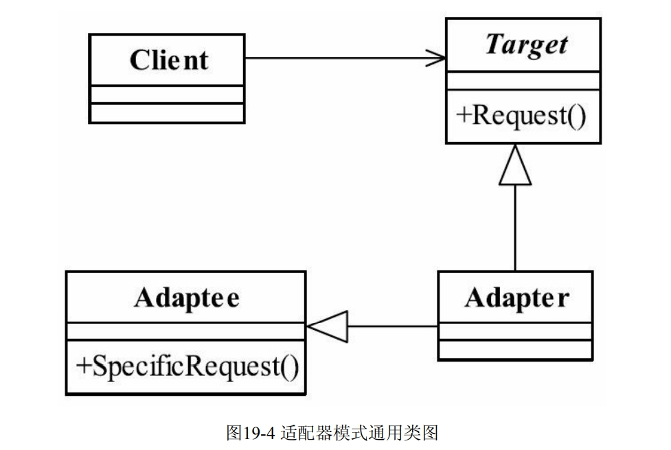
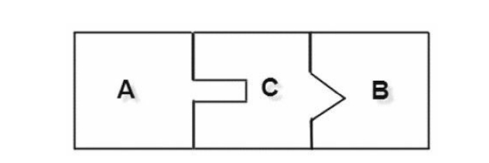
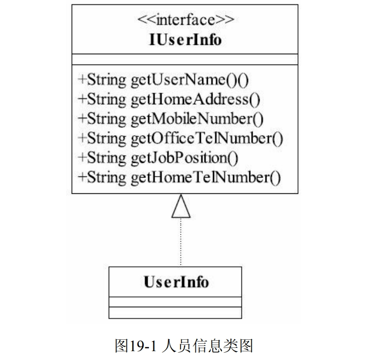
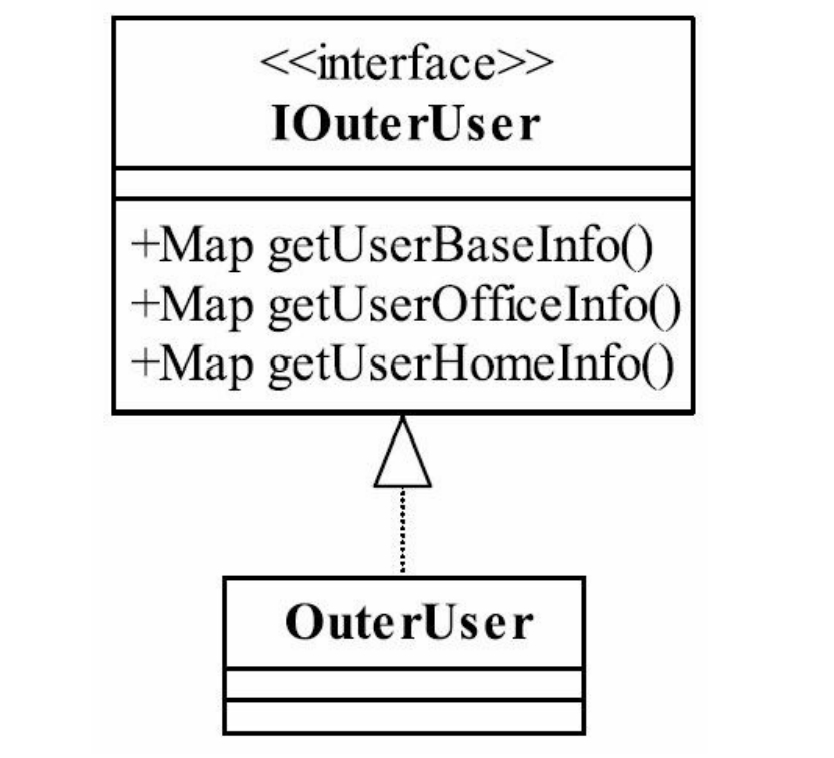
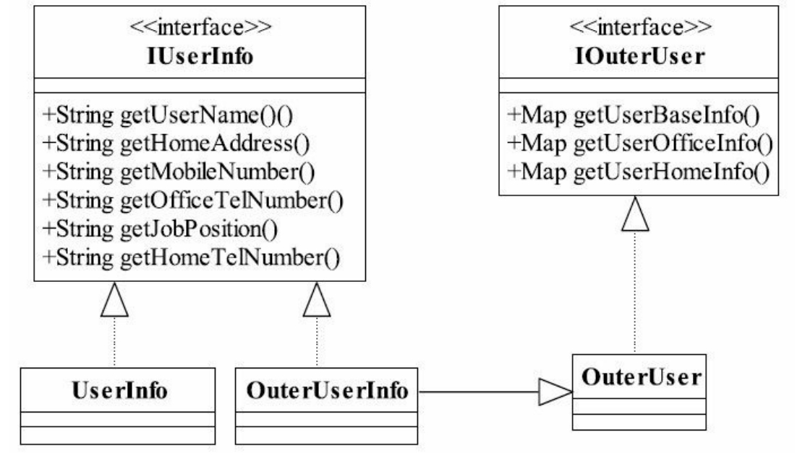
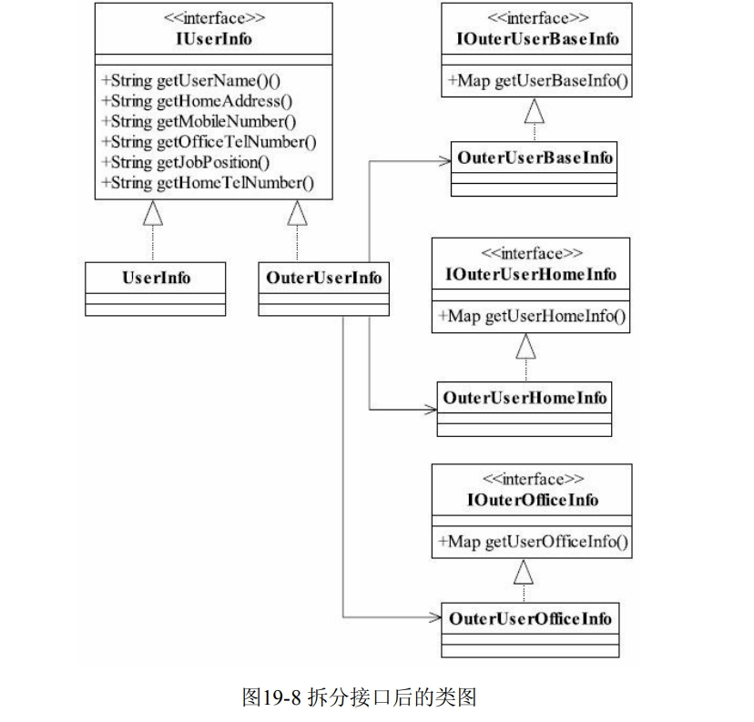

## 参考


::: tip 参考

- https://www.runoob.com/design-pattern/design-pattern-intro.html
- http://c.biancheng.net/view/1317.html
- [设计模式之禅](TheZen0fDesignPattern_2.pdf)

:::


## 代理模式

参考

- [JAVA动态代理](https://www.jianshu.com/p/9bcac608c714)
- [JAVA动态代理](https://www.zhihu.com/question/20794107/answer/658139129)


### 定义

Provide a surrogate or placeholder for another object to control access to it.（为其他对象提供 一种代理以控制对这个对象的访问。）


代理者要代理谁就产生该代理的实例，然后把被代理者传递进来，该模式在实际的项目应用中比较广泛。


### 静态代理

它的要求就是客户端只能访问代理角色，而不能访问真实角色，这是比较简单的。

> 强制代理：当访问一个真实角色时，返回的都是代理角色，无论什么情况。


1.为现有的每一个类都编写一个**对应的**代理类，并且让它实现和目标类相同的接口（假设都有）


2.在创建代理对象时，通过构造器塞入一个目标对象，然后在代理对象的方法内部调用目标对象同名方法，并在调用前后打印日志。也就是说，**代理对象 = 增强代码 + 目标对象（原对象）**。有了代理对象后，就不用原对象了


缺陷

程序员要手动为每一个目标类编写对应的代理类。如果当前系统已经有成百上千个类，工作量太大了。所以，现在我们的努力方向是：如何少写或者不写代理类，却能完成代理功能？


### 动态代理

要创建一个实例，最关键的就是得到对应的Class对象。能否不写代理类，而直接得到代理Class对象，然后根据它创建代理实例（反射）。


动态代理是在实现阶段不用关心代理谁，而在运行阶段才指定代理哪一个对象，相对来说，自己写代理类的方式就是静态代理。本章节的核心部分 就在动态代理上，现在有一个非常流行的名称叫做面向横切面编程，也就是AOP（Aspect Oriented Programming），其核心就是采用了动态代理机制。


在类图中增加了一个InvocationHandler接口和GamePlayIH类，作用就是产生一个对象的 代理对象，其中`InvocationHandler`是JDK提供的动态代理接口，对被代理类的方法进行代理。


其中invoke方法是接口InvocationHandler定义必须实现的，它完成对真实方法的调用。我 们来详细讲解一下InvocationHandler接口，动态代理是根据被代理的接口生成所有的方法， 也就是说给定一个接口，动态代理会宣称“我已经实现该接口下的所有方法了”，那各位读者 想想看，动态代理怎么才能实现被代理接口中的方法呢？默认情况下所有的方法返回值都是 空的，是的，代理已经实现它了，但是没有任何的逻辑含义，那怎么办？好办，通过 InvocationHandler接口，所有方法都由该Handler来进行处理，即所有被代理的方法都由 InvocationHandler接管实际的处理任务。


动态调用过程


动态代理具体步骤：

1. 通过实现 InvocationHandler 接口创建自己的调用处理器；
2. 通过为 Proxy 类指定 ClassLoader 对象和一组 interface 来创建动态代理类；
3. 通过反射机制获得动态代理类的构造函数，其唯一参数类型是调用处理器接口类型；
4. 通过构造函数创建动态代理类实例，构造时调用处理器对象作为参数被传入。


#### 底层原理

1. 创建一个`ProxyHandle`实现`InvocationHandler`接口的invoke方法，并在invoke方法中写好增强的逻辑
2. 通过`Proxy.newProxyInstance(ClassLoader c, Interface[] i, InvocationHandler handle)`方法传入实例对象的，根据实例对象的构造器和接口生成class文件通过反射创造一个代理类并创建代理对象
3. 代理类是实现`InvocationHandler`接口且内部有一个变量`invocationHandler`，代理对象也实现了原本实例对象的接口，但是代理对象的实现方法都是只调用`invocationHandler`的`invoke`方法
4. 最后我们用代理对象来执行方法，就会调用我们的invoke方法的增强逻辑


#### 实例

`HelloInterface`

```java
public interface HelloInterface {
    void sayHello();
}
```


`Hello.class`

```java
public class Hello implements HelloInterface {

    @Override
    public void sayHello() {
        System.out.println("Hello world!");
    }
}
```


`ProxyHandle.class`

```java
public class ProxyHandler implements InvocationHandler {

    private Object object;

    public ProxyHandler(Object object) {
        this.object = object;
    }

    //增强逻辑
    @Override
    public Object invoke(Object proxy, Method method, Object[] args) throws Throwable {
        System.out.println("Before invoke " + method.getName());
        Object result = method.invoke(object, args);
        System.out.println("After invoke " + method.getName());
        return result;
    }

    //自定义方法返回代理类
    public static Object getProxy(Object object) {
        InvocationHandler handler = new ProxyHandler(object);
        return Proxy.newProxyInstance(object.getClass().getClassLoader(), object.getClass().getInterfaces(), handler);
    }
}
```


`Main`

```java
@Test
public void test2() {
    HelloInterface hello = new Hello();
    HelloInterface helloProxy = (HelloInterface) ProxyHandler.getProxy(hello);
    helloProxy.sayHello();
}
```


结果

```java
Before invoke sayHello
Hello world!
After invoke sayHello
```


#### CGLIB动态代理

参考

- [CGLib动态代理原理及实现](https://www.cnblogs.com/suizhikuo/p/13941272.html)


JDK实现动态代理需要实现类通过接口定义业务方法，对于没有接口的类，如何实现动态代理呢，这就需要CGLib了。CGLib采用了非常底层的字节码技术，其原理是通过字节码技术为一个类创建子类，并在子类中采用方法拦截的技术拦截所有父类方法的调用，顺势织入横切逻辑。JDK动态代理与CGLib动态代理均是实现Spring AOP的基础。


CGLib创建的动态代理对象性能比JDK创建的动态代理对象的性能高不少，但是CGLib在创建代理对象时所花费的时间却比JDK多得多，所以对于单例的对象，因为无需频繁创建对象，用CGLib合适，反之，使用JDK方式要更为合适一些。


失效情况

同时，由于CGLib由于是采用动态创建子类的方法，对于`final`方法，无法进行代理增强，但是能调用原来的方法


#### jdk和cglib两种动态代理区别

- JDK动态代理只能对实现了接口的类生成代理，而不能针对类
- CGLIB是针对类实现代理，主要是对指定的类生成一个子类，覆盖其中的方法因为是继承，所以该类或方法最好不要声明成final 


#### Spring

1. 如果目标对象实现了接口，默认情况下会采用JDK的动态代理实现AOP 
2. 如果目标对象实现了接口，可以强制使用CGLIB实现AOP 
3. 如果目标对象没有实现了接口，必须采用CGLIB库，spring会自动在JDK动态代理和CGLIB之间转换

如何强制使用CGLIB实现AOP？

- 添加CGLIB库，SPRING_HOME/cglib/*.jar
- 在spring配置文件中加入<aop:aspectj-autoproxy proxy-target-class="true"/>


## 适配器模式


### 定义

适配器模式（Adapter Pattern）的定义如下： 

::: info 定义

Convert the interface of a class into another interface clients expect.Adapter lets classes work together that couldn't otherwise because of incompatible interfaces.（将一个类的接口变换成客户端所期待的另一种接口，从而使原本因接口不匹配而无法在一起工作的两个类能够在一起工作。） 

:::


::: info 介绍

- 意图：将一个类的接口转换成客户希望的另外一个接口。适配器模式使得原本由于接口不兼容而不能一起工作的那些类可以一起工作。
- 主要解决：主要解决在软件系统中，常常要将一些"现存的对象"放到新的环境中，而新环境要求的接口是现对象不能满足的。
- 何时使用： 1、系统需要使用现有的类，而此类的接口不符合系统的需要。 2、想要建立一个可以重复使用的类，用于与一些彼此之间没有太大关联的一些类，包括一些可能在将来引进的类一起工作，这些源类不一定有一致的接口。 3、通过接口转换，将一个类插入另一个类系中。（比如老虎和飞禽，现在多了一个飞虎，在不增加实体的需求下，增加一个适配器，在里面包容一个虎对象，实现飞的接口。）
- 如何解决：继承或依赖（推荐）。
- 关键代码：适配器继承或依赖已有的对象，实现想要的目标接口。
- 应用实例： 1、美国电器 110V，中国 220V，就要有一个适配器将 110V 转化为 220V。 2、JAVA JDK 1.1 提供了 Enumeration 接口，而在 1.2 中提供了 Iterator 接口，想要使用 1.2 的 JDK，则要将以前系统的 Enumeration 接口转化为 Iterator 接口，这时就需要适配器模式。 3、在 LINUX 上运行 WINDOWS 程序。 4、JAVA 中的 jdbc。
- 优点： 1、可以让任何两个没有关联的类一起运行。 2、提高了类的复用。 3、增加了类的透明度。 4、灵活性好。
- 缺点： 1、过多地使用适配器，会让系统非常零乱，不易整体进行把握。比如，明明看到调用的是 A 接口，其实内部被适配成了 B 接口的实现，一个系统如果太多出现这种情况，无异于一场灾难。因此如果不是很有必要，可以不使用适配器，而是直接对系统进行重构。 2.由于 JAVA 至多继承一个类，所以至多只能适配一个适配者类，而且目标类必须是抽象类。
- 使用场景：有动机地修改一个正常运行的系统的接口，这时应该考虑使用适配器模式。
- 注意事项：适配器不是在详细设计时添加的，而是解决正在服役的项目的问题。

:::


适配器模式又叫做变压器模式，也叫做包装模式（Wrapper），但是包装模式可不止一 个，还包括了第17章讲解的装饰模式。适配器模式的通用类图，如图19-4所示。





适配器模式在生活中还是很常见的，比如你笔记本上的电源适配器，可以使用在110～ 220V之间变化的电源，而笔记本还能正常工作，这也是适配器一个良好模式的体现，简单地 说，适配器模式就是把一个接口或类转换成其他的接口或类，从另一方面来说，适配器模式 也就是一个包装模式，为什么呢？它把Adaptee包装成一个Target接口的类，加了一层衣服， 包装成另外一个靓妞了。大家知道，设计模式原是为建筑设计而服务的，软件设计模式只是 借用了人家的原理而已，那我们来看看最原始的适配器是如何设计的，如图19-5所示。 


A、B两个图框代表已经塑模成型的物体A和物体B，那现在要求把A和B安装在一起使 用，如何安装？两者的接口不一致，是不可能安装在一起使用的，那怎么办？引入一个物体 C，如图19-6所示。


引入物体C后，C适应了物体A的接口，同时也适应了物体B的接口，然后三者就可以组 合成一个完整的物体，如图19-7所示。





其中的物体C就是我们说的适配器，它在中间起到了角色转换的作用，把原有的长条形 接口转换了三角形接口。在我们软件业的设计模式中，适配器模式也是相似的功能，那我们 先来看看适配器模式的三个角色。


::: info 三个角色

- **Target目标角色**

  > 该角色定义把其他类转换为何种接口，也就是我们的期望接口，例子中的IUserInfo接口 就是目标角色。

- **Adaptee源角色**

  > 你想把谁转换成目标角色，这个“谁”就是源角色，它是已经存在的、运行良好的类或对 象，经过适配器角色的包装，它会成为一个崭新、靓丽的角色。

- **Adapter适配器角色**

  > 适配器模式的核心角色，其他两个角色都是已经存在的角色，而适配器角色是需要新建 立的，它的职责非常简单：把源角色转换为目标角色，怎么转换？通过`继承`或是`类关联`的方式。

:::


各个角色的职责都已经非常清楚，我们再来看看其通用源码，目标接口如代码清单19-8 所示。 

代码清单19-8 目标角色 

```java
public interface Target {
  //目标角色有自己的方法
  public void request();
}
```


目标角色是一个已经在正式运行的角色，你不可能去修改角色中的方法，你能做的就是 如何去实现接口中的方法，而且通常情况下，目标角色是一个接口或者是抽象类，一般不会 是实现类。一个正在服役的目标角色，如代码清单19-9所示。 

代码清单19-9 目标角色的实现类

```java
public class ConcreteTarget implements Target {
  public void request() {
    System.out.println("if you need any help,pls call me!"); }
}
```


源角色也是已经在服役状态（当然，非要新建立一个源角色，然后套用适配器模式，那 也没有任何问题），它是一个正常的类，其源代码如代码清单19-10所示。 

代码清单19-10 源角色

```java
public class Adaptee {
  //原有的业务逻辑
  public void doSomething(){
    System.out.println("I'm kind of busy,leave me alone,pls!");
  }
}
```


我们的核心角色要出场了，适配器角色如代码清单19-11所示。 代码清单19-11 适配器角色

```java
public class Adapter extends Adaptee implements Target {
  public void request() {
    super.doSomething();
  }
}
```


所有的角色都已经在场了，那我们就开始看看这场演出，场景类如代码清单19-12所 示。

```java
public class Client {
  public static void main(String[] args) {
    //原有的业务逻辑
    Target target = new ConcreteTarget();
    target.request();
    //现在增加了适配器角色后的业务逻辑
    Target target2 = new Adapter();
    target2.request();
  }
}
```


### 优点


- 适配器模式可以让两个没有任何关系的类在一起运行，只要适配器这个角色能够搞定 他们就成。 

- 增加了类的透明性

  > 想想看，我们访问的Target目标角色，但是具体的实现都委托给了源角色，而这些对高层次模块是透明的，也是它不需要关心的。

- 提高了类的复用度

  > 当然了，源角色在原有的系统中还是可以正常使用，而在目标角色中也可以充当新的演 员。 

- 灵活性非常好

  > 某一天，突然不想要适配器，没问题，删除掉这个适配器就可以了，其他的代码都不用 修改，基本上就类似一个灵活的构件，想用就用，不想就卸载。

 

### 使用场景

适配器应用的场景只要记住一点就足够了：你有动机修改一个已经投产中的接口时，适 配器模式可能是最适合你的模式。比如系统扩展了，需要使用一个已有或新建立的类，但这 个类又不符合系统的接口，怎么办？使用适配器模式，这也是我们例子中提到的。


### 注意事项

适配器模式最好在详细设计阶段不要考虑它，它不是为了解决还处在开发阶段的问题， 而是解决正在服役的项目问题，没有一个系统分析师会在做详细设计的时候考虑使用适配器 模式，这个模式使用的主要场景是扩展应用中，就像我们上面的那个例子一样，系统扩展 了，不符合原有设计的时候才考虑通过适配器模式减少代码修改带来的风险。 再次提醒一点，项目一定要遵守依赖倒置原则和里氏替换原则，否则即使在适合使用适 配器的场合下，也会带来非常大的改造。


### 例子

2004年我带了一个项目，做一个人力资源管理项目，该项目是我们总公司发起的，公司 一共有700多号人。这个项目还是比较简单的，分为三大模块：人员信息管理、薪酬管理、 职位管理。当时开发时业务人员明确指明：人员信息管理的对象是所有员工的所有信息，所 有的员工指的是在职的员工，其他的离职的、退休的暂不考虑。根据需求我们设计了如图 19-1所示的类图。




非常简单，有一个对象UserInfo存储用户的所有信息（实际系统上还有很多子类，不多 说了），也就是BO（Business Object，业务对象），这个对象设计为贫血对象（Thin Business Object），不需要存储状态以及相关的关系，本人是反对使用充血对象（Rich Business Object），这里提到两个名词：贫血对象和充血对象，这两个名词很简单，在领域 模型中分别叫做贫血领域模型和充血领域模型，有什么区别呢？一个对象如果不存储实体状 态以及对象之间的关系，该对象就叫做贫血对象，对应的领域模型就是贫血领域模型，有实 体状态和对象关系的模型就是充血领域模型。看不懂没关系，都是糊弄人的东西，属于专用 名词。扯远了，我们继续说我们的人力资源管理项目，这个UserInfo对象，在系统中很多地 方使用，你可以查看自己的信息，也可以修改，当然这个对象是有setter方法的，我们这里用 不到就隐藏掉了。先来看接口，员工信息接口如代码清单19-1所示。


代码清单19-1 员工信息接口

```java
public interface IUserInfo {
  //获得用户姓名
  public String getUserName();
  //获得家庭地址
  public String getHomeAddress();
  //手机号码，这个太重要，手机泛滥呀
  public String getMobileNumber();
  //办公电话，一般是座机
  public String getOfficeTelNumber();
  //这个人的职位是什么
  public String getJobPosition();
  //获得家庭电话，这有点不好，我不喜欢打家庭电话讨论工作
  public String getHomeTelNumber();
}
```

员工信息接口有了，就需要设计一个实现类来容纳数据，如代码清单19-2所示。

代码清单19-2 实现类

```java
public class UserInfo implements IUserInfo {
  /*
* 获得家庭地址，下属送礼也可以找到地方
*/
  public String getHomeAddress() {
    System.out.println("这里是员工的家庭地址...");
    return null;
  }
  /*
* 获得家庭电话号码
*/
  public String getHomeTelNumber() {
    System.out.println("员工的家庭电话是...");
    return null;
  }
  /*
* 员工的职位，是部门经理还是普通职员
*/
  public String getJobPosition() {
    System.out.println("这个人的职位是BOSS...");
    return null;
  }
  /*
* 手机号码
*/
  public String getMobileNumber() {
    System.out.println("这个人的手机号码是0000...");
    return null;
  }
  /*
* 办公室电话，烦躁的时候最好"不小心"把电话线踢掉
*/
  public String getOfficeTelNumber() {
    System.out.println("办公室电话是...");
    return null;
  }
  /*
* 姓名，这个很重要
*/
  public String getUserName() {
    System.out.println("姓名叫做...");
    return null;
  }
}

```

这个项目是2004年年底投产的，运行到2005年年底还是比较平稳的，中间修修补补也很 正常，2005年年底不知道是哪股风吹的，很多公司开始使用借聘人员的方式引进人员，我们 公司也不例外，从一个劳动资源公司借用了一大批的低技术、低工资的人员，分配到各个子 公司，总共有将近200人，然后人力资源部就找我们部门老大谈判，说要增加一个功能：借 用人员管理，老大一看有钱赚呀，一拍大腿，做！ 


老大命令一下来，我立马带人过去调研，需求就一句话，但是真深入地调研还真不是那 么简单。借聘人员虽然在我们公司干活，和我们一个样，干活时没有任何的差别，但是他们 的人员信息、工资情况、福利情况等都是由劳动服务公司管理的，并且有一套自己的人员管 理系统，人力资源部门就要求我们系统同步劳动服务公司的信息，当然是只要在我们公司工 作的人员信息，其他人员信息是不需要的，而且还要求信息同步，也就是：劳动服务公司的 人员信息一变更，我们系统就应该立刻体现出来，为什么要即时而不批量呢？是因为我们公 司与劳动服务公司之间是按照人头收费的，甭管是什么人，只要我们公司借用，就这个价 格，我要一个研究生，你派了一个高中生给我，那算什么事？因此，了解了业务需求用后， 项目组决定采用RMI（Remote Method Invocation，远程对象调用）的方式进行联机交互，但 是深入分析后，一个重大问题立刻显现出来：劳动服务公司的人员对象和我们系统的对象不 相同，他们的对象如下所示。




劳动服务公司是把人员信息分为了三部分：基本信息、办公信息和个人家庭信息，并且 都放到了HashMap中，比如人员的姓名放到BaseInfo信息中，家庭地址放到HomeInfo中，这 也是一个可以接受的模式，我们来看看他们的代码，接口如代码清单19-3所示。 代码清单19-3 劳动服务公司的人员信息接口

```java
public interface IOuterUser {
  //基本信息，比如名称、性别、手机号码等
  public Map getUserBaseInfo();
  //工作区域信息
  public Map getUserOfficeInfo();
  //用户的家庭信息
  public Map getUserHomeInfo();
}
```


劳动服务公司的人员信息是这样存放的，如代码清单19-4所示。 代码清单19-4 劳动服务公司的人员实现

```java
public class OuterUser implements IOuterUser {
  /*
* 用户的基本信息
*/
  public Map getUserBaseInfo() {
    HashMap baseInfoMap = new HashMap();
    baseInfoMap.put("userName", "这个员工叫混世魔王...");
    baseInfoMap.put("mobileNumber", "这个员工电话是...");
    return baseInfoMap;
  }
  /*
* 员工的家庭信息
*/
  public Map getUserHomeInfo() {
    HashMap homeInfo = new HashMap();
    homeInfo.put("homeTelNumbner", "员工的家庭电话是...");
    homeInfo.put("homeAddress", "员工的家庭地址是...");
    return homeInfo;
  }
  /*
* 员工的工作信息，比如，职位等
*/
  public Map getUserOfficeInfo() {
    HashMap officeInfo = new HashMap();
    officeInfo.put("jobPosition","这个人的职位是BOSS...");
    officeInfo.put("officeTelNumber", "员工的办公电话是...");
    return officeInfo;
  }
}
```


看到这里，咱不好说他们系统设计得不好，问题是咱的系统要和他们的系统进行交互， 怎么办？我们不可能为了这一小小的功能而对我们已经运行良好系统进行大手术，那怎么 办？我们可以转化，先拿到对方的数据对象，然后转化为我们自己的数据对象，中间加一层 转换处理，按照这个思路，我们设计了如图19-3所示的类图。




大家可能会问，这两个对象都不在一个系统中，你如何使用呢？简单！RMI已经帮我们 做了这件事情，只要有接口，就可以把远程的对象当成本地的对象使用，这个大家有时间可 以去看一下RMI文档，不多说了。OuterUserInfo可以看做是“两面派”，实现了IUserInfo接口， 还继承了OuterUser，通过这样的设计，把OuterUser伪装成我们系统中一个IUserInfo对象，这 样，我们的系统基本不用修改，所有的人员查询、调用跟本地一样。


::: warning

我们之所以能够增加一个OuterUserInfo中转类，是因为我们在系统设计时严格遵守了`依赖倒置原则`和`里氏替换原则`，否则即使增加了中转类也无法解决问题。

:::


代码清单19-5 中转角色

```java
public class OuterUserInfo extends OuterUser implements IUserInfo {
  private Map baseInfo = super.getUserBaseInfo(); //员工的基本信息
  private Map homeInfo = super.getUserHomeInfo(); //员工的家庭信息
  private Map officeInfo = super.getUserOfficeInfo(); //工作信息
  /*
* 家庭地址
*/
  public String getHomeAddress() {
    String homeAddress = (String)this.homeInfo.get("homeAddress");
    System.out.println(homeAddress);
    return homeAddress;
  }
  /*
* 家庭电话号码
*/
  public String getHomeTelNumber() {
    String homeTelNumber = (String)this.homeInfo.get("homeTelNumber");
    System.out.println(homeTelNumber);
    return homeTelNumber;
  }
  /*
*职位信息
*/
  public String getJobPosition() {
    String jobPosition = (String)this.officeInfo.get("jobPosition");
    System.out.println(jobPosition);
    return jobPosition;
  }
  /*
* 手机号码
*/
  public String getMobileNumber() {
    String mobileNumber = (String)this.baseInfo.get("mobileNumber");
    System.out.println(mobileNumber);
    return mobileNumber;
  }
  /*
* 办公电话
*/
  public String getOfficeTelNumber() {
    String officeTelNumber = (String)this.officeInfo.get("officeTelNumber");
    System.out.println(officeTelNumber);
    return officeTelNumber;
  }
  /*
* 员工的名称
*/
  public String getUserName() {
    String userName = (String)this.baseInfo.get("userName");
    System.out.println(userName);
    return userName;
  }
}
```

大家看到没？中转的角色有很多的强制类型转换，就是(String)这个东西，如果使用泛型 的话，就可以完全避免这个转化（当然了，泛型当时还没有诞生）。我们要看看这个中转是 否真的起到了中转的作用，我们想象这样一个场景：公司大老板想看看我们自己公司年轻女 孩子的电话号码，那该场景类就如代码清单19-6所示。 

代码清单19-6 场景类

```java
public class Client {
  public static void main(String[] args) {
    //没有与外系统连接的时候，是这样写的
    IUserInfo youngGirl = new UserInfo();
    //从数据库中查到101个
    for(int i=0;i<101;i++){
      youngGirl.getMobileNumber();
    }
  }
}
```


这老板比较色呀。从数据库中生成了101个UserInfo对象，直接打印出来就成了。老板回 头一想，不对呀，兔子不吃窝边草，还是调取借用人员看看，于是要查询出借用人员中美女 的电话号码，如代码清单19-7所示。

```java
public class Client {
  public static void main(String[] args) {
    //老板一想不对呀，兔子不吃窝边草，还是找借用人员好点
    //我们只修改了这句话
    IUserInfo youngGirl = new OuterUserInfo();
    //从数据库中查到101个
    for(int i=0;i<101;i++){
      youngGirl.getMobileNumber();
    }
  }
}
```

大家看，使用了适配器模式只修改了一句话，其他的业务逻辑都不用修改就解决了系统 对接的问题，而且在我们实际系统中只是增加了一个业务类的继承，就实现了可以查本公司 的员工信息，也可以查人力资源公司的员工信息，尽量少的修改，通过扩展的方式解决了该 问题。这就是适配模式。


### 适配器模式的扩展

我们刚刚讲的人力资源管理的例子中，其实是一个比较幸运的例子，为什么呢？如果劳 动服务公司提供的人员接口不止一个，也就是说，用户基本信息是一个接口，工作信息是一 个接口，家庭信息是一个接口，总共有三个接口三个实现类，想想看如何处理呢？不能再使 用我们上面的方法了，为什么呢？Java是不支持多继承的，你难道想让OuterUserInfo继承三 个实现类？此路不通，再想一个办法，对哦，可以使用类关联的办法嘛！声明一个 OuterUserInfo实现类，实现IUserInfo接口，通过再关联其他三个实现类不就可以解决这个问 题了吗？是的，是的，好方法，我们先画出类图，如图19-8所示。

OuterUserInfo通过关联的方式与外界的三个实现类通讯，当然也可以理解为是聚合关 系。IUserInfo和UserInfo代码如代码清单19-1和代码清单19-2所示，不再赘述。我们来看看拆 分后的三个接口和实现类，用户基本信息接口如代码清单19-13所示。





代码清单19-13 用户基本信息接口

`IOuterUserBaseInfo.java`

```java
public interface IOuterUserBaseInfo {
  //基本信息，比如名称、性别、手机号码等
  public Map getUserBaseInfo();
}
```


代码清单19-14 用户家庭信息接口

`IOuterUserHomeInfo.java`

```java
public interface IOuterUserHomeInfo {
  //用户的家庭信息
  public Map getUserHomeInfo();
}

```


代码清单19-15 用户工作信息接口

`IOuterUserOfficeInfo.java`

```java
public interface IOuterUserOfficeInfo {
  //工作区域信息
  public Map getUserOfficeInfo();
}

```


读到这里，读者应该想到这样一个问题：系统这样设计是否合理呢？合理，绝对合理！ 想想`单一职责原则`是怎么说的，类和接口要保持职责单一，在实际的应用中类可以有多重职 责，但是接口一定要职责单一，因此，我们上面拆分接口的假想也是非常合乎逻辑的。我们 来看三个相关的实现类，用户基本信息如代码清单19-16所示。

代码清单19-16 用户基本信息

`OuterUserBaseInfo.java`

```java
public class OuterUserBaseInfo implements IOuterUserBaseInfo {
  /*
* 用户的基本信息
*/
  public Map getUserBaseInfo() {
    HashMap baseInfoMap = new HashMap();
    baseInfoMap.put("userName", "这个员工叫混世魔王...");
    baseInfoMap.put("mobileNumber", "这个员工电话是...");
    return baseInfoMap;
  }
}
```


代码清单19-17 用户家庭信息

`OuterUserHomeInfo.java`

```java
public class OuterUserHomeInfo implements IOuterUserHomeInfo {
  /*
* 员工的家庭信息
*/
  public Map getUserHomeInfo() {
    HashMap homeInfo = new HashMap();
    homeInfo.put("homeTelNumbner", "员工的家庭电话是...");
    homeInfo.put("homeAddress", "员工的家庭地址是...");
    return homeInfo;
  }
}
```


代码清单19-18 用户工作信息

`OuterUserOfficeInfo.java`

```java
public class OuterUserOfficeInfo implements IOuterUserOfficeInfo {
  /*
* 员工的工作信息，比如，职位等
*/
  public Map getUserOfficeInfo() {
    HashMap officeInfo = new HashMap();
    officeInfo.put("jobPosition","这个人的职位是BOSS...");
    officeInfo.put("officeTelNumber", "员工的办公电话是...");
    return officeInfo;
  }
}
```


这里又到我们的核心了——适配器。好，我们来看适配器代码，如代码清单19-19所 示。

代码清单19-19 适配器

```java
public class OuterUserInfo implements IUserInfo {
  //源目标对象
  private IOuterUserBaseInfo baseInfo = null; //员工的基本信息
  private IOuterUserHomeInfo homeInfo = null; //员工的家庭信息
  private IOuterUserOfficeInfo officeInfo = null; //工作信息
  //数据处理
  private Map baseMap = null;
  private Map homeMap = null;
  private Map officeMap = null;
  //构造函数传递对象
  public OuterUserInfo(IOuterUserBaseInfo _baseInfo,IOuterUserHomeInfo _homeInfo,IOuterUserOfficeInfo _officeInfo){
    this.baseInfo = _baseInfo;
    this.homeInfo = _homeInfo;
    this.officeInfo = _officeInfo;
    //数据处理
    this.baseMap = this.baseInfo.getUserBaseInfo();
    this.homeMap = this.homeInfo.getUserHomeInfo();
    this.officeMap = this.officeInfo.getUserOfficeInfo();
  }
  //家庭地址
  public String getHomeAddress() {
    String homeAddress = (String)this.homeMap.get("homeAddress");
    System.out.println(homeAddress);
    return homeAddress;
  }
  //家庭电话号码
  public String getHomeTelNumber() {
    String homeTelNumber = (String)this.homeMap.get("homeTelNumber");
    System.out.println(homeTelNumber);
    return homeTelNumber;
  }
  //职位信息
  public String getJobPosition() {
    String jobPosition = (String)this.officeMap.get("jobPosition");
    System.out.println(jobPosition);
    return jobPosition;
  }
  //手机号码
  public String getMobileNumber() {
    String mobileNumber = (String)this.baseMap.get("mobileNumber");
    System.out.println(mobileNumber);
    return mobileNumber;
  }
  //办公电话
  public String getOfficeTelNumber() {
    String officeTelNumber= (String)this.officeMap.get("officeTelNumber");
    System.out.println(officeTelNumber);
    return officeTelNumber;
  }
  // 员工的名称
  public String getUserName() {
    String userName = (String)this.baseMap.get("userName");
    System.out.println(userName);
    return userName;
  }
}

```


大家只要注意一下黑色字体的构造函数就可以了，它接收三个对象，其他部分变化不 大，只是变量名称进行了修改，我们再来看场景类，如代码清单19-20所示。

```java
public class Client {
  public static void main(String[] args) {
    //外系统的人员信息
    IOuterUserBaseInfo baseInfo = new OuterUserBaseInfo();
    IOuterUserHomeInfo homeInfo = new OuterUserHomeInfo();
    IOuterUserOfficeInfo officeInfo = new OuterUserOfficeInfo();
    //传递三个对象
    IUserInfo youngGirl = new OuterUserInfo(baseInfo,homeInfo,officeInfo);
    //从数据库中查到101个
    for(int i=0;i<101;i++){
      youngGirl.getMobileNumber();
    }
  }
}
```

