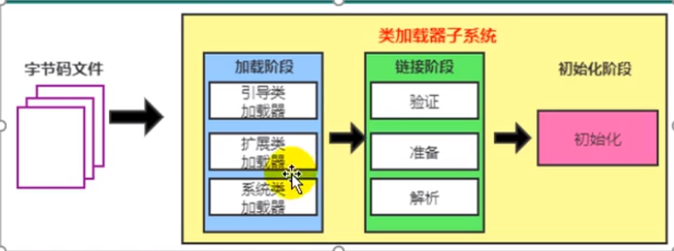

## JVM概述


### JVM跨平台原理


1. 跨平台：由Java编写的程序可以在不同的操作系统上运行：一次编写，多处运行

2. 原理：编译之后的字节码文件和平台无关，需要在不同的操作系统上安装一个对应版本的虚拟机(JVM)
   (Java虚拟机不和包括java在内的任何语言绑定，它只与class文件这种二进制文件格式所关联。无论使用何种语言进行软件开发，只要将源文件编译为正确的Class文件，那么这种语言就可以在Java虚拟机上执行，可以说，统一而强大的Class文件结构，就是Java虚拟机的基石、桥梁)


### JVM位置


### JVM运行流程


### JVM生命周期


#### 1.启动

通过引导类加载器（bootstrap class loader）创建一个初始类（initial class）来完成的，这个类是由虚拟机的具体实现指定的.

#### 2.执行

- 一个运行中的java虚拟机有着一个清晰的任务：执行Java程序；
- 程序开始执行的时候他才运行，程序结束时他就停止；
- 执行一个所谓的Java程序的时候，真真正正在执行的是一个叫做Java虚拟机的进程。

#### 3.退出

- 程序正常执行结束
- 程序异常或错误而异常终止
- 操作系统错误导致终止
- 某线程调用Runtime类或System类的exit方法，或Runtime类的halt方法，并且java安全管理器也允许这次exit或halt操作
- 除此之外，JNI规范描述了用JNI Invocation API来加载或卸载Java虚拟机时，Java虚拟机的退出情况


## 类加载子系统




### 作用

- 类加载子系统负责从文件系统或者网络中加载Class文件，class文件在文件开头有特定的文件标识；
- `ClassLoader`只负责class文件的加载，至于它是否可以运行，则由``Execution Engine`决定
- 加载的类信息存放于一块成为方法区的内存空间。除了类信息之外，方法区还会存放运行时常量池信息，可能还包括字符串字面量和数字常量（这部分常量信息是Class文件中常量池部分的内存映射）


### 加载过程

当程序要使用某个类时，如果该类还未被加载到内存中，则系统会通过


::: info

- 类的加载
- 类的链接（验证，准备，解析）
- 类的初始化

:::


这三个步骤来对类进行初始化。如果不出现意外，JVM将会连续完成这三个步骤，所以有时也把这三个步骤统称为类加载或者初始化


#### 加载（Loading）

由`ClassLoader`负责，将class字节码文件加载到内存中

- 通过一个类的全限定明获取定义此类的二进制字节流；
- 将这个字节流所代表的的`静态存储结构（静态变量，静态代码块，常量池等）`转化为`方法区的运行时数据`；
- 在内存中生成一个对应这个类的`java.lang.Class`对象（用于反射），作为方法区这个类的各种数据的访问入口


#### 链接（Linking）

包含验证，准备，解析


**验证**

::: info

- 目的在于确保Class文件的字节流中包含信息符合当前虚拟机要求，保证被加载类的正确性，不会危害虚拟机自身安全。
- 主要包括四种验证，文件格式验证，源数据验证，字节码验证，符号引用验证。

:::


**准备**

在方法区进行

::: info

- 为类变量（static变量）分配内存并且设置该类变量的默认初始化值，具体赋值在初始化阶段完
- 这里不包含用`final`修饰的`static`，因为final在编译的时候就会分配了，准备阶段会显式初始化；
- 这里不会为实例变量分配初始化,类变量会分配在方法区中,而实例变量会随着对象一起分配到Java堆中

:::


**解析**

将常量池内的`符号引用`转换为`直接引用`的过程。


::: info

- 事实上，解析操作网晚会伴随着jvm在执行完初始化之后再执行
- 符号引用就是一组符号来描述所引用的目标。符号应用的字面量形式明确定义在《java虚拟机规范》的class文件格式中。直接引用就是直接指向目标的指针、相对偏移量或一个间接定位到目标的句柄
- 解析动作主要针对类或接口、字段、类方法、接口方法、方法类型等。对应常量池中的CONSTANT_Class_info/CONSTANT_Fieldref_info、CONSTANT_Methodref_info等。

:::


- 虚拟机在加载Class文件时才会进行动态链接,也就是说,Class文件中不会保存各个方法和字段的最终内存布局信息,因此,这些字段和方法的符号引用不经过转换是无法直接被虚拟机使用的。当虚拟机运行起来时,需要从常量池中获得对应的符号引用,再在类加载过程中(初始化阶段)将其替换直接引用,并翻译到具体的内存地址中
- 符号引用：符号引用以一组符号来描述所引用的目标，符号可以是任何形式的字面量，只要使用时能无歧义地定位到目标即可。符号引用与虚拟机实现的内存布局无关，引用的目标并不一定已经加载到了内存中
- 直接引用：直接引用可以是直接指向目标的指针、相对偏移量或是一个能间接定位到目标的句柄。直接引用是与虚拟机实现的内存布局相关的，同一个符号引用在不同虚拟机实例上翻译出来的直接引用一般不会相同。如果有了直接引用，那说明引用的目标必定已经存在于内存之中了。
  

解释什么是符号引号和直接引用?
教室里有个空的位子没坐人，座位上边牌子写着小明的座位（符号引用），后来小明进来坐下去掉牌子（符号引用换成直接引用）


#### 初始化（Initialization）

为类变量赋予正确的初始化值


::: info

- 初始化阶段就是执行类构造器方法`< clinit >()`的过程。此方法不需要定义，是javac编译器自动收集`类中的所有类变量的赋值动作`和`静态代码快`中的语句合并而来（如果没有则不回生成clinit方法）
- 若该类具有父类，jvm会保证子类的clinit()执行前，父类的clinit()已经执行完毕
- clinit()不同于类的构造器。（关联：构造器是虚拟机视角下的方法init()）
- 虚拟机必须保证一个类的clinit()方法在多线程下被同步加锁。

:::

```java
public class ClassInitTest {
    private  static int num=1;
    static{
        num=2;
        number=20;
        System.out.println(num);
        //System.out.println(number); 报错:非法的前向引用，只能赋值不能调用
    }
    //Linking之prepare: number=0 -->initial:20-->10
    private static int number=10;

    public static void main(String[] args) {
        System.out.println(ClassInitTest.num);
        System.out.println(ClassInitTest.number);
    }
}

```


虚拟机必须保证一个类的clinit()方法在多线程下被同步加锁。


## 类加载器（ClassLoader）

::: tip 参考

- [老大难的 Java ClassLoader，到了该彻底理解它的时候了](https://www.cnblogs.com/makai/p/11081879.html)
- [一看你就懂，超详细java中的ClassLoader详解](https://blog.csdn.net/briblue/article/details/54973413)

:::


### 概述

JVM支持两种类型的加载器，分别为

- **引导类加载器（BootStrap ClassLoader）**
- **自定义类加载器（User-Defined ClassLoader）**


从概念上来讲，自定义类加载器一般指的是程序中由开发人员自定义的一类类加载器，但是java虚拟机规范却没有这么定义，而是**将所有派生于抽象类ClassLoader的类加载器都划分为自定义类加载器**

sum.misc.Launcher:它是一个java虚拟机的入口应用

无论类加载器的类型如何划分，在程序中我们最常见的类加载器始终只有三个，如下所示：


**①启动类加载器（引导类加载器，BootStrap ClassLoader）**

- 这个类加载使用**C/C++语言实现的**，嵌套在JVM内部
- 它用来加载java的核心库（JAVA_HOME/jre/lib/rt.jar/resources.jar或sun.boot.class.path路径下的内容），用于提供JVM自身需要的类
- 并不继承自java.lang.ClassLoader,没有父加载器
- 加载拓展类和应用程序类加载器，并指定为他们的父加载器
- 处于安全考虑，BootStrap启动类加载器只加载包名为java、javax、sun等开头的类

**②拓展类加载器（Extension ClassLoader）**

- java语言编写 ，由sun.misc.Launcher$ExtClassLoader实现。
- 派生于ClassLoader类
- 父类加载器为启动类加载器
- 从java.ext.dirs系统属性所指定的目录中加载类库，或从JDK的安装目录的jre/lib/ext子目录（扩展目录）下加载类库。**如果用户创建的JAR放在此目录下，也会由拓展类加载器自动加载**

**③应用程序类加载器（系统类加载器，AppClassLoader）**

- java语言编写， 由sun.misc.Launcher$AppClassLoader实现。
- 派生于ClassLoader类
- 父类加载器为拓展类加载器
- 它负责加载环境变量classpath或系统属性 java.class.path指定路径下的类库
- **该类加载器是程序中默认的类加载器**，一般来说，java应用的类都是由它来完成加载
- 通过ClassLoader#getSystemClassLoader()方法可以获取到该类加载器


### ClassLoader的常用方法及获取方法

ClassLoader类，它是一个抽象类，其后所有的类加载器都继承自ClassLoader（不包括启动类加载器）

| 方法名称                                             | 描述                                                         |
| ---------------------------------------------------- | ------------------------------------------------------------ |
| getParent（）                                        | 返回该类加载器的超类加载器                                   |
| loadClass（String name）                             | 加载名称为name的类，返回结果为java.lang.Class类的实例        |
| findClass（String name）                             | 查找名称为name的类，返回结果为java.lang.Class类的实例        |
| findLoadedClass（String name）                       | 查找名称为name的已经被加载过的类，返回结果为java.lang.Class类的实例 |
| defineClass（String name，byte[] b,int off,int len） | 把字节数组b中的内容转换为一个Java类 ，返回结果为java.lang.Class类的实例 |
| resolveClass（Class<?> c）                           | 连接指定的一个java类                                         |


### 测试获取加载器

```java
/**
 * ClassLoader加载
 */
public class ClassLoaderTest {
    public static void main(String[] args) {
        //获取系统类加载器
        ClassLoader systemClassLoader = ClassLoader.getSystemClassLoader();
        System.out.println(systemClassLoader);//sun.misc.Launcher$AppClassLoader@18b4aac2

        //获取其上层  扩展类加载器
        ClassLoader extClassLoader = systemClassLoader.getParent();
        System.out.println(extClassLoader);//sun.misc.Launcher$ExtClassLoader@610455d6

        //获取其上层 获取不到引导类加载器
        ClassLoader bootStrapClassLoader = extClassLoader.getParent();
        System.out.println(bootStrapClassLoader);//null

        //对于用户自定义类来说：使用系统类加载器进行加载
        ClassLoader classLoader = ClassLoaderTest.class.getClassLoader();
        System.out.println(classLoader);//sun.misc.Launcher$AppClassLoader@18b4aac2

        //String 类使用引导类加载器进行加载的  -->java核心类库都是使用引导类加载器加载的
        ClassLoader classLoader1 = String.class.getClassLoader();
        System.out.println(classLoader1);//null

    }
}
```


### 用户自定义加载器


#### 好处

::: info 好处

- 隔离加载类
- 修改类加载的方式
- 拓展加载源
- 防止源码泄漏

:::


#### 步骤


在`findClass()`中调用`defineClass()`方法，它能将class二进制内容转换成Class对象，如果不符合要求会抛出各种异常。


### 双亲委派机制


#### 原理

Java虚拟机对class文件采用的是按需加载的方式，也就是说当需要使用该类时才会将她的class文件加载到内存生成的class对象。而且加载某个类的class文件时，java虚拟机采用的是双亲委派模式，即先把请求交由父类处理，它是一种任务委派模式


如图，虽然我们自定义了一个java.lang包下的String尝试覆盖核心类库中的String，但是由于双亲委派机制，启动加载器会加载java核心类库的String类（BootStrap启动类加载器只加载包名为java、javax、sun等开头的类），而核心类库中的String并没有main方法


#### 优势

- 避免类的重复加载
- 保护程序安全，防止核心API被随意篡改


例如

- 自定义类：java.lang.String
- 自定义类：java.lang.MeDsh（java.lang包需要访问权限，阻止我们用包名自定义类


如图，虽然我们自定义了一个java.lang包下的String尝试覆盖核心类库中的String，但是由于双亲委派机制,启动加载器会加载java核心类库的String类(BootStrap启动类加载器只加载包名为java、javax、sun等开头的类),而核心类库中的String并没有main方法


### ClassLoader的传递性

程序在运行过程中，遇到了一个未知的类，它会选择哪个 ClassLoader 来加载它呢？虚拟机的策略是使用调用者 Class 对象的 ClassLoader 来加载当前未知的类。何为调用者 Class 对象？就是在遇到这个未知的类时，虚拟机肯定正在运行一个方法调用（静态方法或者实例方法），这个方法挂在哪个类上面，那这个类就是调用者 Class 对象。前面我们提到每个 Class 对象里面都有一个 classLoader 属性记录了当前的类是由谁来加载的。

因为 ClassLoader 的传递性，所有延迟加载的类都会由初始调用 main 方法的这个 ClassLoader 全全负责，它就是 AppClassLoader。


### 线程上下文类加载器ContextClassLoader

只是一个概念

```java
public class Thread implements Runnable {

/* The context ClassLoader for this thread */
   private ClassLoader contextClassLoader;
   
   public void setContextClassLoader(ClassLoader cl) {
       SecurityManager sm = System.getSecurityManager();
       if (sm != null) {
           sm.checkPermission(new RuntimePermission("setContextClassLoader"));
       }
       contextClassLoader = cl;
   }

   public ClassLoader getContextClassLoader() {
       if (contextClassLoader == null)
           return null;
       SecurityManager sm = System.getSecurityManager();
       if (sm != null) {
           ClassLoader.checkClassLoaderPermission(contextClassLoader,
                                                  Reflection.getCallerClass());
       }
       return contextClassLoader;
   }
}

```


Contextclassloadel只是一个`成员变量`，通方法设置，通过`setContextCloassloader()`设置，通过`getContextCloassloader()`，他会自动检查调用的方法对应的加载器，通过ClassLoader的传递性。


### 沙箱安全机制

自定义String类，但是在加载自定义String类的时候先使用引导类加载器加载，而引导类加载器在加载过程中会先加载jdk自带的文件（rt.jar包中的java\lang\String.class）,报错信息说没有main方法就是因为加载的是rt.jar包中的String类。这样可以保证对java核心源代码的保护，这就是**沙箱安全机制**.


## 判断两个对象对应的类是否相等

在jvm中表示两个class对象是否为同一个类存在的两个必要条件

- 类的完整类名必须一致，包括包名
- 加载这个类的ClassLoader（指ClassLoader实例对象）必须相同

换句话说，在jvm中，即使这两个类对象（class对象）来源同一个Class文件，被同一个虚拟机所加载，但只要加载它们的`ClassLoader`实例对象不同，那么这两个类对象也是不相等的.


## 类的主动使用和被动使用

**java程序对类的使用方式分为：主动使用和被动使用**

- 主动使用，分为七种情况
  - 创建类的实例
  - 访问某各类或接口的静态变量，或者对静态变量赋值
  - 调用类的静态方法
  - 反射 比如Class.forName(com.dsh.jvm.xxx)
  - 初始化一个类的子类
  - java虚拟机启动时被标明为启动类的类
  - JDK 7 开始提供的动态语言支持：
     java.lang.invoke.MethodHandle实例的解析结果REF_getStatic、REF_putStatic、REF_invokeStatic句柄对应的类没有初始化，则初始化
- 除了以上七种情况，其他使用java类的方式都被看作是对类的被动使用，都不会导致类的初始化。


