##  1. 线程、程序、进程的基本概念


## 2. 使用多线程可能带来什么问题?

并发编程的⽬的就是为了能提⾼程序的执⾏效率提⾼程序运⾏速度，但是并发编程并不总是能提⾼程序 运⾏速度的，⽽且并发编程可能会遇到很多问题，⽐如：**内存泄漏、上下⽂切换、死锁还有受限于硬件 和软件的资源闲置问题**。


## 3. Java多线程的四种实现方式&启动原理

参考

> - https://www.cnblogs.com/felixzh/p/6036074.html
> - https://www.jianshu.com/p/7950ea349dbb


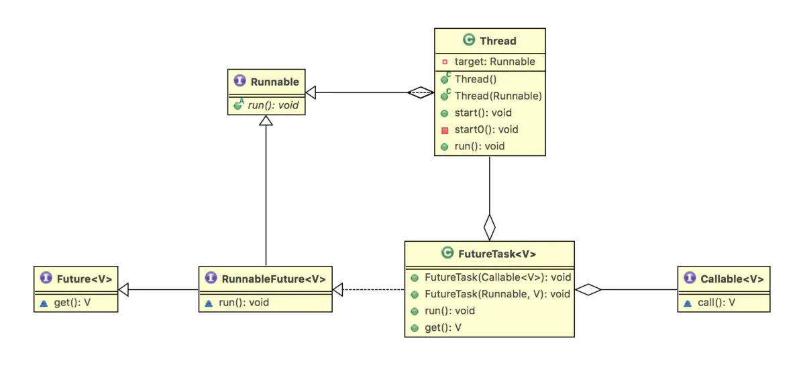


**无返回值**，run()返回为void

- 继承Thread类：**重写run()方法**
- 实现Runnable接口：如果自己的类已经extends另一个类，就无法直接**extends Thread**，此时，可以实现一个Runnable接口，**重写run方法**，实现Runnable接口的实现类的实例对象作为Thread构造函数的target


**有返回值**，通过Callable接口，就要实现call方法，这个方法的返回值是Object

- 实现**Callable**接口通过**FutureTask**包装器来创建Thread线程，调用Thread为
- 线程池，使用**ExecutorService**、Callable、Future实现有返回结果的多线程

### 3.1 线程启动原理


参考

> - https://www.jianshu.com/p/8c16aeea7e1a
> - https://www.cnblogs.com/xuyuanpeng/p/11050394.html


Java多线程，皆始于Thread。Thread是多线程的根，每一个线程的开启都始于Thread的`start()`方法


#### 3.1.1 start()方法源码

```java
 /**
     * Causes this thread to begin execution; the Java Virtual Machine
     * calls the <code>run</code> method of this thread.
     * 
     * 1、start方法将导致this thread开始执行。由JVM调用this thread的run方法。
     * 
     * The result is that two threads are running concurrently: the
     * current thread (which returns from the call to the
     * <code>start</code> method) and the other thread (which executes its
     * <code>run</code> method).
     * 
     * 2、结果是 调用start方法的当前线程 和 执行run方法的另一个线程 同时运行。
     * 
     * It is never legal to start a thread more than once.
     * In particular, a thread may not be restarted once it has completed
     * execution.
     *
     * 3、多次启动线程永远不合法。 特别是，线程一旦完成执行就不会重新启动。
     * 
     * @exception  IllegalThreadStateException  if the thread was already started.
     * 如果线程已启动，则抛出异常。
     * @see        #run()
     * @see        #stop()
     */
    public synchronized void start() {
        /**
         * This method is not invoked for the main method thread or "system"
         * group threads created/set up by the VM. Any new functionality added
         * to this method in the future may have to also be added to the VM.
         * 
         * 4、对于由VM创建/设置的main方法线程或“system”组线程，不会调用此方法。 
         *    未来添加到此方法的任何新功能可能也必须添加到VM中。
         * 
         * A zero status value corresponds to state "NEW".
         * 5、status=0 代表是 status 是 "NEW"。
         */
        if (threadStatus != 0)
            throw new IllegalThreadStateException();

        /* Notify the group that this thread is about to be started
         * so that it can be added to the group's list of threads
         * and the group's unstarted count can be decremented. 
         * 
         * 6、通知组该线程即将启动，以便将其添加到线程组的列表中，
         *    并且减少线程组的未启动线程数递减。
         * 
         * */
        group.add(this);

        boolean started = false;
        try {
            //7、调用native方法，底层开启异步线程，并调用run方法。
            start0();
            started = true;
        } finally {
            try {
                if (!started) {
                    group.threadStartFailed(this);
                }
            } catch (Throwable ignore) {
                /* do nothing. If start0 threw a Throwable then it will be passed up the call stack 
                 * 8、忽略异常。 如果start0抛出一个Throwable，它将被传递给调用堆栈。
                 */
            }
        }
    }

 //native方法，JVM创建并启动线程，并调用run方法
 private native void start0();
```


> - `start`方法用`synchronized`修饰，为`同步方法`；
> - 虽然为同步方法，但不能避免多次调用问题，用`threadStatus`来记录线程状态，如果线程被多次start会抛出异常；threadStatus的状态由JVM控制。
> - 使用`Runnable`时，主线程无法捕获子线程中的异常状态。线程的异常，应在线程内部解决。


#### 3.1.2 run()方法源码

```java
/**
     * If this thread was constructed using a separate
     * <code>Runnable</code> run object, then that
     * <code>Runnable</code> object's <code>run</code> method is called;
     * otherwise, this method does nothing and returns.
     * <p>
     * Subclasses of <code>Thread</code> should override this method.
     *
     * @see     #start()
     * @see     #stop()
     * @see     #Thread(ThreadGroup, Runnable, String)
     */
    @Override
    public void run() {
        if (target != null) {
            target.run();
        }
    }
```

run方法就很简单了，就是回调了Runable的run()接口。导致Thread写的@Overwrite void run() 方法直接是在主线程执行，导致阻塞了主线程。

到此我们就知道了，start会使重写的run方法被虚拟机调用，是在子线程中执行的run方法。而直接调用线程的run方法，他是内部回调了run接口，导致直接执行了Runable.run的重写内容。相当于直接在主线程中执行。


### 3.2 为什么我们调⽤ start() ⽅法时会执⾏ run() ⽅法，为什么我们不能直接调⽤ run() ⽅法？

new ⼀个 Thread，线程进⼊了新建状态;调⽤ start() ⽅法，会启动⼀个线程并使线程进⼊了就绪状 态，当分配到时间⽚后就可以开始运⾏了。 start() 会执⾏线程的相应准备⼯作，然后⾃动执⾏ run() ⽅法的内容，这是真正的多线程⼯作。 ⽽直接执⾏ run() ⽅法，会把 run ⽅法当成⼀个 main 主线程下的普通⽅法去执⾏，并不会在某个线程中执⾏它，所以这并不是多线程⼯作。 总结： 调⽤ start ⽅法⽅可启动线程并使线程进⼊就绪状态，⽽ run ⽅法只是 thread 的⼀个普通 ⽅法调⽤，还是在主线程⾥执⾏。


### 3.3 继承Thread类创建线程

​	Thread类本质上是实现了Runnable接口的一个实例，代表一个线程的实例。启动线程的唯一方法就是通过Thread类的start()实例方法。start()方法是一个native方法，它将启动一个新线程，并执行run()方法。这种方式实现多线程很简单，通过自己的类直接extend Thread，并复写run()方法，就可以启动新线程并执行自己定义的run()方法。例如：

```java
public class MyThread extends Thread {  
　　public void run() {  
　　 System.out.println("MyThread.run()");  
　　}  
}  
 
MyThread myThread1 = new MyThread();  
MyThread myThread2 = new MyThread();  
myThread1.start();  
myThread2.start();
```

这种实现方式是显示的继承了Thread，但从类图中我们可以看到，Thread类本身就继承自Runnable，所以继承Thread的本质依然是实现Runnable接口定义的run方法。

需要注意的是继承Thread方式，target对象为null，重写了run方法，导致方式1中的Thread原生的run方法失效，因此并不会调用到target.run()的逻辑，而是直接调用子类重写的run方法。

因为java是单根继承，此方式一般不常用。


### 3.4 实现Runnable接口

实现run方法，接口的实现类的实例作为**Thread**的**target**作为参数传入带参的**Thread**构造函数，通过调用**start()**方法启动线程。适用于已经有继承的父类无法继承Thread类的时候

```java
public class ThreadDemo02 {
 
    public static void main(String[] args){ 
        System.out.println(Thread.currentThread().getName());
        Thread t1 = new Thread(new MyThread());
        t1.start(); 
    }
}
 
class MyThread implements Runnable{
    @Override
    public void run() {
        // TODO Auto-generated method stub
        System.out.println(Thread.currentThread().getName()+"-->我是通过实现接口的线程实现方式！");
    }   
}
```


### 3.5 实现Callable接口通过FutureTask包装器来创建Thread线程

- 创建Callable接口的实现类 ，并实现Call方法 
- 创建Callable实现类的实现，使用FutureTask类包装Callable对象，该FutureTask对象封装了Callable对象的Call方法的返回值 
- 使用FutureTask对象作为Thread对象的target创建并启动线程 
- 调用FutureTask对象的get()来获取子线程执行结束的返回值

```java
public class DemoCallable implements Callable<String>{
    @Override
    public String call() throws Exception {
        // TODO Auto-generated method stub
        return null;
    }
    
    public static void main(String[] args) throws Exception {
        DemoCallable c = new DemoCallable();
        FutureTask<String> future = new FutureTask<>(c); 
        Thread t = new Thread(future);
        t.start();
        ...
        String result = future.get(); //同步获取返回结果
        System.out.println(result);
    }
}
```

这个方法里，明明没有看到run方法，没有看到Runnable，为什么说本质也是实现Runnable接口呢？

回看开篇的类图，`FutureTask`实现了`RunnableFuture`，`RunnableFuture`则实现了`Runnable`和`Future`两个接口。因此构造Thread时，`FutureTask`还是被转型为`Runnable`使用。**因此其本质还是实现Runnable接口。**


### 3.6 通过线程池创建线程

ExecutorService、Callable都是属于Executor框架。返回结果的线程是在JDK1.5中引入的新特征，还有Future接口也是属于这个框架，有了这种特征得到返回值就很方便了。 
通过分析可以知道，他同样也是实现了Callable接口，实现了Call方法，所以有返回值。这也就是正好符合了前面所说的两种分类

执行Callable任务后，可以获取一个Future的对象，在该对象上调用get就可以获取到Callable任务返回的Object了。get方法是阻塞的，即：线程无返回结果，get方法会一直等待。

```java
public class ThreadDemo05{
 
    private static int POOL_NUM = 10;     //线程池数量
 
    /**
     * @param args
     * @throws InterruptedException 
     */
    public static void main(String[] args) throws InterruptedException {
        // TODO Auto-generated method stub
        ExecutorService executorService = Executors.newFixedThreadPool(5);  
        for(int i = 0; i<POOL_NUM; i++)  
        {  
            RunnableThread thread = new RunnableThread();
 
            //Thread.sleep(1000);
            executorService.execute(thread);  
        }
        //关闭线程池
        executorService.shutdown(); 
    }   
 
}
 
class RunnableThread implements Runnable  
{     
    @Override
    public void run()  
    {  
        System.out.println("通过线程池方式创建的线程：" + Thread.currentThread().getName() + " ");  
 
    }  
}  
```


## 4. 线程的⽣命周期和状态?

Java 线程在运⾏的⽣命周期中的指定时刻只可能处于下⾯ 6 种不同状态的其中⼀个状态（图源《Java 并发编程艺术》4.1.4 节）。


线程在⽣命周期中并不是固定处于某⼀个状态⽽是随着代码的执⾏在不同状态之间切换。Java 线程状 态变迁如下图所示（图源《Java 并发编程艺术》4.1.4 节）：

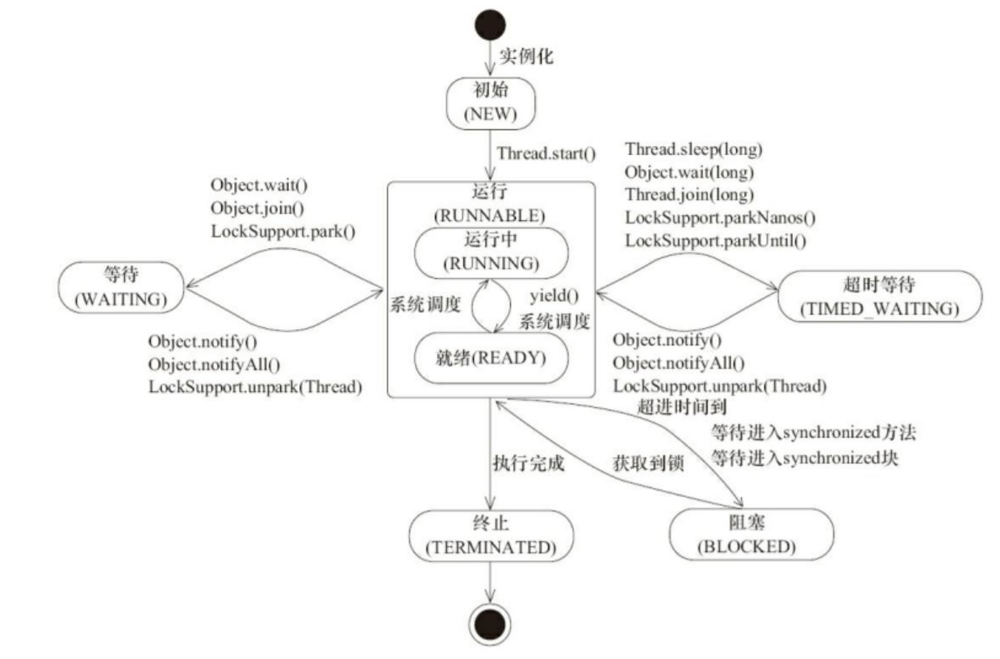


由上图可以看出：线程创建之后它将处于 **NEW（新建） 状态**，**调⽤ start() ⽅法后开始运⾏**，线程 这时候处于 **READY（可运⾏） 状态**。可运⾏状态的线程获得了 **CPU 时间⽚（timeslice）**后就处于 **RUNNING（运⾏）** 状态。


当线程执⾏ wait() ⽅法之后，线程进⼊ WAITING（等待） 状态。进⼊等待状态的线程需要依靠其他 线程的通知才能够返回到运⾏状态，⽽ TIME_WAITING(超时等待) 状态相当于在等待状态的基础上增加 了超时限制，⽐如通过 sleep（long millis） ⽅法或 wait（long millis） ⽅法可以将 Java 线程置于 TIMED WAITING 状态。当超时时间到达后 Java 线程将会返回到 RUNNABLE 状态。当线程调 ⽤同步⽅法时，在没有获取到锁的情况下，线程将会进⼊到 BLOCKED（阻塞） 状态。线程在执⾏ Runnable 的 run() ⽅法之后将会进⼊到 TERMINATED（终⽌） 状态。


## 5. 什么是上下文切换?


- 多线程编程中⼀般线程的个数都⼤于 CPU 核⼼的个数，⽽⼀个 CPU 核⼼在任意时刻只能被⼀个线程使 ⽤，为了让这些线程都能得到有效执⾏，CPU 采取的策略是为每个线程分配时间⽚并轮转的形式。当⼀ 个线程的时间⽚⽤完的时候就会重新处于就绪状态让给其他线程使⽤，这个过程就属于⼀次上下⽂切 换。 
- 概括来说就是：当前任务在执⾏完 CPU 时间⽚切换到另⼀个任务之前会先保存⾃⼰的状态，以便下次 再切换回这个任务时，可以再加载这个任务的状态。**任务从保存到再加载的过程就是⼀次上下⽂切换**。 
- 上下⽂切换通常是计算密集型的。也就是说，它需要相当可观的处理器时间，在每秒⼏⼗上百次的切换 中，每次切换都需要纳秒量级的时间。所以，上下⽂切换对系统来说意味着消耗⼤量的 CPU 时间，事 实上，可能是操作系统中时间消耗最⼤的操作。 
- Linux 相⽐与其他操作系统（包括其他类 Unix 系统）有很多的优点，其中有⼀项就是，其上下⽂切换 和模式切换的时间消耗⾮常少。


## 6. 什么是线程死锁?如何避免死锁?


​		线程死锁描述的是这样⼀种情况：多个线程同时被阻塞，它们中的⼀个或者全部都在等待某个资源被释 放。由于线程被⽆限期地阻塞，因此程序不可能正常终⽌。 如下图所示，线程 A 持有资源 2，线程 B 持有资源 1，他们同时都想申请对⽅的资源，所以这两个线 程就会互相等待⽽进⼊死锁状态。


### 6.1 产⽣死锁必须具备以下四个条件


- **互斥条件：**该资源任意⼀个时刻只由⼀个线程占⽤。 
- **请求与保持条件：**⼀个进程因请求资源⽽阻塞时，对已获得的资源保持不放。
- **不剥夺条件：**线程已获得的资源在末使⽤完之前不能被其他线程强⾏剥夺，只有⾃⼰使⽤完毕后 才释放资源。 
- **循环等待条件：**若⼲进程之间形成⼀种头尾相接的循环等待资源关系。


### 6.2 如何避免线程死锁?

只要破坏产⽣死锁的四个条件中的其中⼀个就可以了


1. **破坏互斥条件 ：**这个条件我们没有办法破坏，因为我们⽤锁本来就是想让他们互斥的（临界资 源需要互斥访问）。 
2. **破坏请求与保持条件 ：**⼀次性申请所有的资源。
3. **破坏不剥夺条件 ：**占⽤部分资源的线程进⼀步申请其他资源时，如果申请不到，可以主动释放 它占有的资源。 
4. **破坏循环等待条件 ：**靠按序申请资源来预防。按某⼀顺序申请资源，释放资源则反序释放。破 坏循环等待条件。


## 7. 说说 sleep() ⽅法和 wait() ⽅法区别和共同点?


- 两者最主要的区别在于：**sleep ⽅法没有释放锁，⽽ wait ⽅法释放了锁 。** 
- 两者都可以暂停线程的执⾏。 Wait 通常被⽤于线程间交互/通信，sleep 通常被⽤于暂停执⾏。 
- wait() ⽅法被调⽤后，线程不会⾃动苏醒，需要别的线程调⽤同⼀个对象上的 notify() 或者 notifyAll() ⽅法。sleep() ⽅法执⾏完成后，线程会⾃动苏醒。或者可以使⽤ wait(long timeout)超时后线程会⾃动苏醒。


### 7.1 详细

1. 原理不同，**sleep（）方法是Thread类的静态方法**，是线程用来控制自身流程的，它会使此线程暂停执行一段时间，而把执行机会让给其他线程，等到计时时间一到，此线程会自动“苏醒”。例如，当线程执行报时功能时，每一秒钟打印一个时间，那么此时就需要在打印方法前面加上一个Sleep()方法，以便让自己每隔1s执行一次，该过程如同闹钟一样，**而wait（）方法是object类的方法，用于线程间的通信**，这个方法会使当前拥有该对象锁的进程等待，直到其它线程调用notify()方法（或notifyALL方法）时才“醒过来”，不过，开发人员也可以给它指定一个时间，自动“醒”过来。与wait()方法配套的方法还有notify（）方法和notifyALL()方法。
2. 对锁的处理机制不同，由于sleep（）方法的主要作用是让线程暂停执行一段时间，时间一到则自动恢复，不涉及线程间的通信，因此，调用sleep（）方法并不会释放锁， 而wait()方法则不同，当调用wan()方法后，线程会释放掉它所占用的锁，从而使线程所在对象中的其他synchronized数据可被别的线程使用。举个简单的例子，如果小明拿遥控器的期间，可以用自己的sleep()方法每隔10min调一次频道，而在这10min里，遥控器还在他的手里。
3. 使用的区域不同。由于wait()方法的特殊意义，因此，它必须放在同步控制方法或同步语句块中使用，而 sleep（）方法则可以放在任何地方使用。
   sleep（）方法必须捕获异常，而wait（）、notify（）以及notifyALL()不需要捕获异常，在sleep()的过程中，有可能被其他对象调用它的interrupt（），产生interruptException异常。
   由于sleep不会释放“锁标志”，容易导致死锁问题的发生，因此，一般情况下，不推荐使用sleep（）方法，而推荐使用wait（）方法。


new ⼀个 Thread，线程进⼊了新建状态;调⽤ start() ⽅法，会启动⼀个线程并使线程进⼊了就绪状 态，当分配到时间⽚后就可以开始运⾏了。 start() 会执⾏线程的相应准备⼯作，然后⾃动执⾏ run() ⽅法的内容，这是真正的多线程⼯作。 ⽽直接执⾏ run() ⽅法，会把 run ⽅法当成⼀个 main 线程下的普通⽅法去执⾏，并不会在某个线程中执⾏它，所以这并不是多线程⼯作。 总结： 调⽤ start ⽅法⽅可启动线程并使线程进⼊就绪状态，⽽ run ⽅法只是 thread 的⼀个普通 ⽅法调⽤，还是在主线程⾥执⾏。


## 9. synchronized 关键字

​		synchronized关键字解决的是多个线程之间访问资源的同步性，synchronized关键字可以保证被它修饰 的⽅法或者代码块在任意时刻只能有⼀个线程执⾏。另外，在 Java 早期版本中，synchronized属于重量级锁，效率低下，**因为监视器锁（monitor）是依 赖于底层的操作系统的 Mutex Lock 来实现的，Java 的线程是映射到操作系统的原⽣线程之上的**。如 果要挂起或者唤醒⼀个线程，都需要操作系统帮忙完成，⽽操作系统实现线程之间的切换时需要从⽤户 态转换到内核态，这个状态之间的转换需要相对⽐较⻓的时间，时间成本相对较⾼，这也是为什么早期 的 synchronized 效率低的原因。庆幸的是在 Java 6 之后 Java 官⽅对从 JVM 层⾯对synchronized 较⼤优化，所以现在的 synchronized 锁效率也优化得很不错了。JDK1.6对锁的实现引⼊了⼤量的优化，如**⾃旋锁、适应性⾃旋锁、锁消除、锁粗化、偏向锁、轻量级锁**等技术来减少锁操作的开销。


### 9.1 三种使用方式

- **修饰实例方法，**作用于当前对象实例加锁，进入同步代码前要获得当前对象实例的锁
- **修饰静态方法，**作用于当前类对象加锁，进入同步代码前要获得当前类对象的锁 。也就是给当前类加锁，会作
  用于类的所有对象实例，因为静态成员不属于任何一个实例对象，是类成员（ static 表明这是该类的一个静态
  资源，不管new了多少个对象，只有一份，所以对该类的所有对象都加了锁）。所以如果一个线程A调用一个实
  例对象的非静态 synchronized 方法，而线程B需要调用这个实例对象所属类的静态 synchronized 方法，是允
  许的，不会发生互斥现象，因为访问静态 synchronized 方法占用的锁是当前类的锁，而访问非静态
  synchronized 方法占用的锁是当前实例对象锁。
- **修饰代码块，**指定加锁对象，对给定对象加锁，进入同步代码库前要获得给定对象的锁。 和 synchronized 方
  法一样，synchronized(this)代码块也是锁定当前对象的。synchronized 关键字加到 static 静态方法和
  synchronized(class)代码块上都是是给 Class 类上锁。这里再提一下：synchronized关键字加到非 static 静态
  方法上是给对象实例上锁。


### 9.2 synchronized底层实现


#### 9.2.1 synchronized 同步语句块的情况

```java
public class SynchronizedDemo {
 public void method() {
 synchronized (this) {
 System.out.println("synchronized 代码块");
 }
 }
}
```


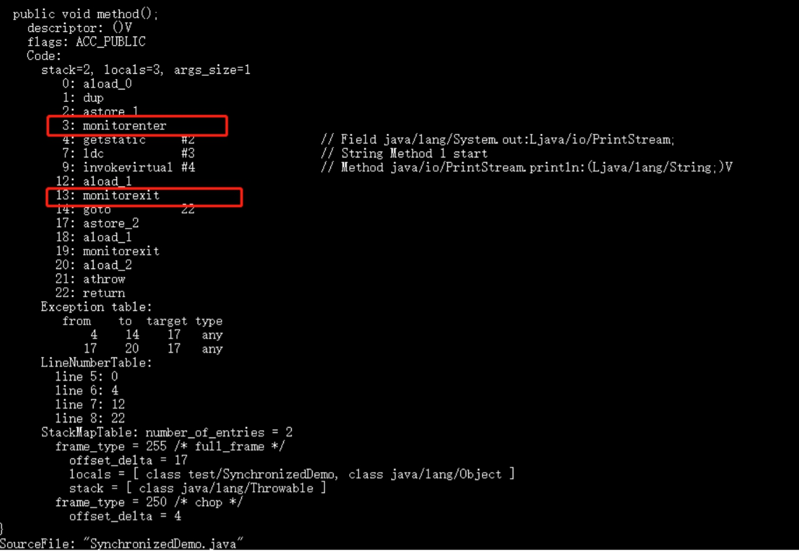


​		synchronized 同步语句块的实现使⽤的是 **monitorenter** 和 **monitorexit** 指令，其中 **monitorenter** 指令指向同步代码块的开始位置，**monitorexit** 指令则指明同步代码块的结束位置。 当执⾏ monitorenter 指令时，线程试图获取锁也就是获取 monitor(**monitor对象存在于每个Java对象的对象 头中，synchronized 锁便是通过这种⽅式获取锁的，也是为什么Java中任意对象可以作为锁的原因**) 的持有权。当计数器为0则可以成功获取，获取后将锁计数器设为1也就是加1。相应的在执⾏ monitorexit 指令后，将锁计数器设为0，表明锁被释放。如果获取对象锁失败，那当前线程就要阻塞 等待，直到锁被另外⼀个线程释放为⽌。


#### 9.2.2 synchronized 修饰⽅法的的情况

```java
public class SynchronizedDemo2 {
 public synchronized void method() {
 System.out.println("synchronized ⽅法");
 }
}
```

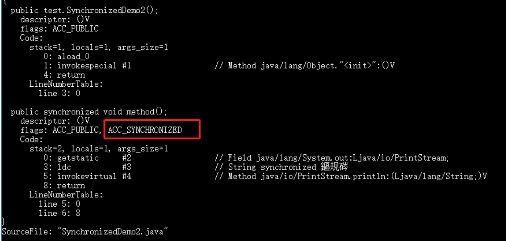


​		synchronized 修饰的⽅法并没有 monitorenter 指令和 monitorexit 指令，取得代之的确实是 ACC_SYNCHRONIZED 标识，该标识指明了该⽅法是⼀个同步⽅法，**JVM 通过该 ACC_SYNCHRONIZED 访问 标志来辨别⼀个⽅法是否声明为同步⽅法**，从⽽执⾏相应的同步调⽤。


### 9.3 说说 JDK1.6 之后的synchronized 关键字底层做了哪些优化，可以详细介绍⼀下这些优化吗

参考

> - https://gitee.com/SnailClimb/JavaGuide/blob/master/docs/java/Multithread/synchronized.md


​		JDK1.6 对锁的实现引入了大量的优化，如**偏向锁、轻量级锁、自旋锁、适应性自旋锁、锁消除、锁粗化**等技术来减少锁操作的开销。

锁主要存在四中状态，依次是：

- **无锁状态**
- **偏向锁状态**
- **轻量级锁状态**
- **重量级锁状态**

他们会随着竞争的激烈而逐渐升级。注意锁可以升级不可降级，这种策略是为了提高获得锁和释放锁的效率。


#### ①偏向锁

**引入偏向锁的目的和引入轻量级锁的目的很像，他们都是为了没有多线程竞争的前提下，减少传统的重量级锁使用操作系统互斥量产生的性能消耗。但是不同是：轻量级锁在无竞争的情况下使用 CAS 操作去代替使用互斥量。而偏向锁在无竞争的情况下会把整个同步都消除掉**。

偏向锁的“偏”就是偏心的偏，它的意思是会偏向于第一个获得它的线程，如果在接下来的执行中，该锁没有被其他线程获取，那么持有偏向锁的线程就不需要进行同步！关于偏向锁的原理可以查看《深入理解Java虚拟机：JVM高级特性与最佳实践》第二版的13章第三节锁优化。

但是对于锁竞争比较激烈的场合，偏向锁就失效了，因为这样场合极有可能每次申请锁的线程都是不相同的，因此这种场合下不应该使用偏向锁，否则会得不偿失，需要注意的是，偏向锁失败后，并不会立即膨胀为重量级锁，而是先升级为轻量级锁。


#### ② 轻量级锁

倘若偏向锁失败，虚拟机并不会立即升级为重量级锁，它还会尝试使用一种称为轻量级锁的优化手段(1.6之后加入的)。**轻量级锁不是为了代替重量级锁，它的本意是在没有多线程竞争的前提下，减少传统的重量级锁使用操作系统互斥量产生的性能消耗，因为使用轻量级锁时，不需要申请互斥量。另外，轻量级锁的加锁和解锁都用到了CAS操作。** 关于轻量级锁的加锁和解锁的原理可以查看《深入理解Java虚拟机：JVM高级特性与最佳实践》第二版的13章第三节锁优化。

**轻量级锁能够提升程序同步性能的依据是“对于绝大部分锁，在整个同步周期内都是不存在竞争的”，这是一个经验数据。如果没有竞争，轻量级锁使用 CAS 操作避免了使用互斥操作的开销。但如果存在锁竞争，除了互斥量开销外，还会额外发生CAS操作，因此在有锁竞争的情况下，轻量级锁比传统的重量级锁更慢！如果锁竞争激烈，那么轻量级将很快膨胀为重量级锁！**


#### ③ 自旋锁和自适应自旋

轻量级锁失败后，虚拟机为了避免线程真实地在操作系统层面挂起，还会进行一项称为自旋锁的优化手段。

互斥同步对性能最大的影响就是阻塞的实现，因为挂起线程/恢复线程的操作都需要转入内核态中完成（用户态转换到内核态会耗费时间）。

**一般线程持有锁的时间都不是太长，所以仅仅为了这一点时间去挂起线程/恢复线程是得不偿失的。** 所以，虚拟机的开发团队就这样去考虑：“我们能不能让后面来的请求获取锁的线程等待一会而不被挂起呢？看看持有锁的线程是否很快就会释放锁”。**为了让一个线程等待，我们只需要让线程执行一个忙循环（自旋），这项技术就叫做自旋**。

百度百科对自旋锁的解释：

> 何谓自旋锁？它是为实现保护共享资源而提出一种锁机制。其实，自旋锁与互斥锁比较类似，它们都是为了解决对某项资源的互斥使用。无论是互斥锁，还是自旋锁，在任何时刻，最多只能有一个保持者，也就说，在任何时刻最多只能有一个执行单元获得锁。但是两者在调度机制上略有不同。对于互斥锁，如果资源已经被占用，资源申请者只能进入睡眠状态。但是自旋锁不会引起调用者睡眠，如果自旋锁已经被别的执行单元保持，调用者就一直循环在那里看是否该自旋锁的保持者已经释放了锁，"自旋"一词就是因此而得名。

自旋锁在 JDK1.6 之前其实就已经引入了，不过是默认关闭的，需要通过`--XX:+UseSpinning`参数来开启。JDK1.6及1.6之后，就改为默认开启的了。需要注意的是：自旋等待不能完全替代阻塞，因为它还是要占用处理器时间。如果锁被占用的时间短，那么效果当然就很好了！反之，相反！自旋等待的时间必须要有限度。如果自旋超过了限定次数任然没有获得锁，就应该挂起线程。**自旋次数的默认值是10次，用户可以修改`--XX:PreBlockSpin`来更改**。

另外,**在 JDK1.6 中引入了自适应的自旋锁。自适应的自旋锁带来的改进就是：自旋的时间不在固定了，而是和前一次同一个锁上的自旋时间以及锁的拥有者的状态来决定，虚拟机变得越来越“聪明”了**。


#### ④ 锁消除

锁消除理解起来很简单，它指的就是虚拟机即使编译器在运行时，如果检测到那些共享数据不可能存在竞争，那么就执行锁消除。锁消除可以节省毫无意义的请求锁的时间。


#### ⑤ 锁粗化

原则上，我们在编写代码的时候，总是推荐将同步块的作用范围限制得尽量小，——直在共享数据的实际作用域才进行同步，这样是为了使得需要同步的操作数量尽可能变小，如果存在锁竞争，那等待线程也能尽快拿到锁。

大部分情况下，上面的原则都是没有问题的，但是如果一系列的连续操作都对同一个对象反复加锁和解锁，那么会带来很多不必要的性能消耗。


### 9.4 Synchronized 和 ReenTrantLock 的对比


#### ① 两者都是可重入锁

两者都是可重入锁。“可重入锁”概念是：自己可以再次获取自己的内部锁。比如一个线程获得了某个对象的锁，此时这个对象锁还没有释放，当其再次想要获取这个对象的锁的时候还是可以获取的，如果不可锁重入的话，就会造成死锁。同一个线程每次获取锁，锁的计数器都自增1，所以要等到锁的计数器下降为0时才能释放锁。


#### ② synchronized 依赖于 JVM 而 ReenTrantLock 依赖于 API

synchronized 是依赖于 JVM 实现的，前面我们也讲到了 虚拟机团队在 JDK1.6 为 synchronized 关键字进行了很多优化，但是这些优化都是在虚拟机层面实现的，并没有直接暴露给我们。ReenTrantLock 是 JDK 层面实现的（也就是 API 层面，需要 lock() 和 unlock 方法配合 try/finally 语句块来完成），所以我们可以通过查看它的源代码，来看它是如何实现的。


#### ③ ReenTrantLock 比 synchronized 增加了一些高级功能

相比synchronized，ReenTrantLock增加了一些高级功能。主要来说主要有三点：

> 1. 等待可中断
> 2. 可指定公平和非公平锁
> 3. 可实现选择性通知（锁可以绑定多个条件）


::: info ReenTrantLock 比 synchronized 增加了一些高级功能


- **ReenTrantLock提供了一种能够中断等待锁的线程的机制**，通过**lock.lockInterruptibly()**来实现这个机制。也就是说正在等待的线程可以选择放弃等待，改为处理其他事情。
- **ReenTrantLock可以指定是公平锁还是非公平锁。而synchronized只能是非公平锁。所谓的公平锁就是先等待的线程先获得锁。** ReenTrantLock默认情况是非公平的，可以通过 ReenTrantLock类的`ReentrantLock(boolean fair)`构造方法来制定是否是公平的。
- **synchronized关键字与wait()和notify/notifyAll()方法相结合可以实现等待/通知机制**，ReentrantLock类当然也可以实现，但是需要借助于Condition接口与newCondition() 方法。Condition是JDK1.5之后才有的，它具有很好的灵活性，比如可以实现多路通知功能也就是在一个Lock对象中可以创建多个Condition实例（即对象监视器），**线程对象可以注册在指定的Condition中，从而可以有选择性的进行线程通知，在调度线程上更加灵活。 在使用notify/notifyAll()方法进行通知时，被通知的线程是由 JVM 选择的，用ReentrantLock类结合Condition实例可以实现“选择性通知”** ，这个功能非常重要，而且是Condition接口默认提供的。而synchronized关键字就相当于整个Lock对象中只有一个Condition实例，所有的线程都注册在它一个身上。如果执行notifyAll()方法的话就会通知所有处于等待状态的线程这样会造成很大的效率问题，而Condition实例的signalAll()方法 只会唤醒注册在该Condition实例中的所有等待线程。

如果你想使用上述功能，那么选择ReenTrantLock是一个不错的选择。

**synchronized 异常就会释放锁，而 ReenTrantLock 异常需要在 finally 里 unlock**


:::


#### ④ 性能已不是选择标准

​		在JDK1.6之前，synchronized 的性能是比 ReenTrantLock 差很多。**具体表示为：synchronized 关键字吞吐量随线程数的增加，下降得非常严重。而ReenTrantLock 基本保持一个比较稳定的水平**。我觉得这也侧面反映了， synchronized 关键字还有非常大的优化余地。后续的技术发展也证明了这一点，我们上面也讲了在 JDK1.6 之后 JVM 团队对 synchronized 关键字做了很多优化。**JDK1.6 之后，synchronized 和 ReenTrantLock 的性能基本是持平了。所以网上那些说因为性能才选择 ReenTrantLock 的文章都是错的！JDK1.6之后，性能已经不是选择synchronized和ReenTrantLock的影响因素了！而且虚拟机在未来的性能改进中会更偏向于原生的synchronized，所以还是提倡在synchronized能满足你的需求的情况下，优先考虑使用synchronized关键字来进行同步！优化后的synchronized和ReenTrantLock一样，在很多地方都是用到了CAS操作**。


## 10. volatile关键字

参考

> - [Java并发编程：volatile关键字解析](https://www.cnblogs.com/dolphin0520/p/3920373.html)
> - [Java面试官最常问的volatile关键字](https://www.cnblogs.com/java1024/p/9031560.html)


### 10.1 两大特性

- 保证了不同线程对该变量操作的**内存可见性**
- 禁止指令重排序


### 10.2 Java内存模型与volatile

​		在 **JDK1.2** 之前，Java的内存模型实现总是从主存（即共享内存）读取变量，是不需要进⾏特别的注意 的。⽽在当前的 Java 内存模型下，线程可以把变量保存本地内存（⽐如机器的寄存器）中，⽽不是直 接在主存中进⾏读写。**这就可能造成⼀个线程在主存中修改了⼀个变量的值，⽽另外⼀个线程还继续使 ⽤它在寄存器中的变量值的拷⻉，造成数据的不⼀致**。


要解决这个问题，就需要把变量声明为**volatile**，这就指示 JVM，这个变量是不稳定的，每次使⽤它都 到主存中进⾏读取。 说⽩了， **volatile 关键字的主要作⽤就是保证变量的可⻅性然后还有⼀个作⽤是防⽌指令重排序。**

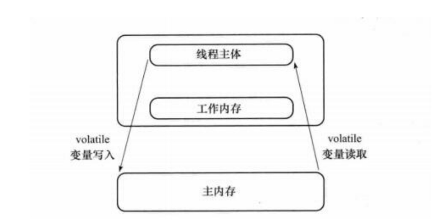


### 10.3 并发编程的三个重要特性

1. **原⼦性 :** ⼀个的操作或者多次操作，要么所有的操作全部都得到执⾏并且不会收到任何因素的 ⼲扰⽽中断，要么所有的操作都执⾏，要么都不执⾏。 **synchronized 可以保证代码⽚段的原⼦性。** 
2. **可⻅性 ：**当⼀个变量对共享变量进⾏了修改，那么另外的线程都是⽴即可以看到修改后的最新 值。 **volatile 关键字可以保证共享变量的可⻅性。**
3. **有序性 ：**代码在执⾏的过程中的先后顺序，Java 在编译器以及运⾏期间的优化，代码的执⾏顺序未必就是编写代码时候的顺序。 **volatile 关键字可以禁⽌指令进⾏重排序优化。**


### 10.4 内存可见性

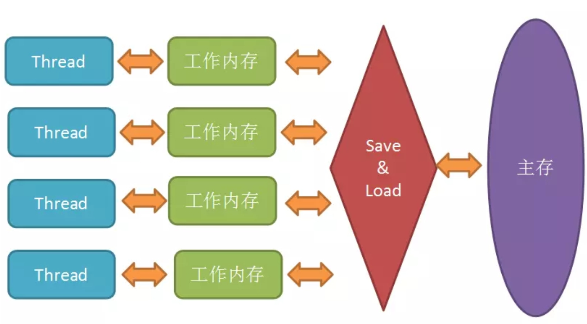


## 11. synchronized | volatile 关键字的区别


- volatile关键字是线程同步的轻量级实现，所以volatile性能肯定⽐synchronized关键字要好。 **但是volatile关键字只能⽤于变量⽽synchronized关键字可以修饰⽅法以及代码块。** synchronized关键字在JavaSE1.6之后进⾏了主要包括为了减少获得锁和释放锁带来的性能消耗 ⽽引⼊的偏向锁和轻量级锁以及其它各种优化之后执⾏效率有了显著提升，实际开发中使⽤ synchronized 关键字的场景还是更多⼀些。 
- **多线程访问volatile关键字不会发⽣阻塞，⽽synchronized关键字可能会发⽣阻塞** 
- **volatile关键字能保证数据的可⻅性，但不能保证数据的原⼦性。synchronized关键字两者都能 保证。** 
- **volatile关键字主要⽤于解决变量在多个线程之间的可⻅性，⽽ synchronized关键字解决的是 多个线程之间访问资源的同步性。**


## 12. Java线程池


### 12.1 好处

- 降低资源消耗。通过重复利⽤已创建的线程降低线程创建和销毁造成的消耗。 
- 提⾼响应速度。当任务到达时，任务可以不需要的等到线程创建就能⽴即执⾏。 
- 提⾼线程的可管理性。线程是稀缺资源，如果⽆限制的创建，不仅会消耗系统资源，还会降低系 统的稳定性，使⽤线程池可以进⾏统⼀的分配，调优和监控。


### 12.2 创建线程池


参考

> - https://www.cnblogs.com/teach/p/10903164.html


《阿⾥巴巴Java开发⼿册》中强制**线程池不允许使⽤ Executors 去创建**，⽽是通过 **ThreadPoolExecutor** 的⽅式，这样的处理⽅式让写的同学更加明确线程池的运⾏规则，规避资源耗尽的⻛险


#### 12.2.1 Executors创建线程池弊端


- **FixedThreadPool** 和 **SingleThreadExecutor** ： 允许请求的队列⻓度为 **Integer.MAX_VALUE** ，可能堆积⼤量的请求，从⽽导致OOM。 
- **CachedThreadPool** 和 **ScheduledThreadPool** ： 允许创建的线程数量为 **Integer.MAX_VALUE** ，可能会创建⼤量线程，从⽽导致OOM。


#### 12.2.2 第一种方式：ThreadPoolExecutor的方式


```java
public ThreadPoolExecutor(int corePoolSize,
                              int maximumPoolSize,
                              long keepAliveTime,
                              TimeUnit unit,
                              BlockingQueue<Runnable> workQueue) {
        this(corePoolSize, maximumPoolSize, keepAliveTime, unit, workQueue,
             Executors.defaultThreadFactory(), defaultHandler);
    }
```


在这个方法中调用了另外的一个构造方法，即上图中四个构造方法中的第四个，从源码中得知，一个线程池包含的属性共有corePoolSize、maximumPoolSize、keepAliveTime、unit、workQueue、threadFactory、handler七个


需要传入的参数说明

| 序号 | 名称            | 类型                      | 含义                       |
| ---- | --------------- | ------------------------- | -------------------------- |
| 1    | corePoolSize    | int                       | 线程池的核心线程数         |
| 2    | maximumPoolSize | int                       | 线程池的最大线程数         |
| 3    | keepAliveTime   | long                      | 线程池空闲时线程的存活时长 |
| 4    | unit            | TimeUnit                  | 线程存活时长时间单位       |
| 5    | workQueue       | BlockingQueue\<Runnable\> | 线程等待队列               |
| 6    | threadFactory   | ThreadFactory             | 线程池创建线程的工厂       |
| 7    | handler         | RejectedExecutionHandler  | 拒绝策略                   |

- **handler**：在队列（workQueue）和线程池达到最大线程数（maximumPoolSize）均满时仍有任务的情况下的处理方式；


::: info 规则

- 线程池的线程数量长期维持在 `corePoolSize` 个（核心线程数量）
- 线程池的线程数量最大可以扩展到 `maximumPoolSize` 个
- 在 `corePoolSize` ~ `maximumPoolSize` 这个区间的线程，一旦空闲超过`keepAliveTime`时间，就会被杀掉（时间单位）
- 送来工作的线程数量超过最大数以后，送到 `workQueue` 里面待业
- 待业队伍也满了，就按照事先约定的策略 `RejectedExecutionHandler` 给拒绝掉

:::


我们再来看中间的两个构造方法，和第一个的区别在于，**第二个和第三个指定了创建线程的工厂和线程池满时的处理策略。**


#### 12.2.3 第二种方式：通过Executor 框架的⼯具类Executors来实现

> - **FixedThreadPool** ： 该⽅法返回⼀个固定线程数量的线程池。该线程池中的线程数量始终不 变。当有⼀个新的任务提交时，线程池中若有空闲线程，则⽴即执⾏。若没有，则新的任务会被 暂存在⼀个任务队列中，待有线程空闲时，便处理在任务队列中的任务。 
> - **SingleThreadExecutor**： ⽅法返回⼀个只有⼀个线程的线程池。若多余⼀个任务被提交到该线 程池，任务会被保存在⼀个任务队列中，待线程空闲，按先⼊先出的顺序执⾏队列中的任务。 
>
> - **CachedThreadPool**： 该⽅法返回⼀个可根据实际情况调整线程数量的线程池。线程池的线程数 量不确定，但若有空闲线程可以复⽤，则会优先使⽤可复⽤的线程。若所有线程均在⼯作，⼜有 新的任务提交，则会创建新的线程处理任务。所有线程在当前任务执⾏完毕后，将返回线程池进 ⾏复⽤。

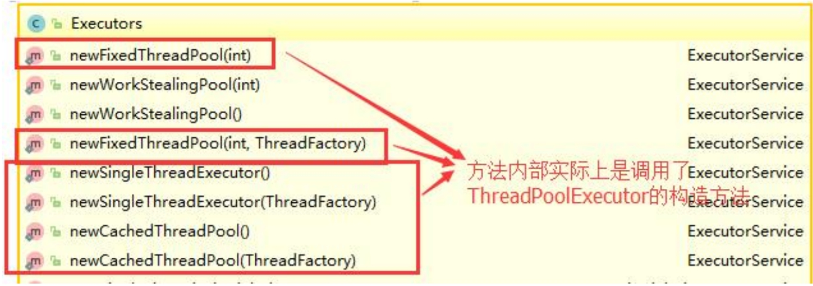


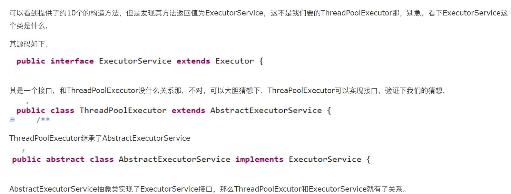


```java
public static ExecutorService newFixedThreadPool(int nThreads) {
        return new ThreadPoolExecutor(nThreads, nThreads,
                                      0L, TimeUnit.MILLISECONDS,
                                      new LinkedBlockingQueue<Runnable>());
    }
```

从上面的代码中可以看出，其返回的是**ThreaPoolExecutor**对象，调用的是ThreaPoolExecutor类四个构造方法中的第一个。

 

总结，上面两种创建线程池的方式，其本质都是通过**ThreaPoolExecutor**类的构造方法的方式，所以**ThreaPoolExecutor**是重点。


### 12.3 ThreadPoolExecutor 类分析

参考

> - https://www.jianshu.com/p/c41e942bcd64

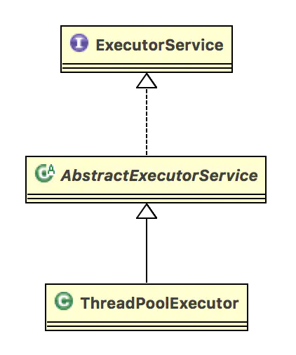

​		当在execute(Runnable)方法中提交新任务并且少于corePoolSize线程正在运行时，即使其他工作线程处于空闲状态，也会创建一个新线程来处理该请求。 如果有多于corePoolSize但小于maximumPoolSize线程正在运行，则仅当队列已满时才会创建新线程。 通过设置corePoolSize和maximumPoolSize相同，您可以创建一个固定大小的线程池。 通过将maximumPoolSize设置为基本上无界的值，例如Integer.MAX_VALUE，您可以允许池容纳任意数量的并发任务。 通常，核心和最大池大小仅在构建时设置，但也可以使用`setCorePoolSize`和`setMaximumPoolSize`进行动态更改。


### 12.4 拒绝策略


::: tips 参考

- https://www.jianshu.com/p/f0506e098c5b

:::


所有拒绝策略都实现了接口`RejectedExecutionHandler`

```java
public interface RejectedExecutionHandler {

    /**
     * @param r the runnable task requested to be executed
     * @param executor the executor attempting to execute this task
     * @throws RejectedExecutionException if there is no remedy
     */
    void rejectedExecution(Runnable r, ThreadPoolExecutor executor);
}
```

> 这个接口只有一个 rejectedExecution 方法。
>
> r 为待执行任务；executor 为线程池；方法可能会抛出拒绝异常。


| 拒绝策略             | 说明                                       |
| -------------------- | ------------------------------------------ |
| AbortPolicy          | 直接抛出拒绝异常（默认策略）               |
| CallerRunsPolicy     | 在调用者线程中，运行当前被丢弃的任务。     |
| DiscardOledestPolicy | 丢弃队列中最老的，然后再次尝试提交新任务。 |
| DiscardPolicy        | 默默丢弃无法加载的任务。                   |


#### 12.4.1 AbortPolicy（默认策略）

直接抛出拒绝异常（继承自RuntimeException），会中断调用者的处理过程，所以除非有明确需求，一般不推荐

```java
public static class AbortPolicy implements RejectedExecutionHandler {
    public void rejectedExecution(Runnable r, ThreadPoolExecutor e) {
        throw new RejectedExecutionException("Task " + r.toString() +
                                             " rejected from " +
                                             e.toString());
    }
}
```


#### 12.4.2 CallerRunsPolicy

在调用者线程中（也就是说谁把 r 这个任务甩来的），运行当前被丢弃的任务。

只会用调用者所在线程来运行任务，也就是说任务不会进入线程池。

如果线程池已经被关闭，则直接丢弃该任务。

```java
public static class CallerRunsPolicy implements RejectedExecutionHandler {
    public void rejectedExecution(Runnable r, ThreadPoolExecutor e) {
        if (!e.isShutdown()) {
            r.run();
        }
    }
}
```


#### 12.4.3 DiscardOledestPolicy

丢弃队列中最老的，然后再次尝试提交新任务。

```java
public static class DiscardOldestPolicy implements RejectedExecutionHandler {
    public void rejectedExecution(Runnable r, ThreadPoolExecutor e) {
        if (!e.isShutdown()) {
            e.getQueue().poll();
            e.execute(r);
        }
    }
}
```

这里 e.getQueue() 是获得待执行的任务队列，也就是前面提到的待业队列。

因为是队列，所以先进先出，一个poll()方法就能直接把队列中最老的抛弃掉，再次尝试执行execute(r)。

这个队列在线程池定义的时候就能看到，是一个阻塞队列

```java
    /**
     * The queue used for holding tasks and handing off to worker
     * threads.  We do not require that workQueue.
     */     
    private final BlockingQueue<Runnable> workQueue;

    public BlockingQueue<Runnable> getQueue() {
        return workQueue;
    }
```


#### 12.4.4 DiscardPolicy

默默丢弃无法加载的任务。

这个代码就很简单了，真的是啥也没做

```java
public static class DiscardPolicy implements RejectedExecutionHandler {
    public void rejectedExecution(Runnable r, ThreadPoolExecutor e) {
    }
}
```


#### 12.4.5 自定义

通过实现 `RejectedExecutionHandler` 接口扩展

jdk内置的四种拒绝策略（都在ThreadPoolExecutor.java里面）代码都很简洁易懂。

我们只要继承接口都可以根据自己需要自定义拒绝策略。下面看两个例子。

一是netty自己实现的线程池里面私有的一个拒绝策略。单独启动一个新的临时线程来执行任务。

```java
private static final class NewThreadRunsPolicy implements RejectedExecutionHandler {
    public void rejectedExecution(Runnable r, ThreadPoolExecutor executor) {
        try {
            final Thread t = new Thread(r, "Temporary task executor");
            t.start();
        } catch (Throwable e) {
            throw new RejectedExecutionException(
                "Failed to start a new thread", e);
        }
    }
}
```


另外一个是dubbo的一个例子，它直接继承的 AbortPolicy ，加强了日志输出，并且输出dump文件

```java
public class AbortPolicyWithReport extends ThreadPoolExecutor.AbortPolicy {

    @Override
    public void rejectedExecution(Runnable r, ThreadPoolExecutor e) {
        String msg = String.format("Thread pool is EXHAUSTED!" +
                        " Thread Name: %s, Pool Size: %d (active: %d, core: %d, max: %d, largest: %d), Task: %d (completed: %d)," +
                        " Executor status:(isShutdown:%s, isTerminated:%s, isTerminating:%s), in %s://%s:%d!",
                threadName, e.getPoolSize(), e.getActiveCount(), e.getCorePoolSize(), e.getMaximumPoolSize(), e.getLargestPoolSize(),
                e.getTaskCount(), e.getCompletedTaskCount(), e.isShutdown(), e.isTerminated(), e.isTerminating(),
                url.getProtocol(), url.getIp(), url.getPort());
        logger.warn(msg);
        dumpJStack();
        throw new RejectedExecutionException(msg);
    }
}

```


### 12.5 线程池执行流程


## 13. java.util.concurrent

参考

> - https://blog.csdn.net/starbxx/article/details/95333992
> - [Jakob Jenkov博客](http://tutorials.jenkov.com/java-util-concurrent/index.html)
> - [Jakob Jenkov博客中文翻译](https://blog.csdn.net/defonds/article/details/44021605)
> - [java并发包java.util.concurrent详解博客导航](https://blog.csdn.net/dichengyan0013/article/details/102347395?utm_medium=distribute.pc_relevant.none-task-blog-BlogCommendFromMachineLearnPai2-2.channel_param&depth_1-utm_source=distribute.pc_relevant.none-task-blog-BlogCommendFromMachineLearnPai2-2.channel_param)


`java.util.concurrent` 是在`并发编程`中很常用的实用工具类，称为`JUC`，在`JDK5`中开始发布


在java.util下的集合都是发生`fail-fast`，而在java.util.concurrent下的发生的都是`fail-safe`


### 线程池相关类


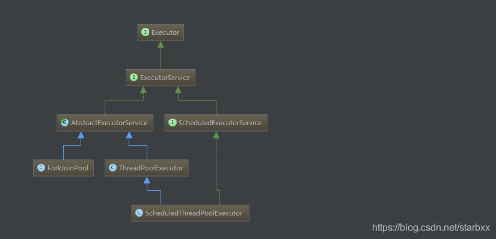


### 阻塞队列相关类


### ConcurrentMap类

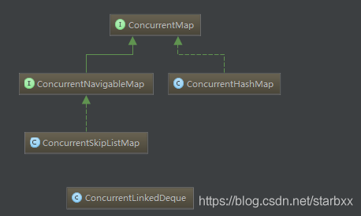


### 多线程其他类


### CAS

参考

> - https://blog.csdn.net/v123411739/article/details/79561458
> - https://www.jianshu.com/p/ab2c8fce878b


#### 概述

`CAS（Compare-and-Swap）`，即比较并替换，是一种实现并发算法时常用到的技术，Java并发包中的很多类都使用了`CAS`技术。CAS是一种`无锁算法`，CAS有3个操作数

> - 内存值V
> - 旧的预期值A
> - 要修改的新值B。


当且仅当`预期值A`和`内存值V`相同时(说明此时内存中的值没有被其他线程改变)，将`内存值V`修改为`B`，否则什么都不做。


CAS比较与交换的伪代码可以表示为：

> do{
>
> ​	备份旧数据；
>
> ​	基于旧数据构造新数据；
>
> }while(!CAS( 内存地址，备份的旧数据，新数据 ))


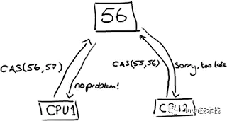


参考`getAndAddInt`方法源码

```java
    public final int getAndAddInt(Object var1, long var2, int var4) {
        int var5;
        do {
            var5 = this.getIntVolatile(var1, var2);
        } while(!this.compareAndSwapInt(var1, var2, var5, var5 + var4));

        return var5;
    }
```


注：t1，t2线程是同时更新`同一变量56的值`

因为t1和t2线程都同时去访问`同一变量56`，所以他们会把**主内存的值完全拷贝一份到自己的工作内存空间**，所以t1和t2线程的预期值都为`56`。

假设t1在与t2线程竞争中线程t1能去更新变量的值，而其他线程都失败。（失败的线程并不会被挂起，而是被告知这次竞争中失败，并可以再次发起尝试）。t1线程去更新变量值改为57，然后写到内存中。此时对于t2来说，内存值变为了57，与预期值56不一致，就操作失败了（想改的值不再是原来的值）。

（上图通俗的解释是：CPU去更新一个值，但如果想改的值不再是原来的值，操作就失败，因为很明显，有其它操作先改变了这个值。）


就是指当两者进行比较时

> - 如果相等，则证明共享数据没有被修改，替换成新值，然后继续往下运行；
> - 如果不相等，说明共享数据已经被修改，放弃已经所做的操作，然后重新执行刚才的操作。


容易看出 CAS 操作是基于共享数据不会被修改的假设，采用了类似于数据库的`commit-retry` 的模式。当同步冲突出现的机会很少时，这种假设能带来较大的性能提升。


#### 使用例子/源码

创建一个`AtomicInteger`类型来测试多线程多同一个变量的自增操作

```java
    public static AtomicInteger race = new AtomicInteger(0);

    public static void increase() {
        /*race++;并非原子操作，经过下面三个步骤，取值，+1，写值*/
        race.getAndIncrement();
    }
```


getAndIncrement()源码

```java
    public final int getAndIncrement() {
        return unsafe.getAndAddInt(this, valueOffset, 1);
    }
```


getAndAddInt源码

```java
    public final int getAndAddInt(Object var1, long var2, int var4) {
        int var5;
        do {
            var5 = this.getIntVolatile(var1, var2);
        } while(!this.compareAndSwapInt(var1, var2, var5, var5 + var4));

        return var5;
    }
```


可以看到最后底层调用的是`compareAndSwapInt()`，如果 CAS 失败，会一直进行尝试


#### CAS缺点

CAS虽然很高效的解决了原子操作问题，但是CAS仍然存在三大问题。


::: info CAS缺点


1. **循环时间长开销很大**：CAS 通常是配合无限循环一起使用的，我们可以看到 `getAndAddInt` 方法执行时，如果 CAS 失败，会一直进行尝试。如果 CAS 长时间一直不成功，可能会给 CPU 带来很大的开销。

2. **只能保证一个变量的原子操作**：当对一个变量执行操作时，我们可以使用`循环 CAS` 的方式来保证原子操作，但是对`多个变量`操作时，CAS 目前无法直接保证操作的原子性。但是我们可以通过以下两种办法来解决：1）使用互斥锁来保证原子性；2）将多个变量封装成对象，通过 `AtomicReference` 来保证原子性。

3. **ABA问题**：CAS 的使用流程通常如下：1）首先从地址 V 读取值 A；2）根据 A 计算目标值 B；3）通过 CAS 以原子的方式将地址 V 中的值从 A 修改为 B。

   但是在第1步中读取的值是A，并且在第3步修改成功了，我们就能说它的值在第1步和第3步之间没有被其他线程改变过了吗?

   **如果在这段期间它的值曾经被改成了B，后来又被改回为A**，那CAS操作就会误认为它从来没有被改变过。这个漏洞称为CAS操作的“ABA”问题。Java并发包为了解决这个问题，提供了一个带有标记的原子引用类“`AtomicStampedReference`”，它可以通过控制`变量值的版本`来保证CAS的正确性。

   因此，在使用CAS前要考虑清楚“ABA”问题是否会影响`程序并发的正确性`，如果需要解决ABA问题，改用`传统的互斥同步`可能会比原子类更高效。


:::


#### CAS开销


#### CAS在JDK中的应用

在原子类变量中，如`java.util.concurrent.atomic`中的`AtomicXXX`，都使用了这些底层的JVM支持为数字类型的引用类型提供一种高效的CAS操作，而在`java.util.concurrent`中的大多数类在实现时都直接或间接的使用了这些原子变量类。


Java 1.8中`AtomicInteger.incrementAndGet()`的实现源码为：

```java
    public final int incrementAndGet() {
        return unsafe.getAndAddInt(this, valueOffset, 1) + 1;
    }


    public final int getAndAddInt(Object var1, long var2, int var4) {
        int var5;
        do {
            var5 = this.getIntVolatile(var1, var2);
        } while(!this.compareAndSwapInt(var1, var2, var5, var5 + var4));

        return var5;
    }
```


由此可见，`AtomicInteger.incrementAndGet`的实现用了`乐观锁`技术，调用了类`sun.misc.Unsafe`库里面的 `CAS`算法，用`CPU指令`来实现`无锁自增`。所以，`AtomicInteger.incrementAndGet`的自增比用`synchronized`的锁效率倍增。


## 14. ThreadLocal

参考

> - https://www.cnblogs.com/fsmly/p/11020641.html
> - https://www.jianshu.com/p/3c5d7f09dfbd


### 14.1 简介

多线程访问同一个共享变量的时候容易出现并发问题，特别是多个线程对一个变量进行写入的时候，为了保证线程安全，一般使用者在访问共享变量的时候需要进行额外的同步措施才能保证线程安全性。ThreadLocal是除了加锁这种同步方式之外的一种保证一种规避多线程访问出现线程不安全的方法，当我们在创建一个变量后，如果每个线程对其进行访问的时候访问的都是线程自己的变量这样就不会存在线程不安全问题。


`ThreadLocal`是JDK包提供的，它提供线程本地变量，如果创建一个`ThreadLocal变量`，那么访问这个变量的每个线程都会有这个变量的一个`副本`，在实际多线程操作的时候，操作的是`自己本地内存中的变量`，从而规避了线程安全问题，如下图所示


其实，`ThreadLocal`并不是一个`Thread`，而是`Thread`的`局部变量`，也许把它命名为`ThreadLocalVariable`更容易让人理解一些。

当使用`ThreadLocal`维护变量时，ThreadLocal为每个使用该变量的线程提供`独立的变量副本`，所以每一个线程都可以独立地改变自己的副本，而不会影响其它线程所对应的副本。


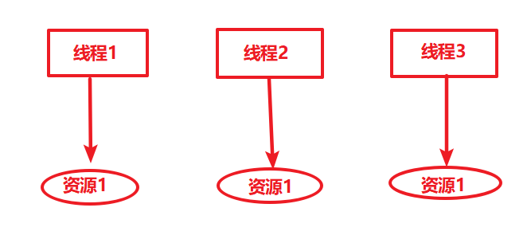


### 14.2 如何使用/原理


threadlocal使用方法很简单

```java
static final ThreadLocal<T> sThreadLocal = new ThreadLocal<T>();
sThreadLocal.set()
sThreadLocal.get()
```

`threadlocal`而是一个线程内部的存储类，可以在`指定线程内存储数据`，数据存储以后，只有指定线程可以得到存储数据，官方解释如下。

```java
/**
 * This class provides thread-local variables.  These variables differ from
 * their normal counterparts in that each thread that accesses one (via its
 * {@code get} or {@code set} method) has its own, independently initialized
 * copy of the variable.  {@code ThreadLocal} instances are typically private
 * static fields in classes that wish to associate state with a thread (e.g.,
 * a user ID or Transaction ID).
 */
```


大致意思就是`ThreadLocal`提供了`线程内存储变量`的能力，这些变量不同之处在于`每一个线程读取的变量是对应的互相独立的`。通过`get`和`set`方法就可以得到`当前线程对应的值`。


做个不恰当的比喻，从表面上看`ThreadLocal`相当于维护了一个`map`，`key`就是当前的线程，`value`就是需要存储的对象。

这里的这个比喻是不恰当的，实际上是`ThreadLocal`的`静态内部类ThreadLocalMap`为每个`Thread`都维护了`一个数组table`，`ThreadLocal`确定了一个数组下标，而这个下标就是`value`存储的对应位置。。

作为一个存储数据的类，关键点就在`get`和`set`方法。


### 14.3 set()方法

```java
//set 方法
public void set(T value) {
      //获取当前线程
      Thread t = Thread.currentThread();
      //实际存储的数据结构类型
      ThreadLocalMap map = getMap(t);
      //如果存在map就直接set，没有则创建map并set
      if (map != null)
          map.set(this, value);
      else
          createMap(t, value);
  }
  
//getMap方法
ThreadLocalMap getMap(Thread t) {
      //thred中维护了一个ThreadLocalMap
      return t.threadLocals;
 }
 
//createMap
void createMap(Thread t, T firstValue) {
      //实例化一个新的ThreadLocalMap，并赋值给线程的成员变量threadLocals
      t.threadLocals = new ThreadLocalMap(this, firstValue);
}
```


从上面代码可以看出每个线程持有一个`ThreadLocalMap`对象。每一个新的线程`Thread`都会实例化一个`ThreadLocalMap`并赋值给`成员变量threadLocals`，使用时若已经存在`threadLocals`则直接使用已经存在的对象。


### 14.4 ThreadLocalMap

```java
//Entry为ThreadLocalMap静态内部类，对ThreadLocal的弱引用
//同时让ThreadLocal和储值形成key-value的关系
static class Entry extends WeakReference<ThreadLocal<?>> {
    /** The value associated with this ThreadLocal. */
    Object value;

    Entry(ThreadLocal<?> k, Object v) {
           super(k);
            value = v;
    }
}

//ThreadLocalMap构造方法
ThreadLocalMap(ThreadLocal<?> firstKey, Object firstValue) {
        //内部成员数组，INITIAL_CAPACITY值为16的常量
        table = new Entry[INITIAL_CAPACITY];
        //位运算，结果与取模相同，计算出需要存放的位置
        //threadLocalHashCode比较有趣，这里计算出索引值
        int i = firstKey.threadLocalHashCode & (INITIAL_CAPACITY - 1);
        //new一个新的Entry并赋值table数组中计算出来的索引值
        table[i] = new Entry(firstKey, firstValue);
        size = 1;
        setThreshold(INITIAL_CAPACITY);
}
```

通过上面的代码不难看出在实例化`ThreadLocalMap`时创建了一个`长度为16的Entry数组`。通过`hashCode`与`length`位运算确定出一个`索引值i`，这个i就是`被存储在table数组中的位置`。


前面讲过每个线程`Thread`持有一个`ThreadLocalMap`类型的实例`threadLocals`，结合此处的构造方法可以理解成每个线程Thread都持有一个Entry型的数组table，而一切的读取过程都是通过操作这个数组table完成的。


*显然table是set和get的焦点，在看具体的set和get方法前，先看下面这段代码。*


```java
//在某一线程声明了ABC三种类型的ThreadLocal
ThreadLocal<A> sThreadLocalA = new ThreadLocal<A>();
ThreadLocal<B> sThreadLocalB = new ThreadLocal<B>();
ThreadLocal<C> sThreadLocalC = new ThreadLocal<C>();
```


由前面我们知道对于一个`Thread`来说只有持有一个`ThreadLocalMap`，所以`ABC`对应同一个`ThreadLocalMap对象`。为了管理`ABC`，于是将他们存储在`一个数组的不同位置`，而这个数组就是上面提到的`Entry型的数组table`。

那么问题来了，`ABC`在`table`中的位置是如何确定的？为了能正常够正常的访问对应的值，肯定存在一种方法计算出确定的`索引值i`，show me code。


```java
  //ThreadLocalMap中set方法。
  private void set(ThreadLocal<?> key, Object value) {

            // We don't use a fast path as with get() because it is at
            // least as common to use set() to create new entries as
            // it is to replace existing ones, in which case, a fast
            // path would fail more often than not.

            Entry[] tab = table;
            int len = tab.length;
            //获取索引值，这个地方是比较特别的地方
            int i = key.threadLocalHashCode & (len-1);

            //遍历tab如果已经存在则更新值
            for (Entry e = tab[i];
                 e != null;
                 e = tab[i = nextIndex(i, len)]) {
                ThreadLocal<?> k = e.get();

                if (k == key) {
                    e.value = value;
                    return;
                }

                if (k == null) {
                    replaceStaleEntry(key, value, i);
                    return;
                }
            }
            
            //如果上面没有遍历成功则创建新值
            tab[i] = new Entry(key, value);
            int sz = ++size;
            //满足条件数组扩容x2
            if (!cleanSomeSlots(i, sz) && sz >= threshold)
                rehash();
        }
```


在`ThreadLocalMap`中的`set`方法与构造方法能看到以下代码片段。


```java
int i = key.threadLocalHashCode & (len-1)
int i = firstKey.threadLocalHashCode & (INITIAL_CAPACITY - 1)
```


简而言之就是将`threadLocalHashCode`进行一个位运算（取模）得到索引i，


`threadLocalHashCode`代码如下：

```java
    //ThreadLocal中threadLocalHashCode相关代码.
    
    private final int threadLocalHashCode = nextHashCode();

    /**
     * The next hash code to be given out. Updated atomically. Starts at
     * zero.
     */
    private static AtomicInteger nextHashCode =
        new AtomicInteger();

    /**
     * The difference between successively generated hash codes - turns
     * implicit sequential thread-local IDs into near-optimally spread
     * multiplicative hash values for power-of-two-sized tables.
     */
    private static final int HASH_INCREMENT = 0x61c88647;

    /**
     * Returns the next hash code.
     */
    private static int nextHashCode() {
        //自增
        return nextHashCode.getAndAdd(HASH_INCREMENT);
    }
```


因为static的原因，在每次`new ThreadLocal`时因为`threadLocalHashCode`的初始化，会使`threadLocalHashCode`值自增一次，增量为`0x61c88647`。


`0x61c88647`是斐波那契散列乘数,它的优点是通过它`散列(hash)`出来的结果分布会比较均匀，可以很大程度上避免`hash冲突`，


以很大程度上避免`hash冲突`，已初始`容量16`为例，hash并与15位运算计算数组下标结果如下：

|  hashCode  | 数组下标 |
| :--------: | :------: |
| 0x61c88647 |    7     |
| 0xc3910c8e |    14    |
| 0x255992d5 |    5     |
| 0x8722191c |    12    |
| 0xe8ea9f63 |    3     |
| 0x4ab325aa |    10    |
| 0xac7babf1 |    1     |
| 0xe443238  |    8     |
| 0x700cb87f |    15    |


总结如下：


::: info 总结如下


1. 对于某一`ThreadLocal`来讲，他的`索引值i`是确定的，在不同线程之间访问时访问的是不同的table数组的同一位置即都为table[i]，只不过这个不同线程之间的table是独立的。
2. 对于同一线程的不同`ThreadLocal`来讲，这些`ThreadLocal`实例共享一个`table`数组，然后每个`ThreadLocal`实例在`table`中的`索引i`是不同的。


:::


### 14.5 get()方法

```java
//ThreadLocal中get方法
public T get() {
    Thread t = Thread.currentThread();
    ThreadLocalMap map = getMap(t);
    if (map != null) {
        ThreadLocalMap.Entry e = map.getEntry(this);
        if (e != null) {
            @SuppressWarnings("unchecked")
            T result = (T)e.value;
            return result;
        }
    }
    return setInitialValue();
}
    
//ThreadLocalMap中getEntry方法
private Entry getEntry(ThreadLocal<?> key) {
       int i = key.threadLocalHashCode & (table.length - 1);
       Entry e = table[i];
       if (e != null && e.get() == key)
            return e;
       else
            return getEntryAfterMiss(key, i, e);
   }
```

理解了`set`方法，`get`方法也就清楚明了，无非是通过计算出索引直接从数组对应位置读取即可。

在进行`get`之前，必须先`set`，否则会报`空指针异常`，当然也可以初始化一个，但是必须重写`initialValue()`方法。


### 14.6 内存泄漏问题


上面这张图详细的揭示了`ThreadLocal`和`Thread`以及`ThreadLocalMap`三者的关系。


::: info 关系

- Thread中有一个map，就是ThreadLocalMap
- ThreadLocalMap的key是ThreadLocal，值是我们自己设定的。
- ThreadLocal是一个弱引用，当为null时，会被当成垃圾回收

:::


重点来了，突然我们`ThreadLocal`是`null`了，也就是要被`垃圾回收器`回收了，但是此时我们的`ThreadLocalMap`生命周期和`Thread`的一样，它不会回收，这时候就出现了一个现象。那就是`ThreadLocalMap`的`key`没了，但是`value`还在，这就造成了`内存泄漏`。


解决办法：使用完`ThreadLocal`后，执行`remove`操作，避免出现`内存溢出`情况。


### 14.7 特性

`ThreadLocal`和`Synchronized`都是为了解决`多线程中相同变量的访问冲突`问题，不同的点是


::: info 不同点

- `Synchronized`是通过线程等待，`牺牲时间`来解决访问冲突
- ThreadLocal是通过每个线程单独一份存储空间，牺牲空间来解决冲突，并且相比于`Synchronized`，`ThreadLocal`具有`线程隔离`的效果，只有在线程内才能获取到对应的值，线程外则不能访问到想要的值。

:::


正因为ThreadLocal的线程隔离特性，使他的应用场景相对来说更为特殊一些。在android中Looper、ActivityThread以及AMS中都用到了`ThreadLocal`。当某些数据是以线程为作用域并且不同线程具有不同的数据副本的时候，就可以考虑采用`ThreadLocal`。


## 其他面试题


### i++线程安全吗

参考

> - https://blog.csdn.net/weixin_39446980/article/details/90597576
> - https://blog.csdn.net/zbw18297786698/article/details/53420780?utm_medium=distribute.pc_relevant.none-task-blog-BlogCommendFromMachineLearnPai2-1.channel_param&depth_1-utm_source=distribute.pc_relevant.none-task-blog-BlogCommendFromMachineLearnPai2-1.channel_param