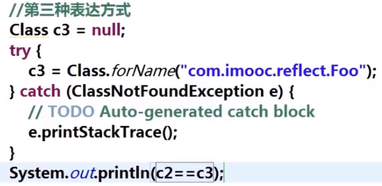
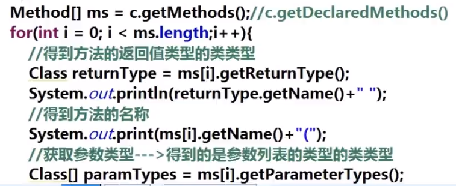

# 参考

> - https://blog.csdn.net/huangliniqng/article/details/88554510
> - https://www.jianshu.com/p/9be58ee20dee

# 定义

JAVA反射机制是在运行状态中

> - 对于任意一个类，都能够知道这个类的所有属性和方法；
> - 对于任意一个对象，都能够调用它的任意方法和属性；

这种动态获取信息以及动态调用对象方法的功能称为java语言的反射机制。

# 用途

参考

> - https://www.jianshu.com/p/3fd80b251399

在日常的第三方应用开发过程中，经常会遇到某个类的某个成员变量、方法或是属性是私有的或是只对系统应用开放，这时候就可以利用Java的反射机制通过反射来获取所需的私有成员或是方法。当然，也不是所有的都适合反射，之前就遇到一个案例，通过反射得到的结果与预期不符。阅读源码发现，经过层层调用后在最终返回结果的地方对应用的权限进行了校验，对于没有权限的应用返回值是没有意义的缺省值，否则返回实际值起到保护用户的隐私目的。

# 反射机制的相关类

类名 用途   Class类 代表类的实体，在运行的Java应用程序中表示类和接口  Field类 代表类的成员变量（成员变量也称为类的属性）  Method类 代表类的方法  Constructor类 代表类的构造方法

| **类名**      | **用途**                                         |
| ------------- | ------------------------------------------------ |
| Class类       | 代表类的实体，在运行的Java应用程序中表示类和接口 |
| Field类       | 代表类的成员变量（成员变量也称为类的属性）       |
| Method类      | 代表类的方法                                     |
| Constructor类 | 代表类的构造方法                                 |

## Class类

[Class](https://developer.android.google.cn/reference/java/lang/Class)代表类的实体，在运行的Java应用程序中表示类和接口。在这个类中提供了很多有用的方法，这里对他们简单的分类介绍。

### 例子

### 获得类相关的方法

| 方法                       | 用途                                                   |
| -------------------------- | ------------------------------------------------------ |
| asSubclass(Class\<U\> clazz) | 把传递的类的对象转换成代表其子类的对象                 |
| Cast                       | 把对象转换成代表类或是接口的对象                       |
| getClassLoader()           | 获得类的加载器                                         |
| getClasses()               | 返回一个数组，数组中包含该类中所有公共类和接口类的对象 |
| getDeclaredClasses()       | 返回一个数组，数组中包含该类中所有类和接口类的对象     |
| forName(String className)  | 根据类名返回类的对象                                   |
| getName()                  | 获得类的完整路径名字                                   |
| newInstance()              | 创建类的实例                                           |
| getPackage()               | 获得类的包                                             |
| getSimpleName()            | 获得类的名字                                           |
| getSuperclass()            | 获得当前类继承的父类的名字                             |
| getInterfaces()            | 获得当前类实现的类或是接口                             |

### 获得类中构造器相关的方法

| 方法                                               | 用途                                   |
| -------------------------------------------------- | -------------------------------------- |
| getConstructor(Class...<?> parameterTypes)         | 获得该类中与参数类型匹配的公有构造方法 |
| getConstructors()                                  | 获得该类的所有公有构造方法             |
| getDeclaredConstructor(Class...<?> parameterTypes) | 获得该类中与参数类型匹配的构造方法     |
| getDeclaredConstructors()                          | 获得该类所有构造方法                   |

### 获得类中方法相关的方法

| 方法                                                       | 用途                   |
| ---------------------------------------------------------- | ---------------------- |
| getMethod(String name, Class...<?> parameterTypes)         | 获得该类某个公有的方法 |
| getMethods()                                               | 获得该类所有公有的方法 |
| getDeclaredMethod(String name, Class...<?> parameterTypes) | 获得该类某个方法       |
| getDeclaredMethods()                                       | 获得该类所有方法       |

### 类中其他重要的方法

| 方法                                                         | 用途                             |
| ------------------------------------------------------------ | -------------------------------- |
| isAnnotation()                                               | 如果是注解类型则返回true         |
| isAnnotationPresent(Class<? extends Annotation> annotationClass) | 如果是指定类型注解类型则返回true |
| isAnonymousClass()                                           | 如果是匿名类则返回true           |
| isArray()                                                    | 如果是一个数组类则返回true       |
| isEnum()                                                     | 如果是枚举类则返回true           |
| isInstance(Object obj)                                       | 如果obj是该类的实例则返回true    |
| isInterface()                                                | 如果是接口类则返回true           |
| isLocalClass()                                               | 如果是局部类则返回true           |
| isMemberClass()                                              | 如果是内部类则返回true           |

## Field类

[Field](https://developer.android.google.cn/reference/java/lang/reflect/Field)代表类的成员变量（成员变量也称为类的属性）。

| 方法                          | 用途                    |
| ----------------------------- | ----------------------- |
| equals(Object obj)            | 属性与obj相等则返回true |
| get(Object obj)               | 获得obj中对应的属性值   |
| set(Object obj, Object value) | 设置obj中对应属性值     |

## Method类

[Method](https://developer.android.google.cn/reference/java/lang/reflect/Method)代表类的方法。

| 方法                               | 用途                                     |
| ---------------------------------- | ---------------------------------------- |
| invoke(Object obj, Object... args) | 传递object对象及参数调用该对象对应的方法 |

## Constructor类

[Constructor](https://developer.android.google.cn/reference/java/lang/reflect/Constructor)代表类的构造方法。

| 方法                            | 用途                       |
| ------------------------------- | -------------------------- |
| newInstance(Object... initargs) | 根据传递的参数创建类的对象 |

