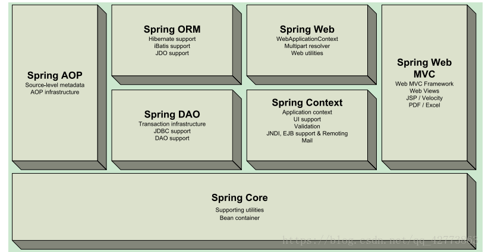

## 参考

> - 


什么是 Spring 框架? Spring 是⼀种轻量级开发框架，旨在提⾼开发⼈员的开发效率以及系统的可维护性。

Spring 官⽹：ht tps://spring.io/。 

我们⼀般说 Spring 框架指的都是 Spring Framework，它是很多模块的集合，使⽤这些模块可以很⽅ 便地协助我们进⾏开发。这些模块是：核⼼容器、数据访问/集成,、Web、AOP（⾯向切⾯编程）、⼯ 具、消息和测试模块。⽐如：Core Container 中的 Core 组件是Spring 所有组件的核⼼，Beans 组件 和 Context 组件是实现IOC和依赖注⼊的基础，AOP组件⽤来实现⾯向切⾯编程。


## 1. Spring特征

Spring 官⽹列出的 Spring 的 6 个特征:


::: info Spring 的 6 个特征


- **核⼼技术** ：依赖注⼊(DI)，AOP，事件(events)，资源，i18n，验证，数据绑定，类型转换， SpEL。 
- **测试** ：模拟对象，TestContext框架，Spring MVC 测试，WebTestClient。 
- **数据访问** ：事务，DAO⽀持，JDBC，ORM，编组XML。 
- **Web⽀持** : Spring MVC和Spring WebFlux Web框架。 
- **集成** ：远程处理，JMS，JCA，JMX，电⼦邮件，任务，调度，缓存。 
- **语⾔** ：Kotlin，Groovy，动态语⾔。


:::


## 2. Spring七大模块

::: tip 参考


> - https://www.cnblogs.com/lukelook/p/9604609.html
> - https://www.cnblogs.com/xiaobaizhiqian/p/7616453.html


:::


所有模块


七大模块





### 2.1 核心容器（Spring Core）

　　Core模块是Spring的核心类库，Spring的所有功能都依赖于该类库，Core主要实现`IOC`功能，Spring的所有功能都是借助`IOC`实现的。核心容器提供Spring框架的基本功能。Spring以bean的方式组织和管理Java应用中的各个组件及其关系。Spring使用`BeanFactory`来产生和管理`Bean`，它是`工厂模式`的实现，并提供`依赖注入（Dependency Injection）`管理`Bean`容器功能。`BeanFactory`它提供对Factory模式的经典实现来消除对程序性`单例模式`的需要，并真正地允许你从程序逻辑中分离出`依赖关系和配置`。`BeanFactory`使用`控制反转(IoC)`模式将`应用的配置和依赖性规范`与`实际的应用程序代码`分开。


### 2.2 应用上下文（Spring Context）

核心模块的`BeanFactory`使`Spring`成为一个`容器`，而`上下文模块`使它成为一个`框架`。Spring上下文是一个配置文件，这个模块扩展了`BeanFactory`的概念，增加了消息、事件传播以及验证的支持。另外，这个模块提供了许多企业服务，例如电子邮件、JNDI访问、EJB集成、远程以及时序调度（scheduling）服务。也包括了对模版框架例如Velocity和FreeMarker集成的支持。


### 2.3 Spring面向切面编程（Spring AOP）

通过配置管理特性，`Spring AOP` 模块直接将面向切面的编程功能集成到了 Spring框架中。所以，可以很容易地使 Spring框架管理的任何对象支持 `AOP`。`Spring AOP` 模块为基于 Spring 的应用程序中的对象提供了事务管理服务。通过使用 `Spring AOP`，不用依赖 EJB 组件，就可以将`声明性事务管理`集成到应用程序中。


Spring在它的AOP模块中提供了对面向切面编程的丰富支持。例如方法拦截器（servletListener ,controller....）和切点，可以有效的防止代码上功能的耦合，这个模块是在Spring应用中实现切面编程的基础。Spring的AOP模块也将`元数据`编程引入了Spring。使用Spring的`元数据支持`，你可以为你的源代码增加注释，指示Spring在何处以及如何应用切面函数。


::: info AOP

AOP = Aspect Oriented Programming   

AOP是OOP的延续，是（Aspect Oriented Programming）的缩写，意思是面向切面（方面）编程。  

主要的功能是：日志记录，性能统计，安全控制，事务处理，异常处理等等

:::  


### 2.4 DAO模块（Spring DAO）

使用`JDBC`经常导致大量的重复代码，取得连接、创建语句、处理结果集，然后关闭连接、旧代码中迁移自定义工具类`JDBCUtil` 也让开发变得繁琐。Spring的`Dao`模块对传统的JDBC进行了抽象，还提供了一种比编程性更好的声明性事务管理方法。JDBC、DAO的抽象层提供了有意义的异常层次结构，可用该结构来管理异常处理，和不同数据库供应商所抛出的错误信息。异常层次结构简化了错误处理，并且极大的降低了需要编写的代码数量，比如打开和关闭链接。


### 2.5 对象实体映射（Spring ORM）

Spring框架插入了若干个`ORM框架`，从而提供了ORM对象的关系工具，其中包括了Hibernate、JDO和 IBatis SQL Map等，所有这些都遵从Spring的通用事物和DAO异常层次结构。通过`ORM`包，可以混合使用所有Spring提供的特性进行“`对象/关系`”映射，方便开发时小组内整合代码。Spring本身并不对ORM进行实现，仅对常见的ORM框架进行封装，并对其进行管理。


### 2.6 Web模块（Spring Web）

Web上下文模块建立在应用程序上下文模块之上，为基于web的应用程序提供了上下文。所以Spring框架支持与Struts集成，web模块还简化了处理多部分请求以及将请求参数绑定到域对象的工作。


### 2.7 MVC模块（Spring Web MVC）

　　MVC框架是一个全功能的构建Web应用程序的MVC实现。通过策略接口，MVC框架变成为高度可配置的。MVC容纳了大量视图技术，其中包括JSP、POI等，模型来有JavaBean来构成，存放于m当中，而视图是一个街口，负责实现模型，控制器表示逻辑代码，由c的事情。Spring框架的功能可以用在任何J2EE服务器当中，大多数功能也适用于不受管理的环境。Spring的核心要点就是支持不绑定到特定J2EE服务的可重用业务和数据的访问的对象，毫无疑问这样的对象可以在不同的J2EE环境，独立应用程序和测试环境之间重用。


## 3. IoC（Inverse of Control：控制反转）| DC（Dependency Injection：依赖注入）

IoC（Inverse of Control:控制反转）是⼀种设计思想，就是 将原本在程序中⼿动创建对象的控制 权，交由Spring框架来管理。 IoC 在其他语⾔中也有应⽤，并⾮ Spring 特有。 IoC 容器是 Spring ⽤来实现 IoC 的载体， IoC 容器实际上就是个Map（key，value）,Map 中存放的是各种对象。 

将对象之间的相互依赖关系交给 IoC 容器来管理，并由 IoC 容器完成对象的注⼊。这样可以很⼤程度 上简化应⽤的开发，把应⽤从复杂的依赖关系中解放出来。 IoC 容器就像是⼀个⼯⼚⼀样，当我们需 要创建⼀个对象的时候，只需要配置好配置⽂件/注解即可，完全不⽤考虑对象是如何被创建出来的。 在实际项⽬中⼀个 Service 类可能有⼏百甚⾄上千个类作为它的底层，假如我们需要实例化这个 Service，你可能要每次都要搞清这个 Service 所有底层类的构造函数，这可能会把⼈逼疯。如果利⽤ IoC 的话，你只需要配置好，然后在需要的地⽅引⽤就⾏了，这⼤⼤增加了项⽬的可维护性且降低了开 发难度。 

Spring 时代我们⼀般通过 XML ⽂件来配置 Bean，后来开发⼈员觉得 XML ⽂件来配置不太好，于是 SpringBoot 注解配置就慢慢开始流⾏起来。


::: tip 参考


- https://www.zhihu.com/question/23277575/answer/169698662
- https://www.cnblogs.com/xdp-gacl/p/4249939.html
- https://www.awaimai.com/2596.html


IOC源码阅读

- https://javadoop.com/post/spring-ioc


:::


## 4. AOP（Aspect-Oriented Programming）：面向切面编程


AOP(Aspect-Oriented Programming):⾯向切⾯编程)能够将那些与业务⽆关，却为业务模块所共同调⽤ 的逻辑或责任（例如事务处理、⽇志管理、权限控制等）封装起来，便于减少系统的重复代码，降低模 块间的耦合度，并有利于未来的可拓展性和可维护性。 


::: tip 参考

- https://www.cnblogs.com/joy99/p/10941543.html
- [SpringAOP详细配置与使用](https://blog.csdn.net/u010890358/article/details/80640433)


:::


### Spring AOP 和 AspectJ AOP 有什么区别？

Spring AOP 属于运⾏时增强，⽽ AspectJ 是编译时增强。 Spring AOP 基于代理(Proxying)，⽽ AspectJ 基于字节码操作(Bytecode Manipulation)。 

Spring AOP 已经集成了 AspectJ ，AspectJ 应该算的上是 Java ⽣态系统中最完整的 AOP 框架了。 AspectJ 相⽐于 Spring AOP 功能更加强⼤，但是 Spring AOP 相对来说更简单。

 如果我们的切⾯⽐᫾少，那么两者性能差异不⼤。但是，当切⾯太多的话，最好选择 AspectJ ，它⽐ Spring AOP 快很多。


## 5. Spring bean


::: tip 参考


- https://www.awaimai.com/2596.html
- https://blog.csdn.net/qq_39411208/article/details/88395875
- [Spring IOC中Bean的作⽤域与⽣命周期](https://blog.csdn.net/qq_43709204/article/details/109991097)
- https://blog.csdn.net/kongmin_123/article/details/82048392


:::


### 5.1 什么是bean

Spring 官方文档对 bean 的解释是：

> In Spring, the objects that form the backbone of your application and that are managed by the Spring IoC container are called beans. A bean is an object that is instantiated, assembled, and otherwise managed by a Spring IoC container.

翻译过来就是：

> 在 Spring 中，构成应用程序`主干`并由`Spring IoC容器`管理的`对象`称为`bean`。bean是一个由`Spring IoC`容器实例化、组装和管理的对象。


### 5.1 Spring中五种作用域?


::: info Spring中的bean的作⽤域有哪些?


| 作用域      | 描述                                                         |
| ----------- | ------------------------------------------------------------ |
| singleton   | 在spring IoC容器仅存在一个Bean实例，Bean以单例方式存在，bean作用域范围的`默认值`。 |
| prototype   | 每次从容器中调用Bean时，都返回一个新的实例，即每次调用getBean()时，相当于执行newXxxBean()。 |
| request     | 每次HTTP请求都会创建一个新的Bean，该作用域仅适用于web的Spring WebApplicationContext环境。 |
| session     | 同一个HTTP Session共享一个Bean，不同Session使用不同的Bean。该作用域仅适用于web的Spring WebApplicationContext环境。 |
| application | 限定一个Bean的作用域为`ServletContext`的生命周期。该作用域仅适用于web的Spring WebApplicationContext环境。 |


:::


#### 5.1.1 singleton 作⽤域


::: warning 关于lazy-init


lazy-init是懒加载, 如果等于true时作⽤是指Spring容器启动的时候不会去实例化这个bean,⽽是在程序调⽤时才去实例化. 默认是false即Spring容器启动时实例化.


:::


实例


创建一个bean:

::: info SingletonBean.java

```java
package com.spring.demo;
public class  SingletonBean{
   private String message;
   public void setMessage(String message){
      this.message  = message;
   }
   public void getMessage(){
      System.out.println("Your Message : " + message);
   }
}
```

:::


在Spring的配置文件中配置该bean:

::: info Bean.xml

```xml
<?xml version="1.0" encoding="UTF-8"?>
<beans xmlns="http://www.springframework.org/schema/beans"
       xmlns:xsi="http://www.w3.org/2001/XMLSchema-instance"
       xsi:schemaLocation="
        http://www.springframework.org/schema/beans http://www.springframework.org/schema/beans/spring-beans.xsd">
 
    <bean id="SingletonBean" class="com.spring.demo.SingletonBean" scope="singleton"></bean>
    <!-- 或者 -->
    <!--  <bean id="SingletonBean" class="com.spring.demo.SingletonBean" ></bean> -->
</beans>
```

:::


测试该Bean是否为单例的:

::: info TestBean.java

```java
package com.spring.demo;
 
import org.springframework.context.ApplicationContext;
import org.springframework.context.support.ClassPathXmlApplicationContext;
import org.junit.Test;
 
public class TestBean {
 
    @Test
    public void textUser()
    {
        //1.获取spring文件
        ApplicationContext context = new ClassPathXmlApplicationContext("Bean.xml");
        //2.由配置文件返回对象
        SingletonBean singletonBeanA = (SingletonBean)context.getBean("SingletonBean");
        singletonBeanA.setMessage("I'm object A");
        singletonBeanA.getMessage();
        SingletonBean singletonBeanB = (SingletonBean)context.getBean("SingletonBean");
        singletonBeanB.getMessage();
    }
}
 
```

:::


运行结果:

::: info 运行结果


:::


`lazy-init`设置为`false`的好处

::: info 好处

可以提前发现潜在的配置问题

Bean 对象存在于缓存中，使⽤时不⽤再去实例化bean，加快程序运⾏效率

:::


适合作为单例的对象

::: info 适合作为单例的对象


就是作为适合创建bean例的类，⼀般来说对于⽆状态或状态不可改变的对象适合使⽤单例模式。（不存在会改变对象状态的成员变量）

比如：user类定义的是各种属性，但有的时候我们需要的只是user属性的一小部分，所以user就不适合作为单例，而controller层、service层、dao层里面的类似固定的操作固定的属性，不会发生什么变动，所以适合作为单例。


:::


#### 5.1.2 prototype 作⽤域


当一个bean的作用域为`prototype`，表示一个bean定义对应多个对象实例。声明为prototype作用域的bean会导致在每次对该bean请求（将其注入到另一个bean中，或者以程序的方式调用容器的getBean()方法）时都会创建一个新的bean实例。prototype是原型类型，它在我们创建容器的时候并没有实例化，而是当我们获取bean的时候才会去创建一个对象，而且我们每次获取到的对象都不是同一个对象。

根据经验，对`有状态的bean`应该使用`prototype`作用域，而对`无状态的bean`则应该使用`singleton`作用域。


#### 5.1.3 request 请求作用域

Spring容器会在每次用到`loginAction`来处理每个HTTP请求的时候都会创建一个新的`LoginAction`实例。也就是说，`loginAction`Bean的作用域是HTTP `Request`级别的。

当http请求调用作用域为request的bean的时候，每增加一个HTTP请求，Spring就会创建一个新的bean，在请求处理完成之后便及时销毁这个bean。开发者可以随意改变实例的状态，因为通过`loginAction`请求来创建的其他实例根本看不到开发者改变的实例状态，所有创建的Bean实例都是根据独立的请求来的。


#### 5.1.4 session 会话作用域

Spring容器会在每次调用到`userPreferences时，`在一个单独的HTTP会话周期来创建一个新的`UserPreferences`实例。换言之`userPreferences`Bean的作用域是HTTP `Session`级别的。

Session中所有http请求共享同一个请求的bean实例。Session结束后就销毁bean。 在`request-scoped`作用域的Bean上，开发者可以随意的更改实例的状态。同样，使用从同一个userPreferences bean定义创建的其他HTTP Session实例在看不到不是自己的内部状态的修改，因为他们是单个的HTTP会话。每个Session请求都会创建新的`userPreferences`实例，所以开发者更改一个Bean的状态，对于其他的Bean仍然是不可见的。


#### 5.1.5 application 全局作用域

Spring容器会在整个web应用范围使用到`appPreferences`的时候创建一个新的`AppPreferences`的实例。也就是说，`appPreferences`Bean是在`ServletContext`级别的，作为常规的ServletContext属性。这种作用域在一些程度上来说和Spring的单例作用域相似，但是也有如下不同之处：


- `application`作用域是每个`ServletContext`中包含一个，而不是每个Spring`ApplicationContext`之中包含一个（某些应用中可能包含不止一个`ApplicationContext`）。
- `application`作用域仅仅作为`ServletContext`的属性可见，单例Bean是`ApplicationContext`可见。


接下来再来简单的学习下在Spring当中如何自定义作用域：

在Spring 2.0中，Spring的Bean作用域机制是可以扩展的，这意味着，你不仅可以使用Spring提供的预定义Bean作用域，还可以定义自己的作用域，甚至重新定义现有的作用域（不提倡这么做，而且你不能覆盖内置的singleton和prototype作用域）


### 5.3 Spring 中的单例 bean 的线程安全问题了解吗？

大部分时候我们并没有在系统中使用多线程，所以很少有人会关注这个问题。

单例 bean 存在线程问题，主要是因为当多个线程操作同一个对象的时候，对这个对象的非静态成员变量的写操作会存在线程安全问题。

常见的有两种解决办法：

::: info 常见的有两种解决办法

1. 在Bean对象中尽量避免定义可变的成员变量（不太现实）。
2. 在类中定义一个`ThreadLocal`成员变量，将需要的可变成员变量保存在 `ThreadLocal` 中（推荐的一种方式）。

:::