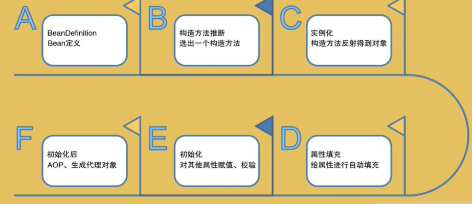
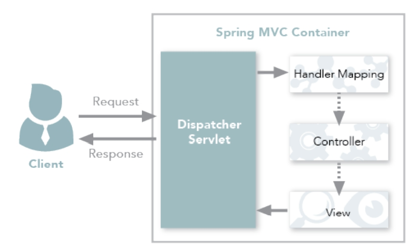

## 参考

::: tip

- [脑图参考](https://www.processon.com/mindmap/60abc60407912906fbcf50ba)
- [脑图参考](https://my.oschina.net/u/3080373/blog/891918)

:::


什么是 Spring 框架? Spring 是⼀种轻量级开发框架，旨在提⾼开发⼈员的开发效率以及系统的可维护性。

Spring 官⽹：https://spring.io/。 

我们⼀般说 Spring 框架指的都是 Spring Framework，它是很多模块的集合，使⽤这些模块可以很⽅ 便地协助我们进⾏开发。这些模块是：核⼼容器、数据访问/集成,、Web、AOP（⾯向切⾯编程）、⼯ 具、消息和测试模块。⽐如：Core Container 中的 Core 组件是Spring 所有组件的核⼼，Beans 组件 和 Context 组件是实现IOC和依赖注⼊的基础，AOP组件⽤来实现⾯向切⾯编程。


## 1. Spring特征

Spring 官⽹列出的 Spring 的 6 个特征:


::: info Spring 的 6 个特征


- **核⼼技术** ：依赖注⼊(DI)，AOP，事件(events)，资源，i18n，验证，数据绑定，类型转换， SpEL。 
- **测试** ：模拟对象，TestContext框架，Spring MVC 测试，WebTestClient。 
- **数据访问** ：事务，DAO⽀持，JDBC，ORM，编组XML。 
- **Web⽀持** : Spring MVC和Spring WebFlux Web框架。 
- **集成** ：远程处理，JMS，JCA，JMX，电⼦邮件，任务，调度，缓存。 
- **语⾔** ：Kotlin，Groovy，动态语⾔。


:::


## 2. Spring七大模块

::: tip 参考


> - https://www.cnblogs.com/lukelook/p/9604609.html
> - https://www.cnblogs.com/xiaobaizhiqian/p/7616453.html


:::


七大模块


### 2.1 核心容器（Spring Core）

Core模块是Spring的核心类库，Spring的所有功能都依赖于该类库，Core主要实现`IOC`功能，Spring的所有功能都是借助`IOC`实现的。核心容器提供Spring框架的基本功能。Spring以bean的方式组织和管理Java应用中的各个组件及其关系。Spring使用`BeanFactory`来产生和管理`Bean`，它是`工厂模式`的实现，并提供`依赖注入（Dependency Injection）`管理`Bean`容器功能。`BeanFactory`它提供对Factory模式的经典实现来消除对程序性`单例模式`的需要，并真正地允许你从程序逻辑中分离出`依赖关系和配置`。`BeanFactory`使用`控制反转(IoC)`模式将`应用的配置和依赖性规范`与`实际的应用程序代码`分开。


### 2.2 应用上下文（Spring Context）

核心模块的`BeanFactory`使`Spring`成为一个`容器`，而`上下文模块`使它成为一个`框架`。Spring上下文是一个配置文件，这个模块扩展了`BeanFactory`的概念，增加了消息、事件传播以及验证的支持。另外，这个模块提供了许多企业服务，例如电子邮件、JNDI访问、EJB集成、远程以及时序调度（scheduling）服务。也包括了对模版框架例如Velocity和FreeMarker集成的支持。


### 2.3 Spring面向切面编程（Spring AOP）

通过配置管理特性，`Spring AOP` 模块直接将面向切面的编程功能集成到了 Spring框架中。所以，可以很容易地使 Spring框架管理的任何对象支持 `AOP`。`Spring AOP` 模块为基于 Spring 的应用程序中的对象提供了事务管理服务。通过使用 `Spring AOP`，不用依赖 EJB 组件，就可以将`声明性事务管理`集成到应用程序中。


Spring在它的AOP模块中提供了对面向切面编程的丰富支持。例如方法拦截器（servletListener ,controller....）和切点，可以有效的防止代码上功能的耦合，这个模块是在Spring应用中实现切面编程的基础。Spring的AOP模块也将`元数据`编程引入了Spring。使用Spring的`元数据支持`，你可以为你的源代码增加注释，指示Spring在何处以及如何应用切面函数。


::: info AOP

AOP = Aspect Oriented Programming   

AOP是OOP的延续，是（Aspect Oriented Programming）的缩写，意思是面向切面（方面）编程。  

主要的功能是：日志记录，性能统计，安全控制，事务处理，异常处理等等

:::  


### 2.4 DAO模块（Spring DAO）

使用`JDBC`经常导致大量的重复代码，取得连接、创建语句、处理结果集，然后关闭连接、旧代码中迁移自定义工具类`JDBCUtil` 也让开发变得繁琐。Spring的`Dao`模块对传统的JDBC进行了抽象，还提供了一种比编程性更好的声明性事务管理方法。JDBC、DAO的抽象层提供了有意义的异常层次结构，可用该结构来管理异常处理，和不同数据库供应商所抛出的错误信息。异常层次结构简化了错误处理，并且极大的降低了需要编写的代码数量，比如打开和关闭链接。


### 2.5 对象实体映射（Spring ORM）

Spring框架插入了若干个`ORM框架`，从而提供了ORM对象的关系工具，其中包括了Hibernate、JDO和 IBatis SQL Map等，所有这些都遵从Spring的通用事物和DAO异常层次结构。通过`ORM`包，可以混合使用所有Spring提供的特性进行“`对象/关系`”映射，方便开发时小组内整合代码。Spring本身并不对ORM进行实现，仅对常见的ORM框架进行封装，并对其进行管理。


### 2.6 Web模块（Spring Web）

Web上下文模块建立在应用程序上下文模块之上，为基于web的应用程序提供了上下文。所以Spring框架支持与Struts集成，web模块还简化了处理多部分请求以及将请求参数绑定到域对象的工作。


### 2.7 MVC模块（Spring Web MVC）

　　MVC框架是一个全功能的构建Web应用程序的MVC实现。通过策略接口，MVC框架变成为高度可配置的。MVC容纳了大量视图技术，其中包括JSP、POI等，模型来有JavaBean来构成，存放于m当中，而视图是一个街口，负责实现模型，控制器表示逻辑代码，由c的事情。Spring框架的功能可以用在任何J2EE服务器当中，大多数功能也适用于不受管理的环境。Spring的核心要点就是支持不绑定到特定J2EE服务的可重用业务和数据的访问的对象，毫无疑问这样的对象可以在不同的J2EE环境，独立应用程序和测试环境之间重用。


## 3. IoC（控制反转）| DC（依赖注入）

IoC（Inverse of Control:控制反转）是依赖倒置原则⼀种设计思想，就是把原先在代码里面需要实现的对象创建、对象之间的依赖，反转给Spring容器来帮忙实现。 IoC 在其他语⾔中也有应⽤，并⾮ Spring 特有。 IoC 容器是 Spring ⽤来实现 IoC 的载体， IoC 容器实际上就是个Map（key，value）,Map 中存放的是各种对象。 

将对象之间的相互依赖关系交给 IoC 容器来管理，并由 IoC 容器完成对象的注⼊。这样可以很⼤程度 上简化应⽤的开发，把应⽤从复杂的依赖关系中解放出来。 IoC 容器就像是⼀个⼯⼚⼀样，当我们需 要创建⼀个对象的时候，只需要配置好配置⽂件/注解即可，完全不⽤考虑对象是如何被创建出来的。 在实际项⽬中⼀个 Service 类可能有⼏百甚⾄上千个类作为它的底层，假如我们需要实例化这个 Service，你可能要每次都要搞清这个 Service 所有底层类的构造函数，这可能会把⼈逼疯。如果利⽤ IoC 的话，你只需要配置好，然后在需要的地⽅引⽤就⾏了，这⼤⼤增加了项⽬的可维护性且降低了开 发难度。 

Spring 时代我们⼀般通过 XML ⽂件来配置 Bean，后来开发⼈员觉得 XML ⽂件来配置不太好，于是 SpringBoot 注解配置就慢慢开始流⾏起来。


::: tip 参考


- https://www.zhihu.com/question/23277575/answer/169698662
- https://www.cnblogs.com/xdp-gacl/p/4249939.html
- https://www.awaimai.com/2596.html
- [理解Spring的AOP和IOC实现原理](https://www.jianshu.com/p/78ba8bafb90a)


IOC源码阅读

- https://javadoop.com/post/spring-ioc


:::


### 3.1 运行原理/设计模式

Spring IOC容器通过`xml`,注解等其它方式配置`类及类之间的依赖关系`，完成了`对象的创建和依赖的管理注入`。实现IOC的主要原理是`工厂模式`加`反射机制`。


### 3.2 使用IOC的好处

::: info 使用IOC的好处

- 它将最小化应用程序中的代码量。
- 它将使您的应用程序易于测试，因为它不需要单元测试用例中的任何单例或 JNDI 查找机制。
- 它以最小的影响和最少的侵入机制促进松耦合。
- 它支持即时的实例化和延迟加载服务。
- 集中管理，实现类的可配置和易管理。
- 降低了类与类之间的耦合度。

:::


### 3.3 依赖注入的方式


::: tip 参考

- [三种依赖注入的方式](https://www.cnblogs.com/levontor/p/11040029.html)

:::


::: info 依赖注入的方式

- 构造函数方法注入
- Setter方法注入
- 接口注入


在Spring Framwork中，仅使用`构造函数`和`setter`注入

:::


### 3.4 Spring IOC 容器 | BeanFactory | ApplicationContext


::: tip 参考

- https://blog.csdn.net/pythias_/article/details/82752881

:::


#### 3.4.1 Spring有多少种IOC容器

::: info Spring有多少种IOC容器

- BeanFactory：就像一个包含 bean 集合的工厂类。它会在客户端要求时实例化 bean。
- ApplicationContext ：接口扩展了 BeanFactory 接口。它在 BeanFactory 基础上提供了一些额外的功能。


`BeanFactory`和`ApplicationContext`是Spring的两大核心接口，都可以当做Spring的容器。其中`ApplicationContext`是`BeanFactory`的子接口。

:::


#### 3.4.2 BeanFactory | ApplicationContext对比

::: info BeanFactory | ApplicationContext对比


**功能上区别**

`BeanFactory`是Spring里面最底层的接口，包含了各种Bean的定义，读取bean配置文档，管理bean的加载、实例化，控制bean的生命周期，维护bean之间的依赖关系。

`ApplicationContext`接口作为`BeanFactory`的派生，是应用上下文，除了提供BeanFactory所具有的功能外，还提供了更完整的框架功能：


> - 国际化（MessageSource）
> - 访问资源，如URL和文件（ResourceLoader）
> - 载入多个（有继承关系）上下文 ，使得每一个上下文都专注于一个特定的层次，比如应用的web层  
> - 消息发送、响应机制（ApplicationEventPublisher）
> - AOP（拦截器）


**两者装载bean的区别**

> - ==BeanFactory==：BeanFactory在启动的时候不会去实例化Bean，只有从容器中拿Bean的时候才会去实例化
> - ==ApplicationContext==：ApplicationContext在启动的时候就把所有的Bean全部实例化了。它还可以为Bean配置`lazy-init=true`来让Bean延迟实例化


**占用内存空间区别**

相对于基本的`BeanFactory`，`ApplicationContext` 唯一的不足是占用内存空间。当应用程序配置Bean较多时，程序启动较慢。


**创建方式区别**

`BeanFactory`通常以`编程的方式`被创建，`ApplicationContext`还能以`声明的方式`创建，如使用ContextLoader。


**我们该用BeanFactory还是ApplicationContent**

> - ==延迟实例化的优点BeanFactory==：应用启动的时候占用资源很少；对资源要求较高的应用，比较有优势
>
> - ==不延迟实例化的优点ApplicationContent==：
>
>   > - 所有的Bean在启动的时候都加载，系统运行的速度快； 
>   > - 在启动的时候所有的Bean都加载了，我们就能在系统启动的时候，尽早的发现系统中的`配置问题` 
>   > - 建议web应用，在启动的时候就把所有的Bean都加载了。（把费时的操作放到系统启动中完成）


:::


## 4. AOP（Aspect-Oriented Programming）：面向切面编程


::: tip 参考

- https://www.cnblogs.com/joy99/p/10941543.html
- [SpringAOP详细配置与使用](https://blog.csdn.net/u010890358/article/details/80640433)
- https://www.jianshu.com/p/78ba8bafb90a

:::


`OOP`面向对象，允许开发者定义纵向的关系，但并适用于定义横向的关系，导致了大量代码的重复，而不利于各个模块的重用。


`AOP(Aspect-Oriented Programming)`:⾯向切⾯编程)能够将那些与业务⽆关，却为业务模块所共同调⽤的逻辑或责任（例如`事务处理`、`⽇志管理`、`权限控制`等）封装起来，便于减少系统的重复代码，降低模块间的耦合度，并有利于未来的可拓展性和可维护性。 


### 4.1 使用AOP的好处

::: info 好处

- 降低模块的耦合度
- 使系统容易扩展
- 提高代码复用性

:::


### 4.2 AOP的基本概念

::: info AOP基本概念

| 名称                | 作用                                                         |
| ------------------- | ------------------------------------------------------------ |
| 连接点（JoinPoint） | 需要在程序中插入横切关注点的点，连接点可能是在类初始化、方法调用、字段调用或处理异常等等。Spring中只支持方法执行连接点。 |
| 切入点（Pointcut）  | 一组相关连接点的集合。                                       |
| 通知（Advice）      | 在连接点上执行的行为，增强提供了在AOP中需要在切入点所选择的连接点处进行扩展现有行为的手段。包括前置增强（before advice）、后置增强 (after advice)、环绕增强 |
| 切面（Aspect）      | 通知和切入点的结合。                                         |
| 织入（Weaving）     | 织入是一个过程，是将切面应用到目标对象从而创建出AOP代理对象的过程。 |
| 代理（Proxy）       | 通过代理方式来对目标对象应用切面。AOP代理可以用JDK动态代理或CGLIB代理实现。 |
| 目标对象（Target）  | 需要被织入关注点的对象。即被代理的对象。                     |

:::


### 4.3 AOP运行原理/设计模式


实现AOP的主要设计模式就是动态代理。
Spring的动态代理有两种：一是`JDK的动态代理`；另一个是`cglib动态代理`。


### Spring AOP 和 AspectJ AOP 有什么区别？

Spring AOP 属于运⾏时增强，⽽ AspectJ 是编译时增强。 Spring AOP 基于代理(Proxying)，⽽ AspectJ 基于字节码操作(Bytecode Manipulation)。 

Spring AOP 已经集成了 AspectJ ，AspectJ 应该算的上是 Java ⽣态系统中最完整的 AOP 框架了。 AspectJ 相⽐于 Spring AOP 功能更加强⼤，但是 Spring AOP 相对来说更简单。

 如果我们的切⾯⽐᫾少，那么两者性能差异不⼤。但是，当切⾯太多的话，最好选择 AspectJ ，它⽐ Spring AOP 快很多。


## 5. Spring Bean


::: tip 参考


- https://www.awaimai.com/2596.html
- https://blog.csdn.net/qq_39411208/article/details/88395875
- [Spring IOC中Bean的作⽤域与⽣命周期](https://blog.csdn.net/qq_43709204/article/details/109991097)
- https://blog.csdn.net/kongmin_123/article/details/82048392


:::


### 5.1 什么是bean

Spring 官方文档对 Bean 的解释是：

> In Spring, the objects that form the backbone of your application and that are managed by the Spring IoC container are called beans. A bean is an object that is instantiated, assembled, and otherwise managed by a Spring IoC container.

翻译过来就是：

> 在 Spring 中，构成应用程序`主干`并由`Spring IoC容器`管理的`对象`称为`bean`。bean是一个由`Spring IoC`容器实例化、组装和管理的对象。


Bean也是基于用户提供容器的配置元数据创建


### 5.2 BeanDefinition

`BeanDefinition`表示Bean定义，Spring根据`BeanDfinition`来创建Bean对象，`BeanDfinition`有很多属性用来描述Bean。


| 属性           | 描述                                                         |
| -------------- | ------------------------------------------------------------ |
| beanClass      | 表示一个bean类型。Spring在创建bean过程根据此属性来实例化得到对象 |
| scope          | 作用域                                                       |
| isLazy         | 是否懒加载。表示一个bean是不是需要懒加载,原型bean的 isLazy属性不起作用, 懒加载的单例bean,会在第一次 getBean的时候生成该bean,非懒加 载的单例bean,则会在 Spring启动过程中直接生成好。 |
| dependsOn      | 表示一个bean在创建之前所依赖的其他bean,在一个bean创建之前,它所依赖的这些bean得先全部创建好。 |
| primary        | 表示一个bean是主bean。在Spng中一个类型可以有多个bean对象, 在进行依赖注入时,如果根据类型找到了多个bean,此时会判断这些 bean中是否存在一个主bean,如果存在,则直接将这个bean注入给属性 |
| initMethodName | 表示一个bean的初始化方法。一个bean的生命周期过程中有一个步骤叫初始化,Spng会在这个步骤中去调用bean的初始化方法,初始化逻辑由程序员自己控制,表示程序员可以自定义逻辑对bean进行加 |


### 5.3 BeanFactory

`BeanFactory`是创建Bean的Spring容器。

`BeanFactory`利用`BeanDefinition`作为模板来生成Bean对象


### 5.2 Spring bean中五种作用域?

| 作用域      | 描述                                                         |
| ----------- | ------------------------------------------------------------ |
| singleton   | 在spring IoC容器仅存在一个Bean实例，Bean以单例方式存在，bean作用域范围的`默认值`。 |
| prototype   | 每次从容器中调用Bean时，都返回一个新的实例，即每次调用getBean()时，相当于执行newXxxBean()。 |
| request     | 每次HTTP请求都会创建一个新的Bean，该作用域仅适用于web的Spring WebApplicationContext环境。 |
| session     | 同一个HTTP Session共享一个Bean，不同Session使用不同的Bean。该作用域仅适用于web的Spring WebApplicationContext环境。 |
| application | 限定一个Bean的作用域为`ServletContext`的生命周期。该作用域仅适用于web的Spring WebApplicationContext环境。 |


#### 5.1.1 singleton 作用域


::: warning 关于lazy-init


lazy-init是懒加载, 如果等于true时作⽤是指Spring容器启动的时候不会去实例化这个bean,⽽是在程序调⽤时才去实例化. 默认是false即Spring容器启动时实例化.


:::


实例


创建一个bean:

::: info SingletonBean.java

```java
package com.spring.demo;
public class  SingletonBean{
   private String message;
   public void setMessage(String message){
      this.message  = message;
   }
   public void getMessage(){
      System.out.println("Your Message : " + message);
   }
}
```

:::


在Spring的配置文件中配置该bean:

::: info Bean.xml

```xml
<?xml version="1.0" encoding="UTF-8"?>
<beans xmlns="http://www.springframework.org/schema/beans"
       xmlns:xsi="http://www.w3.org/2001/XMLSchema-instance"
       xsi:schemaLocation="
        http://www.springframework.org/schema/beans http://www.springframework.org/schema/beans/spring-beans.xsd">
 
    <bean id="SingletonBean" class="com.spring.demo.SingletonBean" scope="singleton"></bean>
    <!-- 或者 -->
    <!--  <bean id="SingletonBean" class="com.spring.demo.SingletonBean" ></bean> -->
</beans>
```

:::


测试该Bean是否为单例的:

::: info TestBean.java

```java
package com.spring.demo;
 
import org.springframework.context.ApplicationContext;
import org.springframework.context.support.ClassPathXmlApplicationContext;
import org.junit.Test;
 
public class TestBean {
 
    @Test
    public void textUser()
    {
        //1.获取spring文件
        ApplicationContext context = new ClassPathXmlApplicationContext("Bean.xml");
        //2.由配置文件返回对象
        SingletonBean singletonBeanA = (SingletonBean)context.getBean("SingletonBean");
        singletonBeanA.setMessage("I'm object A");
        singletonBeanA.getMessage();
        SingletonBean singletonBeanB = (SingletonBean)context.getBean("SingletonBean");
        singletonBeanB.getMessage();
    }
}
 
```

:::


运行结果:

::: info 运行结果


:::


`lazy-init`设置为`false`的好处

::: info 好处

可以提前发现潜在的配置问题

Bean 对象存在于缓存中，使⽤时不⽤再去实例化bean，加快程序运⾏效率

:::


适合作为单例的对象

::: info 适合作为单例的对象


就是作为适合创建bean例的类，⼀般来说对于⽆状态或状态不可改变的对象适合使⽤单例模式。（不存在会改变对象状态的成员变量）

比如：user类定义的是各种属性，但有的时候我们需要的只是user属性的一小部分，所以user就不适合作为单例，而controller层、service层、dao层里面的类似固定的操作固定的属性，不会发生什么变动，所以适合作为单例。


:::


#### 5.1.2 prototype 作⽤域


当一个bean的作用域为`prototype`，表示一个bean定义对应多个对象实例。声明为prototype作用域的bean会导致在每次对该bean请求（将其注入到另一个bean中，或者以程序的方式调用容器的getBean()方法）时都会创建一个新的bean实例。prototype是原型类型，它在我们创建容器的时候并没有实例化，而是当我们获取bean的时候才会去创建一个对象，而且我们每次获取到的对象都不是同一个对象。

根据经验，对`有状态的bean`应该使用`prototype`作用域，而对`无状态的bean`则应该使用`singleton`作用域。


#### 5.1.3 request 请求作用域

Spring容器会在每次用到`loginAction`来处理每个HTTP请求的时候都会创建一个新的`LoginAction`实例。也就是说，`loginAction`Bean的作用域是HTTP `Request`级别的。

当http请求调用作用域为request的bean的时候，每增加一个HTTP请求，Spring就会创建一个新的bean，在请求处理完成之后便及时销毁这个bean。开发者可以随意改变实例的状态，因为通过`loginAction`请求来创建的其他实例根本看不到开发者改变的实例状态，所有创建的Bean实例都是根据独立的请求来的。


#### 5.1.4 session 会话作用域

Spring容器会在每次调用到`userPreferences时，`在一个单独的HTTP会话周期来创建一个新的`UserPreferences`实例。换言之`userPreferences`Bean的作用域是HTTP `Session`级别的。

Session中所有http请求共享同一个请求的bean实例。Session结束后就销毁bean。 在`request-scoped`作用域的Bean上，开发者可以随意的更改实例的状态。同样，使用从同一个userPreferences bean定义创建的其他HTTP Session实例在看不到不是自己的内部状态的修改，因为他们是单个的HTTP会话。每个Session请求都会创建新的`userPreferences`实例，所以开发者更改一个Bean的状态，对于其他的Bean仍然是不可见的。


#### 5.1.5 application 全局作用域

Spring容器会在整个web应用范围使用到`appPreferences`的时候创建一个新的`AppPreferences`的实例。也就是说，`appPreferences`Bean是在`ServletContext`级别的，作为常规的ServletContext属性。这种作用域在一些程度上来说和Spring的单例作用域相似，但是也有如下不同之处：


- `application`作用域是每个`ServletContext`中包含一个，而不是每个Spring`ApplicationContext`之中包含一个（某些应用中可能包含不止一个`ApplicationContext`）。
- `application`作用域仅仅作为`ServletContext`的属性可见，单例Bean是`ApplicationContext`可见。


接下来再来简单的学习下在Spring当中如何自定义作用域：

在Spring 2.0中，Spring的Bean作用域机制是可以扩展的，这意味着，你不仅可以使用Spring提供的预定义Bean作用域，还可以定义自己的作用域，甚至重新定义现有的作用域（不提倡这么做，而且你不能覆盖内置的singleton和prototype作用域）


### 5.3 Spring 中的单例 bean 的线程安全问题了解吗？

大部分时候我们并没有在系统中使用多线程，所以很少有人会关注这个问题。

单例 bean 存在线程问题，主要是因为当多个线程操作同一个对象的时候，对这个对象的非静态成员变量的写操作会存在线程安全问题。

常见的有两种解决办法：

::: info 常见的有两种解决办法

1. 在Bean对象中尽量避免定义可变的成员变量（不太现实）。
2. 在类中定义一个`ThreadLocal`成员变量，将需要的可变成员变量保存在 `ThreadLocal` 中（推荐的一种方式）。

:::


### 5.4 @Component 和 @Bean 的相同和区别是什么？


`@Component`和`@Bean`都是用来注册Bean并装配到`Spring容器`中，但是`Bean`比`Component`的自定义性更强。可以实现一些Component实现不了的自定义加载类。


::: info @Component 和 @Bean 的区别是什么

- 作⽤对象不同: @Component 注解作⽤于`类`，⽽ @Bean 注解作⽤于`⽅法`。 

- @Component （@Controller、@Service、@Repository）通常是通过类路径扫描来⾃动侦测以及⾃动装配到Spring容器中（我们可以使⽤ `@ComponentScan` 注解定义要扫描的路径从中找出标识了需要装配的类⾃动装配到 Spring 的 bean 容器中）。 @Bean 注解通常是我们在标有该注解的⽅法中定义产⽣这个 bean, @Bean告诉了Spring这是某个类的示例，当我需要⽤它的时候还给我。 

- @Bean 注解⽐ Component 注解的⾃定义性更强，⽽且很多地⽅我们只能通过 @Bean 注解 来注册bean。⽐如当我们引⽤第三⽅库中的类需要装配到 Spring 容器时，则只能通过 @Bean 来实现

:::


#### @Bean 注解使⽤示例：

```java
@Configuration
public class AppConfig {
 @Bean
 public TransferService transferService() {
 return new TransferServiceImpl();
 }
}
```

上⾯的代码相当于下⾯的 xml 配置

```xml
<beans>
 <bean id="transferService" class="com.acme.TransferServiceImpl"/>
</beans>
```


### 5.5 将⼀个类声明为Spring的 bean 的注解有哪些

我们⼀般使⽤ `@Autowired` 注解⾃动装配 bean，要想把类标识成可⽤于 `@Autowired` 注解⾃动装 配的 bean 的类,采⽤以下注解可实现： 


::: info @Autowired

- @Component ：通⽤的注解，可标注任意类为 Spring 组件。如果⼀个Bean不知道属于哪个 层，可以使⽤ @Component 注解标注。 
- @Repository : 对应持久层即 Dao 层，主要⽤于数据库相关操作。 
- @Service : 对应服务层，主要涉及⼀些复杂的逻辑，需要⽤到 Dao层。 
- @Controller : 对应 Spring MVC 控制层，主要⽤户接受⽤户请求并调⽤ Service 层返回数 据给前端⻚⾯。

:::


### 5.6 Spring bean 的生命周期


::: tip 参考

- [Spring Bean的生命周期（非常详细）](https://www.cnblogs.com/zrtqsk/p/3735273.html)

:::


Bean生命周期描述的是 Spring中一个Bean创建过程和销毁过程中所经历的步骤,其中Bean创建过程是重点。程序员可以利用Bean生命周期机制对Bean进行自定义加工。





1. **BeanDefinition定义**：BeanDefinition表示Bean定义,它定义了某个Bean的类型, Spring就是利用Bean Definition来创建Bean的,比如需要利用 Bean Definition中 bean class属性确定Bean的类型,从而实例化出来对象。
2. **构造方法推断**：一个Ben中可以有多个构造方法,此时就需要 Spring来判断到底使用哪个构造方法,这个过程是比较复杂的,篇幅有限,不展开介绍。通过构造方法推断之后确定一个构造方法后,就可以利用构造方法实例化得到一个对象了。
3. **实例化和构造方法反射得到对象**：通过构造方法反射得到一个实例化对象,在 Spring中,可以通过Bean PostProcessor机制对实例化进行干预。
4. **属性填充**：实例化所得到的对象,是“不完整”的对象,“不完整”的意思是该对象中的某些属性还没有进行属性填充,也就是Spng还没有自动给某些属性赋值,属性填充就是我们通常说的自动注入、依赖注入。
5. **初始化**：在一个对象的属性填充之后, Spring提供了初始化机制,程序员可以利用初始化机制对Bean进行自定义加工,比如可以利用 Initializing Bean接口来对Bean中的其他属性进行赋值,或对Bean中的某些属性进行校验。
6. **通过AOP生成代理对象**：初始化后是Bean创建生命周期中最后一个步骤,我们常说的AOP机制就是在这个步骤中通过 Bean PostProcessor机制实现的,初始化之后得到的对象才是真正的Bean对象。


| 作用域         | 描述                                                         |
| -------------- | ------------------------------------------------------------ |
| BeanDefinition |                                                              |
| 构造方法推断   | 每次从容器中调用Bean时，都返回一个新的实例，即每次调用getBean()时，相当于执行newXxxBean()。 |
| request        | 每次HTTP请求都会创建一个新的Bean，该作用域仅适用于web的Spring WebApplicationContext环境。 |
| session        | 同一个HTTP Session共享一个Bean，不同Session使用不同的Bean。该作用域仅适用于web的Spring WebApplicationContext环境。 |
| application    | 限定一个Bean的作用域为`ServletContext`的生命周期。该作用域仅适用于web的Spring WebApplicationContext环境。 |


若容器注册了以上各种接口，程序那么将会按照以上的流程进行。下面将仔细讲解各接口作用。


#### 各种接口方法分类

Bean的完整生命周期经历了各种方法调用，这些方法可以划分为以下几类：

::: info  

- Bean自身的方法：这个包括了Bean本身调用的方法和通过配置文件中\<bean\>的`init-method`和`destroy-method`指定的方法
- Bean级生命周期接口方法：这个包括了BeanNameAware、BeanFactoryAware、InitializingBean和DiposableBean这些接口的方法
- 容器级生命周期接口方法：这个包括了InstantiationAwareBeanPostProcessor 和 BeanPostProcessor 这两个接口实现，一般称它们的实现类为“后处理器”。
- 工厂后处理器接口方法：这个包括了AspectJWeavingEnabler, ConfigurationClassPostProcessor, CustomAutowireConfigurer等等非常有用的工厂后处理器接口的方法。工厂后处理器也是容器级的。在应用上下文装配配置文件之后立即调用。

:::


### 5.7 Spring提供了哪些bean配置方式

::: tip 参考

- https://blog.csdn.net/qq_35744081/article/details/94986758

:::


::: info 三种配置方式

- 基于xml的配置
- 基于注解的配置
- 基于Java的配置

:::


### 5.8 bean循环依赖问题

::: tip 参考

- [spring bean循环依赖的解决方法](https://www.cnblogs.com/yanggb/p/13125998.html)
- [Spring-bean的循环依赖以及解决方式](https://blog.csdn.net/u010853261/article/details/77940767)

:::


## 6. Spring控制器是什么设计模式，有什么问题，为什么是这个模式


是**单例模式**，所以在多线程访问的时候有线程安全问题不要用同步会影晌性能的。解决方案是在控制器里面不能写字段成员变量。使用单例模式是为了性能（无需频繁初始化），同时也没有必要使用多例模式。万一必须要定义一个非静态成员变量时候，则通过注解`@Scope("prototype")`，将其设置为多例模式


## 7. Spring用到了哪些设计模式

::: tip 参考

- https://mp.weixin.qq.com/s?__biz=Mzg2OTA0Njk0OA==&mid=2247485303&idx=1&sn=9e4626a1e3f001f9b0d84a6fa0cff04a&chksm=cea248bcf9d5c1aaf48b67cc52bac74eb29d6037848d6cf213b0e5466f2d1fda970db700ba41&token=255050878&lang=zh_CN%23rd
- https://zhuanlan.zhihu.com/p/114244039

:::


- 1.简单工厂(非23种设计模式中的一种)
- 2.工厂方法
- 3.单例模式
- 4.适配器模式
- 5.装饰器模式
- 6.代理模式
- 7.观察者模式
- 8.策略模式
- 9.模版方法模式


## Spring注解


注解本质是一个继承了 Annotation的特殊接口,其具体实现类是Java运行时生成的动态代理类。我们通过反射获取注解时,返回的是Java运行时生成的动态代理对象。通过代理对象调用自定义注解的方法,会最终调用AnnotationInvocationHandler的 invoke方法。该方法会从 membervalues这个Map中索引出对应的值。而 membervalues的来源是Java常量池


Controller类使用继承@Component注解的方法，将其以单例的形式放入spring容器，如果仔细看的话会发现每个注解里面都有一个默认的value()方法，它的作用是为当前的注解声明一个名字，一般默认为类名，然后spring会通过配置文件中的context:component-scan的配置，进行如下操作：


- 使用asm技术扫描.class文件，并将包含@Component及元注解为@Component的注解@Controller、@Service、@Repository或者其他自定义的的bean注册到beanFactory中，
- 然后spring在注册处理器
- 实例化处理器，然后将其放到beanPostFactory中，然后我们就可以在类中进行使用了。
- 创建bean时，会自动调用相应的处理器进行处理。


### SpringMVC常用注解


参考

> - https://www.cnblogs.com/leskang/p/5445698.html


- **@Controller**

  > `@Controller`注解在类上，表明这个类是Spring MVC里的`Controller`，将其声明为Spring的一个Bean，`DispatchServlet`会自动扫描注解了此注解的类，并将Web请求映射到注解了`@RequestMapping`的方法上，需要注意的是，在Spring MVC声明控制器Bean的时候，只能使用@Controller。


- **@RestController**

  > `@RestController`是一个组合注解，组合了`@Controller`和`@ResponseBody`，意味着当只开发一个和页面交互数据的控制的时候，需要使用此注解。 若没有此注解，要想实现上述功能，则需自己在代码中加`@Controller`和`@ResponseBody`两个注解。


- **@RequestMapping**

  > `@RequestMapping`注解是用来映射Web请求（访问路径和参数）、处理类和方法的。它可以注解在类和方法上。注解在方法上的`@RequestMapping`路径会继承注解在类上的路径，`@RequestMapping`支持Servlet的request和response作为参数，也支持对它们的媒体类型进行配置。

  

- **@ResponseBody**

  > `@ResponseBody`支持将返回值放在`response`体内，而不是返回一个页面。我们很多机遇`Ajax`的程序，可以以此注解返回数据而不是返回页面；此注解可以放在返回值或者方法上。

- **@RequestBody**

  > `@RequestBody`允许`request`的参数在`request`体中，而不是在直接链接在地址后面。此注解放在参数前。

  

- **@PathVariable**

  > `@PathVariable` 用来接收路径参数，如`/news/001`,可接收001作为参数，此注解放置在参数前。

  

- **@Resource和@Autowired**

  > @Resource和@Autowired都是做bean的注入时使用，其实@Resource并不是Spring的注解，它的包是javax.annotation.Resource，需要导入，但是Spring支持该注解的注入。

  

- **@Repository**

  > 用于注解dao层，在daoImpl类上面注解。


### @Controller控制器

在SpringMVC 中，控制器Controller 负责处理由`DispatcherServlet` 分发的请求，它把用户请求的数据经过业务处理层处理之后封装成一个`Model` ，然后再把该`Model` 返回给对应的`View` 进行展示。在`SpringMVC` 中提供了一个非常简便的定义`Controller` 的方法，你无需继承特定的类或实现特定的接口，只需使用`@Controller` 标记一个类是Controller ，然后使用`@RequestMapping` 和@`RequestParam` 等一些注解用以定义URL 请求和Controller 方法之间的映射，这样的Controller 就能被外界访问到。此外Controller 不会直接依赖于`HttpServletRequest` 和`HttpServletResponse` 等HttpServlet 对象，它们可以通过Controller 的方法参数灵活的获取到。

@Controller 用于标记在一个类上，使用它标记的类就是一个SpringMVC Controller 对象。分发处理器将会扫描使用了该注解的类的方法，并检测该方法是否使用了@RequestMapping 注解。@Controller 只是定义了一个控制器类，而使用@RequestMapping 注解的方法才是真正处理请求的处理器。单单使用@Controller 标记在一个类上还不能真正意义上的说它就是SpringMVC 的一个控制器类，因为这个时候Spring 还不认识它。那么要如何做Spring 才能认识它呢？这个时候就需要我们把这个控制器类交给Spring 来管理。


单独使⽤ `@Controller` 不加 `@ResponseBody` 的话⼀般使⽤在要返回⼀个视图的情况，这种情况 属于比较传统的Spring MVC 的应⽤，对应于`前后端不分离`的情况。





### @ResponseBody

作用： 该注解用于将Controller的方法返回的对象，通过适当的HttpMessageConverter转换为指定格式后，写入到`Response`对象的`body`数据区。

使用时机：返回的数据不是`html`标签的页面，而是其他某种格式的数据时（如`json`、`xml`等）使用；


### @RestController

可以发现，`@RestController`注解里面包含了`@Controller`注解和@`ResponseBody`注解，`@ResponseBody` 注解是将返回的数据结构转换为 `JSON` 格式，所以说可以这么理解：@RestController = @Controller + @ResponseBody ，省了很多事，我们使用 @RestController 之后就不需要再使用 @Controller 了。


### @RequestMapping请求映射

RequestMapping是一个用来处理请求地址映射的注解，可用于类或方法上。用于类上，表示类中的所有响应请求的方法都是以该地址作为父路径。`@RequestMapping`注解是用来映射Web请求（访问路径和参数）、处理类和方法的。它可以注解在类和方法上。注解在方法上的`@RequestMapping`路径会继承注解在类上的路径，`@RequestMapping`支持Servlet的`request`和`response`作为参数，也支持对它们的媒体类型进行配置。


#### 属性

- value， method

  > - value：   指定请求的实际地址，指定的地址可以是URI Template 模式。value 可以省略不写
  > - method： 指定请求的method类型， GET、POST、PUT、DELETE等；默认为GET。不用每次在 @RequestMapping 注解中加 method 属性来指定，上面的 GET 方式请求可以直接使用 @GetMapping("/get") 注解，效果一样。相应地，PUT 方式、POST 方式和 DELETE 方式对应的注解分别为`@GetMapping`， `@PutMapping`、`@PostMapping` 和 `DeleteMapping`。


- consumes，produces

  > - consumes： 指定处理请求的提交内容类型（Content-Type），例如application/json, text/html;
  > - produces:  指定返回的内容类型，仅当request请求头中的(Accept)类型中包含该指定类型才返回；如 produces = “application/json; charset=UTF-8”，prodeces="image/jpeg"(可以用来配合swagger文档返回图片乱码的情况)


- params，headers

  > - params： 指定request中必须包含某些参数值是，才让该方法处理。
  > - headers： 指定request中必须包含某些指定的header值，才能让该方法处理请求。


### @RequestBody

参考

> - https://blog.csdn.net/weixin_38004638/article/details/99655322

RequestBody 注解用于接收`contentType: "application/json;"`的body，接收参数可以是实体，比如前端通过 JSON 提交传来两个参数 username 和 password，此时我们需要在后端封装一个实体来接收。在传递的参数比较多的情况下，使用 @RequestBody 接收会非常方便。


### @PathVariable

@PathVariable 注解主要用来获取 URL 参数，Spring Boot 支持 `Restfull` 风格的 URL，比如一个 GET 请求携带一个参数 id，我们将 id 作为参数接收，可以使用 @PathVariable 注解。前提是青请求值中要有括号包含对应的参数如下：


```java
@Controller  
public class TestController {  
     @RequestMapping(value="/user/{userId}/roles/{roleId}",method = RequestMethod.GET)  
     public String getLogin(@PathVariable("userId") String userId,  
         @PathVariable("roleId") String roleId){  
         System.out.println("User Id : " + userId);  
         System.out.println("Role Id : " + roleId);  
         return "hello";  
     }  
     @RequestMapping(value="/product/{productId}",method = RequestMethod.GET)  
     public String getProduct(@PathVariable("productId") String productId){  
           System.out.println("Product Id : " + productId);  
           return "hello";  
     }  
     @RequestMapping(value="/javabeat/{regexp1:[a-z-]+}",  
           method = RequestMethod.GET)  
     public String getRegExp(@PathVariable("regexp1") String regexp1){  
           System.out.println("URI Part 1 : " + regexp1);  
           return "hello";  
     }  
}
```


### @RequestParam

@RequestParam 注解顾名思义，也是获取请求参数的，主要用于在SpringMVC后台控制层获取参数，类似一种request.getParameter("name")。上面我们介绍了 @PathValiable 注解也是获取请求参数的，那么 @RequestParam 和 @PathVariable 有什么不同呢：


@PathValiable 是从 URL 模板中获取参数值，类似Restfull

```java
http://localhost:8080/user/{id}
```


@RequestParam 是从 Request 里获取参数值，即这种风格的 URL：

```java
http://localhost:8080/user?id=1
```


#### 属性

defaultValue = "0", required = false, value = "isApp"；


- **required**：true 表示该参数必须要传，否则就会报 404 错误，false 表示可有可无。
- **defaultValue**：表示设置默认值
- **value**:值表示接受的传入的参数类型


### @Resource和@Autowired

@Resource和@Autowired都是做bean的注入时使用，其实@Resource并不是Spring的注解，它的包是javax.annotation.Resource，需要导入，但是Spring支持该注解的注入。


#### 不同点


@Resources按名字，是JDK的；@Autowired按类型，是Spring的。

- @Autowired注解是按类型装配依赖对象，默认情况下它要求依赖对象必须存在，如果允许null值，可以设置它required属性为false。
- @Resource注解和@Autowired一样，也可以标注在字段或属性的setter方法上，但它默认按名称装配。名称可以通过@Resource的name属性指定，如果没有指定name属性，当注解标注在字段上，即默认取字段的名称作为bean名称寻找依赖对象，当注解标注在属性的setter方法上，即默认取属性名作为bean名称寻找依赖对象。 


#### @Autowired

@Autowired为Spring提供的注解，需要导入包`org.springframework.beans.factory.annotation.Autowired`;只按照byType注入。

```java
public class TestServiceImpl {
    // 下面两种@Autowired只要使用一种即可
    @Autowired
    private UserDao userDao; // 用于字段上
    
    @Autowired
    public void setUserDao(UserDao userDao) { // 用于属性的方法上
        this.userDao = userDao;
    }
}
```


#### @Resource

@Resource默认按照`ByName`自动注入，由J2EE提供，需要导入包javax.annotation.Resource。@Resource有两个重要的属性：`name`和`type`，而Spring将@Resource注解的name属性解析为bean的名字，而type属性则解析为bean的类型。所以，如果使用name属性，则使用byName的自动注入策略，而使用type属性时则使用byType自动注入策略。如果既不制定name也不制定type属性，这时将通过反射机制使用byName自动注入策略。

```java
public class TestServiceImpl {
    // 下面两种@Resource只要使用一种即可
    @Resource(name="userDao")
    private UserDao userDao; // 用于字段上
    
    @Resource(name="userDao")
    public void setUserDao(UserDao userDao) { // 用于属性的setter方法上
        this.userDao = userDao;
    }
}
```

注：最好是将@Resource放在setter方法上，因为这样更符合面向对象的思想，通过set、get去操作属性，而不是直接去操作属性。


::: info @Resource装配顺序


1. 如果同时指定了name和type，则从Spring上下文中找到唯一匹配的bean进行装配，找不到则抛出异常。
2. 如果指定了name，则从上下文中查找名称（id）匹配的bean进行装配，找不到则抛出异常。
3. 如果指定了type，则从上下文中找到类似匹配的唯一bean进行装配，找不到或是找到多个，都会抛出异常。
4. 如果既没有指定name，又没有指定type，则自动按照byName方式进行装配；如果没有匹配，则回退为一个原始类型进行匹配，如果匹配则自动装配。

@Resource的作用相当于@Autowired，只不过@Autowired按照byType自动注入。


:::


## SpringMVC组件


- `DispatcherServlet`：前端控制器。也称为中央控制器，它是整个请求响应的控制中心，组件的调用由它统一调度。有了他就减少了其他组件之间的耦合度。
- `HandlerMapping`：处理器映射器。它根据用户访问的 URL 映射到对应的后端处理器 Handler。也就是说它知道处理用户请求的后端处理器，但是它并不执行后端处理器，而是将处理器告诉给中央处理器。
- `HandlerAdapter`：处理器适配器。根据传过来不同类型的`Hadnle`它调用后端处理器中的方法，返回逻辑视图 `ModelAndView` 对象给`DispatcherServlet`。
- `ViewResolver`：视图解析器。将 `ModelAndView` 逻辑视图解析为具体的视图（如 JSP）。
- `Handler`：后端处理器。对用户具体请求进行处理，也就是我们编写的 `Controller` 类。需要程序员开发


## SpringMVC工作流程


::: info 流程详解


1. 用户向服务端发送一次请求，这个请求会先到前端控制器`DispatcherServlet`(也叫中央控制器)。

2. `DispatcherServlet`接收到请求后会调用`HandlerMapping`处理器映射器来，根据配置或注解获取不同的`Handle`，并返回给`DispatcherServlet`。由此得知，该请求该由哪个`Controller`来处理（并未调用Controller，只是得知）

3. `DispatcherServlet`调用`HandlerAdapter`处理器适配器，告诉处理器适配器应该要去执行哪个`Controller`

4. `HandlerAdapter`处理器适配器去执行`Controller`并得到`ModelAndView`(数据和视图)，并层层返回给`DispatcherServlet`

5. `DispatcherServlet`将`ModelAndView`交给`ViewReslover`视图解析器解析，然后返回真正的视图`View`。

6. `DispatcherServlet`将模型数据填充到视图中

7. `DispatcherServlet`将结果响应给用户


:::


