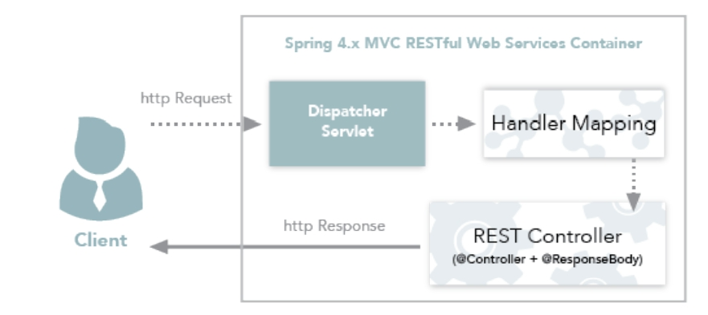

## 1. SpringMVC注解原理


注解本质是一个继承了 Annotation的特殊接口,其具体实现类是Java运行时生成的动态代理类。我们通过反射获取注解时,返回的是Java运行时生成的动态代理对象。通过代理对象调用自定义注解的方法,会最终调用AnnotationInvocationHandler的 invoke方法。该方法会从 membervalues这个Map中索引出对应的值。而 membervalues的来源是Java常量池


 Controller类使用继承@Component注解的方法，将其以单例的形式放入spring容器，如果仔细看的话会发现每个注解里面都有一个默认的value()方法，它的作用是为当前的注解声明一个名字，一般默认为类名，然后spring会通过配置文件中的context:component-scan的配置，进行如下操作：


- 使用asm技术扫描.class文件，并将包含@Component及元注解为@Component的注解@Controller、@Service、@Repository或者其他自定义的的bean注册到beanFactory中，
- 然后spring在注册处理器
- 实例化处理器，然后将其放到beanPostFactory中，然后我们就可以在类中进行使用了。
- 创建bean时，会自动调用相应的处理器进行处理。


## 2. SpringMVC常用注解


参考

> - https://www.cnblogs.com/leskang/p/5445698.html


- **@Controller**

  > `@Controller`注解在类上，表明这个类是Spring MVC里的`Controller`，将其声明为Spring的一个Bean，`DispatchServlet`会自动扫描注解了此注解的类，并将Web请求映射到注解了`@RequestMapping`的方法上，需要注意的是，在Spring MVC声明控制器Bean的时候，只能使用@Controller。


- **@RestController**

  > `@RestController`是一个组合注解，组合了`@Controller`和`@ResponseBody`，意味着当只开发一个和页面交互数据的控制的时候，需要使用此注解。 若没有此注解，要想实现上述功能，则需自己在代码中加`@Controller`和`@ResponseBody`两个注解。


- **@RequestMapping**

  > `@RequestMapping`注解是用来映射Web请求（访问路径和参数）、处理类和方法的。它可以注解在类和方法上。注解在方法上的`@RequestMapping`路径会继承注解在类上的路径，`@RequestMapping`支持Servlet的request和response作为参数，也支持对它们的媒体类型进行配置。

  

- **@ResponseBody**

  > `@ResponseBody`支持将返回值放在`response`体内，而不是返回一个页面。我们很多机遇`Ajax`的程序，可以以此注解返回数据而不是返回页面；此注解可以放在返回值或者方法上。

- **@RequestBody**

  > `@RequestBody`允许`request`的参数在`request`体中，而不是在直接链接在地址后面。此注解放在参数前。

  

- **@PathVariable**

  > `@PathVariable` 用来接收路径参数，如`/news/001`,可接收001作为参数，此注解放置在参数前。

  

- **@Resource和@Autowired**

  > @Resource和@Autowired都是做bean的注入时使用，其实@Resource并不是Spring的注解，它的包是javax.annotation.Resource，需要导入，但是Spring支持该注解的注入。

  

- **@Repository**

  > 用于注解dao层，在daoImpl类上面注解。


## 3. @Controller控制器

在SpringMVC 中，控制器Controller 负责处理由`DispatcherServlet` 分发的请求，它把用户请求的数据经过业务处理层处理之后封装成一个`Model` ，然后再把该`Model` 返回给对应的`View` 进行展示。在`SpringMVC` 中提供了一个非常简便的定义`Controller` 的方法，你无需继承特定的类或实现特定的接口，只需使用`@Controller` 标记一个类是Controller ，然后使用`@RequestMapping` 和@`RequestParam` 等一些注解用以定义URL 请求和Controller 方法之间的映射，这样的Controller 就能被外界访问到。此外Controller 不会直接依赖于`HttpServletRequest` 和`HttpServletResponse` 等HttpServlet 对象，它们可以通过Controller 的方法参数灵活的获取到。

@Controller 用于标记在一个类上，使用它标记的类就是一个SpringMVC Controller 对象。分发处理器将会扫描使用了该注解的类的方法，并检测该方法是否使用了@RequestMapping 注解。@Controller 只是定义了一个控制器类，而使用@RequestMapping 注解的方法才是真正处理请求的处理器。单单使用@Controller 标记在一个类上还不能真正意义上的说它就是SpringMVC 的一个控制器类，因为这个时候Spring 还不认识它。那么要如何做Spring 才能认识它呢？这个时候就需要我们把这个控制器类交给Spring 来管理。


单独使⽤ `@Controller` 不加 `@ResponseBody` 的话⼀般使⽤在要返回⼀个视图的情况，这种情况 属于比较传统的Spring MVC 的应⽤，对应于`前后端不分离`的情况。


## 4. @ResponseBody

作用： 该注解用于将Controller的方法返回的对象，通过适当的HttpMessageConverter转换为指定格式后，写入到`Response`对象的`body`数据区。

使用时机：返回的数据不是`html`标签的页面，而是其他某种格式的数据时（如`json`、`xml`等）使用；


## 5. @RestController

可以发现，`@RestController`注解里面包含了`@Controller`注解和@`ResponseBody`注解，`@ResponseBody` 注解是将返回的数据结构转换为 `JSON` 格式，所以说可以这么理解：@RestController = @Controller + @ResponseBody ，省了很多事，我们使用 @RestController 之后就不需要再使用 @Controller 了。





## 6. @RequestMapping请求映射

RequestMapping是一个用来处理请求地址映射的注解，可用于类或方法上。用于类上，表示类中的所有响应请求的方法都是以该地址作为父路径。`@RequestMapping`注解是用来映射Web请求（访问路径和参数）、处理类和方法的。它可以注解在类和方法上。注解在方法上的`@RequestMapping`路径会继承注解在类上的路径，`@RequestMapping`支持Servlet的`request`和`response`作为参数，也支持对它们的媒体类型进行配置。


### 属性

- value， method

  > - value：   指定请求的实际地址，指定的地址可以是URI Template 模式。value 可以省略不写
  > - method： 指定请求的method类型， GET、POST、PUT、DELETE等；默认为GET。不用每次在 @RequestMapping 注解中加 method 属性来指定，上面的 GET 方式请求可以直接使用 @GetMapping("/get") 注解，效果一样。相应地，PUT 方式、POST 方式和 DELETE 方式对应的注解分别为 `@PutMapping`、`@PostMapping` 和 `DeleteMapping`。


- consumes，produces

  > - consumes： 指定处理请求的提交内容类型（Content-Type），例如application/json, text/html;
  > - produces:  指定返回的内容类型，仅当request请求头中的(Accept)类型中包含该指定类型才返回；如 produces = “application/json; charset=UTF-8”


- params，headers

  > - params： 指定request中必须包含某些参数值是，才让该方法处理。
  > - headers： 指定request中必须包含某些指定的header值，才能让该方法处理请求。


## 7. @RequestBody

参考

> - https://blog.csdn.net/weixin_38004638/article/details/99655322

RequestBody 注解用于接收`contentType: "application/json;"`的body，接收参数可以是实体，比如前端通过 JSON 提交传来两个参数 username 和 password，此时我们需要在后端封装一个实体来接收。在传递的参数比较多的情况下，使用 @RequestBody 接收会非常方便。


## 8. @PathVariable

@PathVariable 注解主要用来获取 URL 参数，Spring Boot 支持 `Restfull` 风格的 URL，比如一个 GET 请求携带一个参数 id，我们将 id 作为参数接收，可以使用 @PathVariable 注解。前提是青请求值中要有括号包含对应的参数如下：


```java
@Controller  
public class TestController {  
     @RequestMapping(value="/user/{userId}/roles/{roleId}",method = RequestMethod.GET)  
     public String getLogin(@PathVariable("userId") String userId,  
         @PathVariable("roleId") String roleId){  
         System.out.println("User Id : " + userId);  
         System.out.println("Role Id : " + roleId);  
         return "hello";  
     }  
     @RequestMapping(value="/product/{productId}",method = RequestMethod.GET)  
     public String getProduct(@PathVariable("productId") String productId){  
           System.out.println("Product Id : " + productId);  
           return "hello";  
     }  
     @RequestMapping(value="/javabeat/{regexp1:[a-z-]+}",  
           method = RequestMethod.GET)  
     public String getRegExp(@PathVariable("regexp1") String regexp1){  
           System.out.println("URI Part 1 : " + regexp1);  
           return "hello";  
     }  
}
```


## 10. @RequestParam

@RequestParam 注解顾名思义，也是获取请求参数的，主要用于在SpringMVC后台控制层获取参数，类似一种request.getParameter("name")。上面我们介绍了 @PathValiable 注解也是获取请求参数的，那么 @RequestParam 和 @PathVariable 有什么不同呢：


@PathValiable 是从 URL 模板中获取参数值，类似Restfull

```java
http://localhost:8080/user/{id}
```


@RequestParam 是从 Request 里获取参数值，即这种风格的 URL：

```java
http://localhost:8080/user?id=1
```


### 属性

defaultValue = "0", required = false, value = "isApp"；


- **required**：true 表示该参数必须要传，否则就会报 404 错误，false 表示可有可无。
- **defaultValue**：表示设置默认值
- **value**:值表示接受的传入的参数类型


## 11. @Resource和@Autowired

@Resource和@Autowired都是做bean的注入时使用，其实@Resource并不是Spring的注解，它的包是javax.annotation.Resource，需要导入，但是Spring支持该注解的注入。


### 不同点


@Resources按名字，是JDK的；@Autowired按类型，是Spring的。

- @Autowired注解是按类型装配依赖对象，默认情况下它要求依赖对象必须存在，如果允许null值，可以设置它required属性为false。
- @Resource注解和@Autowired一样，也可以标注在字段或属性的setter方法上，但它默认按名称装配。名称可以通过@Resource的name属性指定，如果没有指定name属性，当注解标注在字段上，即默认取字段的名称作为bean名称寻找依赖对象，当注解标注在属性的setter方法上，即默认取属性名作为bean名称寻找依赖对象。 


### @Autowired

@Autowired为Spring提供的注解，需要导入包`org.springframework.beans.factory.annotation.Autowired`;只按照byType注入。

```java
public class TestServiceImpl {
    // 下面两种@Autowired只要使用一种即可
    @Autowired
    private UserDao userDao; // 用于字段上
    
    @Autowired
    public void setUserDao(UserDao userDao) { // 用于属性的方法上
        this.userDao = userDao;
    }
}
```


### @Resource

@Resource默认按照`ByName`自动注入，由J2EE提供，需要导入包javax.annotation.Resource。@Resource有两个重要的属性：`name`和`type`，而Spring将@Resource注解的name属性解析为bean的名字，而type属性则解析为bean的类型。所以，如果使用name属性，则使用byName的自动注入策略，而使用type属性时则使用byType自动注入策略。如果既不制定name也不制定type属性，这时将通过反射机制使用byName自动注入策略。

```java
public class TestServiceImpl {
    // 下面两种@Resource只要使用一种即可
    @Resource(name="userDao")
    private UserDao userDao; // 用于字段上
    
    @Resource(name="userDao")
    public void setUserDao(UserDao userDao) { // 用于属性的setter方法上
        this.userDao = userDao;
    }
}
```

注：最好是将@Resource放在setter方法上，因为这样更符合面向对象的思想，通过set、get去操作属性，而不是直接去操作属性。


::: info @Resource装配顺序


1. 如果同时指定了name和type，则从Spring上下文中找到唯一匹配的bean进行装配，找不到则抛出异常。
2. 如果指定了name，则从上下文中查找名称（id）匹配的bean进行装配，找不到则抛出异常。
3. 如果指定了type，则从上下文中找到类似匹配的唯一bean进行装配，找不到或是找到多个，都会抛出异常。
4. 如果既没有指定name，又没有指定type，则自动按照byName方式进行装配；如果没有匹配，则回退为一个原始类型进行匹配，如果匹配则自动装配。

@Resource的作用相当于@Autowired，只不过@Autowired按照byType自动注入。


:::