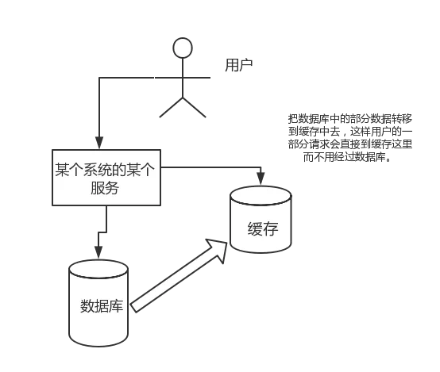
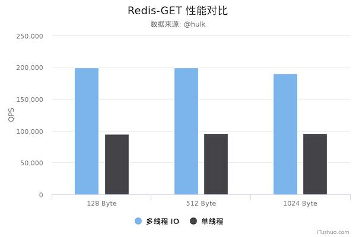
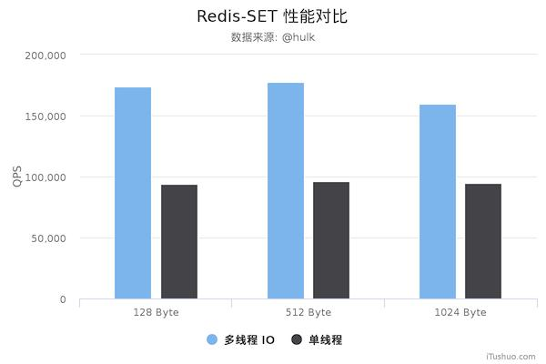
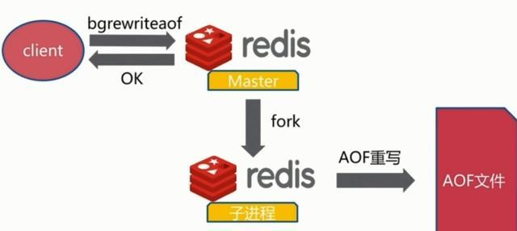
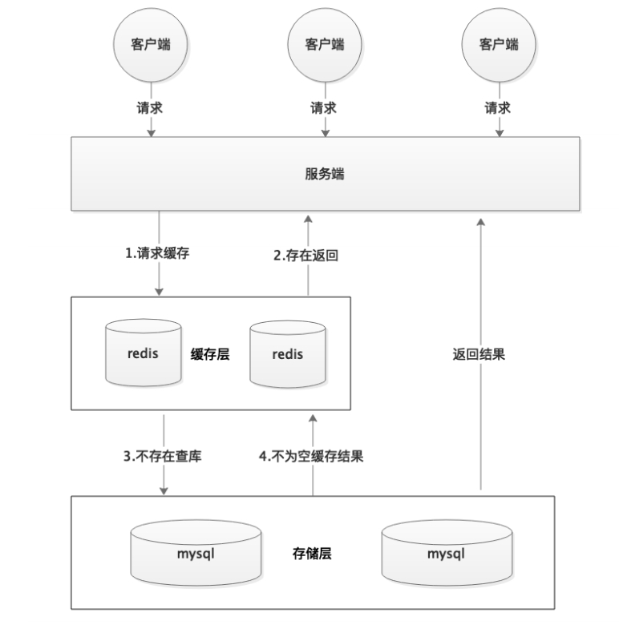
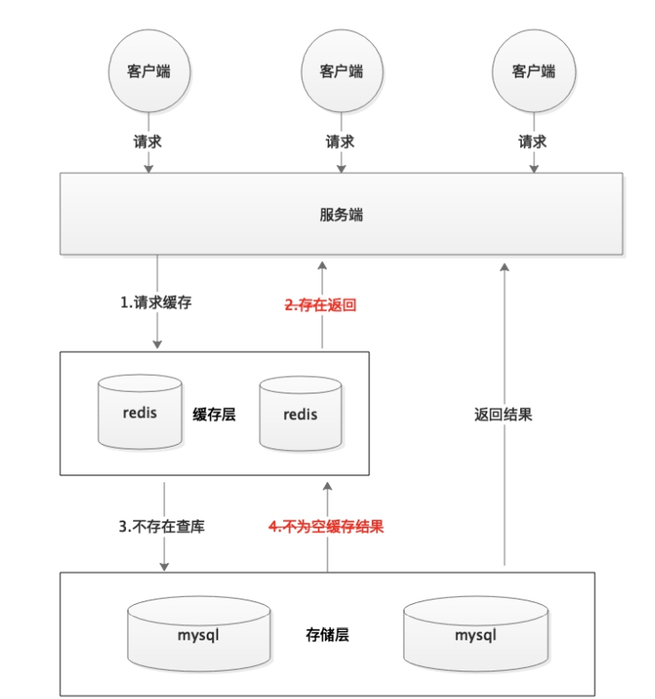
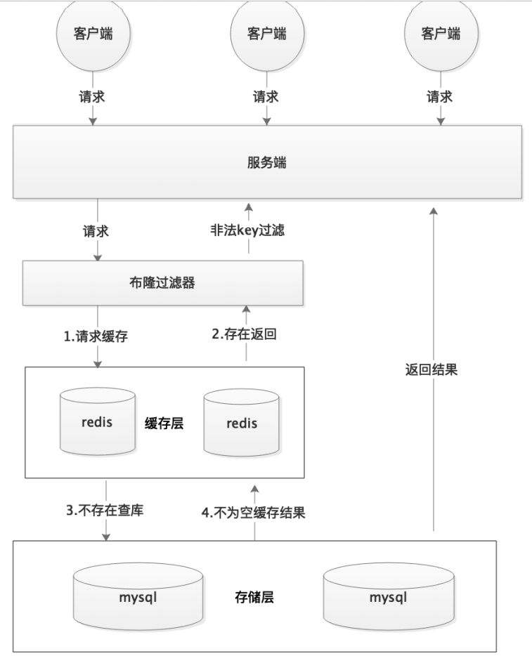
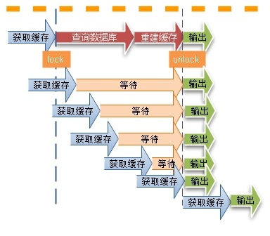
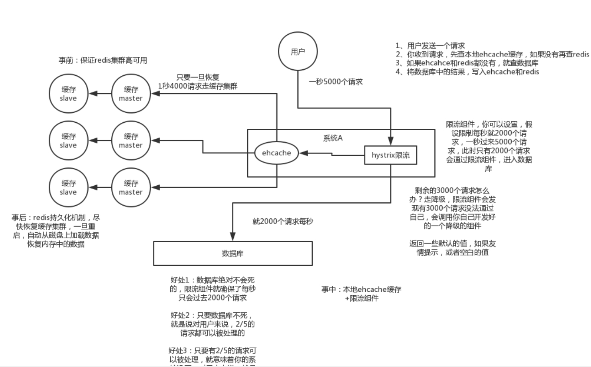
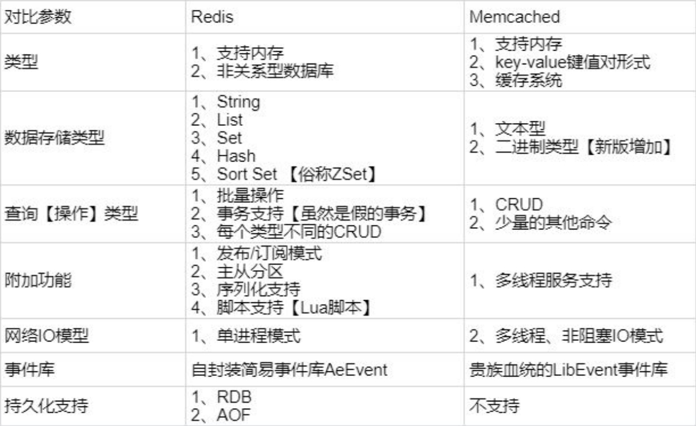

## 1. 参考

> - [Redis 命令参考 — Redis 命令参考 (redisfans.com)](http://doc.redisfans.com/)
> - [redis 总结——重构版](https://mp.weixin.qq.com/s?__biz=Mzg2OTA0Njk0OA==&mid=2247484858&idx=1&sn=8e222ea6115e0b69cac91af14d2caf36&chksm=cea24a71f9d5c367148dccec3d5ddecf5ecd8ea096b5c5ec32f22080e66ac3c343e99151c9e0&token=1082669959&lang=zh_CN&scene=21#wechat_redirect)
> - https://www.cnblogs.com/jasontec/p/9699242.html
> - https://github.com/Snailclimb/JavaGuide
> - [Redis中文文档](http://redisdoc.com/)
> - [【狂神说Java】Redis最新超详细版教程通俗易懂](https://www.bilibili.com/video/BV1S54y1R7SB)


## 2. 简介

Redis的全称是`Remote Dictionary Server`，即`远程字典服务`。官方原话如下：

Redis是一个开源(BSD许可)的,内存中的数据结构存储系统,它可以用作`数据库`、`缓存`和`消息中间件MQ`。它支持多种类型的数据结构,如字符串( strings),散列( hashes),列表( lists),集合(sets),有序集合( sorted sets)与范围查询,bitmaps, hyperloglogs和地理空间( geospatial)索引半径查询。 Redis内置了复制( replication),LUA脚本(Luascripting),LRU驱动事件( LRU eviction),事务( transactions)和不同级别的磁盘持久化( persistence),并通过Reds哨兵( Sentinel)和自动分区( Cluster)提供高可用性( high availability)。


### 2.1 优点

因为是`纯内存`操作, Redis的性能非常出色,每秒可以处理超过`10万次读写操作`是已知性能最快的`Key- Value DB`。Redis的出色之处不仅仅是性能, Redis最大的魅力是支持保存`多种数据结构`,此外`单个value`的最大限制是`1GB`,不像 `memcached`只能保存`1MB`的数据,因此 Redis可以用来实现很多有用的功能。比方说用他的`Lst`来做`FIFO双向链表`,实现一个轻量级的高性能消息队列服务用他的Set可以做高性能的tag系统等等另外 Redis也可以对存入的`Key-Vaue`设置`expire`时间,因此也可以被当作一个功能加强版的 memcached来用。 


### 2.2 缺点

Redis的主要缺点是`数据库容量`受到`物理内存`的限制,不能用作`海量数据的高性能读写`,因此 Redis适合的场景主要局限在较小数据量的高性能操作和运算上。


简单来说 redis 就是⼀个数据库，不过与传统数据库不同的是 redis 的数据是存在内存中的，所以读 写速度⾮常快，因此 redis 被⼴泛应⽤于缓存⽅向。另外，redis 也经常⽤来做`分布式锁`。redis 提 供了多种数据类型来⽀持不同的业务场景。除此之外，redis ⽀持事务 、持久化、LUA脚本、LRU驱动 事件、多种集群⽅案。


## 3. 为什么要用 redis /为什么要用缓存

主要从“`高性能`”和“`高并发`”这两点来看待这个问题。


### 3.1 高性能

假如用户第一次访问数据库中的某些数据。这个过程会比较慢，因为是从硬盘上读取的。将该用户访问的数据存在数缓存中，这样下一次再访问这些数据的时候就可以直接从缓存中获取了。操作缓存就是直接操作内存，所以速度相当快。如果数据库中的对应数据改变的之后，同步改变缓存中相应的数据即可！


### 3.2 高并发

直接操作缓存能够承受的请求是远远大于直接访问数据库的，所以我们可以考虑把数据库中的部分数据转移到缓存中去，这样用户的一部分请求会直接到缓存这里而不用经过数据库。




### 3.3 为什么要⽤ redis ⽽不⽤ map/guava 做缓存?

缓存分为本地缓存和分布式缓存。以 Java 为例，使⽤⾃带的 map 或者 guava 实现的是本地缓存，最主要的特点是轻量以及快速，⽣命周期随着 jvm 的销毁⽽结束，并且在多实例的情况下，每个实例都 需要各⾃保存⼀份缓存，缓存不具有⼀致性。 使⽤ redis 或 memcached 之类的称为分布式缓存，在多实例的情况下，各实例共⽤⼀份缓存数据，缓 存具有⼀致性。缺点是需要保持 redis 或 memcached服务的⾼可⽤，整个程序架构上较为复杂。


## 4. redis 的线程模型

参考

> - https://blog.csdn.net/m0_37524661/article/details/87086267
> - https://baijiahao.baidu.com/s?id=1666100733546359034&wfr=spider&for=pc


### 4.1 redis单线程模型指的是什么

Redis基于`Reactor`模式开发了网络事件处理器，这个处理器被称为`文件事件处理器`。它的组成结构为4部分：

> - 多个套接字
>
> - IO多路复用程序
>
> - 文件事件分派器
>
> - 事件处理器


redis 内部使⽤⽂件事件处理器 `file event handler` ，这个`⽂件事件处理器`是`单线程`的，所以 redis 才叫做`单线程模型`。它采⽤ `IO 多路复⽤机`制同时监听多个 `socket`，根据 `socket` 上的事件 来选择对应的事件处理器进⾏处理


Redis客户端对服务端的每次调用都经历了`发送命令`，`执行命令`，`返回结果`三个过程。其中执行命令阶段，由于Redis是`单线程`来处理命令的，所有每一条到达服务端的命令不会立刻执行，所有的命令都会进入一个队列中，然后逐个被执行。并且多个客户端发送的命令的执行`顺序是不确定`的。但是可以确定的是不会有两条命令被同时执行，不会产生并发问题，这就是Redis的单线程基本模型。


> 目前redis的网络处理方面时多线程，但是核心模块方面还是单线程


### 4.2 redis是单线程模型为什么效率还这么高？


> 1. **纯内存访问**：数据存放在内存中，内存的响应时间大约是100纳秒，这是Redis每秒万亿级别访问的重要基础。
> 2. **非阻塞I/O**：Redis采用epoll做为I/O多路复用技术的实现，再加上Redis自身的事件处理模型将epoll中的连接，读写，关闭都转换为了时间，不在I/O上浪费过多的时间。
> 3. 单线程避免了线程切换和竞态产生的消耗。
> 4. Redis采用单线程模型，每条命令执行如果占用大量时间，会造成其他线程阻塞，对于Redis这种高性能服务是致命的，所以Redis是面向高速执行的数据库


### 4.3 rector模式简介

参考

> - https://www.cnblogs.com/crazymakercircle/p/9833847.html


### 4.4 为什么网络处理要引入多线程？

之前的段落说了，Redis 的瓶颈并不在 CPU，而在`内存`和`网络I/O`。

内存不够的话，可以加内存或者做数据结构优化和其他优化等，但网络的性能优化才是大头，网络 IO 的读写在 Redis 整个执行期间占用了大部分的 CPU 时间，如果把网络处理这部分做成多线程处理方式，那对整个 Redis 的性能会有很大的提升。








## 5.常⻅数据结构以及使⽤场景分析


| 数据结构           | 常用命令                     |
| ------------------ | ---------------------------- |
| String             | set,get,decr,incr,mget       |
| Hash               | hget,hset,hgetall            |
| List               | lpush,rpush,lpop,rpop,lrange |
| Set                | sadd,spop,smembers,sunion    |
| ZSet（Sorted Set） | zadd,zrange,zrem,zcard       |


### 5.1 String

> 常⽤命令: set,get,decr,incr,mget 等。


String数据结构是简单的key-value类型，value其实不仅可以是String，也可以是数字。 常规keyvalue缓存应⽤； 常规计数：微博数，粉丝数等。

string类型是二进制安全的。意思是redis的string可以包含任何数据。比如jpg图片或者序列化的对象 。


### 5.2 Hash 

> 常⽤命令： hget,hset,hgetall 等。

hash 是⼀个 string 类型的 `field` 和 `value` 的映射表，hash 特别适合⽤于存储对象，后续操作的时 候，你可以直接仅仅修改这个对象中的某个字段的值。 ⽐如我们可以 hash 数据结构来存储⽤户信 息，商品信息等等。⽐如下⾯我就⽤ hash 类型存放了我本⼈的⼀些信息：

```json
key=JavaUser293847
value={
 “id”: 1,
 “name”: “SnailClimb”,
 “age”: 22,
 “location”: “Wuhan, Hubei”
}
```


### 5.3 List 

> 常⽤命令: lpush,rpush,lpop,rpop,lrange等 


Redis list 的实现为⼀个`双向链表`。Redis list 的应⽤场景⾮常多，也是Redis最重要的数据结构之⼀，⽐如微博的关注 列表，粉丝列表，消息列表等功能都可以⽤Redis的 list 结构来实现。 Redis list 的实现为⼀个双向链表，即可以⽀持反向查找和遍历，更⽅便操作，不过带来了部分额外 的内存开销。 另外可以通过 lrange 命令，就是从某个元素开始读取多少个元素，可以基于 list 实现分⻚查询，这 个很棒的⼀个功能，基于 redis 实现简单的⾼性能分⻚，可以做类似微博那种下拉不断分⻚的东⻄ （⼀⻚⼀⻚的往下⾛），性能⾼。


在 key 对应 list 的头部添加字符串元素

```java
lpush name value
```


在 key 对应 list 的尾部添加字符串元素

```java
rpush name value
```


key 对应 list 中删除 count 个和 value 相同的元素

```java
lrem name index
```


返回 key 对应 list 的长度

```java
llen name 
```


### 5.4 Set

> 常⽤命令： sadd,spop,smembers,sunion 等 


set 对外提供的功能与list类似是⼀个列表的功能，特殊之处在于 set 是可以⾃动排重的。 当你需要存储⼀个列表数据，⼜不希望出现重复数据时，set是⼀个很好的选择，并且set提供了判断某 个成员是否在⼀个set集合内的重要接⼝，这个也是list所不能提供的。可以基于 set 轻易实现交集、 并集、差集的操作。 ⽐如：在微博应⽤中，可以将⼀个⽤户所有的关注⼈存在⼀个集合中，将其所有粉丝存在⼀个集合。 Redis可以⾮常⽅便的实现如共同关注、共同粉丝、共同喜好等功能。这个过程也就是求交集的过程， 具体命令如下：


```json
sinterstore key1 key2 key3 将交集存在key1内
```


### 5.5 ZSet（Sorted Set） 

> 常⽤命令： zadd,zrange,zrem,zcard等 


和set相⽐，sorted set增加了⼀个权重参数score，使得集合中的元素能够按score进⾏有序排列。 举例： 在直播系统中，实时排⾏信息包含直播间在线⽤户列表，各种礼物排⾏榜，弹幕消息（可以理 解为按消息维度的消息排⾏榜）等信息，适合使⽤ Redis 中的 Sorted Set 结构进⾏存储。


## 6. Redis过期时间

Redis中有个设置时间过期的功能，即对存储在 redis 数据库中的值可以设置⼀个过期时间。作为⼀个 缓存数据库，这是⾮常实⽤的。如我们⼀般项⽬中的 token 或者⼀些登录信息，尤其是短信验证码都 是有时间限制的，按照传统的数据库处理⽅式，⼀般都是⾃⼰判断过期，这样⽆疑会严重影响项⽬性 能。


我们 set key 的时候，都可以给⼀个 `expire time`，就是过期时间，通过过期时间我们可以指定这个 key 可以存活的时间。 也可以在运行时给存在的键设置剩余的生存时间，不设置则默认为`-1`，设置为-1时表示`永久存储`。


如果假设你创建一个 `Timer`，设置了⼀批 key 只能存活1个⼩时，那么接下来1⼩时后，redis是怎么对这批key进⾏删除 的？ 


> - **定期删除**：redis默认是每隔 `100ms` 就随机抽取⼀些设置了过期时间的key，检查其是否过期， 如果过期就删除。注意这⾥是随机抽取的。为什么要随机呢？你想⼀想假如 redis 存了⼏⼗万 个 key ，每隔100ms就遍历所有的设置过期时间的 key 的话，这时候需要的是Cpu处理能力，而不是内存，就会给 CPU 带来很⼤的负载！ 
> - **惰性删除** ：定期删除可能会导致很多过期 key 到了时间并没有被删除掉。所以就有了惰性删除。假如你的过期 key，靠定期删除没有被删除掉，还停留在内存⾥，除⾮你的系统去查⼀下那 个 key，才会被redis给删除掉。这就是所谓的惰性删除，也是够懒的哈！ 但是仅仅通过设置过期时间还是有问题的。


但是仅仅通过设置过期时间还是有问题的。我们想⼀下：如果定期删除漏掉了很多过期 key，然后你也 没及时去查，也就没⾛惰性删除，此时会怎么样？如果⼤量过期key堆积在内存⾥，导致redis内存块耗 尽了。怎么解决这个问题呢？ redis 内存淘汰机制。


## 7. Redis内存淘汰机制

参考

> - https://blog.csdn.net/weixin_43184769/article/details/90523923
> - https://blog.csdn.net/qq_28018283/article/details/80764518
> - 配置文件： http://download.redis.io/redis-stable/redis.conf


思考一下，如果定期删除漏掉了很多过期的key，而我们也没有再去访问它，如果不加处理，很可能导致内存耗尽。


什么时候触发

Redis配置文件中可以设置`maxmemory`，内存的最大使用量，到达限度时会执行`内存淘汰机制`


### 7.1 内存置换策略

没有配置时，`默认为no-eviction`

| 名称                        | 描述                                                     |
| --------------------------- | -------------------------------------------------------- |
| volatile-lru                | 从`已设置过期时间的数据集`中挑选`最近最少使用`的数据淘汰 |
| volatile-lfu（4.0版本）     | 从`已设置过期时间的数据集`中挑选`最不经常`使用的数据淘汰 |
| volatile-ttl                | 从`已设置过期时间的数据集`中挑选`将要过期`的数据淘汰     |
| volatile-random             | 从`已设置过期时间的数据集`中挑选`任意数据`淘汰           |
| allkeys-lru                 | 当`内存不足`写入新数据时淘汰`最近最少`使用的Key          |
| allkeys-random              | 当`内存不足`写入新数据时`随机选择`key淘汰                |
| allkeys-lfu（4.0版本）      | 当`内存不足`写入新数据时移除`最不经常使用`的Key          |
| no-eviction（禁止驱逐数据） | 当`内存不足`写入新数据时，写入操作会报错，同时不删除数据 |


> - volatile为前缀的策略都是从已过期的数据集中进行淘汰。
> - allkeys为前缀的策略都是面向所有key进行淘汰。
> - LRU（least recently used）最少最近用到的。
> - LFU（Least Frequently Used）最不常用的。
> - TTL（Time To Live）
> - 它们的触发条件都是Redis使用的内存达到阈值时。


### 7.2 淘汰机制的实现

既然是淘汰，那就需要把这些数据给删除，然后保存新的。Redis 删除失效主键的方法主要有两种：


#### 消极方法( passive way)

在主键被访问时如果发现它已经失效,那么就删除它。 redis在实现`GET`、`MGET`、`HGET`、 LRANGE等所有涉及到读取数据的命令时都会调`expirelfNeeded`,它存在的意义就是在读取数据之前先检查一下它有没有失效,如果失效了就删除  


`expirelfNeeded`函数中调用的另外一个函数 `propagateExpire`,这个函数用来在正式删除`失效主键`,并且`广播`告诉其他地方,目的地有俩

> - `AOF`文件,将删除失效主键的这一操作以 DEL Key的标准命令格式记录下来
> - 另一个就是发送到当前 Redis服务器的所有 `Slave`,同样将删除失效主键的这操作以 `DEL Key`的标准命令格式告知这些`Slave`删除各自的失效主键


#### 积极方法( active way)

周期性地探测,发现失效就删除。消极方法的缺点是,如果keγ迟迟不被访问,就会占用很多内存空间,所以才有积极方式


#### 主动删除

当內存超过 `maxmemoryl`限定时,触发主动清理策略,该策略由启动参数的配置决定


## 8. Redis持久化机制

> 怎么保证 redis 挂掉之后再重启数据可以进⾏恢复


参考

> - https://baijiahao.baidu.com/s?id=1654694618189745916&wfr=spider&for=pc


很多时候我们需要持久化数据也就是将内存中的数据写⼊到硬盘⾥⾯，⼤部分原因是为了之后重⽤数据 （⽐如重启机器、机器故障之后恢复数据），或者是为了防⽌系统故障⽽将数据备份到⼀个远程位置。 Redis不同于Memcached的很重⼀点就是，Redis⽀持`持久化`，⽽且⽀持两种不同的持久化操作。当`RDB`和`AOF`文件都存在时，会优先根据`AOF`文件恢复


> - RDB（Redis DataBase 快照）
> - AOF（Append Only File）


### 8.1 RDB（Redis DataBase 快照）

Redis可以通过创建快照来获得存储在内存⾥⾯的数据在某个时间点上的副本。Redis创建快照之后，可 以对快照进⾏备份，可以将快照复制到其他服务器从⽽创建具有相同数据的服务器副本（Redis主从结 构，主要⽤来提⾼Redis性能），还可以将快照留在原地以便重启服务器的时候使⽤。 


优点

> - RDB文件紧凑，全量备份，非常适合用于进行备份和灾难恢复。
> - 在使用bgsave生成RDB文件的时候，redis主进程会fork()一个子进程来处理所有保存工作，主进程不需要进行任何磁盘IO操作。
> - RDB 在恢复大数据集时的速度比 AOF 的恢复速度要快。


缺点

> - RDB快照是一次`全量备份`，存储的是内存数据的`二进制序列化`形式，存储上非常紧凑。当进行快照持久化时，会开启一个子进程专门负责快照持久化，子进程会拥有父进程的`内存数据`，父进程修改内存子进程`不会反应`出来，所以在`快照持久化期间修改的数据不会被保存`，可能丢失数据。


快照持久化是Redis`默认采⽤`的持久化⽅式,触发方式如下：


> - save
> - bgsave
> - 自动化


#### 触发方式：save

该命令会阻塞当前Redis服务器，执行save命令期间，Redis不能处理其他命令，直到RDB过程完成为止。具体流程如下：


执行完成时候如果存在老的`RDB`文件，就把新的替代掉旧的。我们的客户端可能都是几万或者是几十万，这种方式显然不可取。


#### 触发方式：bgsave

执行该命令时，Redis会在后台`异步`进行快照操作，快照同时还可以`响应客户端请求`。具体流程如下：


具体操作是Redis进程执行`fork`操作`创建子进程`，RDB持久化过程由`子进程负责`，完成后自动结束。阻塞只发生在`fork`阶段，一般时间很短。基本上 Redis 内部所有的RDB操作都是采用 `bgsave` 命令。


#### 触发方式：自动触发

自动触发是由我们的配置文件来完成的。在`redis.conf`配置文件中，里面有如下配置，我们可以去设置：


**①save**

这里是用来配置触发 Redis的 `RDB` 持久化条件，也就是什么时候将内存中的数据保存到硬盘。比如“save m n”。表示m秒内数据集存在n次修改时，自动触发`bgsave`。

默认如下配置：

```java
save m n

#在900秒(15分钟)之后，如果⾄少有1个key发⽣变化，Redis就会⾃动触发BGSAVE命令创建快照。
save 900 1 

#在300秒(5分钟)之后，如果⾄少有10个key发⽣变化，Redis就会⾃动触发BGSAVE命令创建快照。
save 300 10 
  
#在60秒(1分钟)之后，如果⾄少有10000个key发⽣变化，Redis就会⾃动触发BGSAVE命令创建快照。
save 60 10000 
```


> - `stop-writes-on-bgsave-error` ：默认值为yes。当启用了RDB且最后一次后台保存数据失败，Redis是否停止接收数据。这会让用户意识到数据没有正确持久化到磁盘上，否则没有人会注意到灾难（disaster）发生了。如果Redis重启了，那么又可以重新开始接收数据了
> - `rdbcompression` ；默认值是yes。对于存储到磁盘中的快照，可以设置是否进行压缩存储。
> - `rdbchecksum` ：默认值是yes。在存储快照后，我们还可以让redis使用CRC64算法来进行数据校验，但是这样做会增加大约10%的性能消耗，如果希望获取到最大的性能提升，可以关闭此功能。
> - `dbfilename` ：设置快照的文件名，默认是 `dump.rdb`
> - `dir`：设置快照文件的存放路径，这个配置项一定是个目录，而不能是文件名。


#### save和bgsave的区别


### 8.2 AOF（Append Only File）

与`快照持久化`相⽐，`AOF持久化` 的`实时性`更好，因此已成为主流的持久化⽅案。默认情况下Redis没有 开启`AOF（append only file）`⽅式的持久化。


可以通过`appendonly`参数开启：


#### 持久化原理


每当有一个`写而非读`命令过来时，就直接追加保存在我们的`AOF`文件中，AOF命令以Redis协议追加保存每次写的操作到文件末尾，Redis还能对AOF文件在后台重写，使得单个AOF文件不至于过大


#### 文件重写原理

AOF的方式也同时带来了另一个问题。持久化文件会变的越来越大。为了压缩`AOF`的持久化文件。redis提供了`bgrewriteaof`命令。将内存中的数据以命令的方式保存到临时文件中，同时会`fork`出一条`新进程`来将文件重写。





重写`AOF`文件的操作，并没有读取旧的`AOF`文件，而是将整个内存中的数据库内容用命令的方式重写了一个`新的AOF文件`，这点和`快照`有点类似。


```java
appendonly yes
```


开启AOF持久化后每执⾏⼀条会更改Redis中的数据的命令，Redis就会将该命令通过`write`写⼊硬盘中的`AOF`⽂件，通俗的理解就是`日志记录`。 `AOF`⽂件的保存位置和`RDB`⽂件的位置相同，都是通过`dir`参数设置的，默认的⽂件名是 `appendonly.aof`。


```java
appendfsync always #每次有数据修改发⽣时都会写⼊AOF⽂件,这样会严重降低Redis的速度
  
appendfsync everysec #每秒钟同步⼀次，显示地将多个写命令同步到硬盘
  
appendfsync no #让操作系统决定何时进⾏同步
```


为了兼顾数据和写⼊性能，⽤户可以考虑 `appendfsync everysec`选项 ，让Redis每秒同步⼀次AOF⽂ 件，Redis性能⼏乎没受到任何影响。⽽且这样即使出现系统崩溃，⽤户最多只会丢失⼀秒之内产⽣的 数据。当硬盘忙于执⾏写⼊操作的时候，Redis还会优雅的放慢⾃⼰的速度以便适应硬盘的最⼤写⼊速度。


#### 修复AOF文件

可以根据文件`redis-check-aof`文件修复，它会把AOF文件中错误的命令删去，相关命令

```shell
redis-check-aof --fix appendonly.aof
```


### 8.3 Redis 4.0 对于持久化机制的优化

Redis 4.0 开始⽀持 `RDB` 和 `AOF` 的`混合持久化`（默认关闭，可以通过配置项开启）


```shell
aof-use-rdbpreamble yes
```


如果把混合持久化打开，`AOF` 重写的时候就直接把 `RDB` 的内容写到 `AOF ⽂件开头`。这样做的好处是可 以结合 `RDB` 和 `AOF` 的优点, 快速加载同时避免丢失过多的数据。当然缺点也是有的， `AOF` ⾥⾯的 `RDB` 部分是压缩格式不再是 `AOF` 格式，可读性较差。


通过这种，`Redis`会优先载入`AOF`文件，因为通常情况下`AOF`文件保存的数据要比`RDB`完整


## 9. Redis事务

参考

> - https://www.runoob.com/redis/redis-transactions.html


Redis 通过 `MULTI`、`EXEC`、`WATCH` 等命令来实现`事务(transaction)`功能。Redis 事务的本质是一组命令的集合。事务支持一次执行多个命令，一个事务中所有命令都会被序列化。在事务执行过程，会按照顺序串行化执行队列中的命令，其他客户端提交的命令请求不会插入到事务执行命令序列中。


### 9.1 特点

> - Redis事务没有隔离级别的概念：批量操作在发送 `EXEC` 命令前被放入队列缓存，并不会被实际执行，也就不存在事务内的查询要看到事务里的更新，事务外查询不能看到。
> - Redis事务不保证原子性：Redis中，`单条命令是原子性执行的`，但事务不保证`原子性`，且没有回滚。事务中任意命令执行失败，其余的命令仍会被执行。
> - 在事务执行过程，其他客户端提交的命令请求不会插入到事务执行命令序列中。


### 9.2 阶段


> - 开始事务。
> - 命令入队。
> - 执行事务。


### 9.3 相关命令参考

> - https://www.runoob.com/redis/redis-transactions.html


## 10. 缓存雪崩 | 缓存穿透 | 缓存击穿

参考

> - https://blog.csdn.net/fanrenxiang/article/details/80542580
> - https://www.cnblogs.com/xichji/p/11286443.html


> - **缓存穿透**：key对应的数据在数据源并不存在，每次针对此key的请求从`缓存`获取不到，请求都会到`数据源`，从而可能`压垮数据源`。举个例⼦：某个⿊客故意制造我们缓存中不存在的 key 发起⼤量请求，导致⼤量请 求落到数据库，若黑客利用此漏洞进行攻击可能压垮数据库。
> - **缓存击穿**：是指一个key非常热点，在不停的扛着大并发，大并发集中对这一个点进行访问，当这个`key`在失效的瞬间，持续的大并发就穿破缓存，直接请求数据库，这个时候大并发的请求可能会瞬间把后端DB压垮，就像在一个屏障上凿开了一个洞。
> - **缓存雪崩**：当缓存服务器重启或者大量缓存集中在某一个时间段失效，这样在失效的时候，也会给后端系统(比如DB)带来很大压力，所以，后⾯的请求都会落到数据库上，造成数据库短时间内承受⼤量请求⽽崩掉。


### 10.1 缓存穿透

缓存穿透说简单点就是⼤量请求的 key 根本不存在于缓存中，导致请求直接到了数据库上，根本没有 经过缓存这⼀层。举个例⼦：某个⿊客故意制造我们缓存中不存在的 key 发起⼤量请求，导致⼤量请 求落到数据库。


#### 原理

正常缓存处理流程




缓存穿透处理流程




#### 解决办法

一个一定不存在缓存及查询不到的数据，由于缓存是不命中时被动写的，并且出于容错考虑，如果从存储层查不到数据则不写入缓存，这将导致这个不存在的数据每次请求都要到存储层去查询，失去了缓存的意义。


最基本的就是⾸先做好`参数校验`，⼀些`不合法的参数`请求直接抛出异常信息返回给客户端。⽐如查询的 数据库 id 不能⼩于 0、传⼊的邮箱格式不对的时候直接返回错误消息给客户端等等。


如果一个查询返回的数据为空（不管是数据不存在，还是系统故障），我们仍然把这个空结果进行缓存，但它的过期时间会很短，最长不超过五分钟

```java
public Object getObjectInclNullById(Integer id) {
 // 从缓存中获取数据
 Object cacheValue = cache.get(id);
 // 缓存为空
 if (cacheValue == null) {
 // 从数据库中获取
 Object storageValue = storage.get(key);
 // 缓存空对象
 cache.set(key, storageValue);
 // 如果存储数据为空，需要设置⼀个过期时间(300秒)
 if (storageValue == null) {
 // 必须设置过期时间，否则有被攻击的⻛险
 cache.expire(key, 60 * 5);
 }
 return storageValue;
 }
 return cacheValue;
}
```


#### 布隆过滤器（bloom filter）

参考

> - https://github.com/Snailclimb/JavaGuide/blob/master/docs/dataStructures-algorithms/data-structure/bloom-filter.md


布隆过滤器是⼀个⾮常神奇的数据结构，通过它我们可以⾮常⽅便地判断⼀个给定数 据是否存在与海量数据中。我们需要的就是判断 `key` 是否合法，有没有感觉布隆过滤器就是我们想要 找的那个“⼈”。具体是这样做的：把`所有可能存在的请求的值`都存放在布隆过滤器中，当⽤户请求过来，我会先判断⽤户发来的请求的值是否存在于布隆过滤器中。不存在的话，直接返回请求参数错误信 息给客户端，存在的话才会⾛下⾯的流程。





### 10.2 缓存击穿

参考

> - https://www.cnblogs.com/chengege/p/11073166.html


key可能会在某些时间点被超高并发地访问，是一种非常“热点”的数据。这个时候，需要考虑一个问题：缓存被“击穿”的问题。


#### 互斥锁(mutex key)

业界比较常用的做法，是使用`mutex`。简单地来说，就是在缓存失效的时候（判断拿出来的值为空），不是立即去`load db`，而是先使用缓存工具的某些带成功操作返回值的操作（比如`Redis`的`SETNX`或者`Memcache`的`ADD`）去`set`一个`mutex key`，当操作返回成功时，再进行`load db`的操作并`回设缓存`；否则，就重试整个`get`缓存的方法。就是只让一个线程构建`缓存`，其他线程等待构建缓存的线程执行完，重新从缓存获取数据就可以了。





### 10.3 缓存雪崩


简介：缓存同⼀时间⼤⾯积的失效，所以，后⾯的请求都会落到数据库上，造成数据库短时间内承受⼤ 量请求⽽崩掉。


> - 事前：尽量保证整个 redis 集群的⾼可⽤性，发现机器宕机尽快补上。选择合适的内存淘汰策 略。 
> - 事中：本地ehcache缓存 + hystrix限流&降级，避免MySQL崩掉 
> - 事后：利⽤ redis 持久化机制保存的数据尽快恢复缓存


> - 设置key永不失效（热点数据）；
> - 设置key缓存失效时候尽可能错开；
> - 使用多级缓存机制，比如同时使用redsi和memcache缓存，请求->redis->memcache->db；
> - 购买第三方可靠性高的Redis云服务器；





## 11. Redis发布订阅

参考

> - [订阅与发布 — Redis 设计与实现 (redisbook.readthedocs.io)](https://redisbook.readthedocs.io/en/latest/feature/pubsub.html)


使用场景

> - 实时消息
> - 聊天室（既可以是发送者也可以是订阅者）
> - 订阅，关注推送


## 12. Redis主从复制/集群

参考

> - [集群教程 — Redis 命令参考 (redisfans.com)](http://doc.redisfans.com/topic/cluster-tutorial.html#cluster-tutorial)


## 13. 如何解决 Redis 的并发竞争 Key 问题

参考

> - https://www.jianshu.com/p/41d3a673425d
> - https://blog.csdn.net/qq_42253147/article/details/94446727


这里的并发指的是多个redis的client同时set key引起的并发问题，也就是多个系统同时对⼀个 key 进⾏操作，但是最后执⾏的顺序 和我们期望的顺序不同，这样也就导致了结果的不同！


方案

> - **分布式锁+时间戳**
> - **消息队列MQ**


### 11.1 分布式锁+时间戳


#### 如果对这个key操作，不要求顺序

这种情况下，准备一个分布式锁，大家去抢锁，抢到锁就做`set`操作即可，比较简单。加锁的目的实际上就是把`并行读写`改成`串行读写`的方式，从而来避免资源竞争。


#### 如果对这个key操作，要求顺序

假设有一个`key1`

> - 系统A需要将key1设置为valueA
> - 系统B需要将key1设置为valueB
> - 系统C需要将key1设置为valueC


期望按照key1的value值按照 `valueA–>valueB–>valueC`的顺序变化。这种时候我们在数据写入数据库的时候，需要保存一个`时间戳`。假设`时间戳`如下

> - 系统A key 1 {valueA 3:00}
> - 系统B key 1 {valueB 3:05}
> - 系统C key 1 {valueC 3:10}


那么，假设这会`系统B`先抢到锁，将`key1`设置为`{valueB 3:05}`。接下来系统A抢到锁，发现自己的valueA的时间戳早于缓存中的时间戳，那就不做`set`操作了。以此类推


#### 什么是分布式锁

因为传统的加锁的做法（如java的synchronized和Lock）这里没用，只适合单点。因为这是分布式环境，需要的是分布式锁。

当然，分布式锁可以基于很多种方式实现，比如zookeeper、redis等，

不管哪种方式实现，基本原理是不变的：**用一个状态值表示锁，对锁的占用和释放通过状态值来标识**。


#### 分布式锁的实现

主要用到的redis函数是`setnx()`

利用`SETNX`非常简单地实现`分布式锁`。例如：某客户端要获得一个名字`youzhi`的锁，客户端使用下面的命令进行获取：

```shell
SETNX lock.youzhi<current Unix time + lock timeout + 1>
```


> - 如返回1，则该客户端获得锁，把`lock.youzhi`的键值设置为时间值表示该键已被锁定，该客户端最后可以通过`DEL lock.foo`来释放该锁。
> - 如返回0，表明该锁已被其他客户端取得，这时我们可以先返回或进行重试等对方完成或等待锁超时。


### 11.2 消息队列

在并发量过大的情况下,可以通过`消息中间件`进行处理,把`并行读写`进行`串行化`。

把`Redis.set`操作放在队列中使其串行化,必须的一个一个执行。

这种方式在一些高并发的场景中算是一种通用的解决方案。


## 13. 区别


### 13.1 redis 和 memcached 的区别


> 1. **redis⽀持更丰富的数据类型（⽀持更复杂的应⽤场景）**：Redis不仅仅⽀持简单的k/v类型的数 据，同时还提供list，set，zset，hash等数据结构的存储。memcache⽀持简单的数据类型， String。 
> 2. **Redis⽀持数据的持久化**：可以将内存中的数据保持在磁盘中，重启的时候可以再次加载进⾏使 ⽤,⽽Memecache把数据全部存在内存之中。 
> 3. **集群模式**：memcached没有原⽣的集群模式，需要依靠客户端来实现往集群中分⽚写⼊数据；但 是 redis ⽬前是原⽣⽀持 cluster 模式的. 
> 4. Memcached是多线程，⾮阻塞IO复⽤的⽹络模型；Redis使⽤单线程的多路 IO 复⽤模型。





